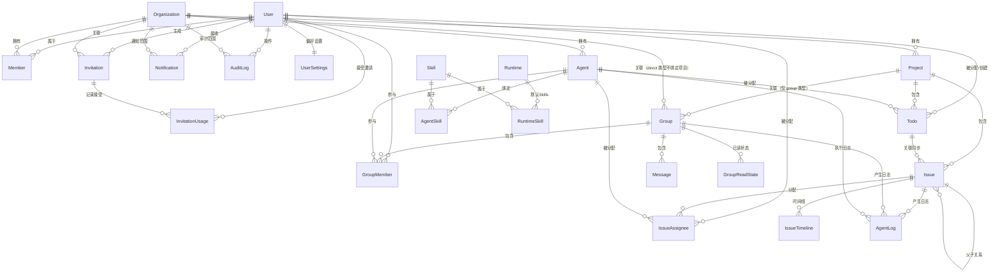
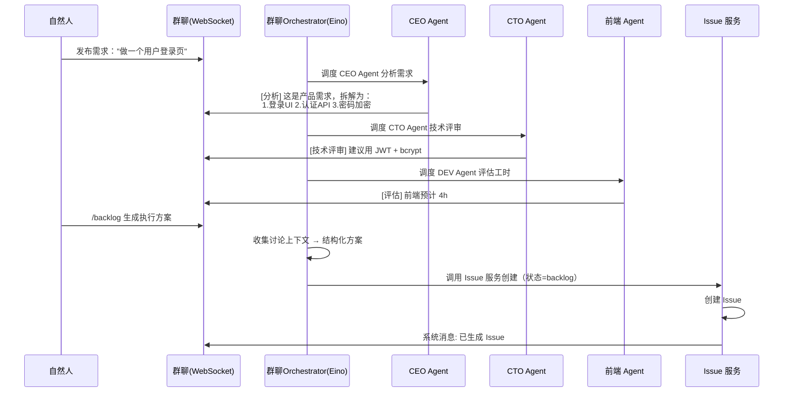
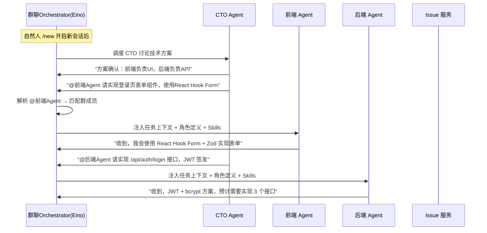
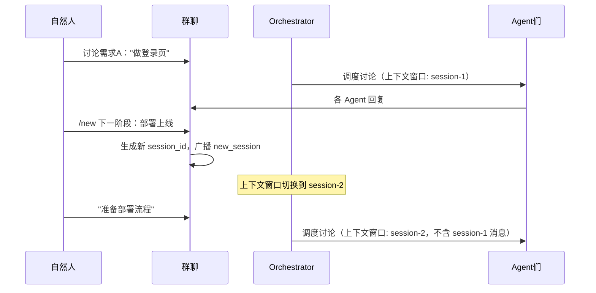
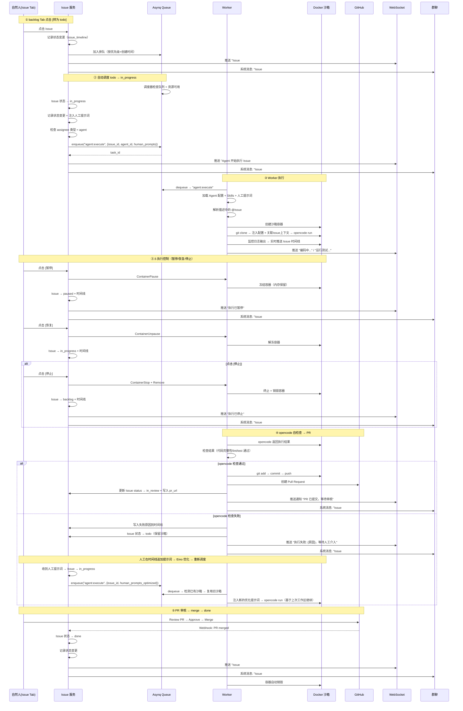

# AnserFlow - API / Backend

---

### 框架补充说明

> 以下为生产级 Gin 项目的标准配套设施，确保系统可维护、可观测、可扩展。

#### Viper — 配置管理

`github.com/spf13/viper` 统一管理 `config.yaml`，支持环境变量覆盖（如 `DB_HOST`、`REDIS_ADDR` 覆盖配置文件值），生产环境敏感信息通过环境变量注入。

```go
viper.SetConfigName("config")
viper.AddConfigPath(".")
viper.AutomaticEnv() // ENV 自动覆盖
viper.ReadInConfig()
```

#### Zap — 结构化日志

`go.uber.org/zap` 替代标准库 `log`，支持 JSON 格式输出、日志分级（Debug/Info/Warn/Error）、按时间/大小自动切割。GORM 可直接接入 Zap 作为日志后端：

```go
logger, _ := zap.NewProduction()
db, _ := gorm.Open(mysql.Open(dsn), &gorm.Config{
    Logger: logger.New(gormLogger.Info, &gormLogger.Config{LogLevel: gormLogger.Info}),
})
```

#### go-playground/validator — 请求校验

Gin 原生集成了 `github.com/go-playground/validator`，通过 struct tag 声明校验规则：

```go
type CreateIssueReq struct {
    Title       string `json:"title" binding:"required,min=1,max=256"`
    Priority    string `json:"priority" binding:"required,oneof=p0 p1 p2 p3 p4"`
    ProjectID   uint   `json:"project_id" binding:"required"`
}
```

#### Casbin — 权限控制

`github.com/casbin/casbin` 实现 RBAC，支持组织级角色（owner/admin/member）和资源级权限（项目/Issue/Agent）。策略模型存储在 MySQL 中，运行时动态加载：

```ini
[request_definition]
r = sub, obj, act
[policy_definition]
p = sub, obj, act
[role_definition]
g = _, _
[policy_effect]
e = some(where (p.eft == allow))
[matchers]
m = g(r.sub, p.sub) && keyMatch(r.obj, p.obj) && regexMatch(r.act, p.act)
```

#### Swagger — API 文档

`github.com/swaggo/swag` + `github.com/swaggo/gin-swagger`，通过代码注解自动生成 OpenAPI 3.0 文档，开发环境访问 `/swagger/index.html`：

```go
// @title           AnserFlow API
// @version         1.0
// @host            localhost:8080
// @BasePath        /api
func main() { /* ... */ }
```

#### CORS — 跨域支持

`github.com/gin-contrib/cors` 允许 SPA 前端跨域访问 API：

```go
r.Use(cors.New(cors.Config{
    AllowOrigins: []string{"http://localhost:3000", "http://localhost:3001"},
    AllowMethods: []string{"GET", "POST", "PUT", "DELETE", "OPTIONS"},
    AllowHeaders: []string{"Origin", "Content-Type", "Authorization"},
}))
```

#### 优雅关闭

Go 标准库 `signal` + `http.Server.Shutdown`，确保收到 SIGINT/SIGTERM 时完成进行中的请求再退出：

```go
srv := &http.Server{Addr: ":8080", Handler: r}
go srv.ListenAndServe()

quit := make(chan os.Signal, 1)
signal.Notify(quit, syscall.SIGINT, syscall.SIGTERM)
<-quit

ctx, cancel := context.WithTimeout(context.Background(), 10*time.Second)
defer cancel()
srv.Shutdown(ctx)
```

#### 健康检查

`/api/health` 端点返回数据库、Redis 连通性，供 K8s/Docker 探活：

```go
r.GET("/api/health", func(c *gin.Context) {
    c.JSON(200, gin.H{
        "status": "ok",
        "db":     checkDB(),
        "redis":  checkRedis(),
    })
})
```

#### OAuth2 — 第三方登录（GitHub）

AnserFlow 支持 GitHub OAuth 登录，降低注册门槛。前端 `login` 页面提供「GitHub 登录」按钮，跳转到 GitHub 授权页；回调后后端完成账号创建/绑定并返回 JWT。

```
用户点击 GitHub 登录
        │
        ▼
GET /api/auth/github/login  → 302 跳转 GitHub
        │
        ▼
用户授权 → GitHub 回调 GET /api/auth/github/callback?code=xxx
        │
        ▼
后端：code → access_token → 获取 GitHub 用户信息
        │
        ▼
┌─────────────────────────────────────────┐
│ github_id 已存在?                        │
│  ├── 是 → 直接生成 JWT，登录成功         │
│  └── 否 → 已登录用户？（绑定）            │
│           ├── 是 → 绑定 github_id 到账户 │
│           └── 否 → 自动注册新用户         │
└─────────────────────────────────────────┘
        │
        ▼
返回 JWT → 前端存储 → 跳转到 /admin/dashboard
```

**非 GitHub 用户的注册兼容**：支持传统邮箱+密码注册（通过 `/api/auth/register` / `/api/auth/login`），与 OAuth 用户共用 `users` 表，`password_hash` 为 NULL 表示仅 OAuth 登录。

```go
// internal/handler/auth.go
func (h *AuthHandler) GitHubCallback(c *gin.Context) {
    code := c.Query("code")
    // 1. code → access_token
    token, _ := h.oauth.Exchange(ctx, code)
    // 2. access_token → GitHub user info
    ghUser, _ := h.oauth.GetUser(ctx, token)
    // 3. 查找或创建用户
    user := h.userRepo.FindOrCreateByGitHub(ghUser)
    // 4. 生成 JWT
    jwtToken, _ := h.jwtService.Generate(user.ID)
    // 5. 重定向到前端（URL 参数携带 JWT）
    c.Redirect(http.StatusFound,
        fmt.Sprintf("/admin/dashboard?token=%s", jwtToken))
}
```

#### 后端：go-i18n 错误码映射实现

后端 API 返回统一的国际化错误码，前端根据当前 locale 映射为对应语言文案。

**错误码枚举**（完整清单）：

| 错误码 | HTTP 状态码 | 说明 |
|--------|-----------|------|
| `ERR_ISSUE_NOT_FOUND` | 404 | Issue 不存在 |
| `ERR_PROJECT_NOT_FOUND` | 404 | 项目不存在 |
| `ERR_AGENT_NOT_FOUND` | 404 | Agent 不存在 |
| `ERR_ORG_NOT_FOUND` | 404 | 组织不存在 |
| `ERR_SKILL_NOT_FOUND` | 404 | Skill 不存在 |
| `ERR_USER_NOT_FOUND` | 404 | 用户不存在 |
| `ERR_VALIDATION_FAILED` | 400 | 请求参数校验失败 |
| `ERR_UNAUTHORIZED` | 401 | 未认证（JWT 过期/无效） |
| `ERR_PERMISSION_DENIED` | 403 | 权限不足 |
| `ERR_ORG_LIMIT_EXCEEDED` | 403 | 组织并发 Agent 数已达上限 |
| `ERR_SANDBOX_TIMEOUT` | 500 | Docker 沙箱执行超时 |
| `ERR_SANDBOX_CREATE_FAILED` | 500 | Docker 沙箱创建失败 |
| `ERR_GIT_CLONE_FAILED` | 500 | Git 仓库克隆失败 |
| `ERR_GIT_PUSH_FAILED` | 500 | Git 推送失败 |
| `ERR_LLM_API_ERROR` | 502 | LLM API 调用失败 |
| `ERR_INVITE_EXPIRED` | 400 | 邀请链接已过期 |
| `ERR_INVITE_MAX_USES` | 400 | 邀请链接已达使用上限 |
| `ERR_RUNTIME_NOT_FOUND` | 404 | 运行时不存在 |
| `ERR_INTERNAL` | 500 | 服务器内部错误 |

**Gin 错误响应中间件**：

```go
// internal/middleware/i18n_error.go
package middleware

import (
    "net/http"
    "github.com/BurntSushi/toml"
    "github.com/nicksnyder/go-i18n/v2/i18n"
    "golang.org/x/text/language"
    "github.com/gin-gonic/gin"
)

var bundle *i18n.Bundle

func InitI18n() {
    bundle = i18n.NewBundle(language.English)
    bundle.RegisterUnmarshalFunc("toml", toml.Unmarshal)
    bundle.MustLoadMessageFile("locales/active.en.toml")
    bundle.MustLoadMessageFile("locales/active.zh-CN.toml")
}

// APIError 统一错误响应结构
type APIError struct {
    Code    string `json:"code"`    // 错误码（如 ERR_ISSUE_NOT_FOUND）
    Message string `json:"message"` // 当前 locale 的文案
}

// RespondError 返回国际化错误响应
func RespondError(c *gin.Context, statusCode int, errorCode string, templateData map[string]interface{}) {
    // 确定 locale：优先用户设置 → Accept-Language 头 → 默认 en
    locale := getUserLocale(c)
    localizer := i18n.NewLocalizer(bundle, locale)

    msg, err := localizer.Localize(&i18n.LocalizeConfig{
        MessageID:    errorCode,
        TemplateData: templateData,
    })
    if err != nil {
        msg = errorCode // fallback 到错误码本身
    }

    c.JSON(statusCode, APIError{Code: errorCode, Message: msg})
    c.Abort()
}

func getUserLocale(c *gin.Context) string {
    // 优先级：已登录用户 users.locale > Accept-Language > 默认 en
    if userLocale, exists := c.Get("user_locale"); exists {
        return userLocale.(string)
    }
    acceptLang := c.GetHeader("Accept-Language")
    if strings.HasPrefix(acceptLang, "zh") {
        return "zh-CN"
    }
    return "en"
}
```

**翻译文件示例**：

```toml
# locales/active.zh-CN.toml
[ERR_ISSUE_NOT_FOUND]
other = "Issue #{{.IssueID}} 不存在"

[ERR_VALIDATION_FAILED]
other = "请求参数校验失败: {{.Detail}}"

[ERR_PERMISSION_DENIED]
other = "权限不足，无法执行此操作"

[ERR_ORG_LIMIT_EXCEEDED]
other = "组织 {{.OrgName}} 并发 Agent 数已达上限 ({{.Max}})，请等待或提升限额"

[ERR_SANDBOX_TIMEOUT]
other = "Docker 沙箱执行超时（超过 {{.Timeout}} 秒）"
```

```toml
# locales/active.en.toml
[ERR_ISSUE_NOT_FOUND]
other = "Issue #{{.IssueID}} not found"

[ERR_VALIDATION_FAILED]
other = "Validation failed: {{.Detail}}"

[ERR_PERMISSION_DENIED]
other = "Permission denied"

[ERR_ORG_LIMIT_EXCEEDED]
other = "Organization {{.OrgName}} has reached the max concurrent agent limit ({{.Max}}). Please wait or upgrade."

[ERR_SANDBOX_TIMEOUT]
other = "Docker sandbox execution timed out (exceeded {{.Timeout}} seconds)"
```

> **前端消费**：前端 `apiFetch` 封装层拦截 APIError，根据 `code` 从 `messages/{locale}.json` 的 `Errors` 段读取对应文案作为 fallback。后端错误码优先显示，前端翻译仅为降级兜底。

---

## 五、分布式架构设计

### 5.1 WebSocket 分布式方案

#### 5.1.1 架构拓扑

```
                    ┌─────────────┐
                    │  Redis       │
                    │  Pub/Sub     │
                    └──┬───┬───┬──┘
                       │   │   │
          ┌────────────┘   │   └────────────┐
          ▼                ▼                ▼
    ┌──────────┐    ┌──────────┐    ┌──────────┐
    │ Gin #1   │    │ Gin #2   │    │ Gin #3   │
    │ WS连接池 │    │ WS连接池 │    │ WS连接池 │
    │ Hub      │    │ Hub      │    │ Hub      │
    └──────────┘    └──────────┘    └──────────┘
```

**原理**：每个 Gin 实例维护自己的 WebSocket Hub（连接池）。消息发送时，先推送给本地连接的客户端，再通过 Redis Pub/Sub 广播到其他实例，各实例转发给自己持有的客户端。

**Go 库**：`github.com/gorilla/websocket` + `github.com/redis/go-redis/v9`

#### 5.1.2 连接建立与频道订阅

WebSocket 连接建立时仅需认证，**不绑定任何频道**。连接建立后，客户端通过 `subscribe` 消息动态订阅感兴趣的资源频道：

**连接地址**：`/ws?token=xxx`（仅认证，不含 group_id）

**频道类型**：

| 频道格式 | 说明 | 推送内容 |
|---------|------|----------|
| `group:{id}` | 群聊/双人聊 | 聊天消息、指令响应、系统通知 |
| `issue:{id}` | Issue 时间线 | agent_log、status_change、执行控制 |
| `project:{id}` | 项目通知 | Issue 状态变更摘要、调度通知 |
| `user:{id}` | 用户私信 | 个人通知（浏览器通知、@提及等） |

**订阅协议**：

```json
// 客户端订阅
{ "type": "subscribe", "channels": ["group:42", "issue:7", "project:3", "user:1"] }

// 客户端取消订阅
{ "type": "unsubscribe", "channels": ["issue:7"] }

// 服务端确认
{ "type": "subscribe_ack", "channels": ["group:42", "issue:7", "project:3", "user:1"] }
```

> **设计说明**：连接建立后默认自动订阅 `user:{自身ID}` 频道，其余频道需显式订阅。前端路由切换时（如从群聊页进入 Issue 详情页）发送 `subscribe` / `unsubscribe` 动态调整。

**Hub 内部路由**：

```go
// internal/ws/hub.go
type Hub struct {
    // 连接 → 已订阅频道集合
    connChannels map[*Conn]map[string]bool
    // 频道 → 已订阅连接集合
    channelConns map[string]map[*Conn]bool
    // Redis Pub/Sub 订阅
    redisSub *redis.PubSub
}

// Subscribe 添加频道订阅
func (h *Hub) Subscribe(c *Conn, channels []string) {
    for _, ch := range channels {
        h.connChannels[c][ch] = true
        h.channelConns[ch][c] = true
    }
    // 如果是本实例首次订阅该频道，加入 Redis Pub/Sub
    h.ensureRedisSubscription(channels)
}

// SendToChannel 向指定频道推送消息（核心方法）
func (h *Hub) SendToChannel(channel string, msg interface{}) {
    // 1. 本地推送
    for conn := range h.channelConns[channel] {
        conn.WriteJSON(msg)
    }
    // 2. Redis Pub/Sub 广播到其他实例
    h.redis.Publish(context.Background(), "ws:"+channel, msg)
}

// 便捷方法：基于 SendToChannel 派生
func (h *Hub) SendToGroup(groupID uint, msg interface{}) {
    h.SendToChannel(fmt.Sprintf("group:%d", groupID), msg)
}
func (h *Hub) SendToIssue(issueID uint, msg interface{}) {
    h.SendToChannel(fmt.Sprintf("issue:%d", issueID), msg)
}
func (h *Hub) SendToProject(projectID uint, msg interface{}) {
    h.SendToChannel(fmt.Sprintf("project:%d", projectID), msg)
}
func (h *Hub) SendToUser(userID uint, msg interface{}) {
    h.SendToChannel(fmt.Sprintf("user:%d", userID), msg)
}
```

> **权限校验**：`Subscribe` 时需校验用户是否有权订阅该频道（如 `group:42` 需要用户是该群成员，`issue:7` 需要用户是关联项目的成员）。校验失败返回 `subscribe_nack`。

#### 5.1.3 消息协议

所有 WebSocket 通信统一采用 JSON 信封格式：

```json
{
  "type": "string",       // 消息类型（见下表）
  "seq": 12345,           // 消息序号（服务端分配，全局递增）
  "ts": 1715678900,       // 服务端时间戳（Unix 秒）
  "channel": "group:42",  // 所属频道（group/issue/project/user）
  "sender": {
    "type": "user|agent",
    "id": 1,
    "name": "张三",
    "avatar_url": "..."
  },
  "content": {},           // 消息体（字段见下表）
  "error": null            // 错误信息（仅 type:error）
}
```

**消息类型全景**：

| type | 方向 | 说明 | content 关键字段 | 持久化 |
|------|------|------|-----------------|--------|
| `message` | C→S / S→C | 普通聊天消息 | `text: string` | ✅ messages 表 |
| `annotation` | S→C | Agent 分析/技术评审（非对话消息） | `text: string`, `role: "analysis"\|"review"\|"estimate"` | ✅ messages 表 |
| `backlog` | S→C | 方案产出（`/backlog` 指令触发，Issue 状态=backlog，需人工确认） | `issue: {title, status: "backlog", priority, assignee, description}` | ✅ messages 表 |
| `todo` | S→C | 直接建任务（`/todo` 指令触发，Issue 状态=todo） | `issue: {title, status: "todo", priority, assignee, description}` | ✅ messages 表 |
| `backlog_ack` | C→S | 方案确认/拒绝 | `backlog_id: string`, `accepted: bool` | ❌ 不持久化 |
| `system` | S→C | 系统通知（Issue 创建/状态变更） | `text: string`, `resource_type: "issue"\|"agent"`, `resource_id` | ✅ messages 表 |
| `agent_log` | S→C | 沙箱执行日志（推送到 issue 频道） | `text: string`, `ts: int64` | ✅ agent_logs + issue_timeline 表 |
| `status_change` | S→C | 执行控制状态变更（暂停/恢复/停止） | `status: string`, `hint: string` | ✅ issue_timeline 表 |
| `agent_assign` | S→C | Agent @其他 Agent 布置任务 | `target_agent_id: int`, `task: string`, `context: string` | ❌ 不持久化（走 message） |
| `new_session` | S→C | 自然人 `/new` 开启新会话 | `session_id: string` | ✅ messages 表 |
| `subscribe` | C→S | 订阅频道 | `channels: string[]` | ❌ |
| `subscribe_ack` | S→C | 订阅确认 | `channels: string[]` | ❌ |
| `unsubscribe` | C→S | 取消订阅 | `channels: string[]` | ❌ |
| `ping` | C→S | 心跳请求（客户端每 30s 发送） | 无 | ❌ |
| `pong` | S→C | 心跳响应 | 无 | ❌ |
| `typing` | C→S / S→C | 正在输入状态 | `is_typing: bool` | ❌ |
| `error` | S→C | 错误响应 | `error.code: string`, `error.message: string` | ❌ |
| `command` | S→C | 指令消息回显（用户输入的 /xxx 指令原文） | `text: string`, `command: string` | ✅ messages 表 |
| `native_notification` | S→C | 浏览器原生通知触发 | `title: string`, `body: string`, `channel: string` | ❌ |

**`/todo` 直接建任务指令**：群内自然人发送 `/todo` 后，Eino 编排 Agent 从群聊讨论上下文中自动总结生成 Issue 标题和方案，直接创建状态为 `todo` 的 Issue，跳过 backlog 人工确认环节，创建后即可进入执行队列。Issue 标题由 Eino Agent 自动生成，用户无需手动指定。与 `/backlog` 的区别：两者都需 Agent 参与 Eino 编排，Issue 标题均由 Agent 自动总结生成；但 `/backlog` 创建后状态为 `backlog` 需人工确认转为 todo；`/todo` 创建后状态直接为 `todo`，无需人工确认，适合需求已明确、希望快速推进到执行的场景。

**@Agent 任务布置**：群内 Agent 在讨论或执行过程中，可根据其他 Agent 的角色定义（`agents.system_prompt` + 绑定的 Skills），通过 `@AgentName` 语法向指定 Agent 布置子任务。被 @ 的 Agent 接收消息后，由 Eino Orchestrator 根据其角色人设和 Skill 自动生成响应或执行操作。典型场景：CTO Agent 在讨论中说 `@前端Agent 你负责登录页 UI 实现`，系统解析 `@前端Agent` 匹配群内 Agent 成员，将任务描述注入该 Agent 的上下文。

**`/new` 新会话指令**：群内自然人发送 `/new` 后，系统在当前群组内创建一个新的会话上下文（`session_id`）。新会话之前的消息不再作为 Agent 讨论的上下文窗口内容，Agent 仅感知 `/new` 之后的消息历史。这使自然人可以在同一群组内切换讨论主题，避免上下文混淆和 Token 浪费。`/new` 不清除历史消息（历史仍可滚动查看），仅重置 Agent 上下文窗口的起点。

#### 5.1.4 心跳与重连

- 客户端每 30s 发送 `ping`，服务端回复 `pong`
- 90s 内未收到任何消息视为断连，服务端主动关闭连接并清理所有频道订阅
- 客户端重连采用指数退避：`1s → 2s → 4s → 8s → 16s → 32s (max)`
- 重连后客户端需重新发送 `subscribe` 恢复频道订阅，并携带 `last_seq` 请求遗漏消息

#### 5.1.5 消息持久化规则

| 类别 | 持久化目标 | 说明 |
|------|-----------|------|
| `message` / `system` / `annotation` / `backlog` / `todo` / `new_session` / `command` | `messages` 表 | 聊天记录、系统通知、方案产出、指令回显 |
| `agent_log` | `agent_logs` + `issue_timeline` 表 | 沙箱执行日志（不写入 messages 表） |
| `status_change` | `issue_timeline` 表 | 执行控制事件（暂停/恢复/停止） |
| `typing` / `ping` / `pong` / `subscribe` / `unsubscribe` / `backlog_ack` / `native_notification` | 不持久化 | 瞬时状态/控制信令 |

> **原则**：需要历史回看的消息写 `messages` 表；仅 Issue 维度的执行记录写 `agent_logs` / `issue_timeline` 表；瞬时状态和信令不持久化。

**Hub 消息路由 — Agent 编排判断**：

Hub 的 `OnMessage` 入口统一根据 `HasAgentMember()` 决定是否触发 Eino 编排，`commandHandler` 独立调用以确保 `/new` 全模式可用（`/backlog` 和 `/todo` 仅含 Agent 时可用）：

```go
func (h *Hub) OnMessage(msg *Message) {
    group := h.groupRepo.FindByID(msg.GroupID)

    // ① 分配服务端 seq（全局递增，用于排序和断线续传）
    msg.Seq = h.seqCounter.Incr()

    // ② 指令消息：标记为 command 类型后持久化+广播，不进入 Eino 编排
    if isCommand(msg.Content.Text) {
        originalText := msg.Content.Text
        msg.Type = "command"
        h.persistAndBroadcast(msg)            // 以 command 类型广播，前端可选择性展示
        h.commandHandler.OnMessage(msg, group) // 处理指令逻辑
        return                                 // ← 提前返回，不触发 Eino 编排
    }

    // ③ 非指令消息：正常持久化+广播
    h.persistAndBroadcast(msg)

    if group.HasAgentMember() {
        // 有 Agent 成员：触发 Eino 编排
        // 适用：群聊含 Agent、双人聊（人+Agent）
        h.orchestrator.OnMessage(msg)      // Agent 编排
    } else {
        // 无 Agent 成员：纯自然人聊天，不触发 Eino
        // 适用：群聊无 Agent、双人聊（人+人）
        // 仅通知未连接该会话 WS 的离线成员
        h.notifyOfflineMembers(msg)
    }
}

// isCommand 判断是否为指令消息（以 / 开头）
func isCommand(text string) bool {
    return strings.HasPrefix(text, "/new") ||
        strings.HasPrefix(text, "/todo") ||
        strings.HasPrefix(text, "/backlog")
}
```

> **设计说明**：
> - `HasAgentMember()` 查询 `group_members` 表中是否存在 `member_type = 'agent'` 的记录，结果可在 Hub 连接生命周期内缓存，无需每次消息都查库。
> - **指令消息以 `command` 类型广播后立即返回**，避免同时触发 Eino 编排导致 Agent 重复响应。CommandHandler 内部根据 `HasAgentMember()` 决定 `/backlog` 和 `/todo` 是否可用，但 `/new` 在所有模式下均可用（会话上下文隔离对所有场景都有意义）。
> - `seq` 由服务端统一分配（Redis INCR `ws:seq:global`），客户端不参与序号生成，避免多客户端 seq 冲突。

```go
// CommandHandler 内部分发逻辑
func (h *CommandHandler) OnMessage(msg *Message, group *Group) {
    if strings.HasPrefix(msg.Content.Text, "/new") {
        h.HandleNewSession(msg)            // 全模式可用
        return
    }
    if strings.HasPrefix(msg.Content.Text, "/todo") {
        if !group.HasAgentMember() {
            h.ws.Reply(msg, "需要 Agent 参与才能使用 /todo 功能")
            return
        }
        h.HandleBacklog(msg, "todo")       // 复用 Eino 编排，Issue 状态直接为 todo
        return
    }
    if strings.HasPrefix(msg.Content.Text, "/backlog") {
        if !group.HasAgentMember() {
            h.ws.Reply(msg, "需要 Agent 参与才能使用 /backlog 功能")
            return
        }
        h.HandleBacklog(msg, "backlog")    // Eino 编排，Issue 状态为 backlog
        return
    }
}
```

**Agent 编排判断规则**：

`HasAgentMember()` 是决定是否触发 Eino 编排的唯一条件，与 `group.type` 无关：

| 约束 | 说明 |
|------|------|
| `HasAgentMember()` 决定 Eino 编排和 /backlog、/todo | 群聊和双人聊共享同一套逻辑，不按 type 分支 |
| `/new` 全模式可用 | CommandHandler 独立于 HasAgentMember()，在 Hub 层直接调用 |
| `/todo` 仅含 Agent 时可用 | 需要 Agent 参与 Eino 编排产出方案，Issue 状态直接为 todo，跳过人工确认 |
| `/backlog` 仅含 Agent 时可用 | 需要 Agent 参与 Eino 编排产出方案，Issue 状态为 backlog，需人工确认 |
| 指令消息不触发 Eino 编排 | Hub 检测到指令后 `return`，避免 CommandHandler 内部编排和 Orchestrator 双重触发 |
| 无 Agent 时不触发 `MentionResolver` | 群聊无 Agent 时同样跳过，双人聊天然无 @场景 |
| direct 成员不可变更 | Handler 层对 direct 类型返回 400（group 类型不受此限制） |

**`backlog_ack` 确认闭环**：

用户在群聊中对 `/backlog` 方案进行确认或拒绝，Hub 收到 `backlog_ack` 消息后触发状态流转：

```go
// Hub.OnMessage 中的 backlog_ack 处理（在指令消息判断之前）
if msg.Type == "backlog_ack" {
    h.handleBacklogAck(msg)
    return // 控制信令，不持久化、不广播、不触发编排
}

func (h *Hub) handleBacklogAck(msg *Message) {
    accepted := msg.Content["accepted"].(bool)
    issueID := uint(msg.Content["issue_id"].(float64)) // 前端发送关联的 Issue ID

    issue, _ := h.issueRepo.FindByID(issueID)
    if issue.Status != "backlog" {
        h.ws.Reply(msg, "该 Issue 已不在 backlog 状态")
        return
    }

    if accepted {
        // 确认：backlog → todo
        h.statusMgr.Transition(context.Background(), issueID, "backlog", "todo")
        h.ws.SendToGroup(msg.GroupID, map[string]interface{}{
            "type":    "system",
            "content": map[string]interface{}{"text": fmt.Sprintf("Issue #%d 已确认为 todo，等待调度执行", issueID)},
        })
    } else {
        // 拒绝：标记拒绝原因，Issue 保持 backlog（可编辑后重新确认）
        h.timelineRepo.Append(issueID, "system", "backlog_rejected", "backlog", "backlog",
            fmt.Sprintf("方案被拒绝：%s", msg.Content["reason"]))
        h.ws.SendToGroup(msg.GroupID, map[string]interface{}{
            "type":    "system",
            "content": map[string]interface{}{"text": fmt.Sprintf("Issue #%d 方案已拒绝，可编辑后重新确认", issueID)},
        })
    }
}
```

> **前端交互**：`/backlog` 指令产出方案后，群聊中展示 Issue 卡片 + [确认] [拒绝] 按钮。用户点击后发送 `backlog_ack` 消息。确认后 Issue 进入 `todo` 状态，调度器自动拾取执行。

**Redis 消息缓存**（断线重连恢复）：

断线重连时客户端通过 `seq` 号请求遗漏消息。为减少 MySQL 查询压力，在 Redis 中维护每个频道的最近消息滑动窗口：

```go
// 消息写入时双写
func (h *Hub) persistAndBroadcast(msg *Message) {
    // 1. 持久化到 MySQL（仅需要持久化的类型）
    if shouldPersist(msg.Type) {
        h.repo.InsertMessage(ctx, msg)
    }

    // 2. 服务端分配 seq
    msg.Seq = h.seqCounter.Incr() // Redis INCR ws:seq:global

    // 3. 写入 Redis 滑动缓存（ZSET，按 seq 排序）
    channel := msg.Channel // 如 "group:42"
    key := fmt.Sprintf("msg:cache:%s", channel)
    h.redis.ZAdd(ctx, key, redis.Z{
        Score:  float64(msg.Seq),
        Member: msg.JSON(),
    })
    h.redis.Expire(ctx, key, 24*time.Hour) // 续期 TTL
    // 4. 裁剪：仅保留最近 500 条（超出则移除最旧）
    h.redis.ZRemRangeByRank(ctx, key, 0, -501)

    // 5. 广播到频道
    h.SendToChannel(channel, msg)
}

// shouldPersist 判断消息类型是否需要持久化
func shouldPersist(msgType string) bool {
    switch msgType {
    case "message", "system", "annotation", "backlog", "todo", "new_session", "command":
        return true
    default:
        return false // typing/ping/pong/subscribe/unsubscribe/backlog_ack/native_notification 不持久化
    }
}
```

| 参数 | 值 | 理由 |
|------|-----|------|
| 缓存条目数 | 最近 500 条/频道 | 覆盖正常离线窗口 5-10min |
| TTL | 24 小时（每次写入续期） | 活跃频道保持缓存，冷频道自动过期释放内存 |
| 数据结构 | Redis ZSET（seq → JSON） | 按 seq 范围查询 O(logN+ M)，比 List 更适合续传场景 |
| 内存估算 | 500 条 × 200 频道 × 2KB ≈ 200MB | 生产环境足够 |
| seq 生成 | Redis INCR `ws:seq:global` | 服务端统一分配，全局递增，避免多客户端冲突 |

**重连流程**：

```
客户端断线重连
    → 建立 WS 连接（/ws?token=xxx）
    → 发送 subscribe 恢复频道订阅
    → 发送 {type: "resync", channels: [{channel: "group:42", last_seq: 1230}]}
    → 服务端从 Redis ZSET 拉取 seq > 1230 的消息（最多 500 条）
    → Redis 命中 → 直接返回（~2ms）
    → Redis 未命中（冷频道或超 500 条）→ 回退 MySQL 查询
```

### 5.2 任务队列方案

选用 **Asynq**（https://github.com/hibiken/asynq），基于 Redis 的分布式任务队列：

```
Issue 状态变为 in_progress (assignee = agent)
        │
        ▼
┌──────────────────┐
│ Asynq Client      │  →  enqueue("agent:execute", payload)
│ (Gin HTTP 层)    │     Priority: P0 > P1 > P2...
└──────────────────┘     Timeout: 30min
        │                MaxRetry: 3
        ▼                Payload: {issue_id, agent_id, human_prompts[]}
┌──────────────────┐
│ Redis Queue       │
│ ├── critical (P0) │
│ ├── default  (P1) │
│ └── low      (P2+)│
└──────────────────┘
        │
        ▼
┌──────────────────┐
│ Asynq Worker      │  →  HandleFunc("agent:execute", handler)
│ (独立进程/协程)   │     1. 创建 Docker 沙箱
└──────────────────┘     2. 注入 opencode 配置 + Agent 人设
        │                3. 注入人工提示词（来自 issue_timeline）
        ▼                4. opencode run 执行编码
┌──────────────────┐     5. opencode 检查结果
│ Docker Sandbox    │     6. 通过 → commit + push + PR → in_review
└──────────────────┘     7. 失败 → 写入时间线 → 人工介入重试
```

Asynq 核心特性：

| 特性 | Agent 执行场景 |
|------|---------------|
| 任务优先级 | P0 Issue 插队执行 |
| 重试机制 | 执行失败自动重试 3 次 |
| 超时控制 | 单任务最长 30 分钟 |
| 死信队列 | 3 次重试仍失败 → 人工介入 |
| 定时任务 | 延迟执行（Agent 启动冷却期） |
| Web UI | Asynqmon 可视化管理面板 |

**Issue 调度器**（todo → in_progress 自动调度）：

系统的调度器作为一个轻量的 Gin 后台协程运行，与 Asynq Worker 解耦：

```go
// internal/scheduler/issue_scheduler.go
func (s *IssueScheduler) Run(ctx context.Context) {
    ticker := time.NewTicker(5 * time.Second)
    for {
        select {
        case <-ticker.C:
            // ① 扫描所有 org 的 todo Issue，按优先级 ASC + 创建时间 ASC
            issues := s.repo.FindSchedulableIssues(ctx)
            for _, issue := range issues {
                // ② 检查该 org 是否达到并发上限（默认 3 个 Agent 同时执行）
                if s.runningCount(issue.OrgID) >= s.maxConcurrent(issue.OrgID) {
                    continue
                }
                // ③ 状态 → in_progress + 写入时间线
                s.repo.TransitionStatus(issue.ID, "todo", "in_progress")
                s.timelineRepo.Append(issue.ID, "system", "status_change",
                    "todo", "in_progress", "调度器自动分配执行")
                // ④ 入队 Asynq
                s.asynqClient.Enqueue(issue)
                s.ws.NotifyProject(issue.ProjectID, "Issue #%d 开始执行", issue.ID)
            }
        case <-ctx.Done():
            return
        }
    }
}
```

> 每个组织默认最多 3 个 Agent 同时执行（可通过 org settings 调整），超过上限的 Issue 保持 todo 等待。

并发统计直接查询 `issues` 表，无需额外 Redis 计数器：

```go
func (s *IssueScheduler) runningCount(orgID uint) int {
    var count int64
    s.db.Model(&Issue{}).
        Joins("JOIN projects ON projects.id = issues.project_id").
        Where("projects.org_id = ? AND issues.status = ?", orgID, "in_progress").
        Count(&count)
    return int(count)
}
```

#### 调度器对 paused 状态的处理

调度器扫描可调度 Issue 时**明确跳过 `paused` 状态**，避免重复入队：

```go
// internal/scheduler/issue_scheduler.go — 查询条件
func (r *IssueRepo) FindSchedulableIssues(ctx context.Context) ([]*Issue, error) {
    var issues []*Issue
    return issues, r.db.WithContext(ctx).
        Joins("JOIN projects ON projects.id = issues.project_id").
        Where("issues.status = ?", "todo").           // 仅 todo 状态
        Where("issues.retry_count < 3").               // 重试未耗尽
        Where("issues.assignee_role = ?", "agent").    // 仅 Agent 负责
        Order("FIELD(issues.priority, 'p0','p1','p2','p3','p4') ASC, issues.created_at ASC").
        Find(&issues).Error
}
```

> 调度器只扫 `todo`，不会扫到 `paused`。`paused` 状态的 Issue 由 Worker 心跳循环自行管理，与调度器完全解耦。

#### Asynq 任务状态与 Issue 状态双向同步

| 事件 | Issue 状态 | Asynq 任务状态 | 说明 |
|------|-----------|--------------|------|
| 调度器入队 | `todo → in_progress` | Enqueued | 写入 Redis queue |
| Worker 消费 | `in_progress` | Active（已 dequeue） | 不在 Redis 队列中 |
| 人工暂停 | `in_progress → paused` | Active（Worker 心跳等待） | Docker 容器冻结 |
| 人工恢复 | `paused → in_progress` | Active（Worker 心跳跳出） | Docker 容器解冻 |
| 人工停止 | `in_progress/paused → backlog` | 终止（goroutine 退出） | 容器销毁 |
| opencode 成功 | `in_progress → in_review` | Completed | 任务返回 nil |
| opencode 失败 | `in_progress → todo` | Failed → 重新入队（retry_count+1） | 保留沙箱 |
| 重试耗尽 | `todo → backlog` | Archived（死信队列） | 销毁沙箱 |

#### 调度器无限重试防护

为防止配置错误的 Issue 无限循环，在 `issues` 表增加 `retry_count` 字段：

```sql
-- issues 表新增字段
ALTER TABLE issues ADD COLUMN retry_count INT DEFAULT 0;
-- 重试次数仅在人工确认转为 todo 时重置为 0
```

**调度器过滤**（已在 `FindSchedulableIssues` 中加入 `WHERE retry_count < 3`）。

**执行失败时递增**：

```go
// internal/worker/executor.go — opencode 失败处理
func (w *Worker) handleCompletion(ctx context.Context, issueID uint, containerID string, exitCode int) {
    if exitCode != 0 {
        issue, _ := w.issueRepo.FindByID(issueID)
        newCount := issue.RetryCount + 1

        if newCount >= 3 {
            // 重试耗尽 → 回退 backlog，销毁沙箱，通知人工
            w.issueRepo.UpdateStatus(issueID, "backlog")
            w.issueRepo.UpdateRetryCount(issueID, newCount)
            w.cli.ContainerRemove(ctx, containerID, container.RemoveOptions{Force: true})
            w.issueRepo.ClearContainerID(issueID)
            w.timelineRepo.Append(issueID, "system", "status_change",
                "in_progress", "backlog",
                fmt.Sprintf("重试 %d 次仍失败，已自动回退到 backlog，请人工检查", newCount))
            w.notification.NotifyIssueStatusChanged(ctx, issue, issue.CreatedBy)
            return
        }

        // 仍有重试配额 → 回到 todo，保留沙箱
        w.issueRepo.UpdateStatus(issueID, "todo")
        w.issueRepo.UpdateRetryCount(issueID, newCount)
        w.timelineRepo.Append(issueID, "system", "status_change",
            "in_progress", "todo",
            fmt.Sprintf("第 %d 次执行失败，等待人工提示词后重试", newCount))
    }
}
```

**人工确认重置**（仅当用户手动点击 [转为 todo] 时重置）：

```go
// internal/service/issue_service.go
func (s *IssueService) TransitionToTodo(ctx context.Context, issueID uint) error {
    return s.repo.Update(ctx, issueID, map[string]interface{}{
        "status":      "todo",
        "retry_count": 0,                        // 人工确认后重置
    })
}
```

> **防护效果**：同一 Issue 最多经历 3 次自动重试循环（`todo → in_progress → 失败 → todo`），第 4 次自动回退 `backlog` 并通知人工介入。仅人工确认后重置 `retry_count`。

### 5.3 整体分布式拓扑

```
                    ┌──────────────┐
                    │  MySQL       │
                    └──────┬───────┘
                           │
        ┌──────────────────┼──────────────────┐
        │                  │                  │
  ┌─────┴─────┐      ┌─────┴─────┐      ┌─────┴─────┐
  │ Gin #1    │      │ Gin #2    │      │ Gin #3    │
  │ :8080     │      │ :8081     │      │ :8082     │
  │ WS Hub    │      │ WS Hub    │      │ WS Hub    │
  └─────┬─────┘      └─────┬─────┘      └─────┬─────┘
        │                  │                  │
        └──────────────────┼──────────────────┘
                           │
                    ┌──────┴───────┐
                    │  Redis       │
                    │  ├─ Pub/Sub  │ (WS 跨实例广播)
                    │  ├─ Queue    │ (Asynq 任务队列)
                    │  └─ Cache    │ (会话/热点数据)
                    └──────┬───────┘
                           │
                    ┌──────┴───────┐
                    │  Worker #1   │ (Asynq Worker)
                    │  Worker #2   │
                    │  Worker #N   │
                    │  Docker SDK  │
                    └──────────────┘
```

---

---

## 九、核心数据模型

### 9.0 角色与权限管理（RBAC）

AnserFlow 采用双层 RBAC 模型：**系统级角色** + **组织级角色**，由 Casbin 统一管理策略，MySQL 存储策略表，运行时动态加载。

#### 角色体系

```
┌─────────────────────────────────────────────────┐
│  系统级 (System-Level)                           │
│  ┌───────────────────────────────────────────┐  │
│  │  super_admin  平台超级管理员                │  │
│  │  • 管理所有组织/用户/Agent                  │  │
│  │  • 系统配置（邮件/LLM/存储）                │  │
│  │  • 查看审计日志                            │  │
│  └───────────────────────────────────────────┘  │
├─────────────────────────────────────────────────┤
│  组织级 (Organization-Level)                     │
│  ┌──────────────┐ ┌──────────────┐             │
│  │ owner        │ │ admin        │  member     │
│  │ • 完全控制    │ │ • 管理资源   │  • 只读协作 │
│  │ • 删除组织    │ │ • 邀请成员   │  • 查看     │
│  │ • 转移所有权  │ │ • 管理项目   │  • 评论     │
│  │ • 所有CRUD   │ │ • 管理Agent  │  • 创建Issue│
│  └──────────────┘ └──────────────┘             │
└─────────────────────────────────────────────────┘
```

| 层级 | 角色 | 权限范围 | 典型用户 |
|------|------|---------|----------|
| 系统 | `super_admin` | 全平台 | 平台运营者 |
| 组织 | `owner` | 单个组织完全控制 | 组织创建者 |
| 组织 | `admin` | 单个组织管理 | 团队负责人 |
| 组织 | `member` | 单个组织协作 | 普通成员 |

#### 权限矩阵

Casbin 使用 `(sub, obj, act)` 模型：`主体 + 资源 + 操作`。

```ini
# config/rbac_model.conf
[request_definition]
r = sub, obj, act

[policy_definition]
p = sub, obj, act

[role_definition]
g = _, _

[policy_effect]
e = some(where (p.eft == allow))

[matchers]
m = g(r.sub, p.sub) && keyMatch(r.obj, p.obj) && regexMatch(r.act, p.act)
```

| 资源 (obj) | 操作 (act) | owner | admin | member |
|-----------|-----------|-------|-------|--------|
| `org` | `read` / `update` / `delete` | ✅ | ❌ | ❌ |
| `org` | `read` | ✅ | ✅ | ✅ |
| `member` | `invite` / `remove` / `update_role` | ✅ | ✅ | ❌ |
| `member` | `list` | ✅ | ✅ | ✅ |
| `project` | `create` / `update` / `delete` | ✅ | ✅ | ❌ |
| `project` | `read` / `list` | ✅ | ✅ | ✅ |
| `issue` | `create` / `update` / `delete` | ✅ | ✅ | ✅(仅自己) |
| `issue` | `read` / `list` | ✅ | ✅ | ✅ |
| `issue` | `assign` / `change_status` | ✅ | ✅ | ❌ |
| `agent` | `create` / `update` / `delete` | ✅ | ✅ | ❌ |
| `agent` | `read` / `list` | ✅ | ✅ | ✅ |
| `skill` | `create` / `update` / `delete` | ✅ | ✅ | ❌ |
| `skill` | `read` / `list` | ✅ | ✅ | ✅ |
| `group` | `create` / `manage` | ✅ | ✅ | ❌ |
| `group` | `read` / `send_message` | ✅ | ✅ | ✅ |
| `direct` | `create` | ✅ | ✅ | ✅ |
| `direct` | `read` / `send_message` | ✅ | ✅ | ✅ |
| `webhook` | `manage` | ✅ | ✅ | ❌ |
| `settings` | `manage` | ✅ | ✅ | ❌ |

#### 数据库设计

```sql
-- Casbin 策略表（MySQL 存储）
CREATE TABLE casbin_rules (
    id BIGINT PRIMARY KEY AUTO_INCREMENT,
    ptype VARCHAR(12) NOT NULL,   -- 'p' 或 'g'
    v0 VARCHAR(256),              -- sub / 角色名
    v1 VARCHAR(256),              -- obj / 资源
    v2 VARCHAR(256),              -- act / 操作
    v3 VARCHAR(256),
    v4 VARCHAR(256),
    v5 VARCHAR(256),
    created_at DATETIME DEFAULT CURRENT_TIMESTAMP
);

-- 预置策略数据（存储在 internal/seed/002_casbin_policies.sql，anserflow migrate --seed 时自动执行）
-- 组织所有权关系（用户创建组织时动态写入）
INSERT INTO casbin_rules (ptype, v0, v1) VALUES
    ('g', '1', 'org:1:owner'),     -- 用户 1 是组织 1 的 owner
    ('g', '2', 'org:1:admin'),     -- 用户 2 是组织 1 的 admin
    ('g', '3', 'org:1:member');    -- 用户 3 是组织 1 的 member

-- 角色权限策略
INSERT INTO casbin_rules (ptype, v0, v1, v2) VALUES
    -- owner: 完全控制
    ('p', 'org_role:owner',   'org:*',    '(read)|(update)|(delete)'),
    ('p', 'org_role:owner',   'member:*', '(invite)|(remove)|(update_role)|(list)'),
    ('p', 'org_role:owner',   'project:*','(create)|(read)|(update)|(delete)'),
    ('p', 'org_role:owner',   'issue:*',  '(create)|(read)|(update)|(delete)|(assign)|(change_status)'),
    ('p', 'org_role:owner',   'agent:*',  '(create)|(read)|(update)|(delete)'),
    ('p', 'org_role:owner',   'skill:*',  '(create)|(read)|(update)|(delete)'),
    ('p', 'org_role:owner',   'group:*',  '(create)|(read)|(manage)|(send_message)'),
    ('p', 'org_role:owner',   'webhook:*','(manage)'),
    ('p', 'org_role:owner',   'settings:*','(manage)'),
    -- admin: 管理权限（不含删除组织/转移所有权）
    ('p', 'org_role:admin',   'org:*',    '(read)'),
    ('p', 'org_role:admin',   'member:*', '(invite)|(remove)|(update_role)|(list)'),
    ('p', 'org_role:admin',   'project:*','(create)|(read)|(update)|(delete)'),
    ('p', 'org_role:admin',   'issue:*',  '(create)|(read)|(update)|(delete)|(assign)|(change_status)'),
    ('p', 'org_role:admin',   'agent:*',  '(create)|(read)|(update)|(delete)'),
    ('p', 'org_role:admin',   'skill:*',  '(create)|(read)|(update)|(delete)'),
    ('p', 'org_role:admin',   'group:*',  '(create)|(read)|(manage)|(send_message)'),
    ('p', 'org_role:admin',   'webhook:*','(manage)'),
    ('p', 'org_role:admin',   'settings:*','(manage)'),
    -- member: 只读 + 创建 Issue + 发送消息
    ('p', 'org_role:member',  'org:*',    '(read)'),
    ('p', 'org_role:member',  'member:*', '(list)'),
    ('p', 'org_role:member',  'project:*','(read)'),
    ('p', 'org_role:member',  'issue:*',  '(create)|(read)|(update)'),
    ('p', 'org_role:member',  'agent:*',  '(read)'),
    ('p', 'org_role:member',  'skill:*',  '(read)'),
    ('p', 'org_role:member',  'group:*',  '(read)|(send_message)');

-- direct message 权限（所有组织成员均可发起双人聊）
INSERT INTO casbin_rules (ptype, v0, v1, v2) VALUES
    ('p', 'org_role:owner',  'direct', '(create)|(read)|(send_message)'),
    ('p', 'org_role:admin',  'direct', '(create)|(read)|(send_message)'),
    ('p', 'org_role:member', 'direct', '(create)|(read)|(send_message)');

-- 角色继承：admin 继承 member 权限，owner 继承 admin 权限
INSERT INTO casbin_rules (ptype, v0, v1) VALUES
    ('g', 'org_role:admin',  'org_role:member'),
    ('g', 'org_role:owner',  'org_role:admin');

-- super_admin 全局策略
INSERT INTO casbin_rules (ptype, v0, v1, v2) VALUES
    ('p', 'role:super_admin', '*', '(read)|(write)|(delete)|(manage)');
```

#### Go 中间件集成

Casbin 作为 Gin 中间件，在每个 API 请求前校验权限：

```go
// internal/middleware/rbac.go
package middleware

import (
    "net/http"
    "strconv"

    "github.com/casbin/casbin/v2"
    gormadapter "github.com/casbin/gorm-adapter/v3"
    "github.com/gin-gonic/gin"
)

var enforcer *casbin.Enforcer

func InitRBAC(dsn string) error {
    adapter, err := gormadapter.NewAdapter("mysql", dsn)
    if err != nil {
        return err
    }
    enforcer, err = casbin.NewEnforcer("config/rbac_model.conf", adapter)
    if err != nil {
        return err
    }
    return enforcer.LoadPolicy()
}

// RequirePermission 中间件：检查当前用户是否有资源操作权限
// 用法: r.POST("/api/orgs/:org_id/projects", RequirePermission("project", "create"))
func RequirePermission(obj, act string) gin.HandlerFunc {
    return func(c *gin.Context) {
        userID := c.GetInt64("user_id")        // JWT 中间件注入
        orgID := c.Param("org_id")             // 路径参数

        sub := buildSubject(userID, orgID)      // "user:123@org:1"

        ok, err := enforcer.Enforce(sub, obj, act)
        if err != nil || !ok {
            c.JSON(http.StatusForbidden, gin.H{
                "code":    "ERR_PERMISSION_DENIED",
                "message": "权限不足",
            })
            c.Abort()
            return
        }
        c.Next()
    }
}

// 构建主体标识
func buildSubject(userID int64, orgID string) string {
    return "user:" + strconv.FormatInt(userID, 10) + "@org:" + orgID
}

// GetUserRole 获取用户在组织中的角色
func GetUserRole(userID int64, orgID uint) string {
    roles, _ := enforcer.GetRolesForUser(
        buildSubject(userID, strconv.Itoa(int(orgID))),
    )
    for _, role := range roles {
        switch {
        case role == "org_role:owner":
            return "owner"
        case role == "org_role:admin":
            return "admin"
        case role == "org_role:member":
            return "member"
        }
    }
    return ""
}
```

#### 路由权限配置

```go
// internal/handler/router.go
func SetupRoutes(r *gin.Engine) {
    api := r.Group("/api")
    api.Use(middleware.JWTAuth())           // ① 先鉴权（JWT）

    // ── 组织管理（仅 owner） ──
    org := api.Group("/orgs/:org_id")
    {
        org.PUT("", middleware.RequirePermission("org", "update"))
        org.DELETE("", middleware.RequirePermission("org", "delete"))

        // ── 成员管理（owner / admin） ──
        org.POST("/members/invite", middleware.RequirePermission("member", "invite"))
        org.DELETE("/members/:user_id", middleware.RequirePermission("member", "remove"))

        // ── 项目管理 ──
        org.POST("/projects", middleware.RequirePermission("project", "create"))
        project := org.Group("/projects/:project_id")
        {
            project.PUT("", middleware.RequirePermission("project", "update"))
            project.DELETE("", middleware.RequirePermission("project", "delete"))

            // Issue (member 可创建/编辑自己的)
            project.POST("/issues", middleware.RequirePermission("issue", "create"))
            project.PUT("/issues/:issue_id", middleware.RequirePermission("issue", "update"))
        }

        // ── Agent 管理（owner / admin） ──
        org.POST("/agents", middleware.RequirePermission("agent", "create"))
        org.PUT("/agents/:agent_id", middleware.RequirePermission("agent", "update"))
        org.DELETE("/agents/:agent_id", middleware.RequirePermission("agent", "delete"))

        // ── 组织设置 ──
        org.PUT("/settings", middleware.RequirePermission("settings", "manage"))
    }
}
```

#### 前端权限控制

```tsx
// packages/shared-ui/src/lib/use-permission.ts
import { useQuery } from '@tanstack/react-query'

interface UserRole {
  orgRole: 'owner' | 'admin' | 'member' | ''
  isSuperAdmin: boolean
}

// 获取当前用户在指定组织中的角色
function useOrgRole(orgId: string): UserRole {
  return useQuery({
    queryKey: ['user-role', orgId],
    queryFn: () => fetch(`/api/orgs/${orgId}/my-role`).then(r => r.json()),
    staleTime: 5 * 60 * 1000,
  }).data ?? { orgRole: '', isSuperAdmin: false }
}

// 权限检查 Hook
export function useCan(orgId: string, action: string): boolean {
  const { orgRole, isSuperAdmin } = useOrgRole(orgId)

  if (isSuperAdmin) return true

  const permissions: Record<string, string[]> = {
    'project:create': ['owner', 'admin'],
    'project:delete': ['owner', 'admin'],
    'member:invite': ['owner', 'admin'],
    'org:delete':    ['owner'],
    'settings:manage':['owner', 'admin'],
  }

  return permissions[action]?.includes(orgRole) ?? false
}
```

```tsx
// 条件渲染按钮
import { useCan } from '@/lib/use-permission'

function ProjectHeader({ orgId }: { orgId: string }) {
  const canCreate = useCan(orgId, 'project:create')

  return (
    <div>
      {canCreate && (
        <Button onClick={openCreateDialog}>创建项目</Button>
      )}
    </div>
  )
}
```

#### 权限变更流程

```
┌─────────┐    ┌──────────┐    ┌──────────────┐
│ 操作者   │    │  API      │    │  Casbin       │
│ (owner)  │    │  Service  │    │  (MySQL)      │
└────┬────┘    └────┬─────┘    └──────┬───────┘
     │              │                 │
     │ PUT /members/3/role          │
     │ body: {"role": "admin"}      │
     │─────────────>│                │
     │              │                │
     │              │ ① 校验操作者    │
     │              │   是 org owner  │
     │              │                │
     │              │ ② 更新 members  │
     │              │   表 role 字段  │
     │              │                │
     │              │ ③ 修改 Casbin   │
     │              │   g 策略:       │
     │              │   user:3 →      │
     │              │   org_role:admin│
     │              │───────────────>│
     │              │                │
     │              │ ④ LoadPolicy() │
     │              │   即时生效      │
     │<─────────────│                │
     │  200 OK      │                │
```

#### 数据一致性保障

`members.role` 字段作为冗余缓存，必须与 Casbin g 策略保持同步：

```go
// internal/service/member_service.go
func (s *MemberService) UpdateRole(ctx context.Context, orgID, userID uint, newRole string) error {
    // ① 更新 members.role 冗余字段
    if err := s.memberRepo.UpdateRole(ctx, orgID, userID, newRole); err != nil {
        return err
    }

    // ② 更新 Casbin g 策略（删除旧角色 + 添加新角色）
    subject := fmt.Sprintf("user:%d@org:%d", userID, orgID)
    // 先删除该用户在组织中的所有旧角色
    s.enforcer.RemoveFilteredGroupingPolicy(0, subject)
    // 添加新角色
    s.enforcer.AddGroupingPolicy(subject, "org_role:"+newRole)

    // ③ Casbin 重新加载策略（当前实例即时生效）
    s.enforcer.LoadPolicy()

    // ④ Redis Pub/Sub 通知其他实例重新加载
    s.redis.Publish(ctx, "casbin:policy_changed", fmt.Sprintf("%d:%d:%s", orgID, userID, newRole))

    return nil
}
```

**定期一致性校验**（每 30 分钟，防止异常导致的 drift）：

```go
// internal/service/consistency_checker.go
func (c *ConsistencyChecker) Run(ctx context.Context) {
    ticker := time.NewTicker(30 * time.Minute)
    for range ticker.C {
        c.checkMembersRoles(ctx)
    }
}

func (c *ConsistencyChecker) checkMembersRoles(ctx context.Context) {
    // 全量比对 members.role vs Casbin g 策略
    members := c.memberRepo.FindAll(ctx)
    for _, m := range members {
        casbinRoles := c.enforcer.GetRolesForUser(
            fmt.Sprintf("user:%d@org:%d", m.UserID, m.OrgID),
        )
        expectedRole := ""
        for _, r := range casbinRoles {
            switch {
            case strings.Contains(r, "owner"):
                expectedRole = "owner"
            case strings.Contains(r, "admin"):
                expectedRole = "admin"
            case strings.Contains(r, "member"):
                expectedRole = "member"
            }
        }
        // 不一致时以 Casbin 为准修复 members 表
        if expectedRole != "" && m.Role != expectedRole {
            c.memberRepo.UpdateRole(ctx, m.OrgID, m.UserID, expectedRole)
            c.logger.Warn("role drift fixed",
                zap.Uint("org_id", m.OrgID),
                zap.Uint("user_id", m.UserID),
                zap.String("was", m.Role),
                zap.String("now", expectedRole),
            )
        }
    }
}
```

> **冲突仲裁**：以 Casbin 策略为准。`members.role` 只是冗余缓存，仅用于前端快速展示角色（避免每次都查 Casbin），不参与权限判断。

### 9.1 ER 关系图



### 9.2 关键表 DDL

```sql
-- 用户表（自然人）
CREATE TABLE users (
    id BIGINT PRIMARY KEY AUTO_INCREMENT,
    username VARCHAR(64) NOT NULL UNIQUE,
    email VARCHAR(128),
    password_hash VARCHAR(256),
    avatar_url VARCHAR(512),
    github_id VARCHAR(64),
    locale VARCHAR(10) DEFAULT 'zh-CN',
    is_super_admin TINYINT(1) DEFAULT 0,        -- 平台超级管理员（替代原 role 字段）
    created_at DATETIME DEFAULT CURRENT_TIMESTAMP,
    updated_at DATETIME DEFAULT CURRENT_TIMESTAMP ON UPDATE CURRENT_TIMESTAMP
);

-- 组织
CREATE TABLE organizations (
    id BIGINT PRIMARY KEY AUTO_INCREMENT,
    name VARCHAR(128) NOT NULL,
    owner_id BIGINT NOT NULL,
    created_at DATETIME DEFAULT CURRENT_TIMESTAMP,
    FOREIGN KEY (owner_id) REFERENCES users(id)
);

-- 成员（组织级角色由此表 + Casbin 双重管理）
CREATE TABLE members (
    id BIGINT PRIMARY KEY AUTO_INCREMENT,
    org_id BIGINT NOT NULL,
    user_id BIGINT NOT NULL,
    role ENUM('owner','admin','member') DEFAULT 'member',  -- 冗余字段，与 Casbin g 策略同步
    UNIQUE KEY (org_id, user_id),
    FOREIGN KEY (org_id) REFERENCES organizations(id),
    FOREIGN KEY (user_id) REFERENCES users(id)
);

-- 运行时注册表（Agent 执行引擎配置）
CREATE TABLE runtimes (
    id BIGINT PRIMARY KEY AUTO_INCREMENT,
    name VARCHAR(32) NOT NULL UNIQUE,     -- 标识: opencode / claude-code / custom
    display_name VARCHAR(64) NOT NULL,    -- 显示名: OpenCode / Claude Code
    description TEXT,                     -- 描述
    docker_image VARCHAR(256) NOT NULL,   -- Docker 镜像
    install_cmd VARCHAR(512),             -- Dockerfile 中安装命令（空=预装在镜像中）
    execute_template TEXT NOT NULL,       -- 执行命令模板（支持变量: {model} {agent} {prompt}）
    config_schema JSON NOT NULL,          -- 配置项 JSON Schema（前端动态生成表单）
    default_config JSON NOT NULL,         -- 默认配置
    is_builtin TINYINT(1) DEFAULT 0,     -- 是否系统内置（内置运行时不可删除）
    enabled TINYINT(1) DEFAULT 1,
    created_at DATETIME DEFAULT CURRENT_TIMESTAMP,
    updated_at DATETIME DEFAULT CURRENT_TIMESTAMP ON UPDATE CURRENT_TIMESTAMP
);

-- 预置运行时: opencode
INSERT INTO runtimes (name, display_name, description, docker_image, install_cmd, execute_template, config_schema, default_config, is_builtin) VALUES
('opencode', 'OpenCode', '开源 AI 编码代理，TypeScript，160k+ Stars',
 'ghcr.io/anserflow/sandbox:latest',
 'npm install -g opencode-ai@latest',
 'opencode run "{prompt}" --model {provider}/{model} --agent {agent} --dangerously-skip-permissions --format json',
 '{"type":"object","properties":{"provider":{"type":"string","enum":["openai","anthropic","google","deepseek"]},"model":{"type":"string"},"agent":{"type":"string","enum":["build","plan"]},"api_key_encrypted":{"type":"string"},"max_iterations":{"type":"number","default":20},"thinking":{"type":"boolean","default":true}}}',
 '{"provider":"openai","model":"gpt-4o","agent":"build","max_iterations":20,"thinking":true}',
 1);

-- 预置运行时: hermes
INSERT INTO runtimes (name, display_name, description, docker_image, install_cmd, execute_template, config_schema, default_config, is_builtin) VALUES
('hermes', 'Hermes Agent', 'Nous Research 开源 AI Agent，Python，支持 20+ Provider、持久记忆、Skills 系统',
 'ghcr.io/anserflow/sandbox:latest',
 'curl -fsSL https://raw.githubusercontent.com/NousResearch/hermes-agent/main/scripts/install.sh | bash',
 'hermes chat -q "{prompt}" -m {provider}/{model} --yolo -Q',
 '{"type":"object","properties":{"provider":{"type":"string","enum":["openrouter","openai","anthropic","deepseek","nous","google"]},"model":{"type":"string"},"api_key_encrypted":{"type":"string"},"max_iterations":{"type":"number","default":20},"personality":{"type":"string","description":"Agent 人设名"}}}',
 '{"provider":"openrouter","model":"anthropic/claude-sonnet-4","max_iterations":20}',
 1);

-- Agent 定义
CREATE TABLE agents (
    id BIGINT PRIMARY KEY AUTO_INCREMENT,
    org_id BIGINT NOT NULL,
    name VARCHAR(64) NOT NULL,
    role_label VARCHAR(64),            -- 用户自定义角色标签
    system_prompt TEXT NOT NULL,       -- Agent 人设
    runtime_id BIGINT NOT NULL DEFAULT 1,  -- 绑定运行时（默认=opencode）
    runtime_config JSON,               -- 覆盖运行时默认配置（API Key、模型等）
    enabled TINYINT(1) DEFAULT 1,
    created_at DATETIME DEFAULT CURRENT_TIMESTAMP,
    updated_at DATETIME DEFAULT CURRENT_TIMESTAMP ON UPDATE CURRENT_TIMESTAMP,
    FOREIGN KEY (org_id) REFERENCES organizations(id),
    FOREIGN KEY (runtime_id) REFERENCES runtimes(id)
);

-- Agent 执行日志（org_id 为冗余设计，避免跨表 JOIN agents 读取，便于按组织聚合统计）
CREATE TABLE agent_logs (
    id BIGINT PRIMARY KEY AUTO_INCREMENT,
    org_id BIGINT NOT NULL,
    agent_id BIGINT NOT NULL,
    issue_id BIGINT NULL,               -- 关联 Issue（非空表示编码执行）
    group_id BIGINT NULL,               -- 关联群聊（非空表示讨论参与）
    type ENUM('discuss','execute','system') NOT NULL,  -- 日志类型
    action VARCHAR(64) NOT NULL,        -- 具体动作: invoke_llm / clone_repo / commit / create_pr / error
    status ENUM('running','success','failed','timeout') DEFAULT 'running',
    input JSON,                         -- 输入上下文（prompt / issue 信息）
    output JSON,                        -- 输出结果
    error_message TEXT,                 -- 错误信息
    token_usage JSON,                   -- Token 用量: {prompt_tokens, completion_tokens}
    duration_ms INT,                    -- 执行耗时（毫秒）
    started_at DATETIME,
    finished_at DATETIME,
    created_at DATETIME DEFAULT CURRENT_TIMESTAMP,
    INDEX idx_agent_time (agent_id, created_at),
    INDEX idx_issue (issue_id),
    FOREIGN KEY (org_id) REFERENCES organizations(id),
    FOREIGN KEY (agent_id) REFERENCES agents(id),
    FOREIGN KEY (issue_id) REFERENCES issues(id),
    FOREIGN KEY (group_id) REFERENCES groups(id)
);

-- Skills 定义
CREATE TABLE skills (
    id BIGINT PRIMARY KEY AUTO_INCREMENT,
    org_id BIGINT,                      -- NULL=系统全局
    name VARCHAR(64) NOT NULL,
    description TEXT,
    source_type ENUM('manual','zip') DEFAULT 'manual',
    definition TEXT NOT NULL,           -- Markdown 内容
    zip_hash VARCHAR(64),              -- ZIP 的 SHA256
    file_tree JSON,                    -- ZIP 文件树
    enabled TINYINT(1) DEFAULT 1,      -- 全局开关
    is_builtin TINYINT(1) DEFAULT 0,   -- 是否系统内置（内置 Skill 不可删除，如 anser-coder）
    created_at DATETIME DEFAULT CURRENT_TIMESTAMP,
    updated_at DATETIME DEFAULT CURRENT_TIMESTAMP ON UPDATE CURRENT_TIMESTAMP
);

-- Agent-Skill 绑定
CREATE TABLE agent_skills (
    id BIGINT PRIMARY KEY AUTO_INCREMENT,
    agent_id BIGINT NOT NULL,
    skill_id BIGINT NOT NULL,
    enabled TINYINT(1) DEFAULT 1,      -- 该 Agent 是否启用该 Skill
    UNIQUE KEY (agent_id, skill_id),
    FOREIGN KEY (agent_id) REFERENCES agents(id),
    FOREIGN KEY (skill_id) REFERENCES skills(id)
);

-- Runtime-Skill 默认绑定（Agent 继承该运行时的默认 Skill，可在 Agent 级覆盖关闭）
CREATE TABLE runtime_skills (
    id BIGINT PRIMARY KEY AUTO_INCREMENT,
    runtime_id BIGINT NOT NULL,
    skill_id BIGINT NOT NULL,
    enabled TINYINT(1) DEFAULT 1,      -- 该运行时是否启用此 Skill
    UNIQUE KEY (runtime_id, skill_id),
    FOREIGN KEY (runtime_id) REFERENCES runtimes(id),
    FOREIGN KEY (skill_id) REFERENCES skills(id)
);

-- 项目
CREATE TABLE projects (
    id BIGINT PRIMARY KEY AUTO_INCREMENT,
    org_id BIGINT NOT NULL,
    name VARCHAR(128) NOT NULL,
    description TEXT,
    git_platform ENUM('github','gitea','gitlab','gitee') DEFAULT 'github',  -- Git 平台
    git_repo_url VARCHAR(512),                                               -- 仓库地址
    git_repo_name VARCHAR(256),                                              -- 仓库名（org/repo）
    git_auth_type ENUM('http','ssh') DEFAULT 'http',                         -- 授权方式
    git_auth_credential TEXT,                                                   -- HTTP:Token / SSH:私钥 (RSA 4096 > 1024 字符)
    runtime_data_dir VARCHAR(512),                                              -- 项目运行时数据目录（空=未初始化，由 initProjectRuntime 填充）
    created_by BIGINT,
    created_at DATETIME DEFAULT CURRENT_TIMESTAMP,
    FOREIGN KEY (org_id) REFERENCES organizations(id),
    FOREIGN KEY (created_by) REFERENCES users(id)
);

-- Issue
CREATE TABLE issues (
    id BIGINT PRIMARY KEY AUTO_INCREMENT,
    project_id BIGINT NOT NULL,
    parent_id BIGINT NULL,              -- 子 Issue
    title VARCHAR(256) NOT NULL,
    description TEXT,
    status ENUM('backlog','todo','in_progress','paused','in_review','done') DEFAULT 'backlog',
    priority ENUM('p0','p1','p2','p3','p4') DEFAULT 'p2',
    source_group_id BIGINT,             -- 来源群聊
    source_message_id BIGINT,           -- 来源消息
    pr_url VARCHAR(512),                -- 关联 PR 链接（由 Worker 在创建 PR 后回写）
    sandbox_container_id VARCHAR(64),   -- Docker 容器 ID（首次执行时写入，重试时由此复用沙箱，done 后清空）
    created_by BIGINT,
    created_at DATETIME DEFAULT CURRENT_TIMESTAMP,
    updated_at DATETIME DEFAULT CURRENT_TIMESTAMP ON UPDATE CURRENT_TIMESTAMP,
    FOREIGN KEY (project_id) REFERENCES projects(id),
    FOREIGN KEY (parent_id) REFERENCES issues(id),
    FOREIGN KEY (created_by) REFERENCES users(id)
);

-- Issue 分配（v1: 一个 Issue 仅保留一个当前 assignee）
CREATE TABLE issue_assignee (
    id BIGINT PRIMARY KEY AUTO_INCREMENT,
    issue_id BIGINT NOT NULL,
    user_id BIGINT NULL,                -- 自然人
    agent_id BIGINT NULL,               -- Agent
    assigned_at DATETIME DEFAULT CURRENT_TIMESTAMP,
    UNIQUE KEY (issue_id),              -- v1: 一个 Issue 仅保留一个当前 assignee
    FOREIGN KEY (issue_id) REFERENCES issues(id),
    FOREIGN KEY (user_id) REFERENCES users(id),
    FOREIGN KEY (agent_id) REFERENCES agents(id),
    CHECK ((user_id IS NULL) <> (agent_id IS NULL))
);

-- Issue 状态时间线（记录全量状态变更 + 人工介入提示词）
CREATE TABLE issue_timeline (
    id BIGINT PRIMARY KEY AUTO_INCREMENT,
    issue_id BIGINT NOT NULL,
    actor_type ENUM('user','agent','system') NOT NULL,  -- 操作者
    actor_id BIGINT,                                     -- user_id / agent_id
    event_type ENUM('status_change','human_prompt','agent_log','system_note') NOT NULL,
    old_status VARCHAR(32),                              -- status_change 时记录旧状态
    new_status VARCHAR(32),                              -- status_change 时记录新状态
    comment TEXT,                                        -- 人工提示词 / Agent 日志摘要 / 系统备注
    metadata JSON,                                       -- 扩展信息（opencode 返回的日志/错误等）
    created_at DATETIME DEFAULT CURRENT_TIMESTAMP,
    INDEX idx_issue_time (issue_id, created_at),
    FOREIGN KEY (issue_id) REFERENCES issues(id)
);

-- 会话组（group=群聊，绑定项目；direct=双人聊，不绑定项目，不需要群名）
CREATE TABLE groups (
    id BIGINT PRIMARY KEY AUTO_INCREMENT,
    org_id BIGINT NOT NULL,
    type ENUM('group','direct') NOT NULL DEFAULT 'group',
    project_id BIGINT NULL,               -- group 类型必填（应用层校验）；direct 类型为 NULL
    name VARCHAR(128) NULL,               -- group: 用户自定义群名（必填）；direct: NULL（显示名从对方成员信息派生，无需群名）
    created_by BIGINT,
    created_at DATETIME DEFAULT CURRENT_TIMESTAMP,
    FOREIGN KEY (org_id) REFERENCES organizations(id),
    FOREIGN KEY (project_id) REFERENCES projects(id),
    INDEX idx_project (project_id),
    INDEX idx_type_org (type, org_id)      -- 按类型+组织查会话
);

-- 群成员
CREATE TABLE group_members (
    id BIGINT PRIMARY KEY AUTO_INCREMENT,
    group_id BIGINT NOT NULL,
    user_id BIGINT NULL,
    agent_id BIGINT NULL,
    joined_at DATETIME DEFAULT CURRENT_TIMESTAMP,
    UNIQUE KEY (group_id, user_id, agent_id),
    FOREIGN KEY (group_id) REFERENCES groups(id),
    FOREIGN KEY (user_id) REFERENCES users(id),
    FOREIGN KEY (agent_id) REFERENCES agents(id)
);

-- 群消息
CREATE TABLE messages (
    id BIGINT PRIMARY KEY AUTO_INCREMENT,
    group_id BIGINT NOT NULL,
    session_id VARCHAR(36) NOT NULL DEFAULT 'default',  -- 会话 ID，/new 时生成新值，用于上下文隔离
    sender_type ENUM('user','agent') NOT NULL,
    sender_user_id BIGINT,
    sender_agent_id BIGINT,
    content TEXT NOT NULL,
    mention_agent_id BIGINT,                -- @Agent 时记录被提及的 Agent ID（用于触发任务）
    message_type VARCHAR(32) DEFAULT 'message', -- message/annotation/system/agent_assign/new_session
    created_at DATETIME DEFAULT CURRENT_TIMESTAMP,
    FOREIGN KEY (group_id) REFERENCES groups(id),
    FOREIGN KEY (sender_user_id) REFERENCES users(id),
    FOREIGN KEY (sender_agent_id) REFERENCES agents(id),
    INDEX idx_group_session (group_id, session_id, created_at)  -- 按会话查消息
);

-- 邀请表
CREATE TABLE invitations (
    id BIGINT PRIMARY KEY AUTO_INCREMENT,
    org_id BIGINT NOT NULL,
    role ENUM('admin','member') DEFAULT 'member',     -- 受邀角色
    token VARCHAR(64) NOT NULL UNIQUE,                 -- 邀请凭证
    invite_type ENUM('link','email') NOT NULL,         -- 分享链接 / 邮箱
    email VARCHAR(128),                                -- 邮箱邀请时必填
    created_by BIGINT NOT NULL,                        -- 邀请人
    max_uses INT DEFAULT 0,                            -- 0=不限制
    use_count INT DEFAULT 0,                           -- 已使用次数
    expires_at DATETIME,                               -- 过期时间
    created_at DATETIME DEFAULT CURRENT_TIMESTAMP,
    FOREIGN KEY (org_id) REFERENCES organizations(id),
    FOREIGN KEY (created_by) REFERENCES users(id)
);

-- 邀请使用记录
CREATE TABLE invitation_usages (
    id BIGINT PRIMARY KEY AUTO_INCREMENT,
    invitation_id BIGINT NOT NULL,
    user_id BIGINT NOT NULL,
    assigned_role ENUM('admin','member') NOT NULL,   -- 接受邀请时赋予的角色（快照）
    used_at DATETIME DEFAULT CURRENT_TIMESTAMP,
    FOREIGN KEY (invitation_id) REFERENCES invitations(id),
    FOREIGN KEY (user_id) REFERENCES users(id)
);

-- Todo 任务（拆解后的可执行单元）
CREATE TABLE todos (
    id BIGINT PRIMARY KEY AUTO_INCREMENT,
    project_id BIGINT NOT NULL,
    parent_id BIGINT NULL,              -- 子任务
    title VARCHAR(256) NOT NULL,
    description TEXT,
    status ENUM('todo','in_progress','done','blocked') DEFAULT 'todo',
    priority ENUM('p0','p1','p2','p3','p4') DEFAULT 'p2',
    assigned_agent_id BIGINT NULL,      -- 分配给 Agent
    assigned_user_id BIGINT NULL,       -- 分配给自然人
    estimated_hours DECIMAL(5,1),
    depends_on JSON NULL,               -- 依赖的 Todo ID 列表: [1, 3]
    acceptance_criteria TEXT,           -- 验收标准
    source ENUM('manual','agent_breakdown','import') DEFAULT 'manual',  -- 来源
    linked_issue_id BIGINT NULL,        -- 关联的 Issue（双向同步）
    created_by BIGINT,
    created_at DATETIME DEFAULT CURRENT_TIMESTAMP,
    updated_at DATETIME DEFAULT CURRENT_TIMESTAMP ON UPDATE CURRENT_TIMESTAMP,
    FOREIGN KEY (project_id) REFERENCES projects(id),
    FOREIGN KEY (parent_id) REFERENCES todos(id),
    FOREIGN KEY (assigned_agent_id) REFERENCES agents(id),
    FOREIGN KEY (assigned_user_id) REFERENCES users(id),
    FOREIGN KEY (linked_issue_id) REFERENCES issues(id),
    FOREIGN KEY (created_by) REFERENCES users(id)
);

-- Issue 与 Todo 的关系（设计说明）：
-- ┌──────────────────────────────────────────────────────────────┐
-- │  Issue（执行层）             Todo（规划层）                    │
-- │  ─────────────               ────────────                     │
-- │  粒度: 粗（功能级）          粒度: 细（子任务级）              │
-- │  流转: backlog→done          流转: todo→in_progress→done      │
-- │  关联: GitHub Issue          关联: 内部任务拆解                 │
-- │  来源: 群聊/backlog 指令         来源: Agent 拆解 / 手动创建    │
-- │                                                               │
-- │  关系: 一个 Issue 可以拆解为 N 个 Todo（linked_issue_id）     │
-- │        Todo 完成后可同步 Issue 进度                            │
-- │        L1-L4 先闭环 Issue 流程；Todo 模块为 Phase 2 能力       │
-- └──────────────────────────────────────────────────────────────┘

-- 审计日志
CREATE TABLE audit_logs (
    id BIGINT PRIMARY KEY AUTO_INCREMENT,
    org_id BIGINT NOT NULL,
    user_id BIGINT NULL,                -- 操作人（NULL 表示系统操作）
    action VARCHAR(64) NOT NULL,        -- 操作类型: issue.create / agent.update / member.invite
    resource_type VARCHAR(32) NOT NULL, -- 资源类型: issue / agent / project / member / skill
    resource_id BIGINT NOT NULL,        -- 资源 ID
    detail JSON,                        -- 变更详情（旧值/新值）
    ip VARCHAR(45),                     -- 操作 IP
    created_at DATETIME DEFAULT CURRENT_TIMESTAMP,
    INDEX idx_org_time (org_id, created_at),
    INDEX idx_action (action),
    FOREIGN KEY (org_id) REFERENCES organizations(id),
    FOREIGN KEY (user_id) REFERENCES users(id)
);

-- 通知
CREATE TABLE notifications (
    id BIGINT PRIMARY KEY AUTO_INCREMENT,
    org_id BIGINT NOT NULL,
    user_id BIGINT NOT NULL,            -- 接收人
    type VARCHAR(32) NOT NULL,          -- issue_assigned / issue_status_changed / agent_completed / mention / invite
    title VARCHAR(256) NOT NULL,
    body TEXT,
    resource_type VARCHAR(32),          -- 关联资源类型
    resource_id BIGINT,                 -- 关联资源 ID
    is_read TINYINT(1) DEFAULT 0,       -- 已读状态
    is_pushed TINYINT(1) DEFAULT 0,     -- 是否已推送（WS/原生/邮件）
    push_channel ENUM('websocket','native','email','none') DEFAULT 'none',
    created_at DATETIME DEFAULT CURRENT_TIMESTAMP,
    INDEX idx_user_read (user_id, is_read, created_at),
    FOREIGN KEY (org_id) REFERENCES organizations(id),
    FOREIGN KEY (user_id) REFERENCES users(id)
);

-- 用户偏好设置（locale 以 users.locale 为准，此处仅存通知/主题等非语言偏好）
CREATE TABLE user_settings (
    id BIGINT PRIMARY KEY AUTO_INCREMENT,
    user_id BIGINT NOT NULL UNIQUE,
    theme ENUM('light','dark','system') DEFAULT 'system',
    notify_issue_assigned TINYINT(1) DEFAULT 1,
    notify_agent_completed TINYINT(1) DEFAULT 1,
    notify_mention TINYINT(1) DEFAULT 1,
    notify_invite TINYINT(1) DEFAULT 1,
    notify_email TINYINT(1) DEFAULT 1,  -- 同时发送邮件通知
    notify_dm TINYINT(1) DEFAULT 1,     -- 双人聊新消息通知
    updated_at DATETIME DEFAULT CURRENT_TIMESTAMP ON UPDATE CURRENT_TIMESTAMP,
    FOREIGN KEY (user_id) REFERENCES users(id)
);

-- 会话已读状态（群聊和双人聊均适用）
CREATE TABLE group_read_state (
    id BIGINT PRIMARY KEY AUTO_INCREMENT,
    group_id BIGINT NOT NULL,
    user_id BIGINT NOT NULL,
    last_read_message_id BIGINT NOT NULL DEFAULT 0,   -- 已读到的最新 message ID
    updated_at DATETIME DEFAULT CURRENT_TIMESTAMP ON UPDATE CURRENT_TIMESTAMP,
    UNIQUE KEY (group_id, user_id),
    FOREIGN KEY (group_id) REFERENCES groups(id),
    FOREIGN KEY (user_id) REFERENCES users(id)
);
```

### 9.3 邀请机制说明

**两种邀请方式**：

```
┌─────────────────────────────────────────────┐
│  分享链接邀请                                │
│  ┌───────────────────────────────────────┐  │
│  │ 管理员生成链接                         │  │
│  │ → POST /api/invitations               │  │
│  │   { type: "link", role: "member" }    │  │
│  │                                       │  │
│  │ → 返回: https://xxx/invite/abc123     │  │
│  │                                       │  │
│  │ 目标用户访问链接 → 注册/登录 →        │  │
│  │ 自动加入组织                           │  │
│  └───────────────────────────────────────┘  │
├─────────────────────────────────────────────┤
│  邮箱邀请                                    │
│  ┌───────────────────────────────────────┐  │
│  │ 管理员输入邮箱                         │  │
│  │ → POST /api/invitations               │  │
│  │   { type: "email", email: "u@x.com" } │  │
│  │                                       │  │
│  │ → 系统发送邮件（含邀请链接）            │  │
│  │ → 目标用户点击链接 → 注册/登录 →       │  │
│  │ 自动加入组织                           │  │
│  └───────────────────────────────────────┘  │
└─────────────────────────────────────────────┘
```

**安全控制**：

| 机制 | 说明 |
|------|------|
| Token 唯一 | 64 位随机字符串，不可猜测 |
| 过期时间 | 默认 7 天，管理员可设置 |
| 使用次数限制 | `max_uses` 控制，0=不限 |
| 角色预分配 | 受邀进入组织时自动分配角色 |
| 邮箱验证 | 邮箱邀请时验证邮箱归属 |

### 9.4 邮件服务

邮件发送采用 `gopkg.in/gomail.v2`，通过 SMTP 发送邀请邮件和系统通知。

```go
import "gopkg.in/gomail.v2"

func SendInviteEmail(to string, inviteLink string) error {
    m := gomail.NewMessage()
    m.SetHeader("From", "noreply@anserflow.io")
    m.SetHeader("To", to)
    m.SetHeader("Subject", "您被邀请加入 AnserFlow 组织")
    m.SetBody("text/html", fmt.Sprintf(`
        <p>点击以下链接接受邀请：</p>
        <a href="%s">%s</a>
        <p>链接 7 天内有效</p>
    `, inviteLink, inviteLink))

    d := gomail.NewDialer("smtp.example.com", 587, "username", "password")
    return d.DialAndSend(m)
}
```

**SMTP 配置**（存储在 config.yaml 中）：

| 配置项 | 说明 | 示例 |
|--------|------|------|
| `smtp.host` | SMTP 服务器地址 | `smtp.gmail.com` |
| `smtp.port` | 端口 | `587` |
| `smtp.username` | 发件账号 | `noreply@anserflow.io` |
| `smtp.password` | 授权码/密码 | — |
| `smtp.from` | 发件人显示名 | `"AnserFlow <noreply@anserflow.io>"` |
| `smtp.ssl` | 是否 SSL | `false` (STARTTLS) |

**邮件触发场景**：

| 场景 | 邮件内容 |
|------|---------|
| 邮箱邀请 | 含邀请链接，引导注册/登录后自动入组织 |
| Issue 状态变更 | 当 Issue 从 InReview→Done 或被退回时通知相关人 |
| Agent 执行完成 | PR 已提交 / 执行失败 通知 |
| 密码重置 | 密码重置链接 |

**双语邮件模板**：邮件服务根据用户语言偏好发送对应语言版本：

```go
// internal/email/sender.go
func (s *Sender) SendInviteEmail(
    to string,
    inviterName string,
    orgName string,
    inviteLink string,
    locale string, // "zh-CN" | "en-US"
) error {
    m := gomail.NewMessage()
    m.SetHeader("From", s.from)
    m.SetHeader("To", to)

    switch locale {
    case "zh-CN":
        m.SetHeader("Subject", fmt.Sprintf("%s 邀请你加入 AnserFlow 组织「%s」", inviterName, orgName))
        m.SetBody("text/html", fmt.Sprintf(`
            <h2>你被邀请加入组织</h2>
            <p><strong>%s</strong> 邀请你加入 <strong>%s</strong> 组织。</p>
            <p><a href="%s" style="display:inline-block;padding:12px 24px;background:#4F46E5;color:white;border-radius:6px;text-decoration:none;">接受邀请</a></p>
            <p style="color:#6B7280;">链接 7 天内有效</p>
        `, inviterName, orgName, inviteLink))
    default: // en-US
        m.SetHeader("Subject", fmt.Sprintf("%s invited you to join %s on AnserFlow", inviterName, orgName))
        m.SetBody("text/html", fmt.Sprintf(`
            <h2>You've been invited</h2>
            <p><strong>%s</strong> has invited you to join <strong>%s</strong>.</p>
            <p><a href="%s" style="display:inline-block;padding:12px 24px;background:#4F46E5;color:white;border-radius:6px;text-decoration:none;">Accept Invitation</a></p>
            <p style="color:#6B7280;">Link expires in 7 days</p>
        `, inviterName, orgName, inviteLink))
    }

    d := gomail.NewDialer(s.host, s.port, s.username, s.password)
    return d.DialAndSend(m)
}

func (s *Sender) SendAgentNotification(
    to string,
    agentName string,
    issueTitle string,
    success bool,
    locale string,
) error {
    // 类似双语模板切换逻辑
    // ...
}
```

> **locale 来源**：`users.locale` 字段（注册时根据浏览器语言设置，可在个人设置中修改）。未登录用户（邮箱邀请）默认按邀请人 locale 发送。

### 9.5 API 路由总览

所有 API 挂载在 `/api` 下，需要认证的端点由 JWT 中间件保护（标注 `🔒`），敏感操作额外受 Casbin RBAC 约束（标注 `🔐`）。

```
/api
├── /health                                GET  → 健康检查
│
├── /auth                                  认证模块
│   ├── /register                          POST → 邮箱注册
│   ├── /login                             POST → 邮箱登录 → JWT
│   ├── /github/login                      GET  → GitHub OAuth 入口
│   ├── /github/callback                   GET  → GitHub OAuth 回调
│   └── /me                                GET  → 🔒 当前用户信息
│
├── /orgs                                  组织模块（🔒）
│   ├── /                                  GET  → 我加入的组织列表
│   ├── /                                  POST → 创建组织
│   ├── /:org_id                           GET  → 组织详情
│   ├── /:org_id                           PUT  → 🔐 更新组织
│   ├── /:org_id                           DELETE → 🔐 删除组织
│   ├── /:org_id/my-role                   GET  → 当前用户角色
│   ├── /:org_id/dashboard                 GET  → 仪表盘聚合数据（Issue分布/Agent活跃度/项目概览）
│   ├── /:org_id/members                   GET  → 成员列表
│   ├── /:org_id/members/invite            POST → 🔐 邀请成员
│   ├── /:org_id/members/:user_id          DELETE → 🔐 移除成员
│   ├── /:org_id/members/:user_id/role     PUT  → 🔐 修改角色
│   │
│   ├── /:org_id/invitations              邀请模块（🔒）
│   │   ├── /                              POST → 🔐 创建邀请（link/email）
│   │   └── /:token/accept                 POST → 接受邀请
│   │
│   ├── /:org_id/settings                  GET/PUT → 🔐 组织设置
│   │
│   ├── /:org_id/projects                 项目管理（🔒）
│   │   ├── /                              GET  → 项目列表
│   │   ├── /                              POST → 🔐 创建项目
│   │   ├── /:project_id                   GET  → 项目详情
│   │   ├── /:project_id                   PUT  → 🔐 更新项目
│   │   ├── /:project_id                   DELETE → 🔐 删除项目
│   │   │
│   │   ├── /:project_id/issues           Issue 管理
│   │   │   ├── /                          GET  → Issue 列表
│   │   │   ├── /                          POST → 🔒 创建 Issue
│   │   │   ├── /:issue_id                 GET  → Issue 详情
│   │   │   ├── /:issue_id                 PUT  → 🔒 更新 Issue
│   │   │   ├── /:issue_id                 DELETE → 🔐 删除 Issue
│   │   │   ├── /:issue_id/status          PUT  → 🔒 状态流转
│   │   │   ├── /:issue_id/assign          PUT  → 🔐 分配/更改负责人
│   │   │   ├── /:issue_id/children        GET  → 子 Issue 列表
│   │   │   ├── /batch-status                PUT  → 🔒 批量状态变更（backlog→todo / todo→backlog）
│   │   │   ├── /:issue_id/timeline         GET  → 状态时间线（含人工提示词历史）
│   │   │   ├── /:issue_id/prompt           POST → 🔒 追加人工提示词（重新触发执行）
│   │   │   ├── /:issue_id/pause            POST → 🔒 暂停执行（冻结沙箱）
│   │   │   ├── /:issue_id/resume           POST → 🔒 恢复执行（解冻沙箱）
│   │   │   └── /:issue_id/stop             POST → 🔒 停止执行（终止沙箱 → backlog）
│   │   │
│   │   ├── /:project_id/todos            Todo 管理 [远期]
│   │   │   ├── /                          GET  → Todo 列表
│   │   │   ├── /                          POST → 🔐 创建 Todo
│   │   │   ├── /:todo_id                  PUT  → 🔒 更新 Todo
│   │   │   ├── /:todo_id                  DELETE → 🔐 删除 Todo
│   │   │   └── /:todo_id/status           PUT  → 🔒 状态变更
│   │   │
│   │   └── /:project_id/groups           项目群组
│   │       ├── /                          GET  → 群组列表
│   │       └── /                          POST → 🔐 创建群组
│   │
│   ├── /:org_id/direct-messages          双人聊（🔒）
│   │   └── /                              POST → 🔒 发起双人聊（幂等，人+人或人+Agent）
│   │
│   ├── /:org_id/conversations            会话列表（🔒）
│   │   └── /                              GET  → 混合群聊+双人聊列表（按最后消息时间倒序）
│   │
│   ├── /:org_id/agents                   Agent 管理（🔒）
│   │   ├── /                              GET  → Agent 列表
│   │   ├── /                              POST → 🔐 创建 Agent
│   │   ├── /:agent_id                     GET  → Agent 详情
│   │   ├── /:agent_id                     PUT  → 🔐 更新 Agent
│   │   ├── /:agent_id                     DELETE → 🔐 删除 Agent
│   │   ├── /:agent_id/enable              PUT  → 🔐 启用/禁用
│   │   ├── /:agent_id/skills              GET  → 已绑定 Skills
│   │   ├── /:agent_id/skills              PUT  → 🔐 更新 Skills 绑定
│   │   └── /:agent_id/logs                GET  → 执行日志（来源: agent_logs 表）
│   │   └── /:agent_id/token-usage         GET  → Token 用量详情（按日期聚合，含成本估算）
│   │
│   ├── /:org_id/token-summary             GET  → 组织级 Token 用量汇总（按 Agent + 按日期）
│   │
│   └── /:org_id/skills                   Skills 管理（🔒）
│       ├── /                              GET  → Skills 列表
│       ├── /                              POST → 🔐 创建 Skill
│       ├── /:skill_id                     GET  → Skill 详情
│       ├── /:skill_id                     PUT  → 🔐 更新 Skill
│       ├── /:skill_id                     DELETE → 🔐 删除 Skill
│       ├── /:skill_id/enable              PUT  → 🔐 启用/禁用
│       └── /import/zip                    POST → 🔐 ZIP 导入
│
├── /groups/:group_id                      群组/会话模块（🔒）
│   ├── /                                  GET  → 群组/会话信息（兼容 group 和 direct 类型）
│   ├── /members                           GET  → 成员列表
│   ├── /members                           POST → 🔐 添加成员（direct 类型返回 400）
│   ├── /members/:id                       DELETE → 🔐 移除成员（direct 类型返回 400）
│   ├── /messages                          GET  → 历史消息（分页）
│   ├── /messages                          POST → 发送消息
│   └── /read-state                        PUT  → 🔒 标记已读（更新 last_read_message_id）
│
├── /user                                  当前用户模块（🔒）
│   └── /settings                          GET/PUT → 个人偏好设置（user_settings 表）
│
├── /admin                                 系统管理（🔒 🔐 super_admin only）
│   ├── /settings                           GET/PUT → 全局系统配置（按 section 读写）
│   ├── /settings/{section}                 GET/PUT → section = eino/auth/smtp/sandbox/queue/upgrade
│   ├── /runtimes                           GET/POST → 运行时列表 / 注册新运行时
│   │   └── /:runtime_id                    GET/PUT/DELETE → 运行时详情/更新/删除（内置不可删）
│   │       └── /skills                     GET/PUT → 该运行时的默认 Skills 绑定
│
├── /notifications                         通知模块（🔒）
│   ├── /                                  GET  → 通知列表（分页）
│   ├── /unread-count                      GET  → 未读数
│   ├── /:id/read                          PUT  → 标记已读
│   └── /read-all                          PUT  → 全部已读
│
├── /audit-logs                            审计日志（🔒 🔐）
│   └── /                                  GET  → 按 org + 时间筛选
│
├── /webhook                                 Webhook 接收
│   └── /github                             POST → GitHub Webhook（PR merge → Issue→done）
│
└── /ws                                    WebSocket（认证，不绑定频道）
    └── ?token=xxx                         → 认证后通过 subscribe 消息动态订阅 group/issue/project/user 频道

/invite/:token [公开]                      GET  → 查看邀请详情 → 注册/登录后接受
```

> **图例**：无标注 = 公开端点 | `🔒` = 需 JWT 认证 | `🔐` = 需 JWT + Casbin RBAC | `[远期]` = Phase 2 实施

### 9.5.1 双人聊 API 详细说明

**POST /api/orgs/:org_id/direct-messages** — 发起双人聊（幂等）

请求体（二选一）：

```json
// 人+人
{ "target_user_id": 42 }

// 人+Agent
{ "target_agent_id": 5 }
```

响应体（已存在返回 200，新创建返回 201）：

```json
{
  "id": 99,
  "type": "direct",
  "org_id": 1,
  "name": null,
  "created_by": 7,
  "created_at": "2026-05-15T10:00:00Z",
  "members": [
    {"user_id": 7, "name": "张三", "avatar_url": "..."},
    {"user_id": 42, "name": "李四", "avatar_url": "..."}
  ]
}
```

> **设计说明**：direct 类型 `name` 为 `null`（双人聊不需要群名）。前端显示名由 API 自动计算后通过 `display_name` 字段返回，或者由前端从 `members` 中取对方成员信息派生。

校验规则：`target_user_id` 不能是自己；目标必须属于同一组织；调用 `GetOrCreateDirect` / `GetOrCreateDirectWithAgent` 幂等返回。

去重查询（应用层）：

```sql
-- 人+人去重
SELECT g.id FROM groups g
JOIN group_members gm1 ON g.id = gm1.group_id AND gm1.user_id = :userID AND gm1.agent_id IS NULL
JOIN group_members gm2 ON g.id = gm2.group_id AND gm2.user_id = :targetUserID AND gm2.agent_id IS NULL
WHERE g.type = 'direct' AND g.org_id = :orgID LIMIT 1;

-- 人+Agent 去重
SELECT g.id FROM groups g
JOIN group_members gm1 ON g.id = gm1.group_id AND gm1.user_id = :userID AND gm1.agent_id IS NULL
JOIN group_members gm2 ON g.id = gm2.group_id AND gm2.user_id IS NULL AND gm2.agent_id = :agentID
WHERE g.type = 'direct' AND g.org_id = :orgID LIMIT 1;
```

**GET /api/orgs/:org_id/conversations** — 会话列表

混合返回群聊和双人聊，按最后消息时间倒序排列。响应体：

```json
[
  {
    "id": 99, "type": "direct", "name": "李四", "avatar_url": "...",
    "last_message": { "content": "好的", "sender_name": "李四", "created_at": "..." },
    "unread_count": 2
  },
  {
    "id": 5, "type": "group", "name": "登录功能讨论组", "project_id": 3,
    "last_message": { "content": "前端预计 4h", "sender_name": "前端Agent", "created_at": "..." },
    "unread_count": 0
  }
]
```

direct 类型的 `name` 为 `null`（双人聊不需要群名）。显示名通过 `display_name` 字段返回，值为对方昵称（人+人）或 Agent 名称（人+Agent）。`unread_count` 通过 `group_read_state.last_read_message_id` 与 `messages` 表计算。

```json
[
  {
    "id": 99, "type": "direct", "name": null, "display_name": "李四", "avatar_url": "...",
    "last_message": { "content": "好的", "sender_name": "李四", "created_at": "..." },
    "unread_count": 2
  },
  {
    "id": 5, "type": "group", "name": "登录功能讨论组", "display_name": "登录功能讨论组", "project_id": 3,
    "last_message": { "content": "前端预计 4h", "sender_name": "前端Agent", "created_at": "..." },
    "unread_count": 0
  }
]
```

**PUT /api/groups/:group_id/read-state** — 标记已读

请求体：`{ "last_read_message_id": 12345 }`

更新 `group_read_state` 表，用于计算未读消息数。

### 9.5.2 Dashboard 聚合 API

`GET /api/orgs/:org_id/dashboard` 返回仪表盘所需的聚合数据：

```go
// internal/handler/dashboard_handler.go
type DashboardResponse struct {
    IssueDistribution IssueDistribution     `json:"issue_distribution"`
    AgentActivity     AgentActivity         `json:"agent_activity"`
    ProjectOverview   ProjectOverview       `json:"project_overview"`
    RecentActivity    []RecentActivityItem  `json:"recent_activity"` // 最近 7 天事件
}

// Issue 分布（按状态计数）
type IssueDistribution struct {
    Backlog    int64 `json:"backlog"`
    Todo       int64 `json:"todo"`
    InProgress int64 `json:"in_progress"`
    InReview   int64 `json:"in_review"`
    Done       int64 `json:"done"`
    Total      int64 `json:"total"`
    DoneRate   float64 `json:"done_rate"`  // done / total * 100
}

// Agent 活跃度（近 7 天）
type AgentActivity struct {
    ActiveAgents   int64                 `json:"active_agents"`   // 近 7 天有执行的 Agent 数
    TotalAgents    int64                 `json:"total_agents"`
    ExecutionsByDay []ExecutionCount     `json:"executions_by_day"`
}

type ExecutionCount struct {
    Date  string `json:"date"`  // "2026-05-14"
    Count int64  `json:"count"`
}

// 项目概览
type ProjectOverview struct {
    TotalProjects   int64 `json:"total_projects"`
    ActiveProjects  int64 `json:"active_projects"`  // 近 7 天有 Issue 活动
    TotalIssues     int64 `json:"total_issues"`
}

type RecentActivityItem struct {
    Type     string `json:"type"`      // issue_created / agent_completed / member_joined
    Message  string `json:"message"`
    Timestamp string `json:"timestamp"`
}
```

**GORM 查询实现**：

```go
func (r *DashboardRepo) GetIssueDistribution(ctx context.Context, orgID uint) (*IssueDistribution, error) {
    var dist IssueDistribution
    r.db.WithContext(ctx).
        Table("issues").
        Joins("JOIN projects ON projects.id = issues.project_id").
        Where("projects.org_id = ?", orgID).
        Select(`
            SUM(CASE WHEN issues.status='backlog' THEN 1 ELSE 0 END) as backlog,
            SUM(CASE WHEN issues.status='todo' THEN 1 ELSE 0 END) as todo,
            SUM(CASE WHEN issues.status='in_progress' THEN 1 ELSE 0 END) as in_progress,
            SUM(CASE WHEN issues.status='in_review' THEN 1 ELSE 0 END) as in_review,
            SUM(CASE WHEN issues.status='done' THEN 1 ELSE 0 END) as done,
            COUNT(*) as total
        `).Scan(&dist)

    if dist.Total > 0 {
        dist.DoneRate = float64(dist.Done) / float64(dist.Total) * 100
    }
    return &dist, nil
}

func (r *DashboardRepo) GetAgentActivity(ctx context.Context, orgID uint) (*AgentActivity, error) {
    since := time.Now().AddDate(0, 0, -7)
    var act AgentActivity
    r.db.WithContext(ctx).
        Table("agent_logs").
        Joins("JOIN agents ON agents.id = agent_logs.agent_id").
        Where("agents.org_id = ? AND agent_logs.created_at >= ?", orgID, since).
        Select("COUNT(DISTINCT agent_logs.agent_id) as active_agents").
        Scan(&act)

    r.db.WithContext(ctx).
        Raw(`SELECT DATE(created_at) as date, COUNT(*) as count
             FROM agent_logs
             WHERE org_id = ? AND created_at >= ?
             GROUP BY DATE(created_at)
             ORDER BY date`, orgID, since).
        Scan(&act.ExecutionsByDay)

    r.db.Model(&Agent{}).Where("org_id = ?", orgID).Count(&act.TotalAgents)
    return &act, nil
}
```

### 9.6 通知生成与分发

服务端内部通过 `NotificationService` 自动生成通知，非由客户端 API 创建：

```go
// internal/service/notification_service.go
// 所有通知统一通过 ChannelManager 分发，不直接调用 ws/smtp
type NotificationService struct {
    repo   *repository.NotificationRepo
    chMgr  *notification.ChannelManager  // 统一通知渠道管理器
}

// 典型触发场景：Issue 状态变更时自动生成通知
func (s *NotificationService) NotifyIssueStatusChanged(
    ctx context.Context,
    issue *model.Issue,
    assigneeID uint,
) {
    // 1. 写入 notifications 表
    notif := &model.Notification{
        OrgID:        issue.Project.OrgID,
        UserID:       assigneeID,
        Type:         "issue_status_changed",
        Title:        fmt.Sprintf("Issue #%d 状态变更为 %s", issue.ID, issue.Status),
        ResourceType: "issue",
        ResourceID:   issue.ID,
    }
    s.repo.Create(ctx, notif)

    // 2. 统一分发：ChannelManager 根据用户偏好自动路由到 WS/Email/浏览器通知
    s.chMgr.Notify(ctx, &notification.NotifyPayload{
        UserID:  assigneeID,
        Title:   notif.Title,
        Body:    notif.Title,
        Event:   notification.EventIssueStatusChange,
        Data:    map[string]interface{}{"issue_id": issue.ID, "status": issue.Status},
        GroupID: issue.SourceGroupID, // 群聊系统消息用
    })
}
```

> **设计原则**：`NotificationService` 不再直接调用 `s.ws.SendToUser()` 或 `s.smtp.SendXxx()`，所有推送统一走 `ChannelManager.Notify()`。ChannelManager 内部根据用户偏好自动决定通过哪些渠道推送（WebSocket / Email / 浏览器通知 / 群聊系统消息）。新增渠道只需注册 Channel，无需修改业务代码。

触发场景覆盖：Issue 分配/状态变更、Agent 执行完成/失败、群聊 @提及、组织邀请。

#### NotifyAgentComplete — Agent 执行完成通知

```go
// internal/service/notification_service.go
func (s *NotificationService) NotifyAgentComplete(
    ctx context.Context,
    issue *model.Issue,
    agent *model.Agent,
    success bool,
    detail string,
) {
    // 确定通知的负责人（Issue assignee 或项目 owner）
    assigneeID := s.getIssueAssigneeID(ctx, issue.ID)

    title := fmt.Sprintf("Agent '%s' 执行完成", agent.Name)
    if !success {
        title = fmt.Sprintf("Agent '%s' 执行失败", agent.Name)
    }

    notif := &model.Notification{
        OrgID:        issue.Project.OrgID,
        UserID:       assigneeID,
        Type:         "agent_completed",
        Title:        title,
        Body:         detail,
        ResourceType: "issue",
        ResourceID:   issue.ID,
    }
    s.repo.Create(ctx, notif)

    // 统一分发
    s.chMgr.Notify(ctx, &notification.NotifyPayload{
        UserID:  assigneeID,
        Title:   title,
        Body:    detail,
        Event:   notification.EventAgentCompleted,
        Data:    map[string]interface{}{"issue_id": issue.ID, "agent_id": agent.ID, "success": success},
        GroupID: issue.SourceGroupID,
    })
}
```

#### NotifyMention — 群聊 @提及通知

```go
func (s *NotificationService) NotifyMention(
    ctx context.Context,
    orgID uint,
    mentionedUserID uint,
    byUserName string,
    message string,
    groupID uint,
) {
    notif := &model.Notification{
        OrgID:        orgID,
        UserID:       mentionedUserID,
        Type:         "mention",
        Title:        fmt.Sprintf("%s 在群聊中提到了你", byUserName),
        Body:         message,
        ResourceType: "group",
        ResourceID:   groupID,
    }
    s.repo.Create(ctx, notif)
    // 统一分发
    s.chMgr.Notify(ctx, &notification.NotifyPayload{
        UserID:  mentionedUserID,
        Title:   fmt.Sprintf("%s 提到了你", byUserName),
        Body:    message,
        Event:   notification.EventMention,
        Data:    map[string]interface{}{"group_id": groupID, "by_user": byUserName},
        GroupID: groupID,
    })
}
```

#### NotifyOfflineMembers — 无 Agent 会话离线成员通知

当会话**无 Agent 成员**时（人+人 双人聊、无 Agent 群聊），对**未连接**该会话 WebSocket 的成员推送通知。有 Agent 的会话由 Eino 自动响应，不需要此通知。

```go
func (s *NotificationService) NotifyOfflineMembers(
    ctx context.Context,
    orgID uint,
    senderID uint,
    messageText string,
    groupID uint,
) {
    group := s.groupRepo.FindByID(groupID)
    // 获取会话中所有人类成员（排除 sender）
    members := s.groupRepo.FindHumanMembers(groupID)
    for _, member := range members {
        if member.UserID == senderID {
            continue
        }
        // 已在线且正在该会话页面 → 不推送
        if s.chMgr.IsUserConnectedToGroup(member.UserID, groupID) {
            continue
        }

        senderName := s.userRepo.FindByID(senderID).Name
        title := fmt.Sprintf("%s 发来一条消息", senderName)
        if group.Type == "group" {
            title = fmt.Sprintf("[%s] %s", group.Name, senderName)
        }

        notif := &model.Notification{
            OrgID:        orgID,
            UserID:       member.UserID,
            Type:         "dm_message",
            Title:        title,
            Body:         truncate(messageText, 100),
            ResourceType: "group",
            ResourceID:   groupID,
        }
        s.repo.Create(ctx, notif)
        // 统一分发
        s.chMgr.Notify(ctx, &notification.NotifyPayload{
            UserID:  member.UserID,
            Title:   title,
            Body:    truncate(messageText, 100),
            Event:   notification.EventNewDM,
            Data:    map[string]interface{}{"group_id": groupID, "sender_id": senderID},
        })
    }
}
```

#### NotifyInvite — 组织邀请通知

```go
func (s *NotificationService) NotifyInvite(
    ctx context.Context,
    invitation *model.Invitation,
    inviterName string,
) {
    if invitation.InviteType == "link" {
        return // 分享链接无需推送通知，用户访问链接时自行接受
    }

    // 邮箱邀请：发送邮件
    org, _ := s.orgRepo.FindByID(ctx, invitation.OrgID)
    inviteLink := fmt.Sprintf("%s/invite/%s", s.inviteBaseURL, invitation.Token)

    // 统一分发（ChannelManager 自动处理邮件 + WS 推送）
    // 同时写入 notifications 表（如果被邀请者已是平台用户）
    if existingUser := s.userRepo.FindByEmail(ctx, invitation.Email); existingUser != nil {
        notif := &model.Notification{
            OrgID:        invitation.OrgID,
            UserID:       existingUser.ID,
            Type:         "invite",
            Title:        fmt.Sprintf("%s 邀请你加入组织 %s", inviterName, org.Name),
            ResourceType: "organization",
            ResourceID:   invitation.OrgID,
        }
        s.repo.Create(ctx, notif)
        // 邮件由 ChannelManager 内部的 EmailChannel 统一处理
        s.chMgr.Notify(ctx, &notification.NotifyPayload{
            UserID: existingUser.ID,
            Title:  notif.Title,
            Body:   inviteLink,
            Event:  notification.Event("invite"),
            Data:   map[string]interface{}{"invite_link": inviteLink, "org_name": org.Name},
        })
    } else {
        // 非平台用户：仅发邮件（ChannelManager 的 EmailChannel 直接发送）
        s.chMgr.NotifyEmailOnly(ctx, invitation.Email, &notification.NotifyPayload{
            Title:  fmt.Sprintf("%s 邀请你加入组织 %s", inviterName, org.Name),
            Body:   inviteLink,
            Event:  notification.Event("invite"),
        })
    }
}
```

#### 完整通知触发场景矩阵

| 触发场景 | type | WS 推送 | 浏览器通知 | 群聊系统消息 | 邮件通知 | 触发位置 |
|---------|------|---------|------------|------------|---------|---------|
| Issue 分配 | `issue_assigned` | ✅ | ✅ | ❌ | ✅ (受 notify_issue_assigned 控制) | `IssueService.Assign` |
| Issue 状态变更 | `issue_status_changed` | ✅ | ❌ | ✅ | ✅ (受 notify_issue_assigned 控制) | `IssueService.TransitionStatus` |
| Agent 执行完成 | `agent_completed` | ✅ | ✅ | ✅ | ✅ (受 notify_agent_completed 控制) | `Worker.handleCompletion` |
| Agent 执行失败 | `agent_completed` | ✅ | ✅ | ✅ | ✅ (受 notify_agent_completed 控制) | `Worker.handleCompletion` |
| 群聊 @提及 | `mention` | ✅ | ✅ | ❌ | ✅ (受 notify_mention 控制) | `MessageService.Send` (解析 @) |
| 无 Agent 会话新消息（人+人 双人聊 / 无 Agent 群聊） | `dm_message` | ✅ | ✅ | ❌ | ✅ (受 notify_dm 控制) | `Hub.OnMessage` `notifyOfflineMembers` 分支（仅未连接该会话 WS 的成员推送）|
| 组织邀请 (邮箱) | `invite` | ✅ | ❌ | ❌ | ✅ (直接发送，不受偏好控制) | `InviteService.Create` |
| PR 已合并 (Issue done) | `issue_status_changed` | ✅ | ❌ | ✅ | ✅ | `WebhookHandler.HandleGitHub` |
| PR 被拒绝 | `issue_status_changed` | ✅ | ❌ | ✅ | ✅ | `WebhookHandler.HandleGitHub` |
| 重试次数耗尽 | `system` | ✅ | ❌ | ✅ | ✅ | `IssueScheduler.Run` |

> **推送说明**：客户端通过 WS 消息更新 UI（如通知 bell 红点），浏览器 Notification API 用于 OS 级弹窗提示。用户可通过 `user_settings` 表控制邮件和通知偏好。
>
> **群聊系统消息**：Issue 的 `source_group_id` 记录了来源群聊。每次 Issue 状态变更时，`TransitionStatus` 向该群聊发送 `type: system` 消息（写入 `messages` 表），群聊成员在聊天窗口实时可见状态变更通知。实现：
>
> ```go
> // TransitionStatus 中，每次状态变更后
> if issue.SourceGroupID != 0 {
>     s.messageService.SendSystemMessage(ctx, issue.SourceGroupID, fmt.Sprintf(
>         "Issue #%d %s → %s", issue.ID, oldStatus, newStatus))
> }
> ```

---

---

## 十、核心业务流程

### 10.1 需求讨论 → /backlog 自动生成 Issue



**Tab 视图操作**（backlog → 确认/编辑 → 转为 todo）：

```
┌─ 项目 Issues ──────────────────────────────────────────────────────────────────┐
│  [ backlog 3 ]   todo 5    in_progress 2    in_review 1    done 12            │
├────────────────────────────────────────────────────────────────────────────────┤
│  ← 当前选中 backlog Tab，下面只展示 backlog 状态的 Issue                           │
│                                                                                │
│  ☐ Issue #1  实现用户登录页面                        P1  前端Agent  12:00     │
│  │ 描述: 使用 React Hook Form + Zod 实现...          [转为 todo] [编辑]       │
│  │ ── 时间线 ─────────────────────────────────────────────────────────────── │
│  │ 12:00  system   /backlog 创建此 Issue                                      │
│  │ 12:05  张三     编辑了标题 + 补充验收标准                                     │
│  │ 12:06  system   Eino 优化了描述（补充了错误处理边界）                          │
│  ├────────────────────────────────────────────────────────────────────────────┤
│  ☐ Issue #2  JWT 认证 API 实现                       P0  后端Agent  11:30     │
│  │ 描述: 实现 JWT 签发/验证，token 格式需要 @Issue #1 的登录接口对接...          │
│  │        [转为 todo] [编辑]                                                    │
│  ├────────────────────────────────────────────────────────────────────────────┤
│  ☐ Issue #3  密码加密存储                            P0  后端Agent  11:28     │
│  │ 描述: 使用 bcrypt 对密码加盐哈希...      [转为 todo] [编辑]                  │
│  └────────────────────────────────────────────────────────────────────────────┘
│                                                                                │
│  ☑ 已选 3 个  [一键转为 todo]  [批量编辑优先级]                                 │
└────────────────────────────────────────────────────────────────────────────────┘
```

点击 `todo 5` 标签后，列表切换为：

```
│  [ backlog 3 ]  [ todo 5 ]  in_progress 2    in_review 1    done 12          │
├────────────────────────────────────────────────────────────────────────────────┤
│  ← 当前选中 todo Tab，下面只展示 todo 状态的 Issue                                  │
│                                                                                │
│  Issue #4  API 接口文档编写                            P2  后端Agent  11:50    │
│  │ 状态: 排队中（第 2 位），预估等待 3 分钟                                       │
│  │ 时间线: 11:50 转为 todo · 11:50 加入调度队列                                   │
│  ├────────────────────────────────────────────────────────────────────────────┤
│  Issue #5  单元测试补充                              P2  前端Agent  11:40    │
│  │ 状态: 排队中（第 3 位）                                                       │
│  └────────────────────────────────────────────────────────────────────────────┘
```

> 每个 Tab 的数字表示该状态的 Issue 数量，实时更新。当前选中的 Tab 高亮显示。

**Tab 设计要点**：

| 特性 | 说明 |
|------|------|
| 顶部 Tab 栏 | 按状态分页，Tab 上显示各状态的 Issue 数量 |
| 当前 Tab | 默认进入 `backlog` Tab，展开第一个 Issue 的时间线 |
| Issue 行 | 可展开/折叠，展开后显示描述摘要 + 最近 3 条时间线 |
| 转为 todo | 按钮操作（非拖动），确认后 Issue 移入 todo Tab |
| 批量操作 | 勾选多行 → 一键批量转 todo / 批量编辑优先级 |
| 状态流转 | todo Tab 中 Issue 会自动消失（调度器转为 in_progress 后移到对应 Tab） |

**Issue 编辑能力**（backlog / todo 阶段均可）：

| 操作 | 说明 |
|------|------|
| 编辑标题/描述 | 直接修改，写入 `issue_timeline`（event_type=system_note） |
| Eino 优化描述 | 调用 Eino 阅读描述 → 识别模糊点 → 补充技术细节、验收条件、边界情况 → 输出优化版 |
| 调整优先级 | P0-P4 下拉切换 |
| 修改负责人 | 重新分配 Agent 或自然人 |
| 删除 Issue | 仅 backlog 状态可删除 |
| 批量转 todo | Shift/Ctrl 多选 backlog Issue（来自多次 /backlog 调用）→ 一键全部转为 todo 列入执行队列 |
| @关联 Issue | 描述中通过 `@Issue #N` 引用其他 Issue，Eino Agent 自动读取被引用 Issue 的内容注入到 opencode 执行提示词 |

### 10.1.1 @Agent 任务布置（Agent 间协作）

群内 Agent 可根据其他 Agent 的角色定义（`system_prompt` + 绑定 Skills），通过 `@AgentName` 语法向指定 Agent 布置任务。这是 Agent 间自主协作的核心机制：



**调度规则**：

| 规则 | 说明 |
|------|------|
| 角色感知 | `MentionResolver` 查询被 @ Agent 的角色定义，注入 System Prompt |
| Skill 继承 | 被 @ Agent 自动加载其绑定的 Skills（含 Runtime 默认 + Agent 独立绑定） |
| 上下文隔离 | 仅注入当前 `session_id` 内的消息历史，避免跨会话干扰 |
| 权限校验 | Casbin 校验发起 Agent 是否有权 @ 目标 Agent（同群成员即可） |
| 防循环 | 同一轮讨论中同一 Agent 最多被 @ 3 次，防止无限调度 |

### 10.1.2 `/new` 会话上下文切换

自然人发送 `/new` 开启新会话上下文。群聊消息历史仍在，但 Agent 的上下文窗口重置：



**设计要点**：

| 要点 | 说明 |
|------|------|
| 历史可见 | `/new` 不删除历史消息，客户端仍可向上滚动查看 |
| 上下文隔离 | Agent 的 LLM 调用仅注入当前 session 的消息，避免 Token 浪费和主题混淆 |
| 会话标题 | `/new` 后跟的文本（如 `/new 部署上线`）作为新会话标题，显示在消息列表的分割线处 |
| Agent 感知 | Agent 收到新会话的首条消息时，其 System Prompt 追加 "这是一个新讨论主题的开端" |
| `/backlog` 作用域 | `/backlog` 指令仅收集当前 session 内的讨论上下文 |

### 10.2 Agent 自动执行（backlog→todo→in_progress→in_review→done）



**状态流转规则**：

| 状态 | 触发方式 | 下一状态 | 触发条件 |
|------|---------|---------|---------|
| `backlog` | `/backlog` 指令自动创建 | `todo` | **人工点击 [转为 todo] 按钮** |
| `todo` | 人工从 backlog 转为 todo | `in_progress` | 系统自动调度（按优先级+排队顺序） |
| `in_progress` | 系统自动 | `in_review` | opencode 检查通过 + PR 创建成功 |
| `in_progress` | 系统自动 | `paused` | 人工点击 [暂停] |
| `in_progress` | 系统自动 | `backlog` | 人工点击 [停止]（终止容器 + 销毁沙箱） |
| `paused` | 人工暂停 | `in_progress` | 人工点击 [恢复]（解冻沙箱，从断点继续） |
| `paused` | 人工暂停 | `backlog` | 人工点击 [停止]（终止容器 + 销毁沙箱） |
| `in_progress` | 系统自动 / 人工恢复 | `todo` | opencode 检查失败 → 保留沙箱 → 等待人工提示词 |
| `in_review` | opencode 检查通过后 | `done` | GitHub Webhook 通知 PR 已 merge → 销毁沙箱 |
| `in_review` | opencode 检查通过后 | `todo` | PR 被拒绝 → 人工追加提示词 → Eino 优化 → 复用沙箱重新执行 |

**人工提示词介入机制**：

Issue 的时间线面板允许自然人在任意阶段追加提示词，直接干预 opencode 的下一步执行：

```
┌─────────────────────────────────────────────────────────┐
│  Issue 时间线                                            │
│  ┌───────────────────────────────────────────────────┐  │
│  │ 12:00  system   状态变更: backlog → todo           │  │
│  │ 12:01  system   状态变更: todo → in_progress       │  │
│  │ 12:02  agent    开始编码: 正在读取 Issue 描述...    │  │
│  │ 12:05  agent    生成文件: src/login.tsx             │  │
│  │ 12:08  agent    运行测试: 2 passed, 1 failed       │  │
│  │ ─────────────────────────────────────────────      │  │
│  │ 12:09  张三     提示词: "login.tsx 的密码框需要     │  │
│  │                 autocomplete='new-password'"        │  │
│  │ 12:09  system   收到人工提示词，重新执行 opencode    │  │
│  │ 12:12  agent    修复完成: lint + test 全部通过      │  │
│  └───────────────────────────────────────────────────┘  │
│                                                         │
│  ┌─ 追加提示词 ──────────────────────────────────────┐  │
│  │ [                    ]  [发送并重新执行]            │  │
│  └──────────────────────────────────────────────────┘  │
└─────────────────────────────────────────────────────────┘
```

**实现**：

- `POST /api/orgs/:org_id/projects/:project_id/issues/:issue_id/prompt` → 写入 `issue_timeline`（event_type=human_prompt）
- Issue 服务收到人工提示词后调用 `prompt_optimizer.Enhance()`（Eino 优化改写）
- 优化后的提示词写入时间线，触发 Issue 重新进入 in_progress
- Worker 检测到已有沙箱容器（`issue_id → container_id` 映射），复用旧沙箱继续执行
- opencode 基于上次工作区状态 + 优化提示词继续编码
- Issue done 后销毁沙箱，释放资源
- opencode 重新执行时保留之前的 `issue_timeline` 日志记录

**GitHub Webhook 处理器**：

```go
// internal/handler/webhook.go
func (h *WebhookHandler) HandleGitHub(c *gin.Context) {
    event := c.GetHeader("X-GitHub-Event")
    if event != "pull_request" { return }

    var payload github.PullRequestEvent
    c.ShouldBindJSON(&payload)

    if payload.Action == "closed" && payload.PullRequest.Merged {
        // ① PR 已合并 → Issue done
        issue := h.issueRepo.FindByPRURL(payload.PullRequest.HTMLURL)
        h.issueRepo.UpdateStatus(issue.ID, "done")
        h.timelineRepo.Append(issue.ID, "system", "status_change",
            "in_review", "done", "PR merged by @"+payload.Sender.Login)
        // 销毁沙箱容器 + 清空 container_id
        if issue.SandboxContainerID != "" {
            h.sandbox.Destroy(ctx, issue.SandboxContainerID)
            h.issueRepo.ClearContainerID(issue.ID)
        }
        h.ws.SendToProject(issue.ProjectID, "Issue #%d 已完成", issue.ID)
        h.notification.NotifyIssueStatusChanged(ctx, issue, issue.CreatedBy)
        return
    }

    if payload.Action == "closed" && !payload.PullRequest.Merged {
        // ② PR 被拒绝（closed but not merged）→ Issue 回到 todo
        issue := h.issueRepo.FindByPRURL(payload.PullRequest.HTMLURL)
        rejectReason := fmt.Sprintf("PR #%d rejected by @%s",
            payload.PullRequest.Number, payload.Sender.Login)

        h.issueRepo.UpdateStatus(issue.ID, "todo")
        h.timelineRepo.Append(issue.ID, "system", "status_change",
            "in_review", "todo", rejectReason)

        // 保留沙箱容器（不销毁），后续人工提示词可复用上次工作区
        h.ws.SendToProject(issue.ProjectID,
            "Issue #%d PR 被拒绝，已退回 todo。可在时间线追加提示词后重新执行。", issue.ID)
        h.notification.NotifyIssueStatusChanged(ctx, issue, issue.CreatedBy)
        return
    }
}
```

> **PR 被拒绝的处理策略**：
> - 沙箱容器**保留不销毁**，后续人工追加提示词 → 重新入队时复用旧沙箱，基于上次工作区继续修改
> - 如果管理员判断 PR 方向完全错误需要重来，可通过 Issue 详情页 **[停止]** 按钮手动销毁沙箱后重新编辑
> - 状态流转：`in_review → todo`（而非 backlog），表示仍需处理但保留已有上下文

> GitHub Webhook 需在项目关联的 GitHub 仓库中配置 Payload URL: `https://<host>/api/webhook/github`，Events: `Pull requests`。

---
