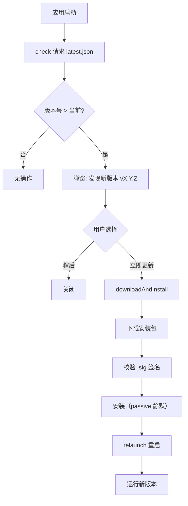

# AnserFlow - Client / Frontend

---

### 前端框架补充说明

> 以下为 Next.js SPA 生产级项目标准配套设施，覆盖状态管理、数据请求、表单、动效、主题等核心能力。

#### TanStack Query — 服务端状态管理

`@tanstack/react-query` 负责所有 API 数据请求，提供自动缓存、后台刷新、请求去重、乐观更新。SPA 模式下完全运行在客户端：

```tsx
// hooks/use-issues.ts
import { useQuery, useMutation, useQueryClient } from '@tanstack/react-query'

export function useIssues(projectId: number) {
  return useQuery({
    queryKey: ['issues', projectId],
    queryFn: () => fetch(`/api/projects/${projectId}/issues`).then(r => r.json()),
    staleTime: 30 * 1000,  // 30s 内不重新请求
  })
}

export function useCreateIssue() {
  const qc = useQueryClient()
  return useMutation({
    mutationFn: (data: CreateIssueReq) =>
      fetch('/api/issues', { method: 'POST', body: JSON.stringify(data) }).then(r => r.json()),
    onSuccess: (_, vars) => {
      qc.invalidateQueries({ queryKey: ['issues', vars.project_id] })
    },
  })
}
```

#### Zustand — 客户端状态管理

`zustand` 管理纯客户端状态：侧栏展开/收起、弹窗开关、Tab 切换状态、WebSocket 连接状态等。极简 API，无 Provider 包裹：

```tsx
// stores/sidebar.ts
import { create } from 'zustand'

export const useSidebar = create<SidebarState>((set) => ({
  isOpen: true,
  toggle: () => set((s) => ({ isOpen: !s.isOpen })),
}))
```

#### React Hook Form + Zod — 表单与校验

`react-hook-form` 提供高性能非受控表单，`zod` 声明式 schema 校验，与 shadcn/ui 的 `<Form />` 组件深度集成：

```tsx
// components/agent-form.tsx
import { useForm } from 'react-hook-form'
import { zodResolver } from '@hookform/resolvers/zod'
import { z } from 'zod'

const agentSchema = z.object({
  name: z.string().min(1, '名称不能为空').max(64),
  role_label: z.string().max(64),               // 自定义角色标签（如 PM / 前端 / 后端）
  system_prompt: z.string().max(200, '人设 1-2 句话即可，调度行为由 Eino Skill 定义'),
  runtime_id: z.number().min(1, '请选择运行时'),
  // runtime_config 由前端根据 runtimes.config_schema 动态生成表单字段
})

type AgentFormData = z.infer<typeof agentSchema>

export function AgentForm() {
  const form = useForm<AgentFormData>({ resolver: zodResolver(agentSchema) })
  // ...
}
```

#### TanStack Table — 数据表格

`@tanstack/react-table` 无头表格库，配合 shadcn/ui 的 `<DataTable />` 组件实现排序、筛选、分页、行选择：

```tsx
// features/issues/components/issue-table.tsx
const columns: ColumnDef<Issue>[] = [
  { accessorKey: 'title', header: '标题' },
  { accessorKey: 'status', header: '状态' },
  { accessorKey: 'priority', header: '优先级' },
]

<DataTable columns={columns} data={issues} />
```

#### Recharts — 数据可视化

`recharts` 用于 Dashboard 仪表盘图表，支持折线图、柱状图、饼图等常用图表类型：

```tsx
// features/dashboard/components/issue-stats-chart.tsx
import { BarChart, Bar, XAxis, YAxis, CartesianGrid, Tooltip, ResponsiveContainer } from 'recharts'

const data = [
  { status: 'backlog', count: 12 },
  { status: 'todo', count: 8 },
  { status: 'in_progress', count: 5 },
  { status: 'in_review', count: 3 },
  { status: 'done', count: 20 },
]

<ResponsiveContainer width="100%" height={300}>
  <BarChart data={data}>
    <CartesianGrid strokeDasharray="3 3" />
    <XAxis dataKey="status" />
    <YAxis />
    <Tooltip />
    <Bar dataKey="count" fill="var(--primary)" radius={[4, 4, 0, 0]} />
  </BarChart>
</ResponsiveContainer>
```

#### lucide-react — 图标库

`lucide-react` 提供 1000+ 开源 SVG 图标，按需导入，与 shadcn/ui 组件配套使用：

```tsx
import { Plus, Trash2, Settings, Users, FolderKanban, Bot, MessageSquare } from 'lucide-react'

<Button><Plus className="mr-2 h-4 w-4" />创建</Button>
<Button variant="destructive"><Trash2 className="h-4 w-4" /></Button>
```

> 图标命名语义化：`FolderKanban`（看板）、`Bot`（Agent）、`MessageSquare`（群聊）。

#### next-themes — 主题切换

`next-themes` 提供暗色/亮色主题切换，与 Tailwind CSS `dark:` 前缀原生配合，支持系统偏好跟随：

```tsx
import { useTheme } from 'next-themes'

<Button onClick={() => setTheme(theme === 'dark' ? 'light' : 'dark')}>
  <Sun className="dark:hidden" />
  <Moon className="hidden dark:block" />
</Button>
```

#### Framer Motion — 动效

`framer-motion` 提供页面过渡动画、Issue 行展开/折叠、模态框弹出动效：

```tsx
import { motion, AnimatePresence } from 'framer-motion'

<AnimatePresence>
  {isOpen && (
    <motion.div initial={{ opacity: 0, y: 20 }} animate={{ opacity: 1, y: 0 }} exit={{ opacity: 0 }}>
      <Modal />
    </motion.div>
  )}
</AnimatePresence>
```

#### Sonner — Toast 通知

`sonner` 替代传统 toast 库，支持 Promise 状态、富文本、自定义样式：

```tsx
import { toast } from 'sonner'

toast.promise(createAgent(data), {
  loading: '创建 Agent 中...',
  success: 'Agent 创建成功',
  error: '创建失败',
})
```

#### 日期处理

`date-fns` 纯函数日期工具，tree-shakable，按需导入：

```tsx
import { format, formatDistanceToNow } from 'date-fns'
import { zhCN } from 'date-fns/locale'

format(new Date(), 'yyyy-MM-dd HH:mm')
formatDistanceToNow(issue.created_at, { locale: zhCN, addSuffix: true }) // "3 小时前"
```


---
#### 环境变量管理

Next.js SPA 模式下，`NEXT_PUBLIC_` 前缀变量在构建时内联，敏感信息必须保留在后端：

```bash
# .env.local
NEXT_PUBLIC_API_BASE=http://localhost:8080/api
NEXT_PUBLIC_WS_URL=ws://localhost:8080/ws
```

#### 前端目录结构

采用 features 模块化架构，按业务功能组织代码。以下以 `admin/` 包为例，后台运行时通过 `basePath: '/admin'` 暴露为 `/admin/*`：

```
src/
├── app/
│       ├── layout.tsx          # 根布局（Provider 包裹）
│       ├── page.tsx            # /admin → 重定向到 /admin/dashboard
│       ├── login/              # /admin/login
│       ├── dashboard/          # /admin/dashboard
│       ├── agents/             # Agent 管理页
│       ├── projects/           # 项目 & Issue 页
│       └── groups/             # 群组 & 群聊页
├── components/                 # 共享 UI 组件
│   ├── ui/                     # shadcn/ui 基础组件
│   └── layout/                 # 布局组件（Sidebar/Navbar）
├── features/                   # 业务功能模块
│   ├── agents/
│   │   ├── api/               # API 请求 & mutation
│   │   ├── components/        # Agent 卡片/表单/列表
│   │   └── schemas/           # Zod 校验 schema
│   ├── issues/
│   ├── projects/
│   ├── organizations/         # 组织管理 + 成员邀请
│   ├── groups/                # 群组 & 群聊 WebSocket 通信（群管理 + 聊天复用 conversations）
│   ├── skills/                # Skills 管理
│   ├── notifications/         # 通知中心
│   ├── dashboard/             # 仪表盘图表
│   └── settings/              # 组织/全局设置
├── hooks/                      # 自定义 Hook
├── stores/                     # Zustand Store
├── lib/                        # 工具函数 & API client
│   ├── api.ts                 # 统一 fetch 封装
│   └── ws.ts                  # WebSocket 客户端
└── types/                      # TypeScript 类型定义
```

#### 代码质量工具

```json
{
  "scripts": {
    "lint": "eslint . --ext .ts,.tsx",
    "format": "prettier --write .",
    "type-check": "tsc --noEmit"
  }
}
```

| 工具 | 用途 |
|------|------|
| **ESLint** + `@next/eslint-plugin` | 代码规范检查 |
| **Prettier** + `prettier-plugin-tailwindcss` | 代码格式化 + Tailwind 类名排序 |
| **TypeScript strict** | `tsconfig.json` 启用 `strict: true` |

---

### 国际化（i18n）

> AnserFlow 面向全球用户，前端 UI + 后端邮件模板 + API 错误消息均需多语言支持。首期支持中文（zh-CN）和英文（en-US），架构预留扩展。

#### 整体架构

```
┌──────────────────────────────────────────────┐
│ 前端 (next-intl)                              │
│ ├── admin/messages/   ← 后台管理翻译           │
│ ├── desktop/messages/ ← 桌面端翻译             │
│ └── packages/shared-ui/messages/ ← 公共翻译    │
├──────────────────────────────────────────────┤
│ 后端 (go-i18n)                                │
│ ├── 邮件模板 i18n   → 邀请/通知邮件双语         │
│ └── API 错误码映射  → 前端根据 locale 展示      │
└──────────────────────────────────────────────┘
```

**设计原则**：

| 原则 | 说明 |
|------|------|
| 前端驱动 | UI 文案由前端 `next-intl` 管理，locale 存储在 localStorage + 已登录用户同步到 `users.locale`，URL 不含 locale 段 |
| 后端错误码 | API 返回国际化错误码（如 `ERR_ISSUE_NOT_FOUND`），前端映射为当前语言文案 |
| 邮件双语 | 邀请邮件根据用户语言偏好发送中/英文版本 |
| 翻译共享 | 公共 UI（按钮、表单校验提示）抽取到 `packages/shared-ui/messages/` 复用 |


---

#### 前端：next-intl

> `next-intl` 是 Next.js App Router 最主流的 i18n 库，原生支持 `output: "export"` 静态导出模式。

##### 安装与配置

```bash
npm install next-intl
```

```ts
// admin/next.config.ts
import createNextIntlPlugin from 'next-intl/plugin'

const withNextIntl = createNextIntlPlugin('./src/i18n/request.ts')

const nextConfig = {
  basePath: '/admin',
  output: 'export',
  distDir: 'dist',
}

export default withNextIntl(nextConfig)
```

```ts
// admin/src/i18n/request.ts
import { getRequestConfig } from 'next-intl/server'

// 静态导出模式：locale 从客户端 localStorage / navigator.language / 用户设置获取
// URL 不含 locale 段，所有页面统一走 /admin/* 路径
export default getRequestConfig(async () => {
  // 静态导出时使用默认 locale，实际切换在客户端完成
  return {
    locale: 'zh-CN',
    messages: (await import(`../../messages/zh-CN.json`)).default,
  }
})
```

**Locale 检测与切换**（纯客户端，不经过 URL）：

```ts
// admin/src/lib/locale.ts
export function detectLocale(): string {
  // 优先级：已登录用户设置 > localStorage > 浏览器语言 > 默认 zh-CN
  const stored = localStorage.getItem('anserflow-locale')
  if (stored) return stored

  const browserLang = navigator.language
  if (browserLang.startsWith('zh')) return 'zh-CN'
  if (browserLang.startsWith('en')) return 'en-US'

  return 'zh-CN'
}

export function setLocale(locale: string) {
  localStorage.setItem('anserflow-locale', locale)
  // 如果已登录，同步到后端 users.locale
  // window.location.reload() 或触发 next-intl 的 setLocale
}
```

```tsx
// 语言切换组件（无 URL 变化，纯客户端切换）
import { useRouter } from 'next/navigation'

export function LanguageSwitcher() {
  const switchTo = (locale: string) => {
    setLocale(locale)
    window.location.reload() // 重新加载页面以切换翻译包
  }

  return (
    <select onChange={(e) => switchTo(e.target.value)} value={detectLocale()}>
      <option value="zh-CN">中文</option>
      <option value="en-US">English</option>
    </select>
  )
}
```

##### 目录结构

```
admin/
├── messages/
│   ├── zh-CN.json          # 后台管理 - 中文
│   └── en-US.json          # 后台管理 - 英文
├── src/
│   ├── i18n/
│   │   └── request.ts      # next-intl 配置
│   └── app/                 # 统一 /admin/* 路由（不含 locale 段）
│       ├── layout.tsx       # NextIntlClientProvider
│       ├── page.tsx         # /admin → 重定向到 dashboard
│       ├── dashboard/
│       ├── agents/
│       └── projects/

desktop/
├── messages/               # 桌面端翻译（同上结构）

packages/shared-ui/
├── messages/               # 公共翻译（按钮、校验提示等）
│   ├── zh-CN.json
│   └── en-US.json
```

##### 翻译文件示例

```json
// admin/messages/zh-CN.json
{
  "Nav": {
    "dashboard": "仪表盘",
    "agents": "智能体",
    "projects": "项目",
    "skills": "技能",
    "settings": "设置"
  },
  "Issue": {
    "title": "Issue 标题",
    "status": "状态",
    "priority": "优先级",
    "assignee": "负责人",
    "create": "创建 Issue",
    "noResults": "暂无 Issue"
  },
  "Common": {
    "save": "保存",
    "cancel": "取消",
    "delete": "删除",
    "confirm": "确认",
    "loading": "加载中...",
    "error": "出错了"
  }
}
```

```json
// admin/messages/en-US.json
{
  "Nav": {
    "dashboard": "Dashboard",
    "agents": "Agents",
    "projects": "Projects",
    "skills": "Skills",
    "settings": "Settings"
  },
  "Issue": {
    "title": "Issue Title",
    "status": "Status",
    "priority": "Priority",
    "assignee": "Assignee",
    "create": "Create Issue",
    "noResults": "No Issues"
  },
  "Common": {
    "save": "Save",
    "cancel": "Cancel",
    "delete": "Delete",
    "confirm": "Confirm",
    "loading": "Loading...",
    "error": "Something went wrong"
  }
}
```

##### 组件使用

```tsx
// admin/src/app/dashboard/page.tsx
import { useTranslations } from 'next-intl'

export default function DashboardPage() {
  const t = useTranslations('Nav')
  const tIssue = useTranslations('Issue')

  return (
    <div>
      <h1>{t('dashboard')}</h1>           {/* "仪表盘" 或 "Dashboard" */}
      <span>{tIssue('noResults')}</span>  {/* "暂无 Issue" 或 "No Issues" */}
    </div>
  )
}
```

##### 日期/数字本地化

```tsx
import { useFormatter } from 'next-intl'

const format = useFormatter()

// 日期
format.dateTime(issue.createdAt, {
  year: 'numeric', month: 'long', day: 'numeric'
})
// zh-CN → "2026年5月13日"
// en-US → "May 13, 2026"

// 相对时间
format.relativeTime(issue.createdAt)
// zh-CN → "3小时前"
// en-US → "3 hours ago"
```

#### 翻译管理

| 阶段 | 方式 |
|------|------|
| 当前 L1-L4 | 手动编辑 JSON 文件 + `goi18n merge` 合并新增翻译 key |
| Phase 2 | 如翻译量明显增加，再单独立项接入 Crowdin / Lokalise |

```bash
# Go 后端翻译管理
goi18n extract           # 从 Go 源码提取待翻译消息 → translate.zh-CN.json
goi18n merge active.*.json translate.*.json  # 合并新增 key
```

---

### Tauri 桌面端补充说明

> Tauri 2.x 负责将 Next.js SPA 打包为桌面应用（Windows/macOS/Linux）+ 移动端（Android/iOS）。以下为 Tauri 项目核心架构、安全模型、插件体系和分发流程。

#### 进程模型

Tauri 采用多进程架构，遵循最小权限原则：

```
┌─────────────────────────────────┐
│  Core 进程 (Rust)                │
│  ├── 唯一拥有 OS 完整访问权限     │
│  ├── 窗口管理 / 系统托盘          │
│  ├── IPC 消息路由与拦截           │
│  ├── 全局状态管理                 │
│  └── 插件调度                    │
├─────────────────────────────────┤
│  WebView 进程 (JS/TS)            │
│  ├── 渲染 Next.js SPA            │
│  ├── 通过 IPC 调用 Core 能力      │
│  └── 受 CSP + Capabilities 限制  │
└─────────────────────────────────┘
```

- **Core 进程**：Rust 编写，管理窗口、托盘、通知，路由所有 IPC 消息
- **WebView 进程**：操作系统原生 WebView（Windows: Edge WebView2, macOS: WKWebView, Linux: webkitgtk）
- **安全隔离**：前端无法直接访问 OS，必须通过 Capabilities 声明的命令才能调用 Core 能力

#### 项目结构

Tauri 项目位于 `desktop/src-tauri/`，与 `desktop/package.json` 同级，符合 Tauri 默认约定：

```
desktop/                       # 桌面客户端根目录
├── package.json               # Next.js + Tauri CLI 依赖
├── next.config.js
├── src/                       # Next.js 源码
├── dist/                      # 构建产物 → frontendDist: "../dist"
└── src-tauri/                 # Tauri Rust 项目
    ├── Cargo.toml             # Rust 依赖
    ├── tauri.conf.json        # Tauri 核心配置
    ├── capabilities/
    │   └── default.json       # 权限声明
    ├── icons/                 # 应用图标（多平台）
    ├── src/
    │   ├── main.rs            # 桌面入口
    │   ├── lib.rs             # 核心逻辑 + 移动端入口
    │   └── commands.rs        # IPC 命令定义
    └── build.rs
```

#### 安全模型：Capabilities

Tauri v2 采用声明式权限系统，`capabilities/default.json` 精确控制前端可调用的能力：

```json
{
  "identifier": "default",
  "description": "默认权限集",
  "windows": ["main"],
  "permissions": [
    "core:default",
    "shell:allow-open",
    "notification:default",
    "dialog:default",
    "clipboard-manager:default",
    "updater:default",
    "process:default",
    "deep-link:default"
  ]
}
```

| 能力 | 用途 |
|------|------|
| `core:default` | 窗口操作、应用事件 |
| `shell:allow-open` | 用系统默认程序打开 URL/文件 |
| `notification:default` | 系统原生通知 |
| `dialog:default` | 原生文件选择/保存对话框 |
| `clipboard-manager:default` | 读写剪贴板 |
| `updater:default` | 自动更新 |
| `process:default` | 进程管理（重启） |
| `deep-link:default` | 自定义协议深度链接 |

#### IPC 通信

前端通过 `@tauri-apps/api` 调用 Rust 端命令，采用异步消息传递：

```rust
// src-tauri/src/commands.rs
#[tauri::command]
fn get_app_version() -> String {
    env!("CARGO_PKG_VERSION").to_string()
}

#[tauri::command]
async fn get_system_info() -> Result<SystemInfo, String> {
    // 获取 OS 信息
    Ok(SystemInfo { os: std::env::consts::OS.to_string() })
}
```

```ts
// 前端调用
import { invoke } from '@tauri-apps/api/core'

const version = await invoke<string>('get_app_version')
const sysInfo = await invoke<SystemInfo>('get_system_info')
```

**核心 IPC 命令**（AnserFlow 场景）：

| 命令 | 功能 |
|------|------|
| `get_app_version` | 获取应用版本 |
| `open_url` | 用系统浏览器打开外部链接 |
| `show_notification` | 发送系统通知 |
| `get_system_info` | 获取 OS 信息 |
| `restart_app` | 更新后重启应用 |

#### Tauri 配置

`tauri.conf.json` 核心配置：

```json
{
  "productName": "AnserFlow",
  "version": "0.1.0",
  "identifier": "io.anserflow.app",
  "build": {
    "beforeBuildCommand": "npm run build",
    "beforeDevCommand": "npm run dev",
    "devUrl": "http://localhost:3001",
    "frontendDist": "../dist"
  },
  "app": {
    "windows": [{
      "title": "AnserFlow",
      "width": 1280,
      "height": 800,
      "minWidth": 900,
      "minHeight": 600,
      "resizable": true,
      "center": true
    }],
    "security": {
      "csp": "default-src 'self'; connect-src 'self' http://localhost:8080 ws://localhost:8080 https://${API_DOMAIN} wss://${API_DOMAIN}"
    }
  },
  "bundle": {
    "active": true,
    "targets": "all",
    "icon": ["icons/icon.png"],
    "createUpdaterArtifacts": true
  },
  "plugins": {
    "deep-link": {
      "desktop": {
        "schemes": ["anserflow"]
      }
    }
  }
}
```

生产构建时通过环境变量 `${API_DOMAIN}` 注入实际服务域名；开发环境保留 `localhost:8080` 便于本地联调。

#### 插件体系

AnserFlow 需要用到的 Tauri 官方插件：

| 插件 | 场景 |
|------|------|
| **notification** | Issue 状态变更 / Agent 执行完成 / @提及 系统通知 |
| **shell** | 用系统默认浏览器打开 GitHub PR 链接 |
| **dialog** | 文件选择（Skills ZIP 导入） |
| **clipboard-manager** | 复制邀请链接 |
| **updater** | 应用内自动更新 |
| **process** | 更新完成后重启应用 |
| **window-state** | 记忆窗口大小和位置 |
| **single-instance** | 防止重复启动 |
| **deep-link** | `anserflow://invite/xxx` 协议处理邀请 |
| **fs** | 文件系统访问（Skills ZIP 解压） |
| **store** | 持久化键值存储（本地设置缓存） |
| **logging** | Rust 端日志输出 |

安装示例：

```bash
cargo tauri add notification
cargo tauri add updater
cargo tauri add deep-link
```

#### 深度链接

通过 `anserflow://` 自定义协议处理邀请链接，用户点击 `anserflow://invite/abc123` 时自动打开桌面应用并跳转到接受邀请页面：

```rust
// src-tauri/src/lib.rs
use tauri_plugin_deep_link::DeepLinkExt;

app.listen_deep_link(|url| {
    if let Some(token) = url.path().strip_prefix("/invite/") {
        // 通知前端跳转到邀请页面
        app.emit("deep-link-invite", token).unwrap();
    }
});
```

```ts
// 前端监听
import { listen } from '@tauri-apps/api/event'

listen('deep-link-invite', (event) => {
  router.push(`/invite/${event.payload}`)
})
```

#### 自动更新

> 核心插件：`tauri-plugin-updater`。支持从 GitHub Releases 静态 JSON 或自定义服务器获取更新。

##### 密钥生成（一次性）

Tauri 更新必须签名校验，需要一对公私钥：

```bash
# 生成密钥对（保存到安全位置，私钥绝不可泄露）
npm run tauri signer generate -w ~/.tauri/anserflow.key
# 输出：
#   ~/.tauri/anserflow.key      ← 私钥（机密，配置到 CI secrets）
#   ~/.tauri/anserflow.key.pub  ← 公钥（写入 tauri.conf.json）
```

##### tauri.conf.json 配置

```json
{
  "bundle": {
    "createUpdaterArtifacts": true
  },
  "plugins": {
    "updater": {
      "pubkey": "dW50cnVzdGVkIGNvbW1lbnQ6IG1pbmlzaWduIHB1YmxpYyBrZXk6I...",
      "endpoints": [
        "https://github.com/anserflow/anserflow/releases/latest/download/latest.json"
      ],
      "windows": {
        "installMode": "passive"
      }
    }
  }
}
```

| 配置项 | 说明 |
|--------|------|
| `pubkey` | 公钥内容（不是文件路径），用于校验安装包签名 |
| `endpoints` | 更新检查 URL 列表，依次尝试直到返回 2xx |
| `installMode` | Windows 安装模式：`passive`（静默进度条 / 默认）、`basicUi`（用户交互）、`quiet`（完全静默） |
| `createUpdaterArtifacts` | `true` 时构建自动生成 `.sig` 签名文件 |

URL 支持动态变量：`{{current_version}}`、`{{target}}` (win/mac/linux)、`{{arch}}` (x86_64/aarch64)。

##### GitHub Actions 自动发布

构建时设置私钥环境变量，Tauri 自动生成签名 + `latest.json`：

```yaml
# .github/workflows/desktop-release.yml（关键步骤）
- name: Build & Release
  uses: tauri-apps/tauri-action@v0
  env:
    GITHUB_TOKEN: ${{ secrets.GITHUB_TOKEN }}
    TAURI_SIGNING_PRIVATE_KEY: ${{ secrets.TAURI_PRIVATE_KEY }}
    TAURI_SIGNING_PRIVATE_KEY_PASSWORD: ${{ secrets.TAURI_KEY_PASSWORD }}
  with:
    projectPath: 'desktop'
    tagName: 'desktop-v__VERSION__'
    releaseName: 'AnserFlow Desktop v__VERSION__'
    releaseBody: 'See CHANGELOG.md'
    includeUpdaterJson: true    # ← 自动生成 latest.json 并上传
    releaseDraft: true
```

**CI Secrets 需配置**：

| Secret | 说明 |
|--------|------|
| `TAURI_PRIVATE_KEY` | 私钥内容或路径 |
| `TAURI_KEY_PASSWORD` | 生成密钥时设置的密码 |
| `APPLE_CERTIFICATE` | macOS 签名证书（base64） |
| `APPLE_CERTIFICATE_PASSWORD` | 证书密码 |
| `APPLE_ID` / `APPLE_PASSWORD` / `APPLE_TEAM_ID` | macOS 公证 |

##### 更新服务器方案对比

| 方案 | 优点 | 缺点 | 推荐场景 |
|------|------|------|----------|
| **GitHub Releases 静态 JSON** | 零成本、自动生成 `latest.json` | 国内下载慢 | ✅ AnserFlow 首选 |
| **GitHub Releases + CDN 代理** | 零成本、国内加速 | 需配置加速域名 | 国内用户多的项目 |
| **自建 Go 更新 API** | 完全可控、灰度发布 | 需维护服务器 | 企业级分发 |
| **S3 / OSS 静态 JSON** | CDN 加速、高可用 | 需手动上传 | 有云服务预算的项目 |

> AnserFlow 推荐方案：GitHub Releases 托管 `latest.json`，国内用户走 CDN 代理（如 `gh.anserflow.cn`）。

##### 前端更新检查

应用启动时自动检查更新，有则弹窗提示，用户确认后下载安装并重启：

```ts
// desktop/src/lib/updater.ts
import { check } from '@tauri-apps/plugin-updater'
import { ask, message } from '@tauri-apps/plugin-dialog'
import { relaunch } from '@tauri-apps/plugin-process'

/**
 * 检查并执行应用更新
 * @param onUserClick 是否由用户手动触发（手动触发时无更新也弹提示）
 */
export async function checkForUpdates(onUserClick = false) {
  try {
    const update = await check()

    if (!update) {
      if (onUserClick) {
        await message('已是最新版本 🎉', {
          title: '检查更新',
          kind: 'info',
        })
      }
      return
    }

    // 有新版本 → 弹窗确认
    const yes = await ask(
      `发现新版本 v${update.version}\n\n${update.body || ''}`,
      {
        title: '更新可用',
        kind: 'info',
        okLabel: '立即更新',
        cancelLabel: '稍后',
      },
    )

    if (yes) {
      // 下载 + 安装 + 重启
      await update.downloadAndInstall()
      await relaunch()
    }
  } catch (e) {
    console.error('更新检查失败:', e)
  }
}
```

```tsx
// 应用入口调用
import { useEffect } from 'react'
import { checkForUpdates } from '@/lib/updater'

useEffect(() => {
  checkForUpdates() // 启动时静默检查
}, [])
```

##### 更新流程全貌



##### Capabilities 权限

更新所需的权限声明：

```json
// src-tauri/capabilities/default.json
{
  "permissions": [
    "updater:default",
    "updater:allow-check",
    "updater:allow-download-and-install",
    "dialog:default",
    "dialog:allow-ask",
    "dialog:allow-message",
    "process:allow-restart"
  ]
}
```

##### 调试技巧

```bash
# 本地测试更新流程（不发布 Release）
# 1. 修改 version
cargo set-version 0.2.0 --path desktop/src-tauri/Cargo.toml

# 2. 构建并手动启动一个本地静态服务器提供 latest.json
cargo tauri build
npx serve target/release/bundle

# 3. 在 tauri.conf.json 临时指向本地
# "endpoints": ["http://localhost:3000/latest.json"]
```

#### 打包与分发

| 平台 | 格式 | 说明 |
|------|------|------|
| **Windows** | MSI / NSIS | MSI 支持企业批量部署，NSIS 体积更小 |
| **macOS** | DMG | 需 Apple Developer 签名 + Notarization |
| **Linux** | AppImage / deb / rpm | AppImage 通用性最好 |
| **Android** | APK / AAB | 通过 Tauri Android 插件打包 |
| **iOS** | IPA | 需 Apple Developer 账号 |

```bash
# 三平台交叉编译
cargo tauri build --target x86_64-pc-windows-msvc
cargo tauri build --target x86_64-apple-darwin
cargo tauri build --target aarch64-apple-darwin
cargo tauri build --target x86_64-unknown-linux-gnu
```

#### Tauri 前端适配

SPA 在 Tauri WebView 中需注意的适配点：

```ts
// lib/tauri.ts — 环境检测与适配
import { isTauri } from '@tauri-apps/api/core'
import { getLocalSettings } from '@/lib/local-settings'

// 浏览器后台走同源 /api；桌面端读取已配置的远程服务地址
export async function getApiConfig() {
  if (!isTauri()) {
    return {
      apiBase: process.env.NEXT_PUBLIC_API_BASE!,
      wsUrl: process.env.NEXT_PUBLIC_WS_URL!,
    }
  }

  const settings = await getLocalSettings()
  return {
    apiBase: settings.apiBase,
    wsUrl: settings.wsUrl,
  }
}

// CSP 适配：Tauri WebView 中 'self' 指向 tauri://localhost
// 需在 tauri.conf.json 的 CSP 中白名单后端地址
```

**桌面端组织上下文**：桌面端路由为 `/projects/:id`、`/chat` 等扁平路径（无 org_id 前缀），但 API 路由需要 `org_id`。桌面端通过以下机制建立组织上下文：

```ts
// desktop/src/lib/org-context.ts — 桌面端组织选择与缓存
import { getSettings, updateSettings } from '@/lib/local-settings'
import { invoke } from '@tauri-apps/api/core'

export async function getCurrentOrgId(): Promise<string> {
  const settings = await getSettings()
  // 如果已有缓存，直接使用
  if (settings.lastOrgId) return settings.lastOrgId

  // 否则从 API 获取用户加入的第一个组织
  const orgs = await fetch(`${settings.apiBase}/api/orgs`).then(r => r.json())
  if (orgs.length === 0) throw new Error('未加入任何组织')
  
  await updateSettings({ lastOrgId: orgs[0].id })
  return orgs[0].id
}

// API 调用时自动注入 org_id
export async function apiFetch(path: string, init?: RequestInit) {
  const orgId = await getCurrentOrgId()
  const url = path.startsWith('/api/orgs/')
    ? path  // 已包含 org_id
    : path.replace('/api/', `/api/orgs/${orgId}/`)
  return fetch(url, init)
}
```

桌面 UI 提供组织切换组件，切换时更新 `lastOrgId` 并刷新所有数据：

```tsx
// desktop/src/components/org-switcher.tsx
const { data: orgs } = useQuery({ queryKey: ['orgs'], queryFn: fetchOrgs })
<Select onValueChange={setCurrentOrgId}>
  {orgs?.map(o => <SelectItem key={o.id} value={o.id}>{o.name}</SelectItem>)}
</Select>
```

#### Rust 最小学习路径

AnserFlow 桌面端 Rust 代码量极少，核心仅三个文件，每个都可以按模板修改：

| 文件 | 行数 | 内容 | Rust 知识点 |
|------|------|------|------------|
| `main.rs` | ~10 | 入口（固定模板） | 无，复制粘贴 |
| `lib.rs` | ~20 | 插件注册 + 初始化 | 宏调用、Result |
| `commands.rs` | ~40 | IPC 命令 | 函数声明、字符串操作 |

**对比**：Go vs Rust 在桌面端职责中的对应关系：

```
Go 概念          →  Rust 概念
━━━━━━━━━━━━━━━━━━━━━━━━━━━━━━━━━━
func cmd()       →  fn cmd()
string           →  String
map[string]T     →  HashMap<String, T>
err != nil       →  match / ? 操作符
struct{}         →  struct{}
go mod           →  Cargo.toml
```

> **结论**：不需要学 Rust。参考 AI 生成 + 模板修改即可完成桌面端开发。

#### lib.rs 完整示例

将所有插件在 `lib.rs` 中一次性注册，AnserFlow 桌面端的完整 Rust 骨架：

```rust
// src-tauri/src/lib.rs
use tauri_plugin_deep_link::DeepLinkExt;

#[cfg_attr(mobile, tauri::mobile_entry_point)]
pub fn run() {
    tauri::Builder::default()
        // ── 插件注册 ──
        .plugin(tauri_plugin_notification::init())
        .plugin(tauri_plugin_shell::init())
        .plugin(tauri_plugin_dialog::init())
        .plugin(tauri_plugin_clipboard_manager::init())
        .plugin(tauri_plugin_store::Builder::new().build())
        .plugin(tauri_plugin_window_state::Builder::default().build())
        .plugin(tauri_plugin_single_instance::init(|app, _args, _cwd| {
            // 重复启动 → 激活已有窗口
            if let Some(window) = app.get_webview_window("main") {
                let _ = window.show();
                let _ = window.set_focus();
            }
        }))
        .plugin(
            tauri_plugin_updater::Builder::new().build()
        )
        .plugin(
            tauri_plugin_log::Builder::new()
                .level(log::LevelFilter::Info)
                .target(tauri_plugin_log::Target::new(
                    tauri_plugin_log::TargetKind::LogDir {
                        file_name: Some("anserflow".to_string()),
                    },
                ))
                .max_file_size(5_000_000)  // 5MB
                .rotation_strategy(tauri_plugin_log::RotationStrategy::KeepAll)
                .build(),
        )
        // ── 深度链接 ──
        .setup(|app| {
            #[cfg(desktop)]
            {
                app.listen_deep_link(|url| {
                    if let Some(token) = url.path().strip_prefix("/invite/") {
                        app.emit("deep-link-invite", token).unwrap();
                    }
                });
            }
            Ok(())
        })
        .invoke_handler(tauri::generate_handler![
            commands::get_system_info,
            commands::open_url,
            commands::restart_app,
        ])
        .run(tauri::generate_context!())
        .expect("error while running tauri application");
}
```

```rust
// src-tauri/src/commands.rs — IPC 命令
use tauri::Manager;

#[tauri::command]
fn get_system_info() -> Result<String, String> {
    Ok(format!(
        "{{ \"os\": \"{}\", \"arch\": \"{}\" }}",
        std::env::consts::OS,
        std::env::consts::ARCH,
    ))
}

#[tauri::command]
fn open_url(app: tauri::AppHandle, url: String) -> Result<(), String> {
    tauri_plugin_shell::ShellExt::shell(&app)
        .open(&url, None)
        .map_err(|e| e.to_string())
}

#[tauri::command]
fn restart_app(app: tauri::AppHandle) {
    app.restart();
}
```

#### 通知插件实战

AnserFlow 关键通知场景的 TypeScript 封装：

```ts
// desktop/src/lib/notifications.ts
import {
  isPermissionGranted,
  requestPermission,
  sendNotification,
  registerActionTypes,
  onAction,
  createChannel,
  Importance,
} from '@tauri-apps/plugin-notification'

// 初始化：申请权限 + 注册频道
async function initNotifications() {
  const granted = await isPermissionGranted()
  if (!granted) {
    const perm = await requestPermission()
    if (perm !== 'granted') return
  }

  // 注册通知频道（Android 必需，其他平台兼容）
  await createChannel({
    id: 'issues',
    name: 'Issue 通知',
    description: 'Issue 状态变更、@提及、分配',
    importance: Importance.High,
    visibility: 1, // Private
  })

  await createChannel({
    id: 'agent',
    name: 'Agent 通知',
    description: 'Agent 执行完成通知',
    importance: Importance.Default,
  })

  // 注册带操作的 Issue 通知
  await registerActionTypes([{
    id: 'issue-actions',
    actions: [
      { id: 'view', title: '查看详情', foreground: true },
      { id: 'close', title: '关闭 Issue', foreground: false },
    ],
  }])
}

// 监听通知操作
onAction((action) => {
  if (action.actionId === 'view') {
    // 导航到 Issue 详情页
    window.location.hash = `/projects/${action.payload?.projectId}/issues/${action.payload?.issueId}`
  }
  if (action.actionId === 'close') {
    // 调用 API 关闭 Issue
    fetch(`/api/issues/${action.payload?.issueId}/close`, { method: 'POST' })
  }
})

// 场景函数
export async function notifyIssueAssigned(title: string, issueUrl: string) {
  await sendNotification({
    title: '📋 新 Issue 分配',
    body: title,
    channelId: 'issues',
    actionTypeId: 'issue-actions',
  })
}

export async function notifyAgentComplete(agentName: string) {
  await sendNotification({
    title: '✅ Agent 执行完成',
    body: `${agentName} 已完成任务`,
    channelId: 'agent',
  })
}

export async function notifyMention(who: string, message: string) {
  await sendNotification({
    title: `💬 ${who} 提到了你`,
    body: message,
    channelId: 'issues',
  })
}
```

#### Store 插件实战

用 tauri-plugin-store 持久化本地设置（窗口尺寸、主题、API 地址等），比 localStorage 更可靠：

```ts
// desktop/src/lib/local-settings.ts
import { load } from '@tauri-apps/plugin-store'

interface LocalSettings {
  theme: 'light' | 'dark' | 'system'
  apiBase: string          // 后端 API 地址
  wsUrl: string            // WebSocket 地址
  lastProjectId?: string
  windowBounds?: { x: number; y: number; width: number; height: number }
}

const DEFAULT: LocalSettings = {
  theme: 'system',
  apiBase: 'https://${API_DOMAIN}/api',
  wsUrl: 'wss://${API_DOMAIN}/ws',
}

let _store: Awaited<ReturnType<typeof load>> | null = null

async function getStore() {
  if (!_store) {
    _store = await load('settings.json', { autoSave: true })
  }
  return _store
}

export async function getSettings(): Promise<LocalSettings> {
  const store = await getStore()
  const val = await store.get<LocalSettings>('settings')
  return { ...DEFAULT, ...val }
}

export async function updateSettings(patch: Partial<LocalSettings>) {
  const store = await getStore()
  const current = await getSettings()
  await store.set('settings', { ...current, ...patch })
  // autoSave: true 会自动持久化
}
```

#### Logging 插件实战

生产环境日志落到文件，便于排查问题：

```ts
// desktop/src/lib/logger.ts
import { info, warn, error, attachConsole } from '@tauri-apps/plugin-log'

// 开发时：前端 console → Rust 日志系统
export function setupLogger() {
  attachConsole() // 将 Rust 日志打印到 WebView console

  // 将 console.log/warn/error 转发到 Rust 日志文件
  const forward = (fnName: 'log' | 'warn' | 'error', logger: (msg: string) => Promise<void>) => {
    const orig = console[fnName]
    console[fnName] = (...args: any[]) => {
      orig(...args)
      logger(args.map(String).join(' '))
    }
  }
  forward('log', info)
  forward('warn', warn)
  forward('error', error)
}

// 调用日志
// info('用户登录成功', { userId: 123 })
// error('API 请求失败', { url: '/api/issues', status: 500 })
```

#### CI/CD：桌面端发布

> 完整工作流见「三、GitHub Flow 与 CI/CD → 3.6」节。此处仅列 Tauri 特定注意事项：

| 事项 | 说明 |
|------|------|
| 触发标签 | `desktop-v*` |
| Node.js 版本 | 22（非 20，与根 `package.json` engines 一致） |
| macOS 签名 | 需 `APPLE_CERTIFICATE` / `APPLE_ID` 等 5 个 secrets |
| Rust Target | `aarch64-apple-darwin` + `x86_64-apple-darwin` 需分别构建 |

#### WebDriver E2E 测试

Tauri 内置 WebDriver 支持，可编写 Selenium/WebdriverIO 脚本测试桌面应用：

```bash
# 安装 tauri-driver
cargo install tauri-driver

# 启动测试
tauri-driver &
cargo tauri dev &  # 或 cargo tauri build --debug
npx wdio run wdio.conf.ts
```

```ts
// wdio.conf.ts
const wdioOptions = {
  hostname: 'localhost',
  port: 4444,
  path: '/',
  capabilities: [{
    'tauri:options': {
      application: './src-tauri/target/debug/anserflow-desktop',
    },
  }],
}
```

> 适合对关键流程（登录、创建 Issue、接受邀请）做自动化回归。

#### 推荐插件分级

| 优先级 | 插件 | 原因 |
|--------|------|------|
| 🔴 必须 | window-state | 窗口尺寸记忆，用户体验基础 |
| 🔴 必须 | single-instance | 防止多开导致的状态冲突 |
| 🔴 必须 | notification | 核心功能（Issue / Agent 通知） |
| 🔴 必须 | shell | 打开 GitHub PR 链接 |
| 🔴 必须 | updater | 自动更新分发 |
| 🟡 重要 | store | 持久化本地设置 |
| 🟡 重要 | logging | 生产排查日志 |
| 🟡 重要 | deep-link | 邀请链接直接打开桌面端 |
| 🟡 重要 | dialog | Skills ZIP 导入 |
| 🟢 可选 | clipboard-manager | 复制邀请链接 |
| 🟢 可选 | fs | 文件系统操作 |
| 🟢 可选 | process | 更新后重启 |


---

### 11.2 客户端（Tauri）

PC 桌面 + Android + iOS 共用 Next.js 前端，Tauri 打包：

- **WebView 内嵌** Next.js 构建产物
- **核心路由**：`/dashboard`、`/projects/:id`、`/chat`、`/invite/:token`
- **原生能力**：系统通知、文件系统、Git 代理（Tauri Command）
- **分阶段交付**：先桌面端，移动端作为 Phase 2

**`/chat` IM 两栏布局**：

```
/chat                          ← 主聊天页面（两栏布局）
  左侧：会话列表（side panel）
    ├── 搜索/新建双人聊（支持搜索用户和 Agent）
    ├── 双人聊列表项
    │     - 人+人：对方用户头像 + 昵称 + 最后消息 + 未读数
    │     - 人+Agent：Agent 头像 + 名称 + Agent 标识 + 最后消息 + 未读数
    ├── 群聊列表项（群名 + 最后消息 + 未读数）
    │     - 按最后消息时间统一排序（双人聊和群聊混合排列）
    │
  右侧：聊天窗口
    /chat/:group_id            ← 选中会话后展示聊天内容
      - 顶部：会话标题（direct: 对方昵称/Agent名称，从成员信息派生；group: 群名）
      - 中部：消息列表（复用现有 MessageList 组件）
      - 底部：输入框（条件渲染，见下方）
```

**direct 类型下的 UI 条件渲染**：

| 场景 | 隐藏 | 显示 |
|------|------|------|
| 人+人（direct, 无 Agent） | @Agent 选择器、/backlog 按钮、Agent 成员头像、成员管理面板 | 纯文本输入框、/new 按钮 |
| 人+Agent（direct, 有 Agent） | @Agent 选择器（只有 1 个 Agent，无需 @）、成员管理面板 | /backlog 按钮、/new 按钮、Agent 头像标识、Agent 回复消息 |
| 群聊（group） | — | 全部功能 |

