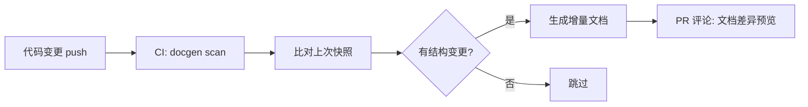
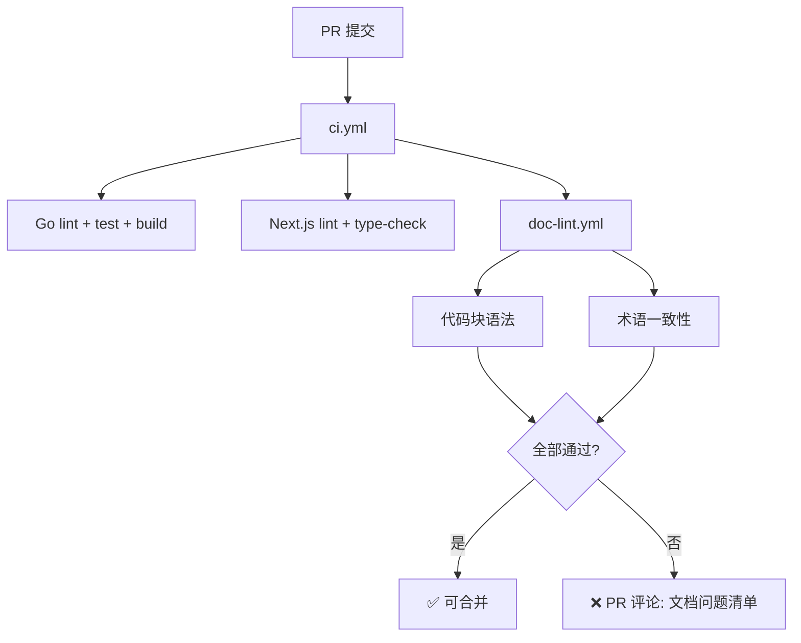
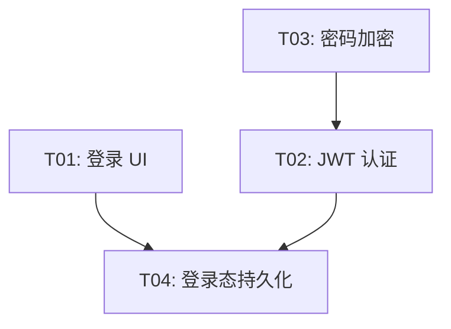

# AnserFlow - Overview and Infra

---

# AnserFlow — 多智能体协作项目管理系统 架构分析文档

## 一、系统愿景

构建一个 **AI Agent + 自然人混合协作** 的项目管理平台。核心场景：

> 自然人创建项目 → 拉群（CEO/CTO/前端/后端等 Agent 角色入群）→ 发布需求 → Agent 根据角色设定自动讨论生成落地方案 → 自动拆解为 Issue 并关联项目 → Agent 认领执行 → 自然人审核验收。

---

## 当前阶段闭环约束

为避免规划项长期悬空，本文档对当前阶段范围做如下收口：

1. 当前交付只以 **L1-L4 路线图** 为验收范围；第十五章统一视为远期 backlog，不计入本轮完成标准。
2. 当前 Git 平台只验收 **GitHub**；`git_platform` 仅保留数据模型兼容位，不要求本轮实现 Gitea / GitLab / Gitea GitPlatform。
3. 当前前端交付闭环 **admin SPA 嵌入 Go** 与 **客户端 Web SPA（IM 聊天界面）**；统一使用 Next.js SPA 技术栈，浏览器访问。
4. 当前客户端闭环 **Web 端**；Crowdin / Lokalise、Pact 合约测试、`golang-migrate`、文档自动生成与 wiki 拆分均归入 Phase 2 或单独立项，不阻塞本轮验收。
5. 文中的目录树、接口、伪代码和工作流若未在仓库中落地，默认按 **目标架构说明** 理解，不视为“仓库现状已实现”。


---

## 二、技术栈总览

```
┌──────────────────────────────────────────┐
│ 前端       Next.js 14 SPA (static export)│
│           shadcn/ui + Tailwind CSS        │
│           TanStack Query (数据请求)       │
│           Zustand (客户端状态)            │
│           React Hook Form + Zod (表单)    │
│           next-intl (国际化)              │
├──────────────────────────────────────────┤
│ 后端框架   Gin                           │
│ ORM        GORM                          │
│ 数据库     MySQL 8.0+                    │
│ CLI        Cobra                         │
│ 静态嵌入   embed (Go 1.16+)              │
│ 配置       Viper                         │
│ 日志       Zap                           │
│ 校验       go-playground/validator       │
│ 权限       Casbin (RBAC)                 │
├──────────────────────────────────────────┤
│ 缓存/广播  Redis                         │
│ 实时通信   Gorilla WebSocket             │
│           + Redis Pub/Sub (分布式)        │
│ 任务队列   Asynq (基于 Redis)            │
├──────────────────────────────────────────┤
│ AI Agent   Eino (字节跳动 CloudWeGo)     │
│            + 自研业务封装层               │
│ 沙箱       Docker SDK for Go            │
├──────────────────────────────────────────┤
│ Skills     手动编写 + ZIP 导入           │
│ 认证       JWT + OAuth2 (GitHub)         │
│ 邮件       gomail (SMTP)                 │
│ 邀请       分享链接 + 邮箱               │
│ 国际化     next-intl (前端)               │
│           go-i18n (后端)                  │
│ API文档    Swagger (swaggo/swag)         │
│ 跨域       gin-contrib/cors              │
└──────────────────────────────────────────┘
```

### 选型理由

| 技术 | 理由 |
|------|------|
| **Gin** | 高性能、生态成熟、中文社区活跃 |
| **GORM** | Go 最流行的 ORM，支持 MySQL 全面 |
| **MySQL 8.0+** | 关系型数据、事务支持、稳定可靠 |
| **Cobra** | Go CLI 标准库，`anserflow server/init` 命令 |
| **embed** | Go 1.16+ 原生静态文件嵌入，编译为单一可执行文件 |
| **Viper** | Go 配置管理标准库，支持 YAML/ENV 多源加载 |
| **Zap** | Uber 开源高性能结构化日志库 |
| **validator** | Go 结构体校验标准库，API 请求参数校验 |
| **Casbin** | 灵活的 RBAC/ABAC 权限模型，满足组织角色管理 |
| **Next.js SPA** | `output: "export"` 模式，产物可直接嵌入 Go 二进制 |
| **Redis** | 缓存 + WebSocket 分布式 Pub/Sub + Asynq 任务队列，一个组件覆盖三个场景 |
| **Gorilla WebSocket** | Go 社区最成熟的 WebSocket 库 |
| **Asynq** | Go 原生、基于 Redis、支持重试/超时/优先级/死信队列，零额外运维 |
| **Eino** | 字节跳动开源、12k+ Stars、Graph/Workflow 多 Agent 编排、流式原生支持、中文社区强 |
| **Docker SDK** | Agent 编码沙箱隔离，资源限制、自动清理 |
| **TanStack Query** | 服务端状态管理，自动缓存/重取/去重，SPA 模式完美兼容 |
| **Zustand** | 极轻量客户端状态管理（侧栏、弹窗、Tab 切换状态） |
| **React Hook Form + Zod** | 高性能表单 + 声明式校验，与 shadcn/ui 深度集成 |
| **TanStack Table** | 无头表格库，Issue 列表/Agent 列表/成员表格 |
| **Recharts** | 图表库，Dashboard 数据可视化 |
| **next-themes** | 暗色/亮色主题切换，与 Tailwind CSS 原生配合 |
| **next-intl** | Next.js App Router 原生 i18n、静态导出兼容、TypeScript 类型安全、ICU 消息格式 |
| **Framer Motion** | 动效库，页面过渡、Issue Tab 展开/折叠动画 |
| **Sonner** | 轻量 Toast 通知，操作反馈 |
| **date-fns** | 日期处理，轻量 tree-shakable |
| **lucide-react** | 图标库，与 shadcn/ui 配套 |
| **shadcn/ui** | 无捆绑、可定制、基于 Radix 的可访问组件 |
| **gomail** | Go 邮件发送库，支持 SMTP/SSL，用于邮箱邀请和通知 |
| **swaggo/swag** | Swagger/OpenAPI 文档自动生成，便于前后端联调 |
| **gin-contrib/cors** | Gin 官方 CORS 中间件，SPA 跨域支持 |
| **go-i18n** | Go 标准 i18n 库，CLI 管理翻译文件，复数规则支持，用于邮件模板和 API 错误消息 |


---

> **opencode**：AnserFlow 内置默认运行时，基于开源 AI 编码代理 [anomalyco/opencode](https://github.com/anomalyco/opencode)（TypeScript，160k+ Stars）。在 Docker 沙箱中通过非交互 CLI 模式（`opencode run`）执行编码任务。支持多 LLM 提供商、Plan/Build 双模式。**hermes**：Nous Research 开源 AI Agent，支持 20+ Provider、持久记忆、Skills 系统。Agent 可绑定任意运行时。

### 系统功能模块总览

```mermaid
graph TD
    A["AnserFlow 平台"] --> B["用户与权限"]
    A --> C["Agent 管理"]
    A --> D["群聊协作"]
    A --> E["项目管理"]
    A --> F["Issue 系统"]
    A --> G["Agent 执行引擎"]
    A --> H["Skills 技能系统"]
    A --> R["运行时管理"]

    B --> B1["注册/登录(OAuth/GitHub)"]
    B --> B2["组织/团队管理"]
    B --> B3["角色权限(RBAC)"]
    B --> B4["邀请机制"]

    C --> C1["Agent 角色定义(自定义提示词)"]
    C --> C2["Agent System Prompt / 人设（1-2句话，行为由Skill定义）"]
    C --> C3["绑定运行时（opencode 默认）"]
    C --> C4["Agent 绑定运行时 + 配置覆盖"]
    C --> C5["全局开关 / 单独启停"]

    D --> D1["创建群组"]
    D --> D2["拉入 Agent + 自然人"]
    D --> D3["需求讨论(Agent自动参与)"]
    D --> D4["方案产出 → 自动建 Issue"]
    D --> D5["@Agent 任务布置(Agent间协作)"]
    D --> D6["/new 会话上下文切换"]

    E --> E1["创建项目"]
    E --> E2["关联 GitHub 仓库(HTTP/SSH)"]
    E --> E3["项目设置/成员"]

    F --> F1["Issue CRUD"]
    F --> F2["状态: Backlog→Todo→InProgress→InReview→Done"]
    F --> F3["优先级(P0-P4)"]
    F --> F4["子 Issue 层级"]
    F --> F5["分配给 Agent 或 自然人"]
    F --> F6["状态Tab视图（backlog/todo/in_progress/in_review/done）"]

    G --> G1["监听 todo→in_progress 自动入队"]
    G --> G2["Asynq 入队 → Worker 消费"]
    G --> G3["Docker 沙箱 + opencode run"]
    G --> G4["opencode 检查结果 → commit → PR"]
    G --> G5["监听人工提示词 → 重新执行"]
    G --> G6["结果回写时间线 / 状态流转 / 通知"]
    G --> G7["Eino Tool 系统（Skill→Tool调度→写DB）"]

    H --> H1["Skill 定义(全局)"]
    H --> H2["Skill 绑定到 Agent"]
    H --> H3["Skill 启用/禁用(全局+单Agent)"]
    H --> H4["手动编写 + ZIP 导入"]

    R --> R1["运行时注册（名称/Docker镜像/执行命令模板）"]
    R --> R2["运行时配置 Schema 定义"]
    R --> R3["运行时默认 Skill 绑定（anser-coder 内置不可关）"]
    R --> R4["Agent 绑定运行时 + 继承默认 Skills"]
```



---


---

## 三、GitHub Flow 与 CI/CD

### 3.1 GitHub Flow 分支策略

AnserFlow 采用 GitHub Flow，保持主干可部署、分支短生命周期：

```
main ─────────────────────────●──────────────────●────  (始终可部署)
      \                      /                  /
       feature/xxx ──●──●──●       fix/yyy ──●
```

| 规则 | 说明 |
|------|------|
| `main` 保护 | 禁止直接 push，必须通过 PR 合并 |
| 功能分支 | `feature/<描述>` / `fix/<描述>` / `docs/<描述>` |
| PR 要求 | 至少 1 人 Review + CI 全绿 |
| Commit 规范 | [Conventional Commits](https://www.conventionalcommits.org/zh-hans/)：`feat:` / `fix:` / `docs:` / `refactor:` / `ci:` |
| 发布标签 | `vX.Y.Z` 触发 CD 构建与发布 |
| 合并方式 | Squash & Merge（保持 main 线性历史） |

```bash
# 分支命名示例
git checkout -b feature/agent-orchestration
git checkout -b fix/issue-status-sync
git checkout -b docs/api-examples

# Commit 示例
feat: Agent 编排支持并行执行
docs: 补充 Docker 沙箱架构文档
fix: 修复 Issue 状态同步竞态条件
ci: 添加 Next.js lint 检查 workflow
```

### 3.2 GitHub Actions 工作流总览

```
┌──────────────────────────────────────────────────────────────┐
│  PR → main                                                    │
│  ┌──────────────────────────────────────────────────────┐    │
│  │  ci.yml (每次 push PR)                                │    │
│  │  ├── Go lint + test + build                          │    │
│  │  ├── Next.js lint + type-check + build (admin)       │    │
│  │  └── Next.js lint + type-check + build (client)      │    │
│  └──────────────────────────────────────────────────────┘    │
│                           ↓ 合并                              │
├──────────────────────────────────────────────────────────────┤
│  main → 发布                                                  │
│  ┌──────────────────────────────────────────────────────┐    │
│  │  sandbox-image.yml (push main / Dockerfile 变更)      │    │
│  │  ├── Build sandbox Docker image                      │    │
│  │  ├── Push to ghcr.io/anserflow/sandbox               │    │
│  │  └── Tag: latest + commit-sha                        │    │
│  ├──────────────────────────────────────────────────────┤    │
│  │  go-release.yml (push tag v*)                        │    │
│  │  ├── Cross-compile Go backend                        │    │
│  │  ├── Upload anserflow binary (linux/windows/macos)   │    │
│  │  └── Create GitHub Release                           │    │
│  └──────────────────────────────────────────────────────┘    │
└──────────────────────────────────────────────────────────────┘
```

| 工作流 | 触发条件 | 耗时 | 产物 |
|--------|---------|------|------|
| `ci.yml` | PR / push main | ~3min | 无（仅检查） |
| `sandbox-image.yml` | push main (Dockerfile) | ~5min | `ghcr.io/anserflow/sandbox` |
| `go-release.yml` | tag `v*` | ~8min | 多平台二进制 + Release |

### 3.3 ci.yml — Pull Request 检查

Go 后端 + 两套 Next.js 在一份工作流中并行检查：

```yaml
# .github/workflows/ci.yml
name: CI
on:
  push:
    branches: [main]
  pull_request:
    branches: [main]

jobs:
  # ── Go 后端 ──
  go:
    runs-on: ubuntu-latest
    steps:
      - uses: actions/checkout@v4

      - uses: actions/setup-go@v5
        with:
          go-version: '1.24'
          cache: true

      - name: Lint
        uses: golangci/golangci-lint-action@v6
        with:
          version: latest
          args: --timeout=3m

      - name: Test
        run: go test -race -coverprofile=coverage.out ./...

      - name: Build
        run: go build -o /dev/null ./...

  # ── Next.js admin ──
  admin:
    runs-on: ubuntu-latest
    defaults:
      run:
        working-directory: admin
    steps:
      - uses: actions/checkout@v4

      - uses: actions/setup-node@v4
        with:
          node-version: '22'
          cache: 'npm'

      - run: npm ci
      - run: npm run lint
      - run: npm run type-check
      - run: npm run build

  # ── Next.js client ──
  client:
    runs-on: ubuntu-latest
    defaults:
      run:
        working-directory: client
    steps:
      - uses: actions/checkout@v4

      - uses: actions/setup-node@v4
        with:
          node-version: '22'
          cache: 'npm'

      - run: npm ci
      - run: npm run lint
      - run: npm run type-check
      - run: npm run build
```

> 三个 job 并行运行，总耗时取最慢者（通常 admin build ~2min）。Go test 启用 `-race` 检测数据竞态。

### 3.4 sandbox-image.yml — Docker 沙箱镜像

仅在 `docker/sandbox/Dockerfile` 或相关文件变更时构建，避免浪费 CI 时间：

```yaml
# .github/workflows/sandbox-image.yml
name: Sandbox Image
on:
  push:
    branches: [main]
    paths:
      - 'docker/sandbox/**'
      - '.github/workflows/sandbox-image.yml'
  workflow_dispatch:  # 允许手动触发

jobs:
  build-and-push:
    runs-on: ubuntu-latest
    permissions:
      contents: read
      packages: write

    steps:
      - uses: actions/checkout@v4

      - name: Set up Docker Buildx
        uses: docker/setup-buildx-action@v3

      - name: Login to GitHub Container Registry
        uses: docker/login-action@v3
        with:
          registry: ghcr.io
          username: ${{ github.actor }}
          password: ${{ secrets.GITHUB_TOKEN }}

      - name: Build and push
        uses: docker/build-push-action@v6
        with:
          context: .
          file: docker/sandbox/Dockerfile
          push: true
          tags: |
            ghcr.io/${{ github.repository }}/sandbox:latest
            ghcr.io/${{ github.repository }}/sandbox:${{ github.sha }}
          cache-from: type=gha
          cache-to: type=gha,mode=max

      - name: Image size report
        run: |
          echo "## Sandbox Image Size" >> $GITHUB_STEP_SUMMARY
          docker pull ghcr.io/${{ github.repository }}/sandbox:latest
          docker images ghcr.io/${{ github.repository }}/sandbox:latest --format '{{.Size}}' >> $GITHUB_STEP_SUMMARY
```

> 使用 GitHub Actions cache 加速构建，仅 Dockerfile 变更时才重新构建。

### 3.5 go-release.yml — Go 后端发布

推 tag `v*` 时触发，交叉编译三平台二进制并发布 Release：

```yaml
# .github/workflows/go-release.yml
name: Go Release
on:
  push:
    tags: ['v*']

jobs:
  build:
    runs-on: ubuntu-latest
    strategy:
      matrix:
        include:
          - goos: linux
            goarch: amd64
          - goos: linux
            goarch: arm64
          - goos: windows
            goarch: amd64
            ext: .exe
          - goos: darwin
            goarch: amd64
          - goos: darwin
            goarch: arm64

    steps:
      - uses: actions/checkout@v4

      - uses: actions/setup-node@v4
        with: { node-version: '22', cache: 'npm' }

      - name: Build admin SPA
        run: |
          npm ci
          npm run build -w @anserflow/admin

      - uses: actions/setup-go@v5
        with: { go-version: '1.24' }

      - name: Build
        env:
          GOOS: ${{ matrix.goos }}
          GOARCH: ${{ matrix.goarch }}
          CGO_ENABLED: 0
        run: |
          go build -ldflags="-s -w -X main.Version=${GITHUB_REF_NAME}" \
            -o anserflow${{ matrix.ext }} .

      - name: Upload artifact
        uses: actions/upload-artifact@v4
        with:
          name: anserflow-${{ matrix.goos }}-${{ matrix.goarch }}
          path: anserflow${{ matrix.ext }}

  release:
    needs: build
    runs-on: ubuntu-latest
    permissions:
      contents: write
    steps:
      - uses: actions/download-artifact@v4
      - name: Generate checksums
        run: |
          find . -type f -name 'anserflow*' -exec sha256sum {} \; > checksums.txt
      - name: Create Release
        uses: softprops/action-gh-release@v2
        with:
          name: 'AnserFlow ${{ github.ref_name }}'
          body: 'See [CHANGELOG.md](./CHANGELOG.md)'
          files: |
            */anserflow*
            checksums.txt
          generate_release_notes: true
```

> `CGO_ENABLED=0` 编译纯静态二进制，无需 glibc 依赖。`-ldflags="-s -w"` 减小体积。

### 3.6 GitHub Secrets 清单

所有 CI/CD Secrets 需在 `Repository Settings → Secrets and variables → Actions` 中配置：

| Secret | 用途 | 触发工作流 |
|--------|------|----------|
| `GITHUB_TOKEN` | 自动提供，无需手动配置 | 所有 |

### 3.7 分支保护规则

在 GitHub Repository Settings → Branches 中配置 `main` 分支保护：

| 规则 | 值 |
|------|-----|
| Require a pull request before merging | ✅ |
| Require approvals | 1 |
| Require status checks to pass | ✅ `ci.yml` (go / admin / client) |
| Require conversation resolution | ✅ |
| Do not allow bypassing | ✅ (包括 admins) |

---


---

### 4.2 交叉编译

支持三平台编译，产物无外部依赖：

```bash
# Windows
GOOS=windows GOARCH=amd64 go build -o anserflow.exe

# macOS (Intel + Apple Silicon)
GOOS=darwin  GOARCH=amd64 go build -o anserflow-darwin-amd64
GOOS=darwin  GOARCH=arm64 go build -o anserflow-darwin-arm64

# Linux
GOOS=linux   GOARCH=amd64 go build -o anserflow-linux-amd64
```

### 4.3 CLI 命令

使用 `github.com/spf13/cobra`：

```bash
# 初始化配置和数据目录
anserflow init
  --db      MySQL 连接串（默认 localhost:3306）
  --redis   Redis 地址（默认 localhost:6379）
  --data    数据目录（默认 ./data）
  --output  配置文件输出路径（默认 ./config.yaml）
  # 自动生成 config.yaml + 数据库表结构

# 启动服务
anserflow server
  --config  config.yaml 路径（默认 ./config.yaml）
  --port    监听端口（默认 8080）
  # 启动 Gin HTTP 服务 + Asynq Worker

# 查看版本
anserflow version

# 仅启动 Worker（分布式部署时）
anserflow worker
  --config  config.yaml 路径
  # 仅启动 Asynq Worker，不启动 HTTP 服务

# 数据库迁移
anserflow migrate
  --config  config.yaml 路径
  --dry-run 仅打印 SQL 不执行（默认 false）
  --backup  迁移前自动生成备份 SQL（默认 true）
  --seed    同时执行种子数据 SQL（Casbin 策略 / 系统默认 Skill 等，默认 true）
  # ① GORM AutoMigrate 自动同步所有表结构
  # ② 执行 internal/seed/*.sql 中的种子数据（Casbin 策略、系统默认 Skill 等）

# 版本升级（下载最新版本并替换当前二进制）
anserflow upgrade
  --channel  更新通道（stable/beta，默认 stable）
  --dry-run  仅检查新版本不执行升级（默认 false）
  # 自动检测最新版本 → 下载 → 校验 → 替换 → 重启
```

```go
// cmd/root.go
var rootCmd = &cobra.Command{
    Use:   "anserflow",
    Short: "AnserFlow - 多智能体协作项目管理系统",
}

// cmd/server.go
var serverCmd = &cobra.Command{
    Use:   "server",
    Short: "启动 AnserFlow 服务",
    Run: func(cmd *cobra.Command, args []string) {
        startServer(cfg)
    },
}

// cmd/init.go
var initCmd = &cobra.Command{
    Use:   "init",
    Short: "初始化配置和数据目录",
    Run: func(cmd *cobra.Command, args []string) {
        initConfig(cfg)
    },
}

// cmd/worker.go
var workerCmd = &cobra.Command{
    Use:   "worker",
    Short: "仅启动 Asynq Worker（分布式部署）",
    Run: func(cmd *cobra.Command, args []string) {
        startWorker(cfg)
    },
}

// cmd/migrate.go
var migrateCmd = &cobra.Command{
    Use:   "migrate",
    Short: "数据库自动迁移（GORM AutoMigrate）",
    Run: func(cmd *cobra.Command, args []string) {
        dryRun, _ := cmd.Flags().GetBool("dry-run")
        backup, _ := cmd.Flags().GetBool("backup")
        runMigrate(cfg, dryRun, backup)
    },
}

// cmd/upgrade.go
var upgradeCmd = &cobra.Command{
    Use:   "upgrade",
    Short: "下载并安装最新版本",
    Run: func(cmd *cobra.Command, args []string) {
        channel, _ := cmd.Flags().GetString("channel")
        dryRun, _ := cmd.Flags().GetBool("dry-run")
        runUpgrade(channel, dryRun)
    },
}
```

`anserflow upgrade` 完整实现流程：

```go
// cmd/upgrade.go
func runUpgrade(channel string, dryRun bool) {
    // ① 获取当前版本
    currentVer := version.Version // -ldflags="-X main.Version=v1.0.0" 注入

    // ② 从 GitHub Releases 获取最新版本
    releaseURL := fmt.Sprintf(
        "https://github.com/anserflow/anserflow/releases/%s/latest", channel)
    latest, err := fetchLatestRelease(releaseURL)
    if err != nil {
        log.Fatal("获取最新版本失败:", err)
    }

    if latest.Version == currentVer {
        fmt.Println("已是最新版本")
        return
    }

    if dryRun {
        fmt.Printf("新版本可用: %s (当前: %s)\n", latest.Version, currentVer)
        return
    }

    // ③ 下载对应平台二进制
    assetName := fmt.Sprintf("anserflow-%s-%s%s",
        runtime.GOOS, runtime.GOARCH, ext())
    assetURL := findAssetURL(latest, assetName)
    checksumURL := findAssetURL(latest, "checksums.txt")

    tmpDir, _ := os.MkdirTemp("", "anserflow-upgrade")
    defer os.RemoveAll(tmpDir)

    downloadFile(assetURL, filepath.Join(tmpDir, assetName))
    downloadFile(checksumURL, filepath.Join(tmpDir, "checksums.txt"))

    // ④ SHA256 校验
    verifyChecksum(tmpDir, assetName)

    // ⑤ 备份当前二进制
    execPath, _ := os.Executable()
    os.Rename(execPath, execPath+".old")

    // ⑥ 替换二进制
    copyFile(filepath.Join(tmpDir, assetName), execPath)
    os.Chmod(execPath, 0755)

    fmt.Printf("升级完成: %s → %s\n", currentVer, latest.Version)
    fmt.Println("请重启服务: anserflow server")
}

// 回滚: mv anserflow.old anserflow && anserflow server
```

> **安全考量**：二进制下载后必须校验 SHA256 签名（与 `go-release.yml` 产物配套）。旧版本保留为 `anserflow.old`，手动回滚。升级本身不自动重启服务，需运维确认后执行。


---

### 4.5 项目目录结构（Monorepo）

Gin 后端、两套 Next.js 前端（后台管理 admin + 客户端 client）放在同一个仓库，统一使用 Web SPA 技术栈。

```
anserflow/
├── package.json                # npm workspace 根配置
├── package-lock.json
├── cmd/                        # Go CLI 入口（Cobra）
│   ├── root.go                 #   根命令注册
│   ├── server.go               #   anserflow server
│   ├── worker.go               #   anserflow worker
│   ├── init.go                 #   anserflow init
│   ├── migrate.go              #   anserflow migrate
│   └── upgrade.go              #   anserflow upgrade
├── internal/                   # Go 业务逻辑
│   ├── handler/                #   Gin Handler（API 路由）
│   ├── service/                #   业务服务层
│   ├── model/                  #   GORM Model
│   ├── middleware/             #   Gin 中间件（JWT / CORS / Casbin）
│   ├── ws/                     #   WebSocket Hub
│   ├── agent/                  #   Agent 编排（Eino 封装）
│   ├── sandbox/                #   Docker 沙箱
│   ├── invite/                 #   邀请服务
│   ├── prompts/                #   提示词统一管理（硬编码模板）
│   ├── status/                 #   Issue 状态机管理器
│   ├── sandbox/                #   Docker 沙箱（含 SandboxManager）
│   ├── runtime/                #   运行时管理器（配置构建/命令渲染）
│   ├── notification/           #   通知渠道路由管理器
│   ├── git/                    #   Git 管理（含 GitManager + GitOps）
│   └── token/                  #   Token 配额管理器（用量追踪/归档）
├── config/                     # Go 配置加载（Viper）
├── admin/                      # ① npm workspace: @anserflow/admin
│   ├── package.json            #   "name": "@anserflow/admin"
│   ├── next.config.js          #   output: "export", basePath: "/admin"
│   ├── tsconfig.json
│   ├── src/                    #   Next.js 源码
│   │   ├── app/                #     /admin/login /admin/dashboard /admin/agents ...
│   │   ├── components/         #     共享 UI 组件
│   │   ├── features/           #     业务模块
│   │   ├── hooks/              #     自定义 Hook
│   │   ├── stores/             #     Zustand Store
│   │   ├── lib/                #     工具函数 & API Client
│   │   └── types/              #     TypeScript 类型
│   └── dist/                   #   构建产物 → //go:embed admin/dist/*
├── client/                     # ② npm workspace: @anserflow/client（IM 聊天界面）
│   ├── package.json            #   "name": "@anserflow/client"
│   ├── next.config.js          #   output: "export", basePath: "/client"
│   ├── tsconfig.json
│   ├── src/                    #   Next.js 源码（IM 聊天视角）
│   │   ├── app/                #     /dashboard /projects/:id /chat /invite/:token
│   │   ├── components/
│   │   ├── features/
│   │   ├── hooks/
│   │   ├── stores/
│   │   ├── lib/
│   │   └── types/
│   └── dist/                   #   构建产物 → //go:embed client/dist/*
├── packages/                   # ③ npm workspace: packages/*
│   └── shared-ui/              #   @anserflow/shared-ui
│       ├── package.json        #     公共组件 / 类型 / lib
│       ├── src/
│       │   ├── components/     #     公共 UI 组件
│       │   ├── lib/            #     公共工具函数
│       │   └── types/          #     公共 TypeScript 类型
│       └── tsconfig.json
├── embed.go                    # //go:embed admin/dist/* client/dist/*
├── main.go                     # Go 入口
├── go.mod
├── go.sum
├── config.yaml                 # 运行配置
└── Makefile                    # 构建脚本
```

**npm workspace 配置**：

```json
// 根 package.json
{
  "name": "anserflow",
  "private": true,
  "workspaces": ["admin", "client", "packages/*"]
}
```

```json
// admin/package.json
{ "name": "@anserflow/admin", "dependencies": { "@anserflow/shared-ui": "*" } }

// client/package.json
{ "name": "@anserflow/client", "dependencies": { "@anserflow/shared-ui": "*" } }

// packages/shared-ui/package.json
{ "name": "@anserflow/shared-ui", "main": "./src/index.ts" }
```

> 所有前端依赖统一提升到根 `node_modules/`，React / Next.js / shadcn/ui 只安装一份。

**两种产物、两个前端入口**：

| 产物 | 前端 | 用户 | 部署方式 |
|------|------|------|----------|
| `anserflow` 二进制 | `admin/` + `client/` 嵌入 | 管理员 & 普通成员（浏览器） | 服务器部署，浏览器访问 |

**`admin/` vs `client/` 职责划分**：

| | `admin/` 后台管理 | `client/` 客户端 |
|------|------|------|
| 访问方式 | 浏览器 `http://host:8080/admin/dashboard` | 浏览器 `http://host:8080/client/chat` |
| 嵌入 Go | ✅ `//go:embed admin/dist/*` | ✅ `//go:embed client/dist/*` |
| 目标用户 | 管理员、组织负责人 | 普通成员、被邀请者 |
| 核心页面 | Agent管理 / Skills管理 / 项目创建 / 组织设置 / 系统配置 | IM 聊天界面 / Issue 状态Tab / 群聊 / 个人工作台 |
| 路由前缀 | `/admin/*` | `/client/*`（`/client/dashboard` `/client/projects/:id` `/client/chat` `/client/invite/:token`） |
| API 地址 | 同源 `/api/*`（无跨域） | 同源 `/api/*`（无跨域） |


---

**开发运行**：

```bash
# 首次安装（根目录执行一次，所有 workspace 共享 node_modules）
npm install

# ====== 后台管理开发 ======
终端1: go run main.go server                        # Gin :8080
终端2: npm run dev -w @anserflow/admin              # Next.js :3000
#     浏览器打开 http://localhost:3000

# ====== 客户端开发 ======
终端1: go run main.go server                        # Gin :8080
终端2: npm run dev -w @anserflow/client             # Next.js :3001
#     浏览器打开 http://localhost:3001
```

**构建流程**：

```bash
# ====== 全量 Web 部署 ======
npm run build -w @anserflow/admin    # → admin/dist/
npm run build -w @anserflow/client   # → client/dist/
go build -o anserflow                 # 嵌入 admin/dist/ + client/dist/
./anserflow server                    # 浏览器访问 :8080/admin 或 :8080/client
```

**当前实现决策**：Go 后端嵌入 `admin/dist` 和 `client/dist` 两套 SPA，通过路由前缀 `/admin/*` 和 `/client/*` 分发。

```go
//go:embed admin/dist
var adminFiles embed.FS

//go:embed client/dist
var clientFiles embed.FS
```

> 后期可从 `admin/` 和 `client/` 中提取公共 UI 组件/类型/API Client 到 `packages/shared-ui/`，减少重复代码。

---


---

## 十二、开发路线图

### L1 — 基础设施（1-2 周）

| 编号 | 任务 | 验收标准 |
|------|------|----------|
| T01 | Go 项目初始化（Gin + GORM） | `go run main.go server` 启动成功 |
| T02 | Next.js 项目初始化（shadcn/ui） | `npm run dev` 启动成功 |
| T03 | MySQL 表结构创建 + GORM AutoMigrate | 所有表自动创建 |
| T04 | 用户注册/登录（JWT + bcrypt） | Postman 测试通过 |
| T05 | 组织 CRUD + 邀请系统（分享链接 + 邮箱） | 创建组织、生成链接/发送邮件、接受邀请自动入组织、成员管理全流程通 |
| T06 | Redis 集成 + WebSocket 基础 | 单实例 WS 通信正常 |
| T07 | Cobra CLI 框架 + `anserflow init/server` | 命令行可初始化并启动 |
| T08 | Next.js SPA 静态导出 + Go embed 嵌入 | `go build` 产出单文件，浏览器访问正常 |

### L2 — 核心业务（3-4 周）

| 编号 | 任务 | 验收标准 |
|------|------|----------|
| T09 | Agent CRUD + System Prompt 编辑 | 创建/编辑 Agent，保存人设 |
| T10 | Skills CRUD + 手动/ZIP 导入 | 两种方式均可添加 Skill |
| T11 | Agent-Skill 绑定 + 启用控制 | 全局/单Agent 开关生效 |
| T12 | 项目管理 + GitHub 关联（HTTP Token / SSH Key） | 创建项目并绑定 GitHub 仓库，支持两种授权方式 |
| T13 | Issue CRUD + 状态流转 + 优先级 + 子 Issue | Tab 状态视图操作全流程通 |
| T14 | Issue 分配给 Agent/自然人 | 分配并正确记录 |


### L3 — 协作与执行（5-7 周）

| 编号 | 任务 | 验收标准 |
|------|------|----------|
| T16 | 群聊 WebSocket + 消息持久化 | 多人实时聊天正常 |
| T17 | WebSocket Redis Pub/Sub 分布式 | 多实例消息同步 |
| T18 | Eino 集成 + 群聊 Agent 讨论编排 | Agent 自动参与讨论 |
| T19 | 讨论→方案→自动创建 Issue（backlog） | /backlog 指令产出 Issue（状态=backlog），到 backlog Tab 手动确认后转为 todo |
| T20 | Asynq 任务队列集成 | 任务入队/消费正常 |
| T21 | Docker 沙箱执行引擎 | Agent 在容器中执行编码 |
| T22 | GitHub PR 自动提交 | 代码提交 + PR 创建流程通 |
| T22a | Agent 执行日志（agent_logs 写入 + 前端查询） | Agent 讨论/执行过程记录到 agent_logs 表，前端 Agent 日志页可按时间/类型筛选 |

### L4 — 客户端与交付（8-10 周）

| 编号 | 任务 | 验收标准 |
|------|------|----------|
| T23 | 交叉编译 + CI 构建（win/mac/linux） | 三平台产出单文件 |
| T24 | 客户端 Web SPA（IM 聊天界面） | 浏览器访问，聊天/Issue/项目功能完整 |
| T25 | 通知系统（WebSocket Push + 浏览器通知 + 邮箱） | 状态变更实时通知 |
| T26 | 权限精细化 + 操作审计日志 | RBAC 权限生效 |
| T27 | 管理后台完整 UI | 所有页面可交互 |
| T28 | 性能优化 + 压力测试 | 100 并发 WS 连接稳定 |

### 测试策略

测试贯穿全部四个阶段，不在单独阶段集中编写：

| 层级 | 框架 | 目标 | 触发时机 |
|------|------|------|----------|
| **Go 单元测试** | `testing` + `testify` | Service / Model 层覆盖率 > 70% | 每次 `go test`（CI PR） |
| **Go 集成测试** | `testing` + `testcontainers-go` | MySQL/Redis 真实交互（Handler + DB 层） | PR + main push |
| **前端组件测试** | Vitest + Testing Library | 核心组件（AgentForm / IssueCard / TodoKanban） | PR |
| **E2E 测试** | Playwright | 关键流程：注册→登录→创建Agent→创建Issue→状态流转→邀请 | main push / 发布前 |
| **WebSocket 测试** | `gorilla/websocket` 客户端 + testify | 消息格式 / 心跳 / 重连 / 分布式 Pub/Sub | PR |
| **压力测试** | k6 / vegeta | WS 并发连接 > 100、API QPS > 500 | L4 阶段 |
| **合约测试** | Pact | 前后端 API 契约一致性 | Phase 2 独立立项 |

> **CI 闭环要求**：当前仓库需补齐 `ci.yml`，至少覆盖 Go `test + lint + build` 与 Next.js `type-check + lint + build`。在工作流真正落地前，这一条只作为计划要求，不表述为“已涵盖”。

### 数据库迁移策略

GORM AutoMigrate 仅处理正向迁移（创建表/添加列）。需要回滚时采用：

| 场景 | 方案 |
|------|------|
| **本地开发** | `anserflow migrate --dry-run` 预览 SQL → 手动执行回滚 DDL |
| **生产发布** | 每次 `anserflow migrate` 前自动生成备份 SQL（`data/migrations/YYYYMMDDHHMMSS_before.sql`） |
| **紧急回滚** | 执行对应时间的备份 SQL 恢复表结构 |
| **当前收口** | 本轮统一采用 `AutoMigrate + 备份 SQL + 种子数据`；`golang-migrate/migrate` 放入 Phase 2 独立任务 |

```bash
# 迁移前自动备份
anserflow migrate --backup    # → data/migrations/20260514120000_before.sql

# 跳过种子数据（仅 DDL）
anserflow migrate --seed=false
```

### 数据库备份恢复

除 `migrate --backup` 自动备份外，提供独立的 `restore` 子命令用于灾难恢复：

```bash
# 恢复数据库到指定备份
anserflow restore --file data/migrations/20260514120000_before.sql
  --config  config.yaml 路径
  --yes     跳过二次确认（默认 false）
  --dry-run 预览将执行的 SQL（默认 false）
```

```go
// cmd/restore.go
var restoreCmd = &cobra.Command{
    Use:   "restore",
    Short: "从备份 SQL 恢复数据库",
    Long: `从 data/migrations/ 目录选择备份 SQL 文件执行恢复。

⚠️  警告：恢复操作会覆盖当前数据库数据，请务必在维护窗口执行。
操作前会自动检查当前数据库状态并生成警告提示。`,
    Run: func(cmd *cobra.Command, args []string) {
        filePath, _ := cmd.Flags().GetString("file")
        dryRun, _ := cmd.Flags().GetBool("dry-run")
        skipConfirm, _ := cmd.Flags().GetBool("yes")

        // 1. 校验备份文件存在
        if _, err := os.Stat(filePath); os.IsNotExist(err) {
            fmt.Printf("❌ 备份文件不存在: %s\n", filePath)
            os.Exit(1)
        }

        // 2. 读取备份 SQL
        sqlBytes, err := os.ReadFile(filePath)
        if err != nil {
            fmt.Printf("❌ 无法读取备份文件: %v\n", err)
            os.Exit(1)
        }

        // 3. dry-run 模式：仅打印 SQL 不执行
        if dryRun {
            fmt.Println("📋 [DRY RUN] 以下 SQL 将被执行:")
            fmt.Println(string(sqlBytes))
            return
        }

        // 4. 连接数据库并检查当前表状态
        db := connectDB(cfg)
        tables := listTables(db)
        fmt.Printf("⚠️  当前数据库包含 %d 张表: %v\n", len(tables), tables)

        // 5. 二次确认
        if !skipConfirm {
            fmt.Print("确认恢复？这会覆盖当前所有数据 (yes/no): ")
            var confirm string
            fmt.Scanln(&confirm)
            if strings.ToLower(confirm) != "yes" {
                fmt.Println("已取消。")
                return
            }
        }

        // 6. 执行恢复 SQL（事务内逐条执行）
        tx := db.Begin()
        for _, stmt := range splitStatements(string(sqlBytes)) {
            if err := tx.Exec(stmt).Error; err != nil {
                tx.Rollback()
                fmt.Printf("❌ 恢复失败 at \"%s\": %v\n",
                    truncate(stmt, 80), err)
                os.Exit(1)
            }
        }
        tx.Commit()

        fmt.Println("✅ 数据库恢复成功")
    },
}

func init() {
    restoreCmd.Flags().String("file", "", "备份 SQL 文件路径（必填）")
    restoreCmd.Flags().Bool("dry-run", false, "预览模式：仅打印 SQL 不执行")
    restoreCmd.Flags().Bool("yes", false, "跳过确认直接执行")
    restoreCmd.MarkFlagRequired("file")
}
```

```
恢复操作流程：
┌──────────────┐
│ 1. 校验文件   │── 备份文件是否存在且可读
└──────┬───────┘
       ▼
┌──────────────┐
│ 2. 安全检查   │── 列出当前数据库表，提示覆盖风险
└──────┬───────┘
       ▼
┌──────────────┐
│ 3. 二次确认   │── 用户输入 "yes" 才继续（--yes 跳过）
└──────┬───────┘
       ▼
┌──────────────┐
│ 4. 事务执行   │── BEGIN → 逐条执行 SQL → COMMIT
└──────┬───────┘     任一失败 → ROLLBACK + 报错退出
       ▼
┌──────────────┐
│ 5. 验证提示   │── 恢复完成后提示重新执行 migrate
└──────────────┘     确保表结构为最新版本
```

> **恢复后操作**：恢复数据库后需执行 `anserflow migrate` 确保表结构与当前代码版本一致（备份可能来自较早版本，缺少新增字段）。

种子数据 SQL 统一放置在 `internal/seed/` 目录：

```
internal/seed/
├── 001_default_skills.sql     # 系统预置 Skill（anser-coder + 6个角色Skill）
├── 002_casbin_policies.sql    # Casbin RBAC 角色权限策略
├── 003_runtime_skills.sql     # 各运行时默认 Skill 绑定（opencode→anser-coder）
└── 004_example_agent.sql      # 可选：示例 Agent 配置
```

**预置 Eino 调度 Skill 清单**（`001_default_skills.sql`）：

| Skill 名称 | 用途 | Eino 调度环节 | 核心内容 |
|-----------|------|-------------|---------|
| `anser-coder` | 编码执行规范 | opencode 沙箱执行 | 代码风格、提交规范、PR 格式 |
| `eino-discuss` | 群聊讨论调度 | 群聊 Agent 编排 | 如何组织讨论、轮次控制、何时收敛结论 |
| `eino-backlog` | 方案拆解 | /backlog 指令 | 如何从讨论生成 Issue、描述格式、优先级/负责人判定 |
| `eino-optimizer` | 提示词优化 | 人工提示词改写 | 自然语言→编码指令的转换规则、技术细节补充要求 |
| `eino-planner` | 任务编排 | Issue 调度 + 依赖分析 | 优先级判定、依赖关系推导、并发度计算 |

> 以上 Skill 均为 Eino 调度专用（`is_builtin=1`）。Agent 的 System Prompt 仅写角色人设 1-2 句，具体调度行为由对应 Eino Skill 定义。

---

## 十三、风险与建议

### 13.1 关键风险

| 风险 | 等级 | 应对措施 |
|------|------|----------|
| Agent 自动编码质量不可控 | 🔴 高 | 先做半自动：Agent 生成代码 → 创建 PR → 人工审核合并 |
| 多 Agent 讨论无限循环 | 🟡 中 | `/backlog` 指令触发方案讨论而非实时监听，限制对话轮数 |
| Docker 沙箱安全 | 🟡 中 | 网络白名单 + 资源限额 + 执行超时 + 无特权模式 |
| Eino 框架迭代不稳定 | 🟢 低 | 字节内部大规模使用，稳定性有保障 |

### 13.2 简化策略

1. **Agent 执行优先做"半自动"**：编码 → PR → 人工 Review → 合并，而非全自动合入 main
2. **讨论先做“指令触发”**：Agent 不实时监听所有消息，通过 `/backlog` 触发，避免 Token 浪费
3. **Skills 系统复用现有模式**：项目已有 `flowcode_design/executor/todo/wiki` Skill 定义，直接复用 YAML frontmatter + Markdown body 的格式

---

## 十四、可参考项目

| 项目 | 参考点 |
|------|--------|
| Plane (plane.so) | Issue 看板、状态流转的 UI/UX |
| OpenHands / Devon | Agent 自动编码的沙箱架构 |
| Mattermost | 群聊 + WebSocket 架构 |
| Dify | Agent 工作流编排的交互设计 |
| Eino (cloudwego/eino) | Go Agent 框架的 Graph/Workflow 模式 |
| Asynq (hibiken/asynq) | Go 任务队列的 API 设计 |

---

## 十五、文档与任务工程化能力扩展（远期 backlog，不纳入当前 L1-L4 验收）

> 以下为 AnserFlow 平台远期能力规划，面向文档自动生成、质量保障以及任务智能化方向。

### 15.1 文档生成

当前项目文档依赖手工编写。以下补全**代码 → 文档**的反向生成能力。

#### 15.1.1 代码 → 文档自动生成

从代码仓库自动产出文档，减少手工维护成本：

| 源 | 产物 | 触发时机 |
|------|------|----------|
| GORM Model 结构体 | 数据字典 Markdown（字段/类型/约束/索引） | CI push main |
| Gin Handler + swag 注解 | OpenAPI 文档增强（含请求示例/错误码） | CI push main |
| TypeScript interface/type | API 契约文档 | CI push main |
| SQL Migration 文件 | 表结构变更日志 + 回滚说明 | `anserflow migrate` |
| Git commit log | CHANGELOG.md（按 Conventional Commits 分组） | CI tag `v*` |

```go
// internal/docgen/engine.go — 文档生成引擎
type DocGenerator interface {
    ScanSource(dir string) ([]SourceUnit, error)
    Generate(units []SourceUnit) (*Document, error)
    Diff(prev, current *Document) (*Changelog, error)
}
```



#### 15.1.2 文档质量门禁

CI/CD 流水线中增加文档自动化检查：

```yaml
文档 CI 检查项:
  代码块语法校验:   ```go → go build   ```ts → tsc   ```sql → 语法解析
  Mermaid 语法:    mermaid-cli 渲染测试
  术语一致性:       关键词表校验（Issue / Agent / Skill 不混用别名）
  新鲜度评分:       对比关联代码变更频率，标记可能过时的文档章节
```



---

### 15.2 任务计划

当前任务计划按 L1-L4 静态拆分。以下扩展仅作为下一阶段增强方向，不与当前交付混算；若要启动，需单独建任务并补验收标准。

#### 15.2.1 Agent 驱动的智能拆分

利用 Eino Agent 对需求做语义级拆解，自动推断子任务、优先级和依赖关系：

```
需求: "做一个用户登录页"
        │
        ▼
  Eino 拆分 Agent（分析需求语义）
        │
        ▼
  ┌─────────────────────────────────────────┐
  │ T01  登录表单 UI        前端  2h  p1     │
  │ T02  JWT 认证 API       后端  3h  p0     │
  │ T03  bcrypt 密码加密    后端  1h  p0  ←── T02 依赖 T03
  │ T04  登录态持久化       前端  1h  p1  ←── T04 依赖 T01+T02
  └─────────────────────────────────────────┘
```

```go
// internal/agent/backlog_breakdown.go
type BreakdownResult struct {
    Tasks []BreakdownTask `json:"tasks"`
}

type BreakdownTask struct {
    Title          string   `json:"title"`
    Description    string   `json:"description"`
    EstimatedHours float64  `json:"estimated_hours"`
    RoleLabel      string   `json:"role_label"`   // CEO / CTO / 前端 / 后端
    Priority       string   `json:"priority"`      // p0-p4
    DependsOn      []int    `json:"depends_on"`    // 依赖的任务序号
    Acceptance     string   `json:"acceptance"`    // 验收标准
}
```

#### 15.2.2 任务依赖图可视化

基于 `depends_on` 关系自动生成依赖图：

- **循环依赖检测**：自动告警并阻断
- **关键路径高亮**：决定总工期的最长依赖链
- **并行度分析**：最大可并行执行的任务数
- **看板联动**：拖动任务卡片自动更新依赖线



#### 15.2.3 Todo ↔ Issue 双向同步

打通规划层（Todo）与执行层（Issue），实现状态闭环：

| Todo 状态 | Issue 状态 | 同步方向 |
|-----------|-----------|----------|
| `[ ]` 未开始 | `backlog` | 创建时 Todo → Issue |
| 执行中 | `in_progress` | Issue → Todo（自动标记） |
| `[x]` 已完成 | `done` | 双向（任一侧完成即同步） |
| 验收退回 | `in_review` | Issue → Todo（取消勾选） |

```go
// internal/sync/todo_issue_sync.go
var stateMapping = map[string]string{
    "todo":        "backlog",
    "in_progress": "in_progress",
    "done":        "done",
    "blocked":     "backlog",
}
```

#### 15.2.4 执行策略引擎

多策略任务调度，按场景选择：

| 策略 | 行为 | 适用场景 |
|------|------|----------|
| 顺序执行 | 按排列逐个执行 | 简单线性任务 |
| 依赖优先 | 拓扑排序，先完成前置任务 | 有明确依赖链 |
| 角色匹配 | 按 Agent role_label 认领 | 多人协作 |
| 并行批处理 | 无依赖任务并行，最多 N 并发 | 提速 |
| 风险优先 | p0 → p4 降序执行 | 核心路径先行 |
| 时间盒 | 单任务超时自动标记 blocked | 防卡死 |

```go
// internal/executor/strategy.go
type ExecutionStrategy interface {
    NextTask(todos []Todo, completed []string) (*Todo, error)
}
```

#### 15.2.5 多维度任务视图

同一份任务数据，多种视角切换：

```
视图模式:
├── 列表视图    L1-L4 层级排列
├── 看板视图    backlog → todo → in_progress → done 泳道
├── 时间线      甘特图展示起止时间和依赖
├── 人员视图    按 Agent/自然人分组
└── 阻塞视图    仅展示阻塞链上的任务
```

看板视图复用已有 Issue 看板 UI 组件：

```tsx
// features/todos/components/todo-kanban.tsx
const columns = [
  { status: 'todo',        title: '待开始', tasks: todos.filter(t => !t.done && !t.inProgress) },
  { status: 'in_progress', title: '进行中', tasks: todos.filter(t => t.inProgress) },
  { status: 'done',        title: '已完成', tasks: todos.filter(t => t.done) },
  { status: 'blocked',     title: '已阻塞', tasks: todos.filter(t => t.blocked) },
]
```

---

> 📌 文档版本: v2.8  
> 📅 更新日期: 2026-05-14  
> 📂 如需拆分为 wiki 知识库或生成详细执行任务清单，需单独立项，不视为本计划未完成项
