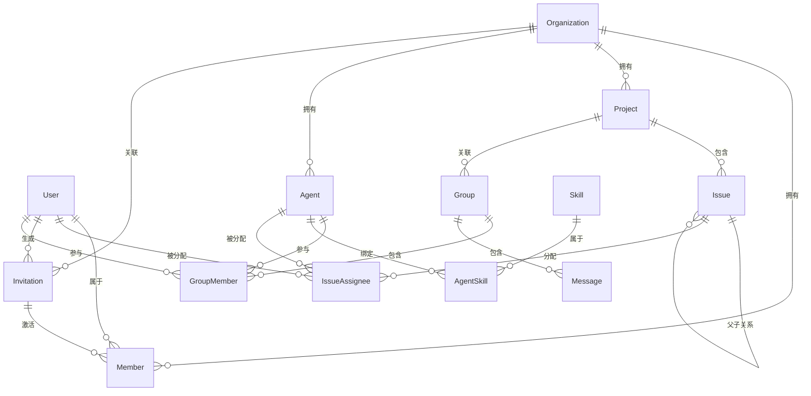
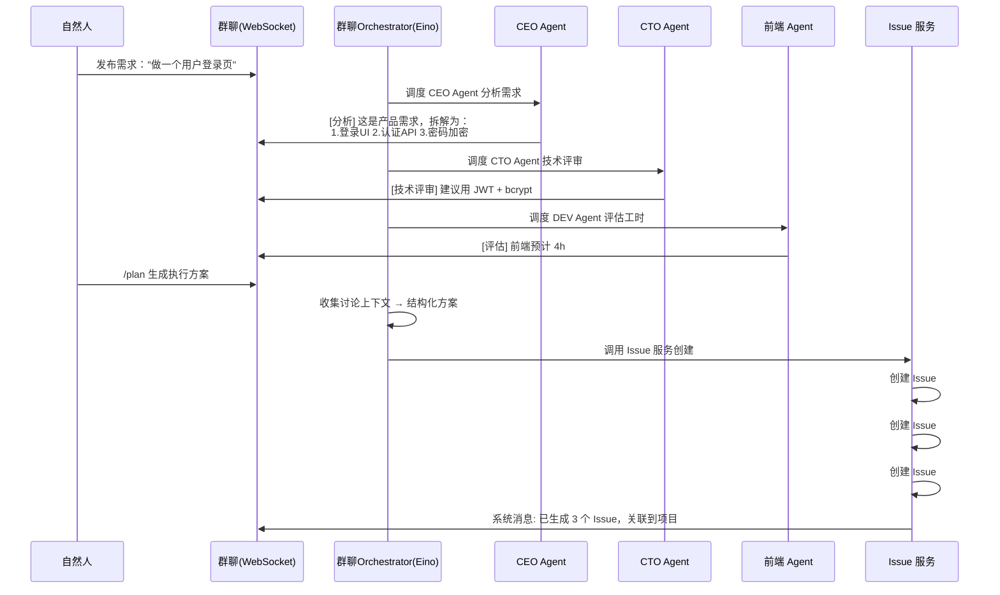
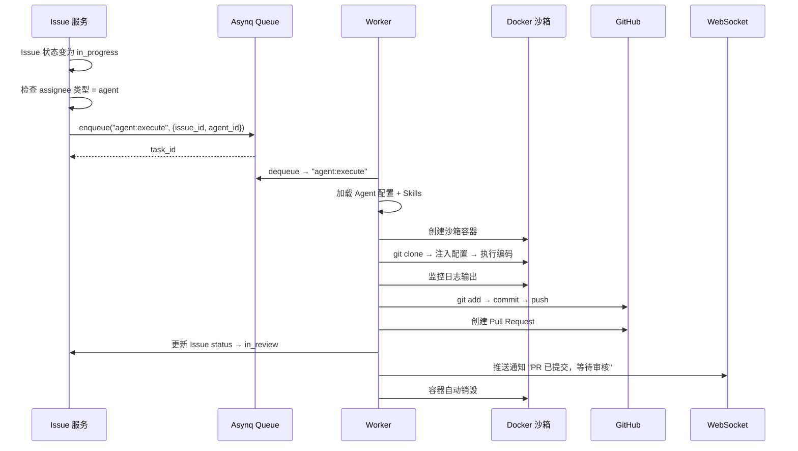

# AnserFlow — 多智能体协作项目管理系统 架构分析文档

## 一、系统愿景

构建一个 **AI Agent + 自然人混合协作** 的项目管理平台。核心场景：

> 自然人创建项目 → 拉群（CEO/CTO/前端/后端等 Agent 角色入群）→ 发布需求 → Agent 根据角色设定自动讨论生成落地方案 → 自动拆解为 Issue 并关联项目 → Agent 认领执行 → 自然人审核验收。

---

## 二、技术栈总览

```
┌──────────────────────────────────────────┐
│ 前端       Next.js 14 SPA (static export)│
│           shadcn/ui                      │
│           Tauri 2.x (桌面+移动端)         │
├──────────────────────────────────────────┤
│ 后端框架   Gin                           │
│ ORM        GORM                          │
│ 数据库     MySQL 8.0+                    │
│ CLI        Cobra                         │
│ 静态嵌入   embed (Go 1.16+)              │
├──────────────────────────────────────────┤
│ 缓存/广播  Redis                         │
│ 实时通信   Gorilla WebSocket             │
│           + Redis Pub/Sub (分布式)        │
│ 任务队列   Asynq (基于 Redis)            │
├──────────────────────────────────────────┤
│ AI Agent   Eino (字节跳动 CloudWeGo)     │
│            + 自研业务封装层               │
│ 沙箱       Docker SDK for Go            │
├──────────────────────────────────────────┤
│ Skills     手动编写 + ZIP 导入           │
│ 认证       JWT + OAuth2 (GitHub)         │
│ 邀请       分享链接 + 邮箱               │
└──────────────────────────────────────────┘
```

### 选型理由

| 技术 | 理由 |
|------|------|
| **Gin** | 高性能、生态成熟、中文社区活跃 |
| **GORM** | Go 最流行的 ORM，支持 MySQL 全面 |
| **MySQL 8.0+** | 关系型数据、事务支持、稳定可靠 |
| **Cobra** | Go CLI 标准库，`anserflow server/init` 命令 |
| **embed** | Go 1.16+ 原生静态文件嵌入，编译为单一可执行文件 |
| **Next.js SPA** | `output: "export"` 模式，产物可直接嵌入 Go 二进制 |
| **Redis** | 缓存 + WebSocket 分布式 Pub/Sub + Asynq 任务队列，一个组件覆盖三个场景 |
| **Gorilla WebSocket** | Go 社区最成熟的 WebSocket 库 |
| **Asynq** | Go 原生、基于 Redis、支持重试/超时/优先级/死信队列，零额外运维 |
| **Eino** | 字节跳动开源、12k+ Stars、Graph/Workflow 多 Agent 编排、流式原生支持、中文社区强 |
| **Docker SDK** | Agent 编码沙箱隔离，资源限制、自动清理 |
| **shadcn/ui** | 无捆绑、可定制、基于 Radix 的可访问组件 |
| **Tauri 2.x** | 比 Electron 轻量、Rust 内核、支持移动端 |

---

## 三、核心功能矩阵

```mermaid
graph TD
    A["AnserFlow 平台"] --> B["用户与权限"]
    A --> C["Agent 管理"]
    A --> D["群聊协作"]
    A --> E["项目管理"]
    A --> F["Issue 系统"]
    A --> G["Agent 执行引擎"]
    A --> H["Skills 技能系统"]

    B --> B1["注册/登录(OAuth/GitHub)"]
    B --> B2["组织/团队管理"]
    B --> B3["角色权限(RBAC)"]
    B --> B4["邀请机制"]

    C --> C1["Agent 角色定义(CEO/CTO/Dev...)"]
    C --> C2["Agent System Prompt / 人设"]
    C --> C3["Agent 运行时配置(opencode等)"]
    C --> C4["Agent 绑定 Skills"]
    C --> C5["全局开关 / 单独启停"]

    D --> D1["创建群组"]
    D --> D2["拉入 Agent + 自然人"]
    D --> D3["需求讨论(Agent自动参与)"]
    D --> D4["方案产出 → 自动建 Issue"]

    E --> E1["创建项目"]
    E --> E2["关联 GitHub 仓库(HTTP/SSH)"]
    E --> E3["项目设置/成员"]

    F --> F1["Issue CRUD"]
    F --> F2["状态: Backlog→Todo→InProgress→InReview→Done"]
    F --> F3["优先级(P0-P4)"]
    F --> F4["子 Issue 层级"]
    F --> F5["分配给 Agent 或 自然人"]
    F --> F6["看板视图"]

    G --> G1["监听 InProgress + 执行人为Agent"]
    G --> G2["Asynq 入队 → Worker 消费"]
    G --> G3["Docker 沙箱执行"]
    G --> G4["结果回写 / PR 提交 / 状态流转"]

    H --> H1["Skill 定义(全局)"]
    H --> H2["Skill 绑定到 Agent"]
    H --> H3["Skill 启用/禁用(全局+单Agent)"]
    H --> H4["手动编写 + ZIP 导入"]
```



---

## 四、构建与部署

### 4.1 单一可执行文件

整个后端编译为一个独立二进制文件，Next.js SPA 产物通过 Go `embed` 嵌入，零运行时依赖（除配置文件外）。

```
┌─────────────────────────────────────────┐
│              anserflow.exe               │
│  ┌───────────────────────────────────┐  │
│  │  Go 运行时 (Gin + GORM + ...)     │  │
│  │                                   │  │
│  │  ┌─────────────────────────────┐  │  │
│  │  │ embed.FS (//go:embed dist)  │  │  │
│  │  │ ┌─────────────────────────┐ │  │  │
│  │  │ │ Next.js SPA 构建产物     │ │  │  │
│  │  │ │ index.html + JS + CSS   │ │  │  │
│  │  │ └─────────────────────────┘ │  │  │
│  │  └─────────────────────────────┘  │  │
│  │                                   │  │
│  │  Gin 路由:                        │  │
│  │  /api/*    → 后端 API             │  │
│  │  /ws       → WebSocket            │  │
│  │  /*        → SPA index.html       │  │
│  └───────────────────────────────────┘  │
└─────────────────────────────────────────┘
```

**关键实现**：

```go
//go:embed dist
var spaFiles embed.FS

func main() {
    r := gin.Default()

    // API 路由
    api := r.Group("/api")
    // ... 注册 API

    // WebSocket
    r.GET("/ws", handleWebSocket)

    // SPA 静态文件（嵌入）
    spa, _ := fs.Sub(spaFiles, "dist")
    r.StaticFS("/", http.FS(spa))
    // 对于 SPA 路由，所有非 API 路径返回 index.html
    r.NoRoute(func(c *gin.Context) {
        data, _ := spaFiles.ReadFile("dist/index.html")
        c.Data(http.StatusOK, "text/html", data)
    })

    r.Run(":8080")
}
```

### 4.2 交叉编译

支持三平台编译，产物无外部依赖：

```bash
# Windows
GOOS=windows GOARCH=amd64 go build -o anserflow.exe

# macOS (Intel + Apple Silicon)
GOOS=darwin  GOARCH=amd64 go build -o anserflow-darwin-amd64
GOOS=darwin  GOARCH=arm64 go build -o anserflow-darwin-arm64

# Linux
GOOS=linux   GOARCH=amd64 go build -o anserflow-linux-amd64
```

### 4.3 CLI 命令

使用 `github.com/spf13/cobra`：

```bash
# 初始化配置和数据目录
anserflow init
  --db      MySQL 连接串（默认 localhost:3306）
  --redis   Redis 地址（默认 localhost:6379）
  --data    数据目录（默认 ./data）
  # 自动生成 config.yaml + 数据库表结构

# 启动服务
anserflow server
  --config  config.yaml 路径（默认 ./config.yaml）
  --port    监听端口（默认 8080）
  # 启动 Gin HTTP 服务 + Asynq Worker

# 查看版本
anserflow version

# 仅启动 Worker（分布式部署时）
anserflow worker
  --config  config.yaml 路径
  # 仅启动 Asynq Worker，不启动 HTTP 服务

# 数据库迁移
anserflow migrate
  --config  config.yaml 路径
  --dry-run 仅打印 SQL 不执行（默认 false）
  # 基于 GORM AutoMigrate，自动同步所有表结构
```

```go
// cmd/root.go
var rootCmd = &cobra.Command{
    Use:   "anserflow",
    Short: "AnserFlow - 多智能体协作项目管理系统",
}

// cmd/server.go
var serverCmd = &cobra.Command{
    Use:   "server",
    Short: "启动 AnserFlow 服务",
    Run: func(cmd *cobra.Command, args []string) {
        startServer(cfg)
    },
}

// cmd/init.go
var initCmd = &cobra.Command{
    Use:   "init",
    Short: "初始化配置和数据目录",
    Run: func(cmd *cobra.Command, args []string) {
        initConfig(cfg)
    },
}

// cmd/worker.go
var workerCmd = &cobra.Command{
    Use:   "worker",
    Short: "仅启动 Asynq Worker（分布式部署）",
    Run: func(cmd *cobra.Command, args []string) {
        startWorker(cfg)
    },
}

// cmd/migrate.go
var migrateCmd = &cobra.Command{
    Use:   "migrate",
    Short: "数据库自动迁移（GORM AutoMigrate）",
    Run: func(cmd *cobra.Command, args []string) {
        dryRun, _ := cmd.Flags().GetBool("dry-run")
        runMigrate(cfg, dryRun)
    },
}
```

### 4.4 Next.js SPA 模式

Next.js 使用静态导出模式，不依赖 Node.js 服务端：

```js
// next.config.js
/** @type {import('next').NextConfig} */
const nextConfig = {
  output: 'export',        // 关键：SPA 静态导出
  distDir: 'dist',         // 输出目录
  images: {
    unoptimized: true,     // export 模式不支持 image optimization
  },
  // API 请求代理到 Go 后端（仅 dev 模式需要）
  async rewrites() {
    return [
      { source: '/api/:path*', destination: 'http://localhost:8080/api/:path*' },
    ]
  },
}
```

**构建流程**：

```bash
# 1. 构建前端 SPA
cd frontend && npm run build    # → dist/ 目录

# 2. Go embed 嵌入前端产物
cd backend && go build -o anserflow    # dist/ 被 go:embed 打入二进制

# 3. 部署：单个文件即可
./anserflow init    # 首次运行初始化
./anserflow server  # 启动，访问 http://localhost:8080
```

### 4.5 项目目录结构

```
anserflow/
├── cmd/                    # CLI 入口（Cobra）
│   ├── root.go
│   ├── server.go
│   ├── worker.go
│   ├── init.go
│   └── migrate.go          # 数据库自动迁移
├── internal/               # 业务逻辑
│   ├── handler/            # Gin Handler
│   ├── service/            # 业务服务
│   ├── model/              # GORM Model
│   ├── middleware/         # Gin 中间件
│   ├── ws/                 # WebSocket Hub
│   ├── agent/              # Agent 编排（Eino 封装）
│   ├── sandbox/            # Docker 沙箱
│   └── invite/             # 邀请服务
├── config/                 # 配置加载
├── frontend/               # Next.js SPA 项目
│   └── dist/               # 构建产物（被 embed）
├── embed.go                # //go:embed frontend/dist/*
├── main.go                 # 入口
├── go.mod
└── go.sum
```

---

## 五、分布式架构设计

### 4.1 WebSocket 分布式方案

```
                    ┌─────────────┐
                    │  Redis       │
                    │  Pub/Sub     │
                    └──┬───┬───┬──┘
                       │   │   │
          ┌────────────┘   │   └────────────┐
          ▼                ▼                ▼
    ┌──────────┐    ┌──────────┐    ┌──────────┐
    │ Gin #1   │    │ Gin #2   │    │ Gin #3   │
    │ WS连接池 │    │ WS连接池 │    │ WS连接池 │
    └──────────┘    └──────────┘    └──────────┘
```

**原理**：每个 Gin 实例维护自己的 WebSocket 连接池。消息发送时，先推送给本地连接的客户端，再通过 Redis Pub/Sub 广播到其他实例，各实例转发给自己持有的客户端。

**Go 库**：`github.com/gorilla/websocket` + `github.com/redis/go-redis/v9`

### 4.2 任务队列方案

选用 **Asynq**（https://github.com/hibiken/asynq），基于 Redis 的分布式任务队列：

```
Issue 状态变为 InProgress
        │
        ▼
┌──────────────────┐
│ Asynq Client      │  →  enqueue("agent:execute", payload)
│ (Gin HTTP 层)    │     Priority: P0 > P1 > P2...
└──────────────────┘     Timeout: 30min
        │                MaxRetry: 3
        ▼
┌──────────────────┐
│ Redis Queue       │
│ ├── critical (P0) │
│ ├── default  (P1) │
│ └── low      (P2+)│
└──────────────────┘
        │
        ▼
┌──────────────────┐
│ Asynq Worker      │  →  HandleFunc("agent:execute", handler)
│ (独立进程/协程)   │     1. 创建 Docker 沙箱
└──────────────────┘     2. 注入 Agent 配置 + Skills
        │                3. 执行编码任务
        ▼                4. 提交 PR → 更新 Issue
┌──────────────────┐
│ Docker Sandbox    │
└──────────────────┘
```

Asynq 核心特性：

| 特性 | Agent 执行场景 |
|------|---------------|
| 任务优先级 | P0 Issue 插队执行 |
| 重试机制 | 执行失败自动重试 3 次 |
| 超时控制 | 单任务最长 30 分钟 |
| 死信队列 | 3 次重试仍失败 → 人工介入 |
| 定时任务 | 延迟执行（Agent 启动冷却期） |
| Web UI | Asynqmon 可视化管理面板 |

### 4.3 整体分布式拓扑

```
                    ┌──────────────┐
                    │  MySQL       │
                    └──────┬───────┘
                           │
        ┌──────────────────┼──────────────────┐
        │                  │                  │
  ┌─────┴─────┐      ┌─────┴─────┐      ┌─────┴─────┐
  │ Gin #1    │      │ Gin #2    │      │ Gin #3    │
  │ :8080     │      │ :8081     │      │ :8082     │
  │ WS Hub    │      │ WS Hub    │      │ WS Hub    │
  └─────┬─────┘      └─────┬─────┘      └─────┬─────┘
        │                  │                  │
        └──────────────────┼──────────────────┘
                           │
                    ┌──────┴───────┐
                    │  Redis       │
                    │  ├─ Pub/Sub  │ (WS 跨实例广播)
                    │  ├─ Queue    │ (Asynq 任务队列)
                    │  └─ Cache    │ (会话/热点数据)
                    └──────┬───────┘
                           │
                    ┌──────┴───────┐
                    │  Worker #1   │ (Asynq Worker)
                    │  Worker #2   │
                    │  Worker #N   │
                    │  Docker SDK  │
                    └──────────────┘
```

---

## 六、AI Agent 框架：Eino + 自研封装

### 6.1 为什么选 Eino

2025-2026 年 Go AI Agent 三大框架对比：

| 维度 | **Eino** (字节) | ADK-Go (Google) | LangChainGo |
|------|:--:|:--:|:--:|
| GitHub Stars | 12k+ | ~3k | 8k+ |
| 多Agent编排 | ✅ Graph/Workflow | ✅ A2A 协议 | ⚠️ 基础 |
| 流式支持 | ✅ 原生 | ✅ | ✅ |
| 中断/恢复 | ✅ Checkpoint | ❌ | ❌ |
| 中文社区 | ✅ 强 | ❌ 弱 | ⚠️ 一般 |
| 厂商锁定 | 无 | Google Cloud | 无 |
| 微服务契合度 | ⭐⭐⭐ | ⭐⭐ | ⭐⭐ |
| 适合本项目 | ✅ **最佳** | ⚠️ Google 绑定 | ❌ 抽象层过重 |

Eino 与本项目需求的高度吻合点：

1. **多 Agent 协作** → Eino 的 `Graph`/`Workflow` 编排天然支持群聊中的多 Agent 讨论调度
2. **工具调用** → Eino 的 `Tool` 抽象可直接映射 Skills 系统
3. **中断/恢复** → Agent 执行被用户打断？Eino 内置 checkpoint 机制
4. **微服务架构** → Gin 服务天然是微服务，Eino 设计理念契合
5. **高并发** → 多 Issue 并发执行多 Agent，goroutine + Eino 流式处理相得益彰

### 6.2 架构分层

```
┌──────────────────────────────────────────┐
│  anserflow/internal/agent/  (自研业务层)  │
│  ├── orchestrator.go    讨论编排          │
│  ├── executor.go        Docker沙箱调度    │
│  ├── skill_loader.go    Skills 加载       │
│  ├── group_discuss.go   群聊 Agent 调度   │
│  └── plan_parser.go     方案→Issue 拆解   │
├──────────────────────────────────────────┤
│  Eino (底层 LLM 引擎)                    │
│  ├── ChatModel         模型调用           │
│  ├── Tool              工具/Skills 抽象   │
│  ├── Graph             多Agent编排        │
│  ├── Callbacks         回调/日志/监控     │
│  └── Flow              流式处理           │
└──────────────────────────────────────────┘
```

---

## 七、Docker 沙箱方案

### 7.1 执行流程

```
┌──────────────────────────────────────┐
│  Asynq Worker                        │
│  ┌────────────────────────────────┐  │
│  │  Step 1: 准备                  │  │
│  │  ├── 读取 Issue 上下文         │  │
│  │  ├── 加载 Agent 配置           │  │
│  │  └── 加载绑定的 Skills         │  │
│  │                                │  │
│  │  Step 2: 创建沙箱容器          │  │
│  │  ├── Image: anserflow/sandbox  │  │
│  │  ├── Memory: 512MB             │  │
│  │  ├── CPU: 2 cores              │  │
│  │  ├── Volume: /workspace        │  │
│  │  └── AutoRemove: true          │  │
│  │                                │  │
│  │  Step 3: 执行                  │  │
│  │  ├── git clone 关联仓库        │  │
│  │  ├── 注入 Agent 配置           │  │
│  │  ├── 运行 opencode / 自定义CLI │  │
│  │  └── 监控执行日志              │  │
│  │                                │  │
│  │  Step 4: 收尾                  │  │
│  │  ├── git add → commit → push   │  │
│  │  ├── 创建 PR                   │  │
│  │  ├── 更新 Issue 状态           │  │
│  │  └── 销毁容器（AutoRemove）    │  │
│  └────────────────────────────────┘  │
└──────────────────────────────────────┘
```

### 7.2 安全策略

| 策略 | 配置 |
|------|------|
| 资源限制 | CPU 2核 / 内存 512MB / 磁盘 1GB |
| 执行超时 | 单任务最长 30 分钟，超时强制 SIGKILL |
| 网络隔离 | 仅允许出站到 GitHub API + LLM API 白名单 |
| 凭证注入 | GitHub Token 通过环境变量注入，不落盘 |
| 自动清理 | `AutoRemove: true`，容器退出即销毁 |
| 镜像预构建 | 包含 Node/Python/Go 运行时 + Git + opencode CLI |

### 7.3 Go Docker SDK

使用官方 `github.com/docker/docker/client`：

```go
import (
    "github.com/docker/docker/client"
    "github.com/docker/docker/api/types/container"
)

func createSandbox(ctx context.Context, cfg SandboxConfig) (string, error) {
    cli, _ := client.NewClientWithOpts(client.FromEnv, client.WithAPIVersionNegotiation())

    resp, err := cli.ContainerCreate(ctx, &container.Config{
        Image: "anserflow/sandbox:latest",
        Env: []string{
            "GITHUB_TOKEN=" + cfg.GitHubToken,
            "LLM_API_KEY=" + cfg.LLMAPIKey,
        },
        Cmd: []string{cfg.RuntimeCLI, "run", "--task", cfg.TaskJSON},
    }, &container.HostConfig{
        Memory:     512 * 1024 * 1024, // 512MB
        NanoCPUs:   2 * 1e9,           // 2 CPU
        AutoRemove: true,
    }, nil, nil, "")

    cli.ContainerStart(ctx, resp.ID, container.StartOptions{})
    return resp.ID, nil
}
```

---

## 八、Skills 技能系统

### 8.1 两种导入方式

```
Skills 数据表：

┌──────────────────────────────────────────────┐
│ skills                                        │
├──────────────────────────────────────────────┤
│ source_type:  'manual' | 'zip'                │
│                                             │
│ 手动模式 (source_type='manual'):              │
│   definition: TEXT  ← 直接在 UI 编辑 Markdown │
│                                             │
│ ZIP 模式 (source_type='zip'):                 │
│   zip_hash: VARCHAR(64)   ← ZIP 包 SHA256    │
│   file_tree: JSON          ← 文件树快照       │
│   definition: TEXT         ← 解压后的 SKILL.md│
└──────────────────────────────────────────────┘
```

### 8.2 ZIP 包格式

```
my-skill.zip
├── SKILL.md              # 必须：Skill 定义
│                         #   ---
│                         #   name: my-skill
│                         #   description: ...
│                         #   ---
│                         #   # Skill 正文
├── agents/               # 可选：Agent 配置
│   └── openai.yaml
├── tools/                # 可选：辅助脚本
│   └── lint.sh
└── examples/             # 可选：示例
    └── sample.md
```

### 8.3 启用控制

```
                 ┌─────────────────┐
                 │  Skill A (全局)  │
                 │  enabled: true   │────────── 全局开关
                 └────────┬────────┘
                          │
          ┌───────────────┼───────────────┐
          │               │               │
    ┌─────┴─────┐   ┌─────┴─────┐   ┌─────┴─────┐
    │ Agent CEO │   │ Agent CTO │   │ Agent Dev │
    │ Skill A ✅ │   │ Skill A ✅ │   │ Skill A ❌ │── 单Agent开关
    └───────────┘   └───────────┘   └───────────┘
```

---

## 九、核心数据模型

### 9.1 ER 关系图



### 9.2 关键表 DDL

```sql
-- 用户表（自然人）
CREATE TABLE users (
    id BIGINT PRIMARY KEY AUTO_INCREMENT,
    username VARCHAR(64) NOT NULL UNIQUE,
    email VARCHAR(128),
    password_hash VARCHAR(256),
    avatar_url VARCHAR(512),
    github_id VARCHAR(64),
    role ENUM('super_admin','admin','member') DEFAULT 'member',
    created_at DATETIME DEFAULT CURRENT_TIMESTAMP,
    updated_at DATETIME DEFAULT CURRENT_TIMESTAMP ON UPDATE CURRENT_TIMESTAMP
);

-- 组织
CREATE TABLE organizations (
    id BIGINT PRIMARY KEY AUTO_INCREMENT,
    name VARCHAR(128) NOT NULL,
    owner_id BIGINT NOT NULL,
    created_at DATETIME DEFAULT CURRENT_TIMESTAMP,
    FOREIGN KEY (owner_id) REFERENCES users(id)
);

-- 成员
CREATE TABLE members (
    id BIGINT PRIMARY KEY AUTO_INCREMENT,
    org_id BIGINT NOT NULL,
    user_id BIGINT NOT NULL,
    role ENUM('owner','admin','member') DEFAULT 'member',
    UNIQUE KEY (org_id, user_id),
    FOREIGN KEY (org_id) REFERENCES organizations(id),
    FOREIGN KEY (user_id) REFERENCES users(id)
);

-- Agent 定义
CREATE TABLE agents (
    id BIGINT PRIMARY KEY AUTO_INCREMENT,
    org_id BIGINT NOT NULL,
    name VARCHAR(64) NOT NULL,
    role_label VARCHAR(64),            -- CEO / CTO / 前端...
    system_prompt TEXT NOT NULL,       -- Agent 人设
    runtime_type VARCHAR(32) DEFAULT 'opencode',
    runtime_config JSON,               -- API Key、模型等
    enabled TINYINT(1) DEFAULT 1,
    created_at DATETIME DEFAULT CURRENT_TIMESTAMP,
    FOREIGN KEY (org_id) REFERENCES organizations(id)
);

-- Skills 定义
CREATE TABLE skills (
    id BIGINT PRIMARY KEY AUTO_INCREMENT,
    org_id BIGINT,                      -- NULL=系统全局
    name VARCHAR(64) NOT NULL,
    description TEXT,
    source_type ENUM('manual','zip') DEFAULT 'manual',
    definition TEXT NOT NULL,           -- Markdown 内容
    zip_hash VARCHAR(64),              -- ZIP 的 SHA256
    file_tree JSON,                    -- ZIP 文件树
    enabled TINYINT(1) DEFAULT 1,      -- 全局开关
    created_at DATETIME DEFAULT CURRENT_TIMESTAMP
);

-- Agent-Skill 绑定
CREATE TABLE agent_skills (
    id BIGINT PRIMARY KEY AUTO_INCREMENT,
    agent_id BIGINT NOT NULL,
    skill_id BIGINT NOT NULL,
    enabled TINYINT(1) DEFAULT 1,      -- 该 Agent 是否启用该 Skill
    UNIQUE KEY (agent_id, skill_id),
    FOREIGN KEY (agent_id) REFERENCES agents(id),
    FOREIGN KEY (skill_id) REFERENCES skills(id)
);

-- 项目
CREATE TABLE projects (
    id BIGINT PRIMARY KEY AUTO_INCREMENT,
    org_id BIGINT NOT NULL,
    name VARCHAR(128) NOT NULL,
    description TEXT,
    github_repo_url VARCHAR(512),
    github_repo_name VARCHAR(256),
    github_auth_type ENUM('http','ssh') DEFAULT 'http',  -- 授权方式
    github_auth_credential VARCHAR(1024),                -- HTTP:Token / SSH:私钥路径或内容
    created_by BIGINT,
    created_at DATETIME DEFAULT CURRENT_TIMESTAMP,
    FOREIGN KEY (org_id) REFERENCES organizations(id),
    FOREIGN KEY (created_by) REFERENCES users(id)
);

-- Issue
CREATE TABLE issues (
    id BIGINT PRIMARY KEY AUTO_INCREMENT,
    project_id BIGINT NOT NULL,
    parent_id BIGINT NULL,              -- 子 Issue
    title VARCHAR(256) NOT NULL,
    description TEXT,
    status ENUM('backlog','todo','in_progress','in_review','done') DEFAULT 'backlog',
    priority ENUM('p0','p1','p2','p3','p4') DEFAULT 'p2',
    source_group_id BIGINT,             -- 来源群聊
    source_message_id BIGINT,           -- 来源消息
    created_by BIGINT,
    created_at DATETIME DEFAULT CURRENT_TIMESTAMP,
    updated_at DATETIME DEFAULT CURRENT_TIMESTAMP ON UPDATE CURRENT_TIMESTAMP,
    FOREIGN KEY (project_id) REFERENCES projects(id),
    FOREIGN KEY (parent_id) REFERENCES issues(id),
    FOREIGN KEY (created_by) REFERENCES users(id)
);

-- Issue 分配
CREATE TABLE issue_assignees (
    id BIGINT PRIMARY KEY AUTO_INCREMENT,
    issue_id BIGINT NOT NULL,
    user_id BIGINT NULL,                -- 自然人
    agent_id BIGINT NULL,               -- Agent
    assigned_at DATETIME DEFAULT CURRENT_TIMESTAMP,
    FOREIGN KEY (issue_id) REFERENCES issues(id),
    FOREIGN KEY (user_id) REFERENCES users(id),
    FOREIGN KEY (agent_id) REFERENCES agents(id),
    CHECK (user_id IS NOT NULL OR agent_id IS NOT NULL)
);

-- 群组
CREATE TABLE groups (
    id BIGINT PRIMARY KEY AUTO_INCREMENT,
    org_id BIGINT NOT NULL,
    project_id BIGINT,                  -- 关联项目
    name VARCHAR(128) NOT NULL,
    created_by BIGINT,
    created_at DATETIME DEFAULT CURRENT_TIMESTAMP,
    FOREIGN KEY (org_id) REFERENCES organizations(id),
    FOREIGN KEY (project_id) REFERENCES projects(id)
);

-- 群成员
CREATE TABLE group_members (
    id BIGINT PRIMARY KEY AUTO_INCREMENT,
    group_id BIGINT NOT NULL,
    user_id BIGINT NULL,
    agent_id BIGINT NULL,
    joined_at DATETIME DEFAULT CURRENT_TIMESTAMP,
    UNIQUE KEY (group_id, user_id, agent_id),
    FOREIGN KEY (group_id) REFERENCES groups(id),
    FOREIGN KEY (user_id) REFERENCES users(id),
    FOREIGN KEY (agent_id) REFERENCES agents(id)
);

-- 群消息
CREATE TABLE messages (
    id BIGINT PRIMARY KEY AUTO_INCREMENT,
    group_id BIGINT NOT NULL,
    sender_type ENUM('user','agent') NOT NULL,
    sender_user_id BIGINT,
    sender_agent_id BIGINT,
    content TEXT NOT NULL,
    created_at DATETIME DEFAULT CURRENT_TIMESTAMP,
    FOREIGN KEY (group_id) REFERENCES groups(id)
);

-- 邀请表
CREATE TABLE invitations (
    id BIGINT PRIMARY KEY AUTO_INCREMENT,
    org_id BIGINT NOT NULL,
    role ENUM('admin','member') DEFAULT 'member',     -- 受邀角色
    token VARCHAR(64) NOT NULL UNIQUE,                 -- 邀请凭证
    invite_type ENUM('link','email') NOT NULL,         -- 分享链接 / 邮箱
    email VARCHAR(128),                                -- 邮箱邀请时必填
    created_by BIGINT NOT NULL,                        -- 邀请人
    max_uses INT DEFAULT 0,                            -- 0=不限制
    use_count INT DEFAULT 0,                           -- 已使用次数
    expires_at DATETIME,                               -- 过期时间
    created_at DATETIME DEFAULT CURRENT_TIMESTAMP,
    FOREIGN KEY (org_id) REFERENCES organizations(id),
    FOREIGN KEY (created_by) REFERENCES users(id)
);

-- 邀请使用记录
CREATE TABLE invitation_usages (
    id BIGINT PRIMARY KEY AUTO_INCREMENT,
    invitation_id BIGINT NOT NULL,
    user_id BIGINT NOT NULL,
    used_at DATETIME DEFAULT CURRENT_TIMESTAMP,
    FOREIGN KEY (invitation_id) REFERENCES invitations(id),
    FOREIGN KEY (user_id) REFERENCES users(id)
);
```

### 9.3 邀请机制说明

**两种邀请方式**：

```
┌─────────────────────────────────────────────┐
│  分享链接邀请                                │
│  ┌───────────────────────────────────────┐  │
│  │ 管理员生成链接                         │  │
│  │ → POST /api/invitations               │  │
│  │   { type: "link", role: "member" }    │  │
│  │                                       │  │
│  │ → 返回: https://xxx/invite/abc123     │  │
│  │                                       │  │
│  │ 目标用户访问链接 → 注册/登录 →        │  │
│  │ 自动加入组织                           │  │
│  └───────────────────────────────────────┘  │
├─────────────────────────────────────────────┤
│  邮箱邀请                                    │
│  ┌───────────────────────────────────────┐  │
│  │ 管理员输入邮箱                         │  │
│  │ → POST /api/invitations               │  │
│  │   { type: "email", email: "u@x.com" } │  │
│  │                                       │  │
│  │ → 系统发送邮件（含邀请链接）            │  │
│  │ → 目标用户点击链接 → 注册/登录 →       │  │
│  │ 自动加入组织                           │  │
│  └───────────────────────────────────────┘  │
└─────────────────────────────────────────────┘
```

**安全控制**：

| 机制 | 说明 |
|------|------|
| Token 唯一 | 64 位随机字符串，不可猜测 |
| 过期时间 | 默认 7 天，管理员可设置 |
| 使用次数限制 | `max_uses` 控制，0=不限 |
| 角色预分配 | 受邀进入组织时自动分配角色 |
| 邮箱验证 | 邮箱邀请时验证邮箱归属 |

---

## 十、核心业务流程

### 10.1 需求讨论 → Issue 自动生成



### 10.2 Agent 自动执行（Asynq + Docker）



---

## 十一、前端页面结构

### 11.1 管理后台

```
/admin
├── /login                    登录页
├── /dashboard                仪表盘
├── /organizations            组织管理
│   ├── /[id]/members         成员管理 + 邀请
│   └── /[id]/settings        组织设置
├── /agents                   Agent 管理
│   ├── /create               创建 Agent
│   ├── /[id]/edit            编辑（人设/运行时/Skills）
│   └── /[id]/logs            执行日志
├── /skills                   Skills 管理
│   ├── /create               手动创建
│   ├── /import               导入 ZIP
│   └── /[id]/edit            编辑
├── /projects                 项目管理
│   ├── /create               创建 + GitHub 关联(HTTP/SSH)
│   └── /[id]/issues          Issue 看板
├── /groups                   群组
│   └── /[id]/chat            群聊界面
├── /invite/:token            接受邀请（分享链接）
└── /settings                 全局设置
```

### 11.2 客户端（Tauri）

PC 桌面 + Android + iOS 共用 Next.js 前端，Tauri 打包：

- **WebView 内嵌** Next.js 构建产物
- **原生能力**：系统通知、文件系统、Git 代理（Tauri Command）
- **分阶段交付**：先桌面端，移动端作为 Phase 2

---

## 十二、开发路线图

### L1 — 基础设施（1-2 周）

| 编号 | 任务 | 验收标准 |
|------|------|----------|
| T01 | Go 项目初始化（Gin + GORM） | `go run main.go` 启动成功 |
| T02 | Next.js 项目初始化（shadcn/ui） | `npm run dev` 启动成功 |
| T03 | MySQL 表结构创建 + GORM AutoMigrate | 所有表自动创建 |
| T04 | 用户注册/登录（JWT + bcrypt） | Postman 测试通过 |
| T05 | 组织 CRUD + 成员邀请 | 创建组织、邀请成员流程通 |
| T06 | Redis 集成 + WebSocket 基础 | 单实例 WS 通信正常 |
| T07 | Cobra CLI 框架 + `anserflow init/server` | 命令行可初始化并启动 |
| T08 | Next.js SPA 静态导出 + Go embed 嵌入 | `go build` 产出单文件，浏览器访问正常 |

### L2 — 核心业务（3-4 周）

| 编号 | 任务 | 验收标准 |
|------|------|----------|
| T09 | Agent CRUD + System Prompt 编辑 | 创建/编辑 Agent，保存人设 |
| T10 | Skills CRUD + 手动/ZIP 导入 | 两种方式均可添加 Skill |
| T11 | Agent-Skill 绑定 + 启用控制 | 全局/单Agent 开关生效 |
| T12 | 项目管理 + GitHub 关联（HTTP Token / SSH Key） | 创建项目并绑定 GitHub 仓库，支持两种授权方式 |
| T13 | Issue CRUD + 状态流转 + 优先级 + 子 Issue | 看板操作全流程通 |
| T14 | Issue 分配给 Agent/自然人 | 分配并正确记录 |
| T15 | 邀请系统（分享链接 + 邮箱） | 生成链接→接受→自动入组织流程通 |

### L3 — 协作与执行（5-7 周）

| 编号 | 任务 | 验收标准 |
|------|------|----------|
| T16 | 群聊 WebSocket + 消息持久化 | 多人实时聊天正常 |
| T17 | WebSocket Redis Pub/Sub 分布式 | 多实例消息同步 |
| T18 | Eino 集成 + 群聊 Agent 讨论编排 | Agent 自动参与讨论 |
| T19 | 讨论→方案→自动创建 Issue | /plan 指令产出 Issue |
| T20 | Asynq 任务队列集成 | 任务入队/消费正常 |
| T21 | Docker 沙箱执行引擎 | Agent 在容器中执行编码 |
| T22 | GitHub PR 自动提交 | 代码提交 + PR 创建流程通 |

### L4 — 客户端与交付（8-10 周）

| 编号 | 任务 | 验收标准 |
|------|------|----------|
| T23 | 交叉编译 + CI 构建（win/mac/linux） | 三平台产出单文件 |
| T24 | Tauri 桌面端打包 | Windows/macOS 安装包 |
| T25 | 通知系统（WebSocket Push + 原生 + 邮箱） | 状态变更实时通知 |
| T26 | 权限精细化 + 操作审计日志 | RBAC 权限生效 |
| T27 | 管理后台完整 UI | 所有页面可交互 |
| T28 | 性能优化 + 压力测试 | 100 并发 WS 连接稳定 |

---

## 十三、风险与建议

### 13.1 关键风险

| 风险 | 等级 | 应对措施 |
|------|------|----------|
| Agent 自动编码质量不可控 | 🔴 高 | 先做半自动：Agent 生成代码 → 创建 PR → 人工审核合并 |
| 多 Agent 讨论无限循环 | 🟡 中 | `/plan` 指令触发方案讨论而非实时监听，限制对话轮数 |
| Docker 沙箱安全 | 🟡 中 | 网络白名单 + 资源限额 + 执行超时 + 无特权模式 |
| Tauri 移动端成熟度 | 🟡 中 | 先交付桌面端，移动端作为 Phase 2 |
| Eino 框架迭代不稳定 | 🟢 低 | 字节内部大规模使用，稳定性有保障 |

### 13.2 简化策略

1. **Agent 执行优先做"半自动"**：编码 → PR → 人工 Review → 合并，而非全自动合入 main
2. **讨论先做"指令触发"**：Agent 不实时监听所有消息，通过 `/plan` 触发，避免 Token 浪费
3. **Tauri 先桌面后移动**：降低初期复杂度
4. **Skills 系统复用现有模式**：项目已有 `flowcode_design/executor/todo/wiki` Skill 定义，直接复用 YAML frontmatter + Markdown body 的格式

---

## 十四、可参考项目

| 项目 | 参考点 |
|------|--------|
| Plane (plane.so) | Issue 看板、状态流转的 UI/UX |
| OpenHands / Devon | Agent 自动编码的沙箱架构 |
| Mattermost | 群聊 + WebSocket 架构 |
| Dify | Agent 工作流编排的交互设计 |
| Eino (cloudwego/eino) | Go Agent 框架的 Graph/Workflow 模式 |
| Asynq (hibiken/asynq) | Go 任务队列的 API 设计 |

---

> 📌 文档版本: v1.1  
> 📅 更新日期: 2026-05-13  
> 📂 后续可拆分为 wiki 知识库，生成详细执行任务清单
