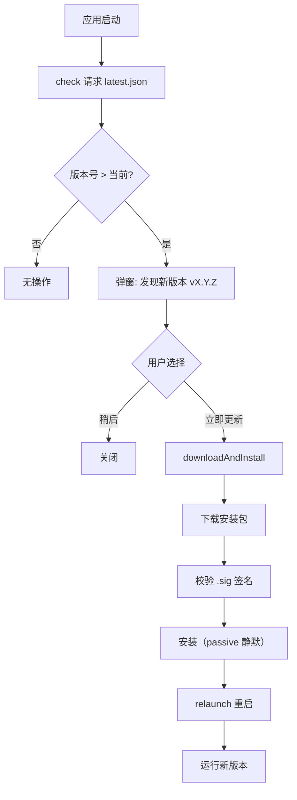
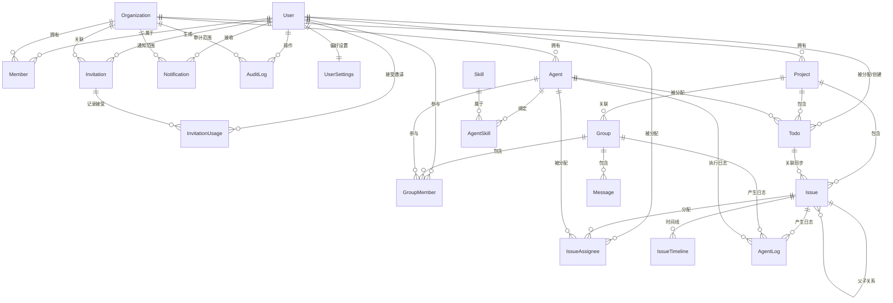
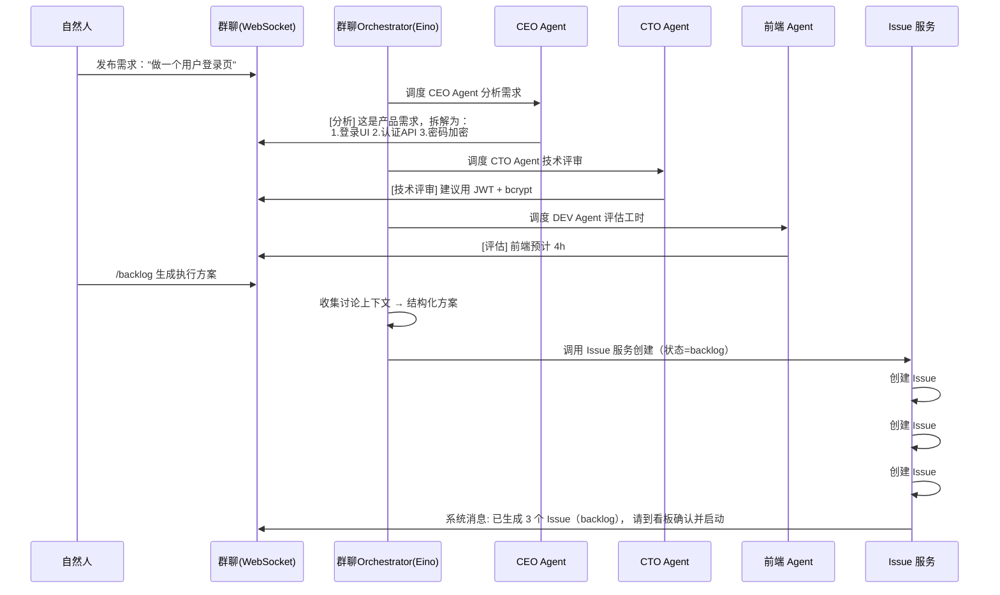
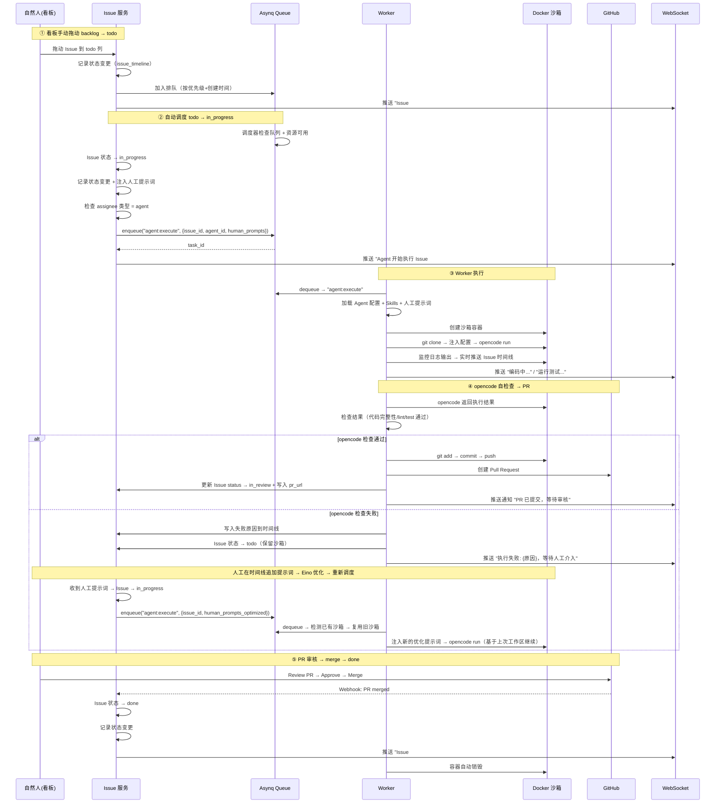
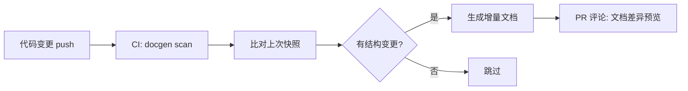
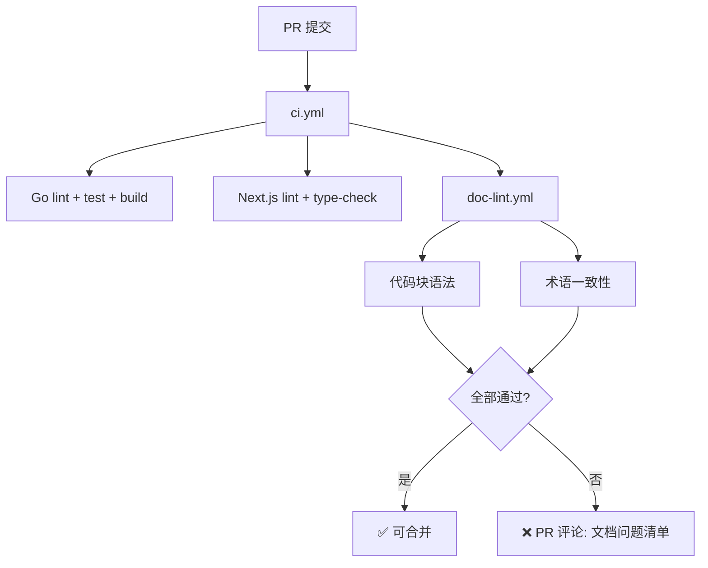
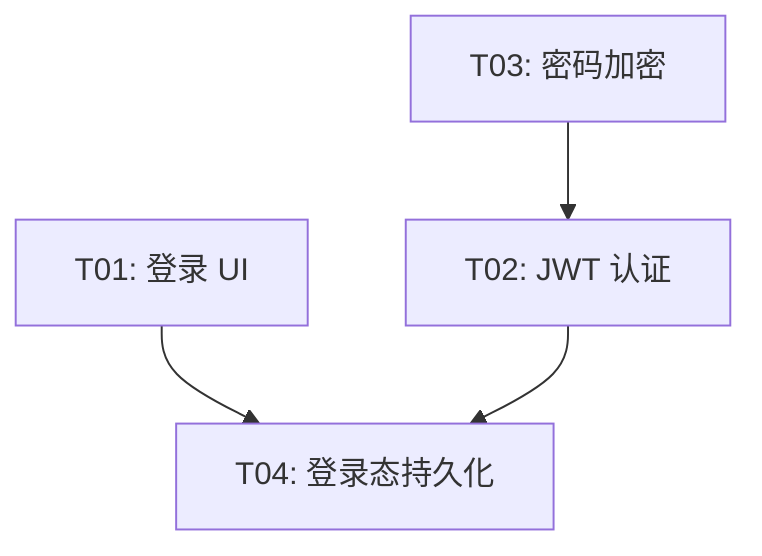

# AnserFlow — 多智能体协作项目管理系统 架构分析文档

## 一、系统愿景

构建一个 **AI Agent + 自然人混合协作** 的项目管理平台。核心场景：

> 自然人创建项目 → 拉群（CEO/CTO/前端/后端等 Agent 角色入群）→ 发布需求 → Agent 根据角色设定自动讨论生成落地方案 → 自动拆解为 Issue 并关联项目 → Agent 认领执行 → 自然人审核验收。

---

## 当前阶段闭环约束

为避免规划项长期悬空，本文档对当前阶段范围做如下收口：

1. 当前交付只以 **L1-L4 路线图** 为验收范围；第十五章统一视为远期 backlog，不计入本轮完成标准。
2. 当前 Git 平台只验收 **GitHub**；`git_platform` 仅保留数据模型兼容位，不要求本轮实现 Gitea / GitLab / Gitee Provider。
3. 当前前端交付只闭环 **admin SPA 嵌入 Go** 与 **Tauri 桌面端独立打包**；不在本轮实现双 SPA 同进程路由分发。
4. 当前客户端只闭环 **桌面端**；Android / iOS、Crowdin / Lokalise、Pact 合约测试、`golang-migrate`、文档自动生成与 wiki 拆分均归入 Phase 2 或单独立项，不阻塞本轮验收。
5. 文中的目录树、接口、伪代码和工作流若未在仓库中落地，默认按 **目标架构说明** 理解，不视为“仓库现状已实现”。

---

## 二、技术栈总览

```
┌──────────────────────────────────────────┐
│ 前端       Next.js 14 SPA (static export)│
│           shadcn/ui + Tailwind CSS        │
│           TanStack Query (数据请求)       │
│           Zustand (客户端状态)            │
│           React Hook Form + Zod (表单)    │
│           next-intl (国际化)              │
│           Tauri 2.x (桌面+移动端)         │
├──────────────────────────────────────────┤
│ 后端框架   Gin                           │
│ ORM        GORM                          │
│ 数据库     MySQL 8.0+                    │
│ CLI        Cobra                         │
│ 静态嵌入   embed (Go 1.16+)              │
│ 配置       Viper                         │
│ 日志       Zap                           │
│ 校验       go-playground/validator       │
│ 权限       Casbin (RBAC)                 │
├──────────────────────────────────────────┤
│ 缓存/广播  Redis                         │
│ 实时通信   Gorilla WebSocket             │
│           + Redis Pub/Sub (分布式)        │
│ 任务队列   Asynq (基于 Redis)            │
├──────────────────────────────────────────┤
│ AI Agent   Eino (字节跳动 CloudWeGo)     │
│            + 自研业务封装层               │
│ 沙箱       Docker SDK for Go            │
├──────────────────────────────────────────┤
│ Skills     手动编写 + ZIP 导入           │
│ 认证       JWT + OAuth2 (GitHub)         │
│ 邮件       gomail (SMTP)                 │
│ 邀请       分享链接 + 邮箱               │
│ 国际化     next-intl (前端)               │
│           go-i18n (后端)                  │
│ API文档    Swagger (swaggo/swag)         │
│ 跨域       gin-contrib/cors              │
└──────────────────────────────────────────┘
```

### 选型理由

| 技术 | 理由 |
|------|------|
| **Gin** | 高性能、生态成熟、中文社区活跃 |
| **GORM** | Go 最流行的 ORM，支持 MySQL 全面 |
| **MySQL 8.0+** | 关系型数据、事务支持、稳定可靠 |
| **Cobra** | Go CLI 标准库，`anserflow server/init` 命令 |
| **embed** | Go 1.16+ 原生静态文件嵌入，编译为单一可执行文件 |
| **Viper** | Go 配置管理标准库，支持 YAML/ENV 多源加载 |
| **Zap** | Uber 开源高性能结构化日志库 |
| **validator** | Go 结构体校验标准库，API 请求参数校验 |
| **Casbin** | 灵活的 RBAC/ABAC 权限模型，满足组织角色管理 |
| **Next.js SPA** | `output: "export"` 模式，产物可直接嵌入 Go 二进制 |
| **Redis** | 缓存 + WebSocket 分布式 Pub/Sub + Asynq 任务队列，一个组件覆盖三个场景 |
| **Gorilla WebSocket** | Go 社区最成熟的 WebSocket 库 |
| **Asynq** | Go 原生、基于 Redis、支持重试/超时/优先级/死信队列，零额外运维 |
| **Eino** | 字节跳动开源、12k+ Stars、Graph/Workflow 多 Agent 编排、流式原生支持、中文社区强 |
| **Docker SDK** | Agent 编码沙箱隔离，资源限制、自动清理 |
| **TanStack Query** | 服务端状态管理，自动缓存/重取/去重，SPA 模式完美兼容 |
| **Zustand** | 极轻量客户端状态管理（侧栏、弹窗、看板拖拽状态） |
| **React Hook Form + Zod** | 高性能表单 + 声明式校验，与 shadcn/ui 深度集成 |
| **TanStack Table** | 无头表格库，Issue 列表/Agent 列表/成员表格 |
| **Recharts** | 图表库，Dashboard 数据可视化 |
| **next-themes** | 暗色/亮色主题切换，与 Tailwind CSS 原生配合 |
| **next-intl** | Next.js App Router 原生 i18n、静态导出兼容、TypeScript 类型安全、ICU 消息格式 |
| **Framer Motion** | 动效库，页面过渡、看板拖拽动画 |
| **Sonner** | 轻量 Toast 通知，操作反馈 |
| **date-fns** | 日期处理，轻量 tree-shakable |
| **lucide-react** | 图标库，与 shadcn/ui 配套 |
| **shadcn/ui** | 无捆绑、可定制、基于 Radix 的可访问组件 |
| **Tauri 2.x** | 比 Electron 轻量、Rust 内核、支持移动端 |
| **gomail** | Go 邮件发送库，支持 SMTP/SSL，用于邮箱邀请和通知 |
| **swaggo/swag** | Swagger/OpenAPI 文档自动生成，便于前后端联调 |
| **gin-contrib/cors** | Gin 官方 CORS 中间件，SPA 跨域支持 |
| **go-i18n** | Go 标准 i18n 库，CLI 管理翻译文件，复数规则支持，用于邮件模板和 API 错误消息 |

### 框架补充说明

> 以下为生产级 Gin 项目的标准配套设施，确保系统可维护、可观测、可扩展。

#### Viper — 配置管理

`github.com/spf13/viper` 统一管理 `config.yaml`，支持环境变量覆盖（如 `DB_HOST`、`REDIS_ADDR` 覆盖配置文件值），生产环境敏感信息通过环境变量注入。

```go
viper.SetConfigName("config")
viper.AddConfigPath(".")
viper.AutomaticEnv() // ENV 自动覆盖
viper.ReadInConfig()
```

#### Zap — 结构化日志

`go.uber.org/zap` 替代标准库 `log`，支持 JSON 格式输出、日志分级（Debug/Info/Warn/Error）、按时间/大小自动切割。GORM 可直接接入 Zap 作为日志后端：

```go
logger, _ := zap.NewProduction()
db, _ := gorm.Open(mysql.Open(dsn), &gorm.Config{
    Logger: logger.New(gormLogger.Info, &gormLogger.Config{LogLevel: gormLogger.Info}),
})
```

#### go-playground/validator — 请求校验

Gin 原生集成了 `github.com/go-playground/validator`，通过 struct tag 声明校验规则：

```go
type CreateIssueReq struct {
    Title       string `json:"title" binding:"required,min=1,max=256"`
    Priority    string `json:"priority" binding:"required,oneof=p0 p1 p2 p3 p4"`
    ProjectID   uint   `json:"project_id" binding:"required"`
}
```

#### Casbin — 权限控制

`github.com/casbin/casbin` 实现 RBAC，支持组织级角色（owner/admin/member）和资源级权限（项目/Issue/Agent）。策略模型存储在 MySQL 中，运行时动态加载：

```ini
[request_definition]
r = sub, obj, act
[policy_definition]
p = sub, obj, act
[role_definition]
g = _, _
[policy_effect]
e = some(where (p.eft == allow))
[matchers]
m = g(r.sub, p.sub) && keyMatch(r.obj, p.obj) && regexMatch(r.act, p.act)
```

#### Swagger — API 文档

`github.com/swaggo/swag` + `github.com/swaggo/gin-swagger`，通过代码注解自动生成 OpenAPI 3.0 文档，开发环境访问 `/swagger/index.html`：

```go
// @title           AnserFlow API
// @version         1.0
// @host            localhost:8080
// @BasePath        /api
func main() { /* ... */ }
```

#### CORS — 跨域支持

`github.com/gin-contrib/cors` 允许 SPA 前端和 Tauri WebView 跨域访问 API：

```go
r.Use(cors.New(cors.Config{
    AllowOrigins: []string{"http://localhost:3000", "tauri://localhost"},
    AllowMethods: []string{"GET", "POST", "PUT", "DELETE", "OPTIONS"},
    AllowHeaders: []string{"Origin", "Content-Type", "Authorization"},
}))
```

#### 优雅关闭

Go 标准库 `signal` + `http.Server.Shutdown`，确保收到 SIGINT/SIGTERM 时完成进行中的请求再退出：

```go
srv := &http.Server{Addr: ":8080", Handler: r}
go srv.ListenAndServe()

quit := make(chan os.Signal, 1)
signal.Notify(quit, syscall.SIGINT, syscall.SIGTERM)
<-quit

ctx, cancel := context.WithTimeout(context.Background(), 10*time.Second)
defer cancel()
srv.Shutdown(ctx)
```

#### 健康检查

`/api/health` 端点返回数据库、Redis 连通性，供 K8s/Docker 探活：

```go
r.GET("/api/health", func(c *gin.Context) {
    c.JSON(200, gin.H{
        "status": "ok",
        "db":     checkDB(),
        "redis":  checkRedis(),
    })
})
```

#### OAuth2 — 第三方登录（GitHub）

AnserFlow 支持 GitHub OAuth 登录，降低注册门槛。前端 `login` 页面提供「GitHub 登录」按钮，跳转到 GitHub 授权页；回调后后端完成账号创建/绑定并返回 JWT。

```
用户点击 GitHub 登录
        │
        ▼
GET /api/auth/github/login  → 302 跳转 GitHub
        │
        ▼
用户授权 → GitHub 回调 GET /api/auth/github/callback?code=xxx
        │
        ▼
后端：code → access_token → 获取 GitHub 用户信息
        │
        ▼
┌─────────────────────────────────────────┐
│ github_id 已存在?                        │
│  ├── 是 → 直接生成 JWT，登录成功         │
│  └── 否 → 已登录用户？（绑定）            │
│           ├── 是 → 绑定 github_id 到账户 │
│           └── 否 → 自动注册新用户         │
└─────────────────────────────────────────┘
        │
        ▼
返回 JWT → 前端存储 → 跳转到 /admin/dashboard
```

**非 GitHub 用户的注册兼容**：支持传统邮箱+密码注册（通过 `/api/auth/register` / `/api/auth/login`），与 OAuth 用户共用 `users` 表，`password_hash` 为 NULL 表示仅 OAuth 登录。

```go
// internal/handler/auth.go
func (h *AuthHandler) GitHubCallback(c *gin.Context) {
    code := c.Query("code")
    // 1. code → access_token
    token, _ := h.oauth.Exchange(ctx, code)
    // 2. access_token → GitHub user info
    ghUser, _ := h.oauth.GetUser(ctx, token)
    // 3. 查找或创建用户
    user := h.userRepo.FindOrCreateByGitHub(ghUser)
    // 4. 生成 JWT
    jwtToken, _ := h.jwtService.Generate(user.ID)
    // 5. 重定向到前端（URL 参数携带 JWT）
    c.Redirect(http.StatusFound,
        fmt.Sprintf("/admin/dashboard?token=%s", jwtToken))
}
```

### 前端框架补充说明

> 以下为 Next.js SPA 生产级项目标准配套设施，覆盖状态管理、数据请求、表单、动效、主题等核心能力。

#### TanStack Query — 服务端状态管理

`@tanstack/react-query` 负责所有 API 数据请求，提供自动缓存、后台刷新、请求去重、乐观更新。SPA 模式下完全运行在客户端：

```tsx
// hooks/use-issues.ts
import { useQuery, useMutation, useQueryClient } from '@tanstack/react-query'

export function useIssues(projectId: number) {
  return useQuery({
    queryKey: ['issues', projectId],
    queryFn: () => fetch(`/api/projects/${projectId}/issues`).then(r => r.json()),
    staleTime: 30 * 1000,  // 30s 内不重新请求
  })
}

export function useCreateIssue() {
  const qc = useQueryClient()
  return useMutation({
    mutationFn: (data: CreateIssueReq) =>
      fetch('/api/issues', { method: 'POST', body: JSON.stringify(data) }).then(r => r.json()),
    onSuccess: (_, vars) => {
      qc.invalidateQueries({ queryKey: ['issues', vars.project_id] })
    },
  })
}
```

#### Zustand — 客户端状态管理

`zustand` 管理纯客户端状态：侧栏展开/收起、弹窗开关、看板拖拽状态、WebSocket 连接状态等。极简 API，无 Provider 包裹：

```tsx
// stores/sidebar.ts
import { create } from 'zustand'

export const useSidebar = create<SidebarState>((set) => ({
  isOpen: true,
  toggle: () => set((s) => ({ isOpen: !s.isOpen })),
}))
```

#### React Hook Form + Zod — 表单与校验

`react-hook-form` 提供高性能非受控表单，`zod` 声明式 schema 校验，与 shadcn/ui 的 `<Form />` 组件深度集成：

```tsx
// components/agent-form.tsx
import { useForm } from 'react-hook-form'
import { zodResolver } from '@hookform/resolvers/zod'
import { z } from 'zod'

const agentSchema = z.object({
  name: z.string().min(1, '名称不能为空').max(64),
  role_label: z.enum(['CEO', 'CTO', 'Frontend', 'Backend', 'DevOps']),
  system_prompt: z.string().min(10, '人设描述至少 10 个字符'),
  opencode_provider: z.enum(['openai', 'anthropic', 'google', 'deepseek']),
  opencode_model: z.string().min(1, '请选择模型'),
  opencode_agent: z.enum(['build', 'plan']),
  opencode_api_key: z.string().min(1, 'API Key 不能为空'),
  opencode_max_iterations: z.number().min(5).max(100).default(20),
  opencode_thinking: z.boolean().default(true),
})

type AgentFormData = z.infer<typeof agentSchema>

export function AgentForm() {
  const form = useForm<AgentFormData>({ resolver: zodResolver(agentSchema) })
  // ...
}
```

#### TanStack Table — 数据表格

`@tanstack/react-table` 无头表格库，配合 shadcn/ui 的 `<DataTable />` 组件实现排序、筛选、分页、行选择：

```tsx
// features/issues/components/issue-table.tsx
const columns: ColumnDef<Issue>[] = [
  { accessorKey: 'title', header: '标题' },
  { accessorKey: 'status', header: '状态' },
  { accessorKey: 'priority', header: '优先级' },
]

<DataTable columns={columns} data={issues} />
```

#### Recharts — 数据可视化

`recharts` 用于 Dashboard 仪表盘图表，支持折线图、柱状图、饼图等常用图表类型：

```tsx
// features/dashboard/components/issue-stats-chart.tsx
import { BarChart, Bar, XAxis, YAxis, CartesianGrid, Tooltip, ResponsiveContainer } from 'recharts'

const data = [
  { status: 'backlog', count: 12 },
  { status: 'todo', count: 8 },
  { status: 'in_progress', count: 5 },
  { status: 'in_review', count: 3 },
  { status: 'done', count: 20 },
]

<ResponsiveContainer width="100%" height={300}>
  <BarChart data={data}>
    <CartesianGrid strokeDasharray="3 3" />
    <XAxis dataKey="status" />
    <YAxis />
    <Tooltip />
    <Bar dataKey="count" fill="var(--primary)" radius={[4, 4, 0, 0]} />
  </BarChart>
</ResponsiveContainer>
```

#### lucide-react — 图标库

`lucide-react` 提供 1000+ 开源 SVG 图标，按需导入，与 shadcn/ui 组件配套使用：

```tsx
import { Plus, Trash2, Settings, Users, FolderKanban, Bot, MessageSquare } from 'lucide-react'

<Button><Plus className="mr-2 h-4 w-4" />创建</Button>
<Button variant="destructive"><Trash2 className="h-4 w-4" /></Button>
```

> 图标命名语义化：`FolderKanban`（看板）、`Bot`（Agent）、`MessageSquare`（群聊）。

#### next-themes — 主题切换

`next-themes` 提供暗色/亮色主题切换，与 Tailwind CSS `dark:` 前缀原生配合，支持系统偏好跟随：

```tsx
import { useTheme } from 'next-themes'

<Button onClick={() => setTheme(theme === 'dark' ? 'light' : 'dark')}>
  <Sun className="dark:hidden" />
  <Moon className="hidden dark:block" />
</Button>
```

#### Framer Motion — 动效

`framer-motion` 提供页面过渡动画、看板卡片拖拽、模态框弹出动效：

```tsx
import { motion, AnimatePresence } from 'framer-motion'

<AnimatePresence>
  {isOpen && (
    <motion.div initial={{ opacity: 0, y: 20 }} animate={{ opacity: 1, y: 0 }} exit={{ opacity: 0 }}>
      <Modal />
    </motion.div>
  )}
</AnimatePresence>
```

#### Sonner — Toast 通知

`sonner` 替代传统 toast 库，支持 Promise 状态、富文本、自定义样式：

```tsx
import { toast } from 'sonner'

toast.promise(createAgent(data), {
  loading: '创建 Agent 中...',
  success: 'Agent 创建成功',
  error: '创建失败',
})
```

#### 日期处理

`date-fns` 纯函数日期工具，tree-shakable，按需导入：

```tsx
import { format, formatDistanceToNow } from 'date-fns'
import { zhCN } from 'date-fns/locale'

format(new Date(), 'yyyy-MM-dd HH:mm')
formatDistanceToNow(issue.created_at, { locale: zhCN, addSuffix: true }) // "3 小时前"
```

#### 环境变量管理

Next.js SPA 模式下，`NEXT_PUBLIC_` 前缀变量在构建时内联，敏感信息必须保留在后端：

```bash
# .env.local
NEXT_PUBLIC_API_BASE=http://localhost:8080/api
NEXT_PUBLIC_WS_URL=ws://localhost:8080/ws
```

#### 前端目录结构

采用 features 模块化架构，按业务功能组织代码。以下以 `admin/` 包为例，后台运行时通过 `basePath: '/admin'` 暴露为 `/admin/*`：

```
src/
├── app/
│       ├── layout.tsx          # 根布局（Provider 包裹）
│       ├── page.tsx            # /admin → 重定向到 /admin/dashboard
│       ├── login/              # /admin/login
│       ├── dashboard/          # /admin/dashboard
│       ├── agents/             # Agent 管理页
│       ├── projects/           # 项目 & Issue 页
│       └── groups/             # 群组 & 群聊页
├── components/                 # 共享 UI 组件
│   ├── ui/                     # shadcn/ui 基础组件
│   └── layout/                 # 布局组件（Sidebar/Navbar）
├── features/                   # 业务功能模块
│   ├── agents/
│   │   ├── api/               # API 请求 & mutation
│   │   ├── components/        # Agent 卡片/表单/列表
│   │   └── schemas/           # Zod 校验 schema
│   ├── issues/
│   ├── projects/
│   ├── organizations/         # 组织管理 + 成员邀请
│   ├── groups/                # 群组 & 群聊 WebSocket 通信
│   ├── skills/                # Skills 管理
│   ├── notifications/         # 通知中心
│   ├── dashboard/             # 仪表盘图表
│   └── settings/              # 组织/全局设置
├── hooks/                      # 自定义 Hook
├── stores/                     # Zustand Store
├── lib/                        # 工具函数 & API client
│   ├── api.ts                 # 统一 fetch 封装
│   └── ws.ts                  # WebSocket 客户端
└── types/                      # TypeScript 类型定义
```

#### 代码质量工具

```json
{
  "scripts": {
    "lint": "eslint . --ext .ts,.tsx",
    "format": "prettier --write .",
    "type-check": "tsc --noEmit"
  }
}
```

| 工具 | 用途 |
|------|------|
| **ESLint** + `@next/eslint-plugin` | 代码规范检查 |
| **Prettier** + `prettier-plugin-tailwindcss` | 代码格式化 + Tailwind 类名排序 |
| **TypeScript strict** | `tsconfig.json` 启用 `strict: true` |

### 国际化（i18n）

> AnserFlow 面向全球用户，前端 UI + 后端邮件模板 + API 错误消息均需多语言支持。首期支持中文（zh-CN）和英文（en-US），架构预留扩展。

#### 整体架构

```
┌──────────────────────────────────────────────┐
│ 前端 (next-intl)                              │
│ ├── admin/messages/   ← 后台管理翻译           │
│ ├── desktop/messages/ ← 桌面端翻译             │
│ └── packages/shared-ui/messages/ ← 公共翻译    │
├──────────────────────────────────────────────┤
│ 后端 (go-i18n)                                │
│ ├── 邮件模板 i18n   → 邀请/通知邮件双语         │
│ └── API 错误码映射  → 前端根据 locale 展示      │
└──────────────────────────────────────────────┘
```

**设计原则**：

| 原则 | 说明 |
|------|------|
| 前端驱动 | UI 文案由前端 `next-intl` 管理，locale 存储在 localStorage + 已登录用户同步到 `users.locale`，URL 不含 locale 段 |
| 后端错误码 | API 返回国际化错误码（如 `ERR_ISSUE_NOT_FOUND`），前端映射为当前语言文案 |
| 邮件双语 | 邀请邮件根据用户语言偏好发送中/英文版本 |
| 翻译共享 | 公共 UI（按钮、表单校验提示）抽取到 `packages/shared-ui/messages/` 复用 |

#### 前端：next-intl

> `next-intl` 是 Next.js App Router 最主流的 i18n 库，原生支持 `output: "export"` 静态导出模式。

##### 安装与配置

```bash
npm install next-intl
```

```ts
// admin/next.config.ts
import createNextIntlPlugin from 'next-intl/plugin'

const withNextIntl = createNextIntlPlugin('./src/i18n/request.ts')

const nextConfig = {
  basePath: '/admin',
  output: 'export',
  distDir: 'dist',
}

export default withNextIntl(nextConfig)
```

```ts
// admin/src/i18n/request.ts
import { getRequestConfig } from 'next-intl/server'

// 静态导出模式：locale 从客户端 localStorage / navigator.language / 用户设置获取
// URL 不含 locale 段，所有页面统一走 /admin/* 路径
export default getRequestConfig(async () => {
  // 静态导出时使用默认 locale，实际切换在客户端完成
  return {
    locale: 'zh-CN',
    messages: (await import(`../../messages/zh-CN.json`)).default,
  }
})
```

**Locale 检测与切换**（纯客户端，不经过 URL）：

```ts
// admin/src/lib/locale.ts
export function detectLocale(): string {
  // 优先级：已登录用户设置 > localStorage > 浏览器语言 > 默认 zh-CN
  const stored = localStorage.getItem('anserflow-locale')
  if (stored) return stored

  const browserLang = navigator.language
  if (browserLang.startsWith('zh')) return 'zh-CN'
  if (browserLang.startsWith('en')) return 'en-US'

  return 'zh-CN'
}

export function setLocale(locale: string) {
  localStorage.setItem('anserflow-locale', locale)
  // 如果已登录，同步到后端 users.locale
  // window.location.reload() 或触发 next-intl 的 setLocale
}
```

```tsx
// 语言切换组件（无 URL 变化，纯客户端切换）
import { useRouter } from 'next/navigation'

export function LanguageSwitcher() {
  const switchTo = (locale: string) => {
    setLocale(locale)
    window.location.reload() // 重新加载页面以切换翻译包
  }

  return (
    <select onChange={(e) => switchTo(e.target.value)} value={detectLocale()}>
      <option value="zh-CN">中文</option>
      <option value="en-US">English</option>
    </select>
  )
}
```

##### 目录结构

```
admin/
├── messages/
│   ├── zh-CN.json          # 后台管理 - 中文
│   └── en-US.json          # 后台管理 - 英文
├── src/
│   ├── i18n/
│   │   └── request.ts      # next-intl 配置
│   └── app/                 # 统一 /admin/* 路由（不含 locale 段）
│       ├── layout.tsx       # NextIntlClientProvider
│       ├── page.tsx         # /admin → 重定向到 dashboard
│       ├── dashboard/
│       ├── agents/
│       └── projects/

desktop/
├── messages/               # 桌面端翻译（同上结构）

packages/shared-ui/
├── messages/               # 公共翻译（按钮、校验提示等）
│   ├── zh-CN.json
│   └── en-US.json
```

##### 翻译文件示例

```json
// admin/messages/zh-CN.json
{
  "Nav": {
    "dashboard": "仪表盘",
    "agents": "智能体",
    "projects": "项目",
    "skills": "技能",
    "settings": "设置"
  },
  "Issue": {
    "title": "Issue 标题",
    "status": "状态",
    "priority": "优先级",
    "assignee": "负责人",
    "create": "创建 Issue",
    "noResults": "暂无 Issue"
  },
  "Common": {
    "save": "保存",
    "cancel": "取消",
    "delete": "删除",
    "confirm": "确认",
    "loading": "加载中...",
    "error": "出错了"
  }
}
```

```json
// admin/messages/en-US.json
{
  "Nav": {
    "dashboard": "Dashboard",
    "agents": "Agents",
    "projects": "Projects",
    "skills": "Skills",
    "settings": "Settings"
  },
  "Issue": {
    "title": "Issue Title",
    "status": "Status",
    "priority": "Priority",
    "assignee": "Assignee",
    "create": "Create Issue",
    "noResults": "No Issues"
  },
  "Common": {
    "save": "Save",
    "cancel": "Cancel",
    "delete": "Delete",
    "confirm": "Confirm",
    "loading": "Loading...",
    "error": "Something went wrong"
  }
}
```

##### 组件使用

```tsx
// admin/src/app/dashboard/page.tsx
import { useTranslations } from 'next-intl'

export default function DashboardPage() {
  const t = useTranslations('Nav')
  const tIssue = useTranslations('Issue')

  return (
    <div>
      <h1>{t('dashboard')}</h1>           {/* "仪表盘" 或 "Dashboard" */}
      <span>{tIssue('noResults')}</span>  {/* "暂无 Issue" 或 "No Issues" */}
    </div>
  )
}
```

##### 日期/数字本地化

```tsx
import { useFormatter } from 'next-intl'

const format = useFormatter()

// 日期
format.dateTime(issue.createdAt, {
  year: 'numeric', month: 'long', day: 'numeric'
})
// zh-CN → "2026年5月13日"
// en-US → "May 13, 2026"

// 相对时间
format.relativeTime(issue.createdAt)
// zh-CN → "3小时前"
// en-US → "3 hours ago"
```

#### 翻译管理

| 阶段 | 方式 |
|------|------|
| 当前 L1-L4 | 手动编辑 JSON 文件 + `goi18n merge` 合并新增翻译 key |
| Phase 2 | 如翻译量明显增加，再单独立项接入 Crowdin / Lokalise |

```bash
# Go 后端翻译管理
goi18n extract           # 从 Go 源码提取待翻译消息 → translate.zh-CN.json
goi18n merge active.*.json translate.*.json  # 合并新增 key
```

### Tauri 桌面端补充说明

> Tauri 2.x 负责将 Next.js SPA 打包为桌面应用（Windows/macOS/Linux）+ 移动端（Android/iOS）。以下为 Tauri 项目核心架构、安全模型、插件体系和分发流程。

#### 进程模型

Tauri 采用多进程架构，遵循最小权限原则：

```
┌─────────────────────────────────┐
│  Core 进程 (Rust)                │
│  ├── 唯一拥有 OS 完整访问权限     │
│  ├── 窗口管理 / 系统托盘          │
│  ├── IPC 消息路由与拦截           │
│  ├── 全局状态管理                 │
│  └── 插件调度                    │
├─────────────────────────────────┤
│  WebView 进程 (JS/TS)            │
│  ├── 渲染 Next.js SPA            │
│  ├── 通过 IPC 调用 Core 能力      │
│  └── 受 CSP + Capabilities 限制  │
└─────────────────────────────────┘
```

- **Core 进程**：Rust 编写，管理窗口、托盘、通知，路由所有 IPC 消息
- **WebView 进程**：操作系统原生 WebView（Windows: Edge WebView2, macOS: WKWebView, Linux: webkitgtk）
- **安全隔离**：前端无法直接访问 OS，必须通过 Capabilities 声明的命令才能调用 Core 能力

#### 项目结构

Tauri 项目位于 `desktop/src-tauri/`，与 `desktop/package.json` 同级，符合 Tauri 默认约定：

```
desktop/                       # 桌面客户端根目录
├── package.json               # Next.js + Tauri CLI 依赖
├── next.config.js
├── src/                       # Next.js 源码
├── dist/                      # 构建产物 → frontendDist: "../dist"
└── src-tauri/                 # Tauri Rust 项目
    ├── Cargo.toml             # Rust 依赖
    ├── tauri.conf.json        # Tauri 核心配置
    ├── capabilities/
    │   └── default.json       # 权限声明
    ├── icons/                 # 应用图标（多平台）
    ├── src/
    │   ├── main.rs            # 桌面入口
    │   ├── lib.rs             # 核心逻辑 + 移动端入口
    │   └── commands.rs        # IPC 命令定义
    └── build.rs
```

#### 安全模型：Capabilities

Tauri v2 采用声明式权限系统，`capabilities/default.json` 精确控制前端可调用的能力：

```json
{
  "identifier": "default",
  "description": "默认权限集",
  "windows": ["main"],
  "permissions": [
    "core:default",
    "shell:allow-open",
    "notification:default",
    "dialog:default",
    "clipboard-manager:default",
    "updater:default",
    "process:default",
    "deep-link:default"
  ]
}
```

| 能力 | 用途 |
|------|------|
| `core:default` | 窗口操作、应用事件 |
| `shell:allow-open` | 用系统默认程序打开 URL/文件 |
| `notification:default` | 系统原生通知 |
| `dialog:default` | 原生文件选择/保存对话框 |
| `clipboard-manager:default` | 读写剪贴板 |
| `updater:default` | 自动更新 |
| `process:default` | 进程管理（重启） |
| `deep-link:default` | 自定义协议深度链接 |

#### IPC 通信

前端通过 `@tauri-apps/api` 调用 Rust 端命令，采用异步消息传递：

```rust
// src-tauri/src/commands.rs
#[tauri::command]
fn get_app_version() -> String {
    env!("CARGO_PKG_VERSION").to_string()
}

#[tauri::command]
async fn get_system_info() -> Result<SystemInfo, String> {
    // 获取 OS 信息
    Ok(SystemInfo { os: std::env::consts::OS.to_string() })
}
```

```ts
// 前端调用
import { invoke } from '@tauri-apps/api/core'

const version = await invoke<string>('get_app_version')
const sysInfo = await invoke<SystemInfo>('get_system_info')
```

**核心 IPC 命令**（AnserFlow 场景）：

| 命令 | 功能 |
|------|------|
| `get_app_version` | 获取应用版本 |
| `open_url` | 用系统浏览器打开外部链接 |
| `show_notification` | 发送系统通知 |
| `get_system_info` | 获取 OS 信息 |
| `restart_app` | 更新后重启应用 |

#### Tauri 配置

`tauri.conf.json` 核心配置：

```json
{
  "productName": "AnserFlow",
  "version": "0.1.0",
  "identifier": "io.anserflow.app",
  "build": {
    "beforeBuildCommand": "npm run build",
    "beforeDevCommand": "npm run dev",
    "devUrl": "http://localhost:3001",
    "frontendDist": "../dist"
  },
  "app": {
    "windows": [{
      "title": "AnserFlow",
      "width": 1280,
      "height": 800,
      "minWidth": 900,
      "minHeight": 600,
      "resizable": true,
      "center": true
    }],
    "security": {
      "csp": "default-src 'self'; connect-src 'self' http://localhost:8080 ws://localhost:8080 https://${API_DOMAIN} wss://${API_DOMAIN}"
    }
  },
  "bundle": {
    "active": true,
    "targets": "all",
    "icon": ["icons/icon.png"],
    "createUpdaterArtifacts": true
  },
  "plugins": {
    "deep-link": {
      "desktop": {
        "schemes": ["anserflow"]
      }
    }
  }
}
```

生产构建时通过环境变量 `${API_DOMAIN}` 注入实际服务域名；开发环境保留 `localhost:8080` 便于本地联调。

#### 插件体系

AnserFlow 需要用到的 Tauri 官方插件：

| 插件 | 场景 |
|------|------|
| **notification** | Issue 状态变更 / Agent 执行完成 / @提及 系统通知 |
| **shell** | 用系统默认浏览器打开 GitHub PR 链接 |
| **dialog** | 文件选择（Skills ZIP 导入） |
| **clipboard-manager** | 复制邀请链接 |
| **updater** | 应用内自动更新 |
| **process** | 更新完成后重启应用 |
| **window-state** | 记忆窗口大小和位置 |
| **single-instance** | 防止重复启动 |
| **deep-link** | `anserflow://invite/xxx` 协议处理邀请 |
| **fs** | 文件系统访问（Skills ZIP 解压） |
| **store** | 持久化键值存储（本地设置缓存） |
| **logging** | Rust 端日志输出 |

安装示例：

```bash
cargo tauri add notification
cargo tauri add updater
cargo tauri add deep-link
```

#### 深度链接

通过 `anserflow://` 自定义协议处理邀请链接，用户点击 `anserflow://invite/abc123` 时自动打开桌面应用并跳转到接受邀请页面：

```rust
// src-tauri/src/lib.rs
use tauri_plugin_deep_link::DeepLinkExt;

app.listen_deep_link(|url| {
    if let Some(token) = url.path().strip_prefix("/invite/") {
        // 通知前端跳转到邀请页面
        app.emit("deep-link-invite", token).unwrap();
    }
});
```

```ts
// 前端监听
import { listen } from '@tauri-apps/api/event'

listen('deep-link-invite', (event) => {
  router.push(`/invite/${event.payload}`)
})
```

#### 自动更新

> 核心插件：`tauri-plugin-updater`。支持从 GitHub Releases 静态 JSON 或自定义服务器获取更新。

##### 密钥生成（一次性）

Tauri 更新必须签名校验，需要一对公私钥：

```bash
# 生成密钥对（保存到安全位置，私钥绝不可泄露）
npm run tauri signer generate -w ~/.tauri/anserflow.key
# 输出：
#   ~/.tauri/anserflow.key      ← 私钥（机密，配置到 CI secrets）
#   ~/.tauri/anserflow.key.pub  ← 公钥（写入 tauri.conf.json）
```

##### tauri.conf.json 配置

```json
{
  "bundle": {
    "createUpdaterArtifacts": true
  },
  "plugins": {
    "updater": {
      "pubkey": "dW50cnVzdGVkIGNvbW1lbnQ6IG1pbmlzaWduIHB1YmxpYyBrZXk6I...",
      "endpoints": [
        "https://github.com/anserflow/anserflow/releases/latest/download/latest.json"
      ],
      "windows": {
        "installMode": "passive"
      }
    }
  }
}
```

| 配置项 | 说明 |
|--------|------|
| `pubkey` | 公钥内容（不是文件路径），用于校验安装包签名 |
| `endpoints` | 更新检查 URL 列表，依次尝试直到返回 2xx |
| `installMode` | Windows 安装模式：`passive`（静默进度条 / 默认）、`basicUi`（用户交互）、`quiet`（完全静默） |
| `createUpdaterArtifacts` | `true` 时构建自动生成 `.sig` 签名文件 |

URL 支持动态变量：`{{current_version}}`、`{{target}}` (win/mac/linux)、`{{arch}}` (x86_64/aarch64)。

##### GitHub Actions 自动发布

构建时设置私钥环境变量，Tauri 自动生成签名 + `latest.json`：

```yaml
# .github/workflows/desktop-release.yml（关键步骤）
- name: Build & Release
  uses: tauri-apps/tauri-action@v0
  env:
    GITHUB_TOKEN: ${{ secrets.GITHUB_TOKEN }}
    TAURI_SIGNING_PRIVATE_KEY: ${{ secrets.TAURI_PRIVATE_KEY }}
    TAURI_SIGNING_PRIVATE_KEY_PASSWORD: ${{ secrets.TAURI_KEY_PASSWORD }}
  with:
    projectPath: 'desktop'
    tagName: 'desktop-v__VERSION__'
    releaseName: 'AnserFlow Desktop v__VERSION__'
    releaseBody: 'See CHANGELOG.md'
    includeUpdaterJson: true    # ← 自动生成 latest.json 并上传
    releaseDraft: true
```

**CI Secrets 需配置**：

| Secret | 说明 |
|--------|------|
| `TAURI_PRIVATE_KEY` | 私钥内容或路径 |
| `TAURI_KEY_PASSWORD` | 生成密钥时设置的密码 |
| `APPLE_CERTIFICATE` | macOS 签名证书（base64） |
| `APPLE_CERTIFICATE_PASSWORD` | 证书密码 |
| `APPLE_ID` / `APPLE_PASSWORD` / `APPLE_TEAM_ID` | macOS 公证 |

##### 更新服务器方案对比

| 方案 | 优点 | 缺点 | 推荐场景 |
|------|------|------|----------|
| **GitHub Releases 静态 JSON** | 零成本、自动生成 `latest.json` | 国内下载慢 | ✅ AnserFlow 首选 |
| **GitHub Releases + CDN 代理** | 零成本、国内加速 | 需配置加速域名 | 国内用户多的项目 |
| **自建 Go 更新 API** | 完全可控、灰度发布 | 需维护服务器 | 企业级分发 |
| **S3 / OSS 静态 JSON** | CDN 加速、高可用 | 需手动上传 | 有云服务预算的项目 |

> AnserFlow 推荐方案：GitHub Releases 托管 `latest.json`，国内用户走 CDN 代理（如 `gh.anserflow.cn`）。

##### 前端更新检查

应用启动时自动检查更新，有则弹窗提示，用户确认后下载安装并重启：

```ts
// desktop/src/lib/updater.ts
import { check } from '@tauri-apps/plugin-updater'
import { ask, message } from '@tauri-apps/plugin-dialog'
import { relaunch } from '@tauri-apps/plugin-process'

/**
 * 检查并执行应用更新
 * @param onUserClick 是否由用户手动触发（手动触发时无更新也弹提示）
 */
export async function checkForUpdates(onUserClick = false) {
  try {
    const update = await check()

    if (!update) {
      if (onUserClick) {
        await message('已是最新版本 🎉', {
          title: '检查更新',
          kind: 'info',
        })
      }
      return
    }

    // 有新版本 → 弹窗确认
    const yes = await ask(
      `发现新版本 v${update.version}\n\n${update.body || ''}`,
      {
        title: '更新可用',
        kind: 'info',
        okLabel: '立即更新',
        cancelLabel: '稍后',
      },
    )

    if (yes) {
      // 下载 + 安装 + 重启
      await update.downloadAndInstall()
      await relaunch()
    }
  } catch (e) {
    console.error('更新检查失败:', e)
  }
}
```

```tsx
// 应用入口调用
import { useEffect } from 'react'
import { checkForUpdates } from '@/lib/updater'

useEffect(() => {
  checkForUpdates() // 启动时静默检查
}, [])
```

##### 更新流程全貌



##### Capabilities 权限

更新所需的权限声明：

```json
// src-tauri/capabilities/default.json
{
  "permissions": [
    "updater:default",
    "updater:allow-check",
    "updater:allow-download-and-install",
    "dialog:default",
    "dialog:allow-ask",
    "dialog:allow-message",
    "process:allow-restart"
  ]
}
```

##### 调试技巧

```bash
# 本地测试更新流程（不发布 Release）
# 1. 修改 version
cargo set-version 0.2.0 --path desktop/src-tauri/Cargo.toml

# 2. 构建并手动启动一个本地静态服务器提供 latest.json
cargo tauri build
npx serve target/release/bundle

# 3. 在 tauri.conf.json 临时指向本地
# "endpoints": ["http://localhost:3000/latest.json"]
```

#### 打包与分发

| 平台 | 格式 | 说明 |
|------|------|------|
| **Windows** | MSI / NSIS | MSI 支持企业批量部署，NSIS 体积更小 |
| **macOS** | DMG | 需 Apple Developer 签名 + Notarization |
| **Linux** | AppImage / deb / rpm | AppImage 通用性最好 |
| **Android** | APK / AAB | 通过 Tauri Android 插件打包 |
| **iOS** | IPA | 需 Apple Developer 账号 |

```bash
# 三平台交叉编译
cargo tauri build --target x86_64-pc-windows-msvc
cargo tauri build --target x86_64-apple-darwin
cargo tauri build --target aarch64-apple-darwin
cargo tauri build --target x86_64-unknown-linux-gnu
```

#### Tauri 前端适配

SPA 在 Tauri WebView 中需注意的适配点：

```ts
// lib/tauri.ts — 环境检测与适配
import { isTauri } from '@tauri-apps/api/core'
import { getLocalSettings } from '@/lib/local-settings'

// 浏览器后台走同源 /api；桌面端读取已配置的远程服务地址
export async function getApiConfig() {
  if (!isTauri()) {
    return {
      apiBase: process.env.NEXT_PUBLIC_API_BASE!,
      wsUrl: process.env.NEXT_PUBLIC_WS_URL!,
    }
  }

  const settings = await getLocalSettings()
  return {
    apiBase: settings.apiBase,
    wsUrl: settings.wsUrl,
  }
}

// CSP 适配：Tauri WebView 中 'self' 指向 tauri://localhost
// 需在 tauri.conf.json 的 CSP 中白名单后端地址
```

**桌面端组织上下文**：桌面端路由为 `/projects/:id`、`/chat` 等扁平路径（无 org_id 前缀），但 API 路由需要 `org_id`。桌面端通过以下机制建立组织上下文：

```ts
// desktop/src/lib/org-context.ts — 桌面端组织选择与缓存
import { getSettings, updateSettings } from '@/lib/local-settings'
import { invoke } from '@tauri-apps/api/core'

export async function getCurrentOrgId(): Promise<string> {
  const settings = await getSettings()
  // 如果已有缓存，直接使用
  if (settings.lastOrgId) return settings.lastOrgId

  // 否则从 API 获取用户加入的第一个组织
  const orgs = await fetch(`${settings.apiBase}/api/orgs`).then(r => r.json())
  if (orgs.length === 0) throw new Error('未加入任何组织')
  
  await updateSettings({ lastOrgId: orgs[0].id })
  return orgs[0].id
}

// API 调用时自动注入 org_id
export async function apiFetch(path: string, init?: RequestInit) {
  const orgId = await getCurrentOrgId()
  const url = path.startsWith('/api/orgs/')
    ? path  // 已包含 org_id
    : path.replace('/api/', `/api/orgs/${orgId}/`)
  return fetch(url, init)
}
```

桌面 UI 提供组织切换组件，切换时更新 `lastOrgId` 并刷新所有数据：

```tsx
// desktop/src/components/org-switcher.tsx
const { data: orgs } = useQuery({ queryKey: ['orgs'], queryFn: fetchOrgs })
<Select onValueChange={setCurrentOrgId}>
  {orgs?.map(o => <SelectItem key={o.id} value={o.id}>{o.name}</SelectItem>)}
</Select>
```

#### Rust 最小学习路径

AnserFlow 桌面端 Rust 代码量极少，核心仅三个文件，每个都可以按模板修改：

| 文件 | 行数 | 内容 | Rust 知识点 |
|------|------|------|------------|
| `main.rs` | ~10 | 入口（固定模板） | 无，复制粘贴 |
| `lib.rs` | ~20 | 插件注册 + 初始化 | 宏调用、Result |
| `commands.rs` | ~40 | IPC 命令 | 函数声明、字符串操作 |

**对比**：Go vs Rust 在桌面端职责中的对应关系：

```
Go 概念          →  Rust 概念
━━━━━━━━━━━━━━━━━━━━━━━━━━━━━━━━━━
func cmd()       →  fn cmd()
string           →  String
map[string]T     →  HashMap<String, T>
err != nil       →  match / ? 操作符
struct{}         →  struct{}
go mod           →  Cargo.toml
```

> **结论**：不需要学 Rust。参考 AI 生成 + 模板修改即可完成桌面端开发。

#### lib.rs 完整示例

将所有插件在 `lib.rs` 中一次性注册，AnserFlow 桌面端的完整 Rust 骨架：

```rust
// src-tauri/src/lib.rs
use tauri_plugin_deep_link::DeepLinkExt;

#[cfg_attr(mobile, tauri::mobile_entry_point)]
pub fn run() {
    tauri::Builder::default()
        // ── 插件注册 ──
        .plugin(tauri_plugin_notification::init())
        .plugin(tauri_plugin_shell::init())
        .plugin(tauri_plugin_dialog::init())
        .plugin(tauri_plugin_clipboard_manager::init())
        .plugin(tauri_plugin_store::Builder::new().build())
        .plugin(tauri_plugin_window_state::Builder::default().build())
        .plugin(tauri_plugin_single_instance::init(|app, _args, _cwd| {
            // 重复启动 → 激活已有窗口
            if let Some(window) = app.get_webview_window("main") {
                let _ = window.show();
                let _ = window.set_focus();
            }
        }))
        .plugin(
            tauri_plugin_updater::Builder::new().build()
        )
        .plugin(
            tauri_plugin_log::Builder::new()
                .level(log::LevelFilter::Info)
                .target(tauri_plugin_log::Target::new(
                    tauri_plugin_log::TargetKind::LogDir {
                        file_name: Some("anserflow".to_string()),
                    },
                ))
                .max_file_size(5_000_000)  // 5MB
                .rotation_strategy(tauri_plugin_log::RotationStrategy::KeepAll)
                .build(),
        )
        // ── 深度链接 ──
        .setup(|app| {
            #[cfg(desktop)]
            {
                app.listen_deep_link(|url| {
                    if let Some(token) = url.path().strip_prefix("/invite/") {
                        app.emit("deep-link-invite", token).unwrap();
                    }
                });
            }
            Ok(())
        })
        .invoke_handler(tauri::generate_handler![
            commands::get_system_info,
            commands::open_url,
            commands::restart_app,
        ])
        .run(tauri::generate_context!())
        .expect("error while running tauri application");
}
```

```rust
// src-tauri/src/commands.rs — IPC 命令
use tauri::Manager;

#[tauri::command]
fn get_system_info() -> Result<String, String> {
    Ok(format!(
        "{{ \"os\": \"{}\", \"arch\": \"{}\" }}",
        std::env::consts::OS,
        std::env::consts::ARCH,
    ))
}

#[tauri::command]
fn open_url(app: tauri::AppHandle, url: String) -> Result<(), String> {
    tauri_plugin_shell::ShellExt::shell(&app)
        .open(&url, None)
        .map_err(|e| e.to_string())
}

#[tauri::command]
fn restart_app(app: tauri::AppHandle) {
    app.restart();
}
```

#### 通知插件实战

AnserFlow 关键通知场景的 TypeScript 封装：

```ts
// desktop/src/lib/notifications.ts
import {
  isPermissionGranted,
  requestPermission,
  sendNotification,
  registerActionTypes,
  onAction,
  createChannel,
  Importance,
} from '@tauri-apps/plugin-notification'

// 初始化：申请权限 + 注册频道
async function initNotifications() {
  const granted = await isPermissionGranted()
  if (!granted) {
    const perm = await requestPermission()
    if (perm !== 'granted') return
  }

  // 注册通知频道（Android 必需，其他平台兼容）
  await createChannel({
    id: 'issues',
    name: 'Issue 通知',
    description: 'Issue 状态变更、@提及、分配',
    importance: Importance.High,
    visibility: 1, // Private
  })

  await createChannel({
    id: 'agent',
    name: 'Agent 通知',
    description: 'Agent 执行完成通知',
    importance: Importance.Default,
  })

  // 注册带操作的 Issue 通知
  await registerActionTypes([{
    id: 'issue-actions',
    actions: [
      { id: 'view', title: '查看详情', foreground: true },
      { id: 'close', title: '关闭 Issue', foreground: false },
    ],
  }])
}

// 监听通知操作
onAction((action) => {
  if (action.actionId === 'view') {
    // 导航到 Issue 详情页
    window.location.hash = `/projects/${action.payload?.projectId}/issues/${action.payload?.issueId}`
  }
  if (action.actionId === 'close') {
    // 调用 API 关闭 Issue
    fetch(`/api/issues/${action.payload?.issueId}/close`, { method: 'POST' })
  }
})

// 场景函数
export async function notifyIssueAssigned(title: string, issueUrl: string) {
  await sendNotification({
    title: '📋 新 Issue 分配',
    body: title,
    channelId: 'issues',
    actionTypeId: 'issue-actions',
  })
}

export async function notifyAgentComplete(agentName: string) {
  await sendNotification({
    title: '✅ Agent 执行完成',
    body: `${agentName} 已完成任务`,
    channelId: 'agent',
  })
}

export async function notifyMention(who: string, message: string) {
  await sendNotification({
    title: `💬 ${who} 提到了你`,
    body: message,
    channelId: 'issues',
  })
}
```

#### Store 插件实战

用 tauri-plugin-store 持久化本地设置（窗口尺寸、主题、API 地址等），比 localStorage 更可靠：

```ts
// desktop/src/lib/local-settings.ts
import { load } from '@tauri-apps/plugin-store'

interface LocalSettings {
  theme: 'light' | 'dark' | 'system'
  apiBase: string          // 后端 API 地址
  wsUrl: string            // WebSocket 地址
  lastProjectId?: string
  windowBounds?: { x: number; y: number; width: number; height: number }
}

const DEFAULT: LocalSettings = {
  theme: 'system',
  apiBase: 'https://${API_DOMAIN}/api',
  wsUrl: 'wss://${API_DOMAIN}/ws',
}

let _store: Awaited<ReturnType<typeof load>> | null = null

async function getStore() {
  if (!_store) {
    _store = await load('settings.json', { autoSave: true })
  }
  return _store
}

export async function getSettings(): Promise<LocalSettings> {
  const store = await getStore()
  const val = await store.get<LocalSettings>('settings')
  return { ...DEFAULT, ...val }
}

export async function updateSettings(patch: Partial<LocalSettings>) {
  const store = await getStore()
  const current = await getSettings()
  await store.set('settings', { ...current, ...patch })
  // autoSave: true 会自动持久化
}
```

#### Logging 插件实战

生产环境日志落到文件，便于排查问题：

```ts
// desktop/src/lib/logger.ts
import { info, warn, error, attachConsole } from '@tauri-apps/plugin-log'

// 开发时：前端 console → Rust 日志系统
export function setupLogger() {
  attachConsole() // 将 Rust 日志打印到 WebView console

  // 将 console.log/warn/error 转发到 Rust 日志文件
  const forward = (fnName: 'log' | 'warn' | 'error', logger: (msg: string) => Promise<void>) => {
    const orig = console[fnName]
    console[fnName] = (...args: any[]) => {
      orig(...args)
      logger(args.map(String).join(' '))
    }
  }
  forward('log', info)
  forward('warn', warn)
  forward('error', error)
}

// 调用日志
// info('用户登录成功', { userId: 123 })
// error('API 请求失败', { url: '/api/issues', status: 500 })
```

#### CI/CD：桌面端发布

> 完整工作流见「三、GitHub Flow 与 CI/CD → 3.6」节。此处仅列 Tauri 特定注意事项：

| 事项 | 说明 |
|------|------|
| 触发标签 | `desktop-v*` |
| Node.js 版本 | 22（非 20，与根 `package.json` engines 一致） |
| macOS 签名 | 需 `APPLE_CERTIFICATE` / `APPLE_ID` 等 5 个 secrets |
| Rust Target | `aarch64-apple-darwin` + `x86_64-apple-darwin` 需分别构建 |

#### WebDriver E2E 测试

Tauri 内置 WebDriver 支持，可编写 Selenium/WebdriverIO 脚本测试桌面应用：

```bash
# 安装 tauri-driver
cargo install tauri-driver

# 启动测试
tauri-driver &
cargo tauri dev &  # 或 cargo tauri build --debug
npx wdio run wdio.conf.ts
```

```ts
// wdio.conf.ts
const wdioOptions = {
  hostname: 'localhost',
  port: 4444,
  path: '/',
  capabilities: [{
    'tauri:options': {
      application: './src-tauri/target/debug/anserflow-desktop',
    },
  }],
}
```

> 适合对关键流程（登录、创建 Issue、接受邀请）做自动化回归。

#### 推荐插件分级

| 优先级 | 插件 | 原因 |
|--------|------|------|
| 🔴 必须 | window-state | 窗口尺寸记忆，用户体验基础 |
| 🔴 必须 | single-instance | 防止多开导致的状态冲突 |
| 🔴 必须 | notification | 核心功能（Issue / Agent 通知） |
| 🔴 必须 | shell | 打开 GitHub PR 链接 |
| 🔴 必须 | updater | 自动更新分发 |
| 🟡 重要 | store | 持久化本地设置 |
| 🟡 重要 | logging | 生产排查日志 |
| 🟡 重要 | deep-link | 邀请链接直接打开桌面端 |
| 🟡 重要 | dialog | Skills ZIP 导入 |
| 🟢 可选 | clipboard-manager | 复制邀请链接 |
| 🟢 可选 | fs | 文件系统操作 |
| 🟢 可选 | process | 更新后重启 |

> **opencode**：开源 AI 编码代理 [anomalyco/opencode](https://github.com/anomalyco/opencode)（TypeScript，160k+ Stars），在 Docker 沙箱中通过非交互 CLI 模式（`opencode run`）执行编码任务。支持多 LLM 提供商（OpenAI / Anthropic / Google 等）、Plan/Build 双模式、`read/write/bash/glob/grep` 工具调用。通过 `agents.runtime_config.opencode` 字段配置行为参数。

### 系统功能模块总览

```mermaid
graph TD
    A["AnserFlow 平台"] --> B["用户与权限"]
    A --> C["Agent 管理"]
    A --> D["群聊协作"]
    A --> E["项目管理"]
    A --> F["Issue 系统"]
    A --> G["Agent 执行引擎"]
    A --> H["Skills 技能系统"]

    B --> B1["注册/登录(OAuth/GitHub)"]
    B --> B2["组织/团队管理"]
    B --> B3["角色权限(RBAC)"]
    B --> B4["邀请机制"]

    C --> C1["Agent 角色定义(CEO/CTO/Dev...)"]
    C --> C2["Agent System Prompt / 人设"]
    C --> C3["Agent 运行时配置(opencode等)"]
    C --> C4["Agent 绑定 Skills"]
    C --> C5["全局开关 / 单独启停"]

    D --> D1["创建群组"]
    D --> D2["拉入 Agent + 自然人"]
    D --> D3["需求讨论(Agent自动参与)"]
    D --> D4["方案产出 → 自动建 Issue"]

    E --> E1["创建项目"]
    E --> E2["关联 GitHub 仓库(HTTP/SSH)"]
    E --> E3["项目设置/成员"]

    F --> F1["Issue CRUD"]
    F --> F2["状态: Backlog→Todo→InProgress→InReview→Done"]
    F --> F3["优先级(P0-P4)"]
    F --> F4["子 Issue 层级"]
    F --> F5["分配给 Agent 或 自然人"]
    F --> F6["看板视图"]

    G --> G1["监听 todo→in_progress 自动入队"]
    G --> G2["Asynq 入队 → Worker 消费"]
    G --> G3["Docker 沙箱 + opencode run"]
    G --> G4["opencode 检查结果 → commit → PR"]
    G --> G5["监听人工提示词 → 重新执行"]
    G --> G6["结果回写时间线 / 状态流转 / 通知"]

    H --> H1["Skill 定义(全局)"]
    H --> H2["Skill 绑定到 Agent"]
    H --> H3["Skill 启用/禁用(全局+单Agent)"]
    H --> H4["手动编写 + ZIP 导入"]
```



---

### 完整配置文件 (config.yaml)

> AnserFlow 运行时所有配置集中在 `config.yaml`，由 Viper 加载。生产环境敏感字段（数据库密码、API Key 等）可通过环境变量覆盖。

```yaml
# config.yaml — AnserFlow 完整配置
server:
  port: 8080
  mode: release                  # debug | release | test
  read_timeout: 30s
  write_timeout: 30s

database:
  driver: mysql
  host: 127.0.0.1
  port: 3306
  database: anserflow
  username: root
  password: ${DB_PASSWORD}       # 优先从环境变量读取
  charset: utf8mb4
  max_open_conns: 100
  max_idle_conns: 10
  conn_max_lifetime: 3600s
  log_level: warn               # silent | error | warn | info

redis:
  host: 127.0.0.1
  port: 6379
  password: ""
  db: 0
  pool_size: 50

jwt:
  secret: ${JWT_SECRET}
  expire_hours: 720              # 30 天
  issuer: anserflow

oauth2:
  github:
    client_id: ${GITHUB_CLIENT_ID}
    client_secret: ${GITHUB_CLIENT_SECRET}
    redirect_url: http://localhost:8080/api/auth/github/callback
    scopes: ["user:email"]

cors:
  allow_origins:
    - http://localhost:3000
    - http://localhost:3001
    - tauri://localhost
  allow_methods: ["GET","POST","PUT","DELETE","OPTIONS"]
  allow_headers: ["Origin","Content-Type","Authorization"]

log:
  level: info                    # debug | info | warn | error
  format: json                   # json | console
  output: stdout                 # stdout | file
  file_path: ./logs/anserflow.log
  max_size: 100                  # MB, 单文件最大
  max_backups: 10                # 保留旧文件数
  max_age: 30                    # 天, 保留天数
  compress: true

asynq:
  concurrency: 10                # Worker 并发数
  queues:
    critical: 6                  # P0 优先级权重
    default: 3                   # P1
    low: 1                       # P2+
  retry:
    max_retry: 3
    min_backoff: 5s
    max_backoff: 5m
  timeout: 1800s                 # 单任务最长 30 分钟

llm:
  provider: openai               # openai | anthropic | local
  api_key: ${LLM_API_KEY}
  base_url: https://api.openai.com/v1
  default_model: gpt-4o
  max_tokens: 4096
  temperature: 0.7
  timeout: 120s
  rate_limit:                    # 令牌桶限流
    capacity: 100                # 每分钟最大请求数
    refill_rate: 1.67            # 令牌补充速率/秒（100/60）

sandbox:
  image: ghcr.io/anserflow/sandbox:latest
  memory: 512                    # MB
  cpu: 2                         # cores
  disk: 1024                     # MB
  timeout: 1800s                 # 30 分钟
  network: restricted            # restricted (白名单) | none (无网络) | host
  allowed_domains:               # 网络白名单（仅 restricted 模式生效）
    - github.com
    - api.github.com
    - api.openai.com

smtp:
  host: smtp.example.com
  port: 587
  username: noreply@anserflow.io
  password: ${SMTP_PASSWORD}
  from: "AnserFlow <noreply@anserflow.io>"
  ssl: false                     # false = STARTTLS

invite:
  link_base_url: http://localhost:8080
  default_expire_hours: 168      # 7 天
  max_uses_default: 0            # 0 = 不限

upgrade:
  channel: stable                # stable | beta
  endpoint: https://github.com/anserflow/anserflow/releases/latest/download
  check_interval: 24h
```

> **环境变量覆盖规则**：Viper 以 `DB_PASSWORD` 覆盖 `database.password`，`LLM_API_KEY` 覆盖 `llm.api_key`。生产环境所有 `${VAR}` 占位符必须通过环境变量注入。

---

## 三、GitHub Flow 与 CI/CD

### 3.1 GitHub Flow 分支策略

AnserFlow 采用 GitHub Flow，保持主干可部署、分支短生命周期：

```
main ─────────────────────────●──────────────────●────  (始终可部署)
      \                      /                  /
       feature/xxx ──●──●──●       fix/yyy ──●
```

| 规则 | 说明 |
|------|------|
| `main` 保护 | 禁止直接 push，必须通过 PR 合并 |
| 功能分支 | `feature/<描述>` / `fix/<描述>` / `docs/<描述>` |
| PR 要求 | 至少 1 人 Review + CI 全绿 |
| Commit 规范 | [Conventional Commits](https://www.conventionalcommits.org/zh-hans/)：`feat:` / `fix:` / `docs:` / `refactor:` / `ci:` |
| 发布标签 | `vX.Y.Z` 触发 CD 构建与发布 |
| 合并方式 | Squash & Merge（保持 main 线性历史） |

```bash
# 分支命名示例
git checkout -b feature/agent-orchestration
git checkout -b fix/issue-status-sync
git checkout -b docs/api-examples

# Commit 示例
feat: Agent 编排支持并行执行
docs: 补充 Docker 沙箱架构文档
fix: 修复 Issue 状态同步竞态条件
ci: 添加 Next.js lint 检查 workflow
```

### 3.2 GitHub Actions 工作流总览

```
┌──────────────────────────────────────────────────────────────┐
│  PR → main                                                    │
│  ┌──────────────────────────────────────────────────────┐    │
│  │  ci.yml (每次 push PR)                                │    │
│  │  ├── Go lint + test + build                          │    │
│  │  ├── Next.js lint + type-check + build (admin)       │    │
│  │  └── Next.js lint + type-check + build (desktop)     │    │
│  └──────────────────────────────────────────────────────┘    │
│                           ↓ 合并                              │
├──────────────────────────────────────────────────────────────┤
│  main → 发布                                                  │
│  ┌──────────────────────────────────────────────────────┐    │
│  │  sandbox-image.yml (push main / Dockerfile 变更)      │    │
│  │  ├── Build sandbox Docker image                      │    │
│  │  ├── Push to ghcr.io/anserflow/sandbox               │    │
│  │  └── Tag: latest + commit-sha                        │    │
│  ├──────────────────────────────────────────────────────┤    │
│  │  go-release.yml (push tag v*)                        │    │
│  │  ├── Cross-compile Go backend                        │    │
│  │  ├── Upload anserflow binary (linux/windows/macos)   │    │
│  │  └── Create GitHub Release                           │    │
│  ├──────────────────────────────────────────────────────┤    │
│  │  desktop-release.yml (push tag desktop-v*)            │    │
│  │  ├── Cross-compile Tauri desktop                     │    │
│  │  ├── Sign + Notarize                                 │    │
│  │  ├── Create GitHub Release                           │    │
│  │  └── Generate latest.json (updater)                  │    │
│  └──────────────────────────────────────────────────────┘    │
└──────────────────────────────────────────────────────────────┘
```

| 工作流 | 触发条件 | 耗时 | 产物 |
|--------|---------|------|------|
| `ci.yml` | PR / push main | ~3min | 无（仅检查） |
| `sandbox-image.yml` | push main (Dockerfile) | ~5min | `ghcr.io/anserflow/sandbox` |
| `go-release.yml` | tag `v*` | ~8min | 多平台二进制 + Release |
| `desktop-release.yml` | tag `desktop-v*` | ~20min | Tauri 安装包 + `latest.json` |

### 3.3 ci.yml — Pull Request 检查

Go 后端 + 两套 Next.js 在一份工作流中并行检查：

```yaml
# .github/workflows/ci.yml
name: CI
on:
  push:
    branches: [main]
  pull_request:
    branches: [main]

jobs:
  # ── Go 后端 ──
  go:
    runs-on: ubuntu-latest
    steps:
      - uses: actions/checkout@v4

      - uses: actions/setup-go@v5
        with:
          go-version: '1.24'
          cache: true

      - name: Lint
        uses: golangci/golangci-lint-action@v6
        with:
          version: latest
          args: --timeout=3m

      - name: Test
        run: go test -race -coverprofile=coverage.out ./...

      - name: Build
        run: go build -o /dev/null ./...

  # ── Next.js admin ──
  admin:
    runs-on: ubuntu-latest
    defaults:
      run:
        working-directory: admin
    steps:
      - uses: actions/checkout@v4

      - uses: actions/setup-node@v4
        with:
          node-version: '22'
          cache: 'npm'

      - run: npm ci
      - run: npm run lint
      - run: npm run type-check
      - run: npm run build

  # ── Next.js desktop ──
  desktop:
    runs-on: ubuntu-latest
    defaults:
      run:
        working-directory: desktop
    steps:
      - uses: actions/checkout@v4

      - uses: actions/setup-node@v4
        with:
          node-version: '22'
          cache: 'npm'

      - run: npm ci
      - run: npm run lint
      - run: npm run type-check
      - run: npm run build
```

> 三个 job 并行运行，总耗时取最慢者（通常 admin build ~2min）。Go test 启用 `-race` 检测数据竞态。

### 3.4 sandbox-image.yml — Docker 沙箱镜像

仅在 `docker/sandbox/Dockerfile` 或相关文件变更时构建，避免浪费 CI 时间：

```yaml
# .github/workflows/sandbox-image.yml
name: Sandbox Image
on:
  push:
    branches: [main]
    paths:
      - 'docker/sandbox/**'
      - '.github/workflows/sandbox-image.yml'
  workflow_dispatch:  # 允许手动触发

jobs:
  build-and-push:
    runs-on: ubuntu-latest
    permissions:
      contents: read
      packages: write

    steps:
      - uses: actions/checkout@v4

      - name: Set up Docker Buildx
        uses: docker/setup-buildx-action@v3

      - name: Login to GitHub Container Registry
        uses: docker/login-action@v3
        with:
          registry: ghcr.io
          username: ${{ github.actor }}
          password: ${{ secrets.GITHUB_TOKEN }}

      - name: Build and push
        uses: docker/build-push-action@v6
        with:
          context: .
          file: docker/sandbox/Dockerfile
          push: true
          tags: |
            ghcr.io/${{ github.repository }}/sandbox:latest
            ghcr.io/${{ github.repository }}/sandbox:${{ github.sha }}
          cache-from: type=gha
          cache-to: type=gha,mode=max

      - name: Image size report
        run: |
          echo "## Sandbox Image Size" >> $GITHUB_STEP_SUMMARY
          docker pull ghcr.io/${{ github.repository }}/sandbox:latest
          docker images ghcr.io/${{ github.repository }}/sandbox:latest --format '{{.Size}}' >> $GITHUB_STEP_SUMMARY
```

> 使用 GitHub Actions cache 加速构建，仅 Dockerfile 变更时才重新构建。

### 3.5 go-release.yml — Go 后端发布

推 tag `v*` 时触发，交叉编译三平台二进制并发布 Release：

```yaml
# .github/workflows/go-release.yml
name: Go Release
on:
  push:
    tags: ['v*']

jobs:
  build:
    runs-on: ubuntu-latest
    strategy:
      matrix:
        include:
          - goos: linux
            goarch: amd64
          - goos: linux
            goarch: arm64
          - goos: windows
            goarch: amd64
            ext: .exe
          - goos: darwin
            goarch: amd64
          - goos: darwin
            goarch: arm64

    steps:
      - uses: actions/checkout@v4

      - uses: actions/setup-node@v4
        with: { node-version: '22', cache: 'npm' }

      - name: Build admin SPA
        run: |
          npm ci
          npm run build -w @anserflow/admin

      - uses: actions/setup-go@v5
        with: { go-version: '1.24' }

      - name: Build
        env:
          GOOS: ${{ matrix.goos }}
          GOARCH: ${{ matrix.goarch }}
          CGO_ENABLED: 0
        run: |
          go build -ldflags="-s -w -X main.Version=${GITHUB_REF_NAME}" \
            -o anserflow${{ matrix.ext }} .

      - name: Upload artifact
        uses: actions/upload-artifact@v4
        with:
          name: anserflow-${{ matrix.goos }}-${{ matrix.goarch }}
          path: anserflow${{ matrix.ext }}

  release:
    needs: build
    runs-on: ubuntu-latest
    permissions:
      contents: write
    steps:
      - uses: actions/download-artifact@v4
      - name: Generate checksums
        run: |
          find . -type f -name 'anserflow*' -exec sha256sum {} \; > checksums.txt
      - name: Create Release
        uses: softprops/action-gh-release@v2
        with:
          name: 'AnserFlow ${{ github.ref_name }}'
          body: 'See [CHANGELOG.md](./CHANGELOG.md)'
          files: |
            */anserflow*
            checksums.txt
          generate_release_notes: true
```

> `CGO_ENABLED=0` 编译纯静态二进制，无需 glibc 依赖。`-ldflags="-s -w"` 减小体积。

### 3.6 desktop-release.yml — 桌面端发布

> 完整工作流见「Tauri 桌面端补充说明 → GitHub Actions 自动发布」章节。此处摘要关键步骤：

| 步骤 | 说明 |
|------|------|
| 触发 | tag `desktop-v*` |
| 矩阵构建 | windows/macos-x64/macos-arm64/linux |
| 签名 | `TAURI_SIGNING_PRIVATE_KEY` 环境变量 |
| 产物 | MSI / DMG / AppImage + `latest.json` |
| 公证 | macOS 需 Apple Developer 证书 |

### 3.7 GitHub Secrets 清单

所有 CI/CD Secrets 需在 `Repository Settings → Secrets and variables → Actions` 中配置：

| Secret | 用途 | 触发工作流 |
|--------|------|-----------|
| `GITHUB_TOKEN` | 自动提供，无需手动配置 | 所有 |
| `TAURI_PRIVATE_KEY` | Tauri updater 签名私钥 | `desktop-release` |
| `TAURI_KEY_PASSWORD` | 私钥密码（可选） | `desktop-release` |
| `APPLE_CERTIFICATE` | macOS 签名证书 (base64) | `desktop-release` |
| `APPLE_CERTIFICATE_PASSWORD` | 证书密码 | `desktop-release` |
| `APPLE_ID` | Apple Developer 账号 | `desktop-release` |
| `APPLE_PASSWORD` | App 专用密码 | `desktop-release` |
| `APPLE_TEAM_ID` | Team ID | `desktop-release` |

### 3.8 分支保护规则

在 GitHub Repository Settings → Branches 中配置 `main` 分支保护：

| 规则 | 值 |
|------|-----|
| Require a pull request before merging | ✅ |
| Require approvals | 1 |
| Require status checks to pass | ✅ `ci.yml` (go / admin / desktop) |
| Require conversation resolution | ✅ |
| Do not allow bypassing | ✅ (包括 admins) |

---

## 四、构建与部署

### 4.1 单一可执行文件

整个后端编译为一个独立二进制文件，后台管理 SPA（`admin/dist`）通过 Go `embed` 嵌入，零运行时依赖（除配置文件外）。

```
┌─────────────────────────────────────────┐
│              anserflow.exe               │
│  ┌───────────────────────────────────┐  │
│  │  Go 运行时 (Gin + GORM + ...)     │  │
│  │                                   │  │
│  │  ┌─────────────────────────────┐  │  │
│  │  │ embed.FS (//go:embed admin/dist) │  │  │
│  │  │ ┌─────────────────────────┐ │  │  │
│  │  │ │ admin SPA 构建产物       │ │  │  │
│  │  │ │ index.html + JS + CSS   │ │  │  │
│  │  │ └─────────────────────────┘ │  │  │
│  │  └─────────────────────────────┘  │  │
│  │                                   │  │
│  │  Gin 路由:                        │  │
│  │  /api/*    → 后端 API             │  │
│  │  /ws       → WebSocket            │  │
│  │  /admin/*  → admin SPA            │  │
│  └───────────────────────────────────┘  │
└─────────────────────────────────────────┘
```

**关键实现**：

```go
//go:embed admin/dist
var adminFiles embed.FS

func main() {
    r := gin.Default()

    // API 路由
    api := r.Group("/api")
    // ... 注册 API

    // WebSocket
    r.GET("/ws", handleWebSocket)

    // admin SPA 静态文件（嵌入）
    adminFS, _ := fs.Sub(adminFiles, "admin/dist")
    r.StaticFS("/admin", http.FS(adminFS))
    // 对于 admin SPA 路由，所有 /admin 下的非静态路径返回 index.html
    r.NoRoute(func(c *gin.Context) {
        if strings.HasPrefix(c.Request.URL.Path, "/admin") {
            data, _ := adminFiles.ReadFile("admin/dist/index.html")
            c.Data(http.StatusOK, "text/html", data)
            return
        }
        c.Status(http.StatusNotFound)
    })

    r.Run(":8080")
}
```

### 4.2 交叉编译

支持三平台编译，产物无外部依赖：

```bash
# Windows
GOOS=windows GOARCH=amd64 go build -o anserflow.exe

# macOS (Intel + Apple Silicon)
GOOS=darwin  GOARCH=amd64 go build -o anserflow-darwin-amd64
GOOS=darwin  GOARCH=arm64 go build -o anserflow-darwin-arm64

# Linux
GOOS=linux   GOARCH=amd64 go build -o anserflow-linux-amd64
```

### 4.3 CLI 命令

使用 `github.com/spf13/cobra`：

```bash
# 初始化配置和数据目录
anserflow init
  --db      MySQL 连接串（默认 localhost:3306）
  --redis   Redis 地址（默认 localhost:6379）
  --data    数据目录（默认 ./data）
  --output  配置文件输出路径（默认 ./config.yaml）
  # 自动生成 config.yaml + 数据库表结构

# 启动服务
anserflow server
  --config  config.yaml 路径（默认 ./config.yaml）
  --port    监听端口（默认 8080）
  # 启动 Gin HTTP 服务 + Asynq Worker

# 查看版本
anserflow version

# 仅启动 Worker（分布式部署时）
anserflow worker
  --config  config.yaml 路径
  # 仅启动 Asynq Worker，不启动 HTTP 服务

# 数据库迁移
anserflow migrate
  --config  config.yaml 路径
  --dry-run 仅打印 SQL 不执行（默认 false）
  --backup  迁移前自动生成备份 SQL（默认 true）
  --seed    同时执行种子数据 SQL（Casbin 策略 / 系统默认 Skill 等，默认 true）
  # ① GORM AutoMigrate 自动同步所有表结构
  # ② 执行 internal/seed/*.sql 中的种子数据（Casbin 策略、系统默认 Skill 等）

# 版本升级（下载最新版本并替换当前二进制）
anserflow upgrade
  --channel  更新通道（stable/beta，默认 stable）
  --dry-run  仅检查新版本不执行升级（默认 false）
  # 自动检测最新版本 → 下载 → 校验 → 替换 → 重启
```

```go
// cmd/root.go
var rootCmd = &cobra.Command{
    Use:   "anserflow",
    Short: "AnserFlow - 多智能体协作项目管理系统",
}

// cmd/server.go
var serverCmd = &cobra.Command{
    Use:   "server",
    Short: "启动 AnserFlow 服务",
    Run: func(cmd *cobra.Command, args []string) {
        startServer(cfg)
    },
}

// cmd/init.go
var initCmd = &cobra.Command{
    Use:   "init",
    Short: "初始化配置和数据目录",
    Run: func(cmd *cobra.Command, args []string) {
        initConfig(cfg)
    },
}

// cmd/worker.go
var workerCmd = &cobra.Command{
    Use:   "worker",
    Short: "仅启动 Asynq Worker（分布式部署）",
    Run: func(cmd *cobra.Command, args []string) {
        startWorker(cfg)
    },
}

// cmd/migrate.go
var migrateCmd = &cobra.Command{
    Use:   "migrate",
    Short: "数据库自动迁移（GORM AutoMigrate）",
    Run: func(cmd *cobra.Command, args []string) {
        dryRun, _ := cmd.Flags().GetBool("dry-run")
        backup, _ := cmd.Flags().GetBool("backup")
        runMigrate(cfg, dryRun, backup)
    },
}

// cmd/upgrade.go
var upgradeCmd = &cobra.Command{
    Use:   "upgrade",
    Short: "下载并安装最新版本",
    Run: func(cmd *cobra.Command, args []string) {
        channel, _ := cmd.Flags().GetString("channel")
        dryRun, _ := cmd.Flags().GetBool("dry-run")
        runUpgrade(channel, dryRun)
    },
}
```

### 4.4 Next.js SPA 模式

后台管理前端（`admin/`）使用静态导出模式，不依赖 Node.js 服务端：

```js
// admin/next.config.js
/** @type {import('next').NextConfig} */
const nextConfig = {
  basePath: '/admin',      // 后台统一挂载到 /admin
  output: 'export',        // 关键：SPA 静态导出
  distDir: 'dist',         // 输出目录
  images: {
    unoptimized: true,     // export 模式不支持 image optimization
  },
  // API 请求代理到 Go 后端（仅 dev 模式需要）
  async rewrites() {
    return [
      { source: '/api/:path*', destination: 'http://localhost:8080/api/:path*' },
    ]
  },
}
```

**构建流程**：

```bash
# 1. 构建 admin SPA（后台管理）
npm run build -w @anserflow/admin    # → admin/dist/

# 2. Go embed 嵌入 admin 产物
go build -o anserflow                 # admin/dist/ 被 go:embed 打入二进制

# 3. 部署：单个文件即可
./anserflow init    # 首次运行初始化
./anserflow server  # 启动，访问 http://localhost:8080/admin/dashboard
```

### 4.5 项目目录结构（Monorepo）

Gin 后端、两套 Next.js 前端（后台管理 + 桌面客户端）、Tauri 放在同一个仓库。

```
anserflow/
├── package.json                # npm workspace 根配置
├── package-lock.json
├── cmd/                        # Go CLI 入口（Cobra）
│   ├── root.go                 #   根命令注册
│   ├── server.go               #   anserflow server
│   ├── worker.go               #   anserflow worker
│   ├── init.go                 #   anserflow init
│   ├── migrate.go              #   anserflow migrate
│   └── upgrade.go              #   anserflow upgrade
├── internal/                   # Go 业务逻辑
│   ├── handler/                #   Gin Handler（API 路由）
│   ├── service/                #   业务服务层
│   ├── model/                  #   GORM Model
│   ├── middleware/             #   Gin 中间件（JWT / CORS / Casbin）
│   ├── ws/                     #   WebSocket Hub
│   ├── agent/                  #   Agent 编排（Eino 封装）
│   ├── sandbox/                #   Docker 沙箱
│   └── invite/                 #   邀请服务
├── config/                     # Go 配置加载（Viper）
├── admin/                      # ① npm workspace: @anserflow/admin
│   ├── package.json            #   "name": "@anserflow/admin"
│   ├── next.config.js          #   output: "export"
│   ├── tsconfig.json
│   ├── src/                    #   Next.js 源码
│   │   ├── app/                #     /login /dashboard /agents /projects ...
│   │   ├── components/         #     共享 UI 组件
│   │   ├── features/           #     业务模块
│   │   ├── hooks/              #     自定义 Hook
│   │   ├── stores/             #     Zustand Store
│   │   ├── lib/                #     工具函数 & API Client
│   │   └── types/              #     TypeScript 类型
│   └── dist/                   #   构建产物 → //go:embed admin/dist/*
├── desktop/                    # ② npm workspace: @anserflow/desktop
│   ├── package.json            #   "name": "@anserflow/desktop"
│   ├── next.config.js          #   output: "export"
│   ├── tsconfig.json
│   ├── src/                    #   Next.js 源码（客户端视角）
│   │   ├── app/                #     /dashboard /projects/:id /chat ...
│   │   ├── components/
│   │   ├── features/
│   │   ├── hooks/
│   │   ├── stores/
│   │   ├── lib/
│   │   │   └── tauri.ts        #     isTauri() 环境检测
│   │   └── types/
│   ├── dist/                   #   构建产物 → Tauri frontendDist
│   └── src-tauri/              #   Tauri Rust 项目
│       ├── Cargo.toml
│       ├── tauri.conf.json     #     frontendDist: "../dist"
│       ├── capabilities/
│       │   └── default.json
│       ├── icons/
│       └── src/
│           ├── main.rs         #     桌面入口
│           ├── lib.rs          #     核心 + 移动端入口
│           └── commands.rs     #     IPC 命令
├── packages/                   # ③ npm workspace: packages/*
│   └── shared-ui/              #   @anserflow/shared-ui
│       ├── package.json        #     公共组件 / 类型 / lib
│       ├── src/
│       │   ├── components/     #     公共 UI 组件
│       │   ├── lib/            #     公共工具函数
│       │   └── types/          #     公共 TypeScript 类型
│       └── tsconfig.json
├── embed.go                    # //go:embed admin/dist/*
├── main.go                     # Go 入口
├── go.mod
├── go.sum
├── config.yaml                 # 运行配置
└── Makefile                    # 构建脚本
```

**npm workspace 配置**：

```json
// 根 package.json
{
  "name": "anserflow",
  "private": true,
  "workspaces": ["admin", "desktop", "packages/*"]
}
```

```json
// admin/package.json
{ "name": "@anserflow/admin", "dependencies": { "@anserflow/shared-ui": "*" } }

// desktop/package.json
{ "name": "@anserflow/desktop", "dependencies": { "@anserflow/shared-ui": "*" } }

// packages/shared-ui/package.json
{ "name": "@anserflow/shared-ui", "main": "./src/index.ts" }
```

> 所有前端依赖统一提升到根 `node_modules/`，React / Next.js / shadcn/ui 只安装一份。

**三种产物、两个前端入口**：

| 产物 | 前端 | 用户 | 部署方式 |
|------|------|------|----------|
| `anserflow` 二进制 | `admin/` 嵌入 | 管理员/团队负责人（浏览器） | 服务器部署 |
| Tauri 安装包 | `desktop/` 打包 | 普通成员/被邀请者（桌面） | MSI/DMG/AppImage |
| 移动端 | `desktop/` + Tauri mobile | 移动用户 | APK/IPA |

**`admin/` vs `desktop/` 职责划分**：

| | `admin/` 后台管理 | `desktop/` 桌面客户端 |
|------|------|------|
| 访问方式 | 浏览器 `http://host:8080/admin/dashboard` | Tauri 原生窗口 |
| 嵌入 Go | ✅ `//go:embed admin/dist/*` | ❌ 由 Tauri 加载 |
| 目标用户 | 管理员、组织负责人 | 普通成员、被邀请者 |
| 核心页面 | Agent管理 / Skills管理 / 项目创建 / 组织设置 / 系统配置 | 项目看板 / Issue 列表 / 群聊 / 个人工作台 |
| 路由前缀 | `/admin/*` | `/dashboard` `/projects/:id` `/chat` `/invite/:token` |
| API 地址 | 同源 `/api/*`（无跨域） | 配置的远程 `https://<server>/api/*`；开发环境可指向 `http://localhost:8080/api/*` |

**Admin 端组织上下文**：admin 前端路由为扁平结构（`/admin/agents`），但 API 需要 `org_id`。admin 通过 Sidebar 顶部组织选择器确定当前组织，以 Zustand store 传递：

```tsx
// admin/src/stores/org-store.ts
export const useCurrentOrg = create<{ orgId: string | null; setOrgId: (id: string) => void }>(
  (set) => ({
    orgId: null,
    setOrgId: (orgId) => set({ orgId }),
  })
)

// admin/src/lib/api.ts — 自动注入 org_id
function apiFetch(path: string, init?: RequestInit) {
  const orgId = useCurrentOrg.getState().orgId
  if (!orgId) throw new Error('未选择组织')
  const url = path.includes('/api/orgs/')
    ? path
    : path.replace('/api/', `/api/orgs/${orgId}/`)
  return fetch(url, init)
}
```

```tsx
// admin/src/components/layout/Sidebar.tsx — 组织选择器
<Select value={orgId} onValueChange={setOrgId}>
  {organizations?.map(o => <SelectItem key={o.id} value={o.id}>{o.name}</SelectItem>)}
</Select>
```

**开发运行**：

```bash
# 首次安装（根目录执行一次，所有 workspace 共享 node_modules）
npm install

# ====== 后台管理开发 ======
终端1: go run main.go server                        # Gin :8080
终端2: npm run dev -w @anserflow/admin              # Next.js :3000
#     浏览器打开 http://localhost:3000

# ====== 桌面端开发 ======
终端1: go run main.go server                        # Gin :8080
终端2: npm run dev -w @anserflow/desktop            # Next.js :3001
终端3: npm run tauri -w @anserflow/desktop          # Tauri 窗口加载 :3001
```

**构建流程**：

```bash
# ====== 纯 Web 部署 ======
npm run build -w @anserflow/admin    # → admin/dist/
go build -o anserflow                 # 嵌入 admin/dist/
./anserflow server                    # 浏览器访问 :8080

# ====== 桌面端打包 ======
npm run build -w @anserflow/desktop   # → desktop/dist/
npm run tauri build -w @anserflow/desktop  # → MSI/DMG/AppImage
```

**当前实现决策**：Go 后端本阶段只嵌入 `admin/dist`。`desktop/dist` 由 Tauri 桌面应用自行加载，不在 Go 进程内同时嵌入两套 SPA，也不做路径前缀分发。

```go
//go:embed admin/dist
var adminFiles embed.FS
```

> 💡 后期可从 `admin/` 和 `desktop/` 中提取公共 UI 组件/类型/API Client 到 `packages/shared-ui/`，减少重复代码。

---

## 五、分布式架构设计

### 5.1 WebSocket 分布式方案

```
                    ┌─────────────┐
                    │  Redis       │
                    │  Pub/Sub     │
                    └──┬───┬───┬──┘
                       │   │   │
          ┌────────────┘   │   └────────────┐
          ▼                ▼                ▼
    ┌──────────┐    ┌──────────┐    ┌──────────┐
    │ Gin #1   │    │ Gin #2   │    │ Gin #3   │
    │ WS连接池 │    │ WS连接池 │    │ WS连接池 │
    └──────────┘    └──────────┘    └──────────┘
```

**原理**：每个 Gin 实例维护自己的 WebSocket 连接池。消息发送时，先推送给本地连接的客户端，再通过 Redis Pub/Sub 广播到其他实例，各实例转发给自己持有的客户端。

**Go 库**：`github.com/gorilla/websocket` + `github.com/redis/go-redis/v9`

**消息协议**：所有 WebSocket 通信统一采用 JSON 信封格式：

```json
{
  "type": "string",       // 消息类型（见下表）
  "seq": 12345,           // 消息序号（客户端递增，用于去重/重放检测）
  "ts": 1715678900,       // 服务端时间戳（Unix 秒）
  "group_id": 42,         // 群组 ID（群聊消息必填）
  "sender": {
    "type": "user|agent",
    "id": 1,
    "name": "张三",
    "avatar_url": "..."
  },
  "content": {},           // 消息体（字段见下表）
  "error": null            // 错误信息（仅 type:error）
}
```

| type | 说明 | content 关键字段 |
|------|------|-----------------|
| `message` | 普通聊天消息 | `text: string` |
| `annotation` | Agent 分析/技术评审（非对话消息） | `text: string`, `role: "analysis"\|"review"\|"estimate"` |
| `backlog` | 方案产出（`/backlog` 指令触发） | `issues: [{title, status: "backlog", priority, assignee}]` |
| `system` | 系统通知（Issue 创建/状态变更） | `text: string`, `resource_type: "issue"\|"agent"`, `resource_id` |
| `ping` | 心跳请求（客户端每 30s 发送） | 无 |
| `pong` | 心跳响应 | 无 |
| `typing` | 正在输入状态 | `is_typing: bool` |
| `backlog_ack` | 方案确认/拒绝 | `backlog_id: string`, `accepted: bool` |
| `error` | 错误响应 | `error.code: string`, `error.message: string` |

**心跳与重连**：

- 客户端每 30s 发送 `ping`，服务端回复 `pong`
- 90s 内未收到任何消息视为断连，服务端主动关闭连接
- 客户端重连采用指数退避：`1s → 2s → 4s → 8s → 16s → 32s (max)`
- 重连后客户端发送 `seq` 字段为上次收到的最后序号，服务端据此推送遗漏消息

**消息持久化**：所有 `message` / `system` / `annotation` / `backlog` 类型消息在发送前先写入 `messages` 表，确保消息不丢失。

**Redis 消息缓存**（断线重连恢复）：

断线重连时客户端通过 `seq` 号请求遗漏消息。为减少 MySQL 查询压力，在 Redis 中维护每个群组的最近消息滑动窗口：

```go
// 消息写入时双写
func (h *Hub) SendMessage(msg *Message) {
    // 1. 写入 MySQL（持久化）
    h.repo.InsertMessage(ctx, msg)

    // 2. 写入 Redis 滑动缓存（ZSET，按 seq 排序）
    key := fmt.Sprintf("msg:cache:%d", msg.GroupID)
    h.redis.ZAdd(ctx, key, redis.Z{
        Score:  float64(msg.Seq),
        Member: msg.JSON(),
    })
    h.redis.Expire(ctx, key, 24*time.Hour) // 续期 TTL
    // 3. 裁剪：仅保留最近 500 条（超出则移除最旧）
    h.redis.ZRemRangeByRank(ctx, key, 0, -501)
}
```

| 参数 | 值 | 理由 |
|------|-----|------|
| 缓存条目数 | 最近 500 条/群组 | 覆盖极端断线（30min × 60msg/min = 1800 条，500 条覆盖正常离线窗口 5-10min） |
| TTL | 24 小时（每次写入续期） | 活跃群组保持缓存，冷群组自动过期释放内存 |
| 数据结构 | Redis ZSET（seq → JSON） | 按 seq 范围查询 O(logN+ M)，比 List 更适合续传场景 |
| 内存估算 | 500 条 × 100 群组 × 2KB ≈ 100MB | 生产环境足够 |

**重连流程**：

```
客户端断线重连
    → 发送最后 seq=1230
    → 服务端从 Redis ZSET 拉取 seq > 1230 的消息（最多 500 条）
    → Redis 命中 → 直接返回（~2ms）
    → Redis 未命中（冷群组或超 500 条）→ 回退 MySQL 查询
```

### 5.2 任务队列方案

选用 **Asynq**（https://github.com/hibiken/asynq），基于 Redis 的分布式任务队列：

```
Issue 状态变为 in_progress (assignee = agent)
        │
        ▼
┌──────────────────┐
│ Asynq Client      │  →  enqueue("agent:execute", payload)
│ (Gin HTTP 层)    │     Priority: P0 > P1 > P2...
└──────────────────┘     Timeout: 30min
        │                MaxRetry: 3
        ▼                Payload: {issue_id, agent_id, human_prompts[]}
┌──────────────────┐
│ Redis Queue       │
│ ├── critical (P0) │
│ ├── default  (P1) │
│ └── low      (P2+)│
└──────────────────┘
        │
        ▼
┌──────────────────┐
│ Asynq Worker      │  →  HandleFunc("agent:execute", handler)
│ (独立进程/协程)   │     1. 创建 Docker 沙箱
└──────────────────┘     2. 注入 opencode 配置 + Agent 人设
        │                3. 注入人工提示词（来自 issue_timeline）
        ▼                4. opencode run 执行编码
┌──────────────────┐     5. opencode 检查结果
│ Docker Sandbox    │     6. 通过 → commit + push + PR → in_review
└──────────────────┘     7. 失败 → 写入时间线 → 人工介入重试
```

Asynq 核心特性：

| 特性 | Agent 执行场景 |
|------|---------------|
| 任务优先级 | P0 Issue 插队执行 |
| 重试机制 | 执行失败自动重试 3 次 |
| 超时控制 | 单任务最长 30 分钟 |
| 死信队列 | 3 次重试仍失败 → 人工介入 |
| 定时任务 | 延迟执行（Agent 启动冷却期） |
| Web UI | Asynqmon 可视化管理面板 |

**Issue 调度器**（todo → in_progress 自动调度）：

系统的调度器作为一个轻量的 Gin 后台协程运行，与 Asynq Worker 解耦：

```go
// internal/scheduler/issue_scheduler.go
func (s *IssueScheduler) Run(ctx context.Context) {
    ticker := time.NewTicker(5 * time.Second)
    for {
        select {
        case <-ticker.C:
            // ① 扫描所有 org 的 todo Issue，按优先级 ASC + 创建时间 ASC
            issues := s.repo.FindSchedulableIssues(ctx)
            for _, issue := range issues {
                // ② 检查该 org 是否达到并发上限（默认 3 个 Agent 同时执行）
                if s.runningCount(issue.OrgID) >= s.maxConcurrent(issue.OrgID) {
                    continue
                }
                // ③ 状态 → in_progress + 写入时间线
                s.repo.TransitionStatus(issue.ID, "todo", "in_progress")
                s.timelineRepo.Append(issue.ID, "system", "status_change",
                    "todo", "in_progress", "调度器自动分配执行")
                // ④ 入队 Asynq
                s.asynqClient.Enqueue(issue)
                s.ws.NotifyProject(issue.ProjectID, "Issue #%d 开始执行", issue.ID)
            }
        case <-ctx.Done():
            return
        }
    }
}
```

> 每个组织默认最多 3 个 Agent 同时执行（可通过 org settings 调整），超过上限的 Issue 保持 todo 等待。

并发统计直接查询 `issues` 表，无需额外 Redis 计数器：

```go
func (s *IssueScheduler) runningCount(orgID uint) int {
    var count int64
    s.db.Model(&Issue{}).
        Joins("JOIN projects ON projects.id = issues.project_id").
        Where("projects.org_id = ? AND issues.status = ?", orgID, "in_progress").
        Count(&count)
    return int(count)
}
```

### 5.3 整体分布式拓扑

```
                    ┌──────────────┐
                    │  MySQL       │
                    └──────┬───────┘
                           │
        ┌──────────────────┼──────────────────┐
        │                  │                  │
  ┌─────┴─────┐      ┌─────┴─────┐      ┌─────┴─────┐
  │ Gin #1    │      │ Gin #2    │      │ Gin #3    │
  │ :8080     │      │ :8081     │      │ :8082     │
  │ WS Hub    │      │ WS Hub    │      │ WS Hub    │
  └─────┬─────┘      └─────┬─────┘      └─────┬─────┘
        │                  │                  │
        └──────────────────┼──────────────────┘
                           │
                    ┌──────┴───────┐
                    │  Redis       │
                    │  ├─ Pub/Sub  │ (WS 跨实例广播)
                    │  ├─ Queue    │ (Asynq 任务队列)
                    │  └─ Cache    │ (会话/热点数据)
                    └──────┬───────┘
                           │
                    ┌──────┴───────┐
                    │  Worker #1   │ (Asynq Worker)
                    │  Worker #2   │
                    │  Worker #N   │
                    │  Docker SDK  │
                    └──────────────┘
```

---

## 六、AI Agent 框架：Eino + 自研封装

### 架构分层

```
┌──────────────────────────────────────────┐
│  anserflow/internal/agent/  (自研业务层)  │
│  ├── orchestrator.go    讨论编排          │
│  ├── command_handler.go /backlog 指令识别 │
│  ├── executor.go        Docker沙箱调度    │
│  ├── skill_loader.go    Skills 加载       │
│  ├── group_discuss.go   群聊 Agent 调度   │
│  ├── backlog_parser.go   方案→Issue 拆解   │
│  └── prompt_optimizer.go 人工提示词 Eino 优化│
├──────────────────────────────────────────┤
│  Eino (底层 LLM 引擎)                    │
│  ├── ChatModel         模型调用           │
│  ├── Tool              工具/Skills 抽象   │
│  ├── Graph             多Agent编排        │
│  ├── Callbacks         回调/日志/监控     │
│  └── Flow              流式处理           │
├──────────────────────────────────────────┤
│  ⚠️ Eino 职责边界                         │
│  Eino 仅负责：Agent 调度 / 群聊讨论编排    │
│             /backlog 方案拆解             │
│             人工提示词优化                  │
│  Eino 不负责：代码生成 / 编码执行          │
│              └→ 由 opencode 在 Docker 沙箱中完成│
└──────────────────────────────────────────┘
```

### Eino 初始化与配置

Eino 使用 `config.yaml` 中 `llm` 配置段统一管理多 Agent 的模型连接：

```go
// internal/agent/eino_init.go
package agent

import (
    "github.com/cloudwego/eino/components/model"
    "github.com/cloudwego/eino/schema"
    "github.com/cloudwego/eino-ext/components/model/openai"
)

var chatModel model.ChatModel

func InitEino(cfg *config.LLMConfig) error {
    var err error
    chatModel, err = openai.NewChatModel(context.Background(), &openai.ChatModelConfig{
        APIKey:      cfg.APIKey,
        BaseURL:     cfg.BaseURL,
        Model:       cfg.DefaultModel,
        MaxTokens:   cfg.MaxTokens,
        Temperature: &cfg.Temperature,
        Timeout:     cfg.Timeout,
    })
    return err
}

// GetChatModel 返回初始化的模型实例（单例）
func GetChatModel() model.ChatModel { return chatModel }
```

### Agent 运行时配置

`agents.runtime_config` JSON 字段存储每个 Agent 的个性化配置，在后台管理界面（Agent 创建/编辑页）设置。沙箱执行时 Worker 读取此配置并注入容器（每次覆盖）：

```json
{
  "llm": {
    "model": "gpt-4o",
    "max_tokens": 4096,
    "temperature": 0.8,
    "api_key_encrypted": "aes256:xxx"  // API Key 加密存储，Worker 解密后注入环境变量
  },
  "opencode": {
    "provider": "openai",          // 后台下拉选择: openai / anthropic / google / deepseek
    "model": "gpt-4o",            // 后台下拉选择（根据 provider 动态加载模型列表）
    "agent": "build",             // 后台下拉选择: build（读写）| plan（只读分析）
    "max_iterations": 20,         // 后台数字输入
    "thinking": true              // 后台开关
  }
}
```

**配置流转**：

```
Admin UI (Agent 编辑页)
│  opencode provider 下拉 / model 下拉 / agent 下拉 / max_iter 输入
│  保存 → agents.runtime_config.opencode JSON
│
▼
Worker (沙箱启动时)
│  ① 读取 agents.runtime_config.opencode
│  ② 解密 api_key_encrypted → Provider 对应环境变量
│  ③ 生成 ~/.config/opencode/config.json 写入容器
│  ④ 执行 opencode run --model provider/model --agent build
```

### ChatModel 调用示例

```go
// internal/agent/group_discuss.go — Agent 参与群聊讨论
func (o *GroupOrchestrator) InvokeAgent(
    ctx context.Context,
    agent *model.Agent,
    messages []*schema.Message,  // 群聊历史上下文
) (*schema.Message, error) {
    // 1. 构建 System Prompt（Agent 人设 + 绑定的 Skills）
    systemPrompt := o.buildSystemPrompt(agent)

    // 2. 追加当前讨论上下文
    chatInput := append([]*schema.Message{
        schema.SystemMessage(systemPrompt),
    }, messages...)

    // 3. 调用 LLM（带 Token 用量回调）
    resp, err := GetChatModel().Generate(ctx, chatInput,
        model.WithCallbacks(&callbacks.Handler{
            OnEnd: func(ctx context.Context, info *callbacks.RunInfo, output model.CallbackOutput) context.Context {
                // 记录 Token 用量
                o.tokenTracker.Record(agent.ID, output.TokenUsage)
                return ctx
            },
        }),
    )
    if err != nil {
        return nil, fmt.Errorf("agent invoke failed: %w", err)
    }
    return resp, nil
}
```

### Tool / Skill 抽象

```go
// internal/agent/skill_loader.go — Skills 加载为 Eino Tool
type SkillLoader struct {
    skillRepo *repository.SkillRepo
}

func (sl *SkillLoader) LoadAsTools(
    ctx context.Context,
    agentID uint,
) ([]tool.InvokableTool, error) {
    skills, err := sl.skillRepo.FindEnabledByAgent(ctx, agentID)
    if err != nil {
        return nil, err
    }
    tools := make([]tool.InvokableTool, 0, len(skills))
    for _, skill := range skills {
        // 每个 Skill 注册为一个 Eino Tool
        tools = append(tools, &SkillTool{
            name:        skill.Name,
            description: skill.Description,
            definition:  skill.Definition, // Markdown 正文
            handler: func(ctx context.Context, input string) (string, error) {
                // 将 Skill 定义注入 System Prompt 让 LLM 遵循
                return fmt.Sprintf(
                    "Skill '%s' loaded. Instructions:\n%s",
                    skill.Name, skill.Definition,
                ), nil
            },
        })
    }
    return tools, nil
}
```

### `/backlog` 指令识别

Eino Agent 在群聊中监听 WebSocket 消息，检测到 `/backlog` 指令时触发方案拆解流程：

```go
// internal/agent/command_handler.go
type CommandHandler struct {
    orchestrator *GroupOrchestrator
    parser       *BacklogParser
}

func (h *CommandHandler) OnMessage(msg *ws.Message) {
    // Eino Agent 仅监听自己所在群组的消息
    if !strings.HasPrefix(msg.Content.Text, "/backlog") {
        return  // 非指令消息，由 group_discuss.go 处理普通讨论
    }

    // 收集群聊历史上下文（最近 50 条消息）
    history := h.getRecentMessages(msg.GroupID, 50)

    // 调用 Eino 编排：根据角色设定调度各 Agent 产出方案
    plan := h.orchestrator.GeneratePlan(ctx, msg.GroupID, history)

    // 拆解方案为 Issue（状态=backlog）
    issues := h.parser.Parse(ctx, plan, msg.GroupID)

    // 批量创建 Issue + 推送 backlog 消息到群聊
    h.createIssues(ctx, issues)
    h.ws.Broadcast(msg.GroupID, ws.Message{
        Type: "backlog",
        Content: map[string]interface{}{
            "issues": issues,
            "hint":   "请到项目看板确认 Issue 并拖动到 todo 列启动执行",
        },
    })
}
```

### 人工提示词 Eino 优化

Eino 在将人工提示词注入 opencode 之前，自动进行上下文增强与工程化改写：

```go
// internal/agent/prompt_optimizer.go
func (o *PromptOptimizer) Enhance(ctx context.Context, rawPrompt string, issue *model.Issue) (string, error) {
    // ① 收集上下文：Issue 描述 + 已有时间线 + 代码仓库信息
    timeline := o.timelineRepo.FindByIssue(ctx, issue.ID)
    context := buildContext(issue, timeline)

    // ② Eino 调用 LLM 将自然语言提示词改写为 opencode 可精确执行的指令
    messages := []*schema.Message{
        schema.SystemMessage(`你是提示词优化器。将用户反馈改写为精确的编码指令。
规则：保留用户原意；补充技术细节；如果用户提到具体文件/组件，添加文件路径。`),
        schema.UserMessage(fmt.Sprintf(
            "Issue 上下文：\n%s\n\n用户提示词：%s\n\n输出优化后的编码指令：",
            context, rawPrompt,
        )),
    }
    resp, _ := GetChatModel().Generate(ctx, messages)
    return resp.Content, nil
}
```

> **关键**：Eino 只做调度与提示词优化，不进入 Docker 沙箱。沙箱内的代码生成完全由 opencode 完成。

### Token 用量与成本追踪

```go
// internal/agent/token_tracker.go
type TokenTracker struct {
    redis *redis.Client
}

// Record 记录单次调用用量（按 Agent + 日期聚合）
func (t *TokenTracker) Record(agentID uint, usage *schema.TokenUsage) {
    key := fmt.Sprintf("tokens:agent:%d:date:%s", agentID, time.Now().Format("2006-01-02"))
    t.redis.HIncrBy(ctx, key, "prompt_tokens", int64(usage.PromptTokens))
    t.redis.HIncrBy(ctx, key, "completion_tokens", int64(usage.CompletionTokens))
    t.redis.Expire(ctx, key, 30*24*time.Hour) // 保留 30 天
}

// GetDailyUsage 获取指定日期用量
func (t *TokenTracker) GetDailyUsage(
    agentID uint, date string,
) (prompt, completion int64, err error) {
    key := fmt.Sprintf("tokens:agent:%d:date:%s", agentID, date)
    cmd := t.redis.HMGet(ctx, key, "prompt_tokens", "completion_tokens")
    // ...
}
```

> **LLM API Key 安全模型**：API Key 在 `agents.runtime_config.llm.api_key_encrypted` 中以 AES-256 加密存储；Agent 执行时 Worker 解密后通过环境变量注入 Docker 沙箱，不写入容器文件系统。

---

## 七、Docker 沙箱方案

### 7.1 执行流程

```
┌──────────────────────────────────────┐
│  Asynq Worker                        │
│  ┌────────────────────────────────┐  │
│  │  Step 1: 准备                  │  │
│  │  ├── 读取 Issue 上下文         │  │
│  │  ├── 加载 Agent 配置           │  │
│  │  └── 加载绑定的 Skills         │  │
│  │                                │  │
│  │  Step 2: 创建沙箱容器          │  │
│  │  ├── Image: anserflow/sandbox  │  │
│  │  ├── Memory: 512MB             │  │
│  │  ├── CPU: 2 cores              │  │
│  │  ├── Volume: /workspace        │  │
│  │  └── AutoRemove: true          │  │
│  │                                │  │
│  │  Step 3: 注入 opencode 配置     │  │
│  │  ├── 读取 Agent runtime_config  │  │
│  │  ├── 解密 API Key → 环境变量    │  │
│  │  ├── 写入 config.json 到容器    │  │
│  │  └── 写入 Skills 定义文件       │  │
│  │                                │  │
│  │  Step 4: 执行（编码闭环）         │  │
│  │  ├── git clone 关联仓库            │  │
│  │  │                                   │  │
│  │  │  ┌─ opencode run（非交互模式）──┐ │  │
│  │  │  │ ① 构造 TASK_PROMPT           │  │  │
│  │  │  │    (Issue 描述+Skills+约束)   │  │  │
│  │  │  │ ② opencode run 读取 prompt   │  │  │
│  │  │  │ ③ LLM 生成/修改代码文件       │  │  │
│  │  │  │ ④ 运行 test/lint 验证        │  │  │
│  │  │  │ ⑤ 失败 → LLM 自动修正        │  │  │
│  │  │  │ ⑥ 成功 → 退出                │  │  │
│  │  │  └──────────────────────────────┘ │  │
│  │  │                                   │  │
│  │  └── 实时流式输出日志（Worker 监控） │  │
│  │                                │  │
│  │  Step 5: 收尾                  │  │
│  │  ├── opencode 检查通过:          │  │
│  │  │   ├── git add → commit → push│  │
│  │  │   ├── 创建 PR               │  │
│  │  │   ├── 更新 Issue → in_review│  │
│  │  │   └── 销毁容器（不再需要）   │  │
│  │  ├── opencode 检查失败:          │  │
│  │  │   ├── 写入失败原因到时间线    │  │
│  │  │   ├── Issue → todo（保留沙箱）│  │
│  │  │   └── 等待人工提示词 → 重试  │  │
│  │  └── PR merge → done:            │  │
│  │      └── 销毁容器（如果还存在）   │  │
│  └────────────────────────────────┘  │
│  └────────────────────────────────┘  │
└──────────────────────────────────────┘
```

### 7.2 安全策略

| 策略 | 配置 |
|------|------|
| 资源限制 | CPU 2核 / 内存 512MB / 磁盘 1GB |
| 执行超时 | 单任务最长 30 分钟，超时强制 SIGKILL |
| 网络隔离 | 仅允许出站到 GitHub API + LLM API 白名单 |
| 凭证注入 | GitHub Token 通过环境变量注入，不落盘 |
| 自动清理 | 执行成功 → 立即销毁容器；执行失败 → 保留容器等待人工介入重试，Issue done 时最终销毁 |
| 非 root 运行 | User `sandbox` (uid 1000)，无 sudo 权限 |
| 镜像最小化 | Alpine 3.21 基础，预装 Node/Python/Git，不含 Go 运行时 |

**Dockerfile** 位于 `docker/sandbox/Dockerfile`：

```bash
# 构建沙箱镜像
docker build -t anserflow/sandbox:latest -f docker/sandbox/Dockerfile .
```

> `docker/sandbox/.dockerignore` 已排除 `node_modules/`、`.git/`、`dist/` 等，确保构建上下文最小。

**Dockerfile**（`docker/sandbox/Dockerfile`）：

```dockerfile
FROM alpine:3.21

RUN apk add --no-cache \
    nodejs npm \
    python3 py3-pip \
    git \
    curl \
    bash \
    && rm -rf /var/cache/apk/*

RUN adduser -D -u 1000 sandbox

# opencode — 开源 AI 编码代理（npm 全局安装）
# https://github.com/anomalyco/opencode
RUN npm install -g opencode-ai@latest \
    && npm cache clean --force

RUN mkdir -p /workspace && chown sandbox:sandbox /workspace
WORKDIR /workspace

COPY entrypoint.sh /entrypoint.sh
RUN chmod +x /entrypoint.sh

USER sandbox

ENTRYPOINT ["/entrypoint.sh"]
```

```bash
# entrypoint.sh — 沙箱入口脚本
# 由 Worker 传入环境变量和配置注入文件控制行为：
#   GIT_REPO_URL / GIT_BRANCH / GITHUB_TOKEN → git clone
#   TASK_PROMPT                              → opencode run 的 prompt 参数
#
# opencode 配置由 Worker 在容器启动后、执行编码前通过以下方式注入（每次覆盖）：
#   ① 写入 ~/.config/opencode/config.json   → opencode 读取 provider / model 配置
#   ② 注入环境变量                           → API Key（如 OPENAI_API_KEY）不落盘
#   ③ opencode run --model provider/model    → 运行时指定模型
```
```

**opencode 配置注入流程**（Worker 侧伪代码）：

```go
// Worker 从 Agent runtime_config 读取 opencode 配置，写入沙箱
func injectOpenCodeConfig(ctx context.Context, containerID string, agent *model.Agent) error {
    cfg := agent.RuntimeConfig.OpenCode

    // ① 生成 opencode 配置文件（模型、provider、tools 权限等）
    configJSON := OpenCodeConfig{
        Model:       cfg.Model,       // "gpt-4o"
        Provider:    cfg.Provider,    // "openai"
        Agent:       cfg.Agent,       // "build"
        MaxTurns:    cfg.MaxIterations,
        Thinking:    cfg.Thinking,
        Permissions: map[string]bool{  // opencode 工具权限白名单
            "read":  true,
            "write": true,
            "bash":  true,
            "glob":  true,
            "grep":  true,
        },
    }
    // 写入容器内 ~/.config/opencode/config.json（通过 docker cp 或 exec）
    execInContainer(ctx, containerID,
        "mkdir -p /home/sandbox/.config/opencode",
        "echo '"+toJSON(configJSON)+"' > /home/sandbox/.config/opencode/config.json",
    )

    // ② 注入 API Key（环境变量已在容器创建时设置，此处为 Provider → 环境变量映射）
    //    容器创建时的 Env: "OPENAI_API_KEY=" + decrypt(cfg.APIKeyEncrypted)
    return nil
}
```

> **安全说明**：API Key 在数据库中以加密存储，Worker 解密后通过环境变量注入容器，不写入容器文件系统。

```dockerfile
# .dockerignore
node_modules/
.git/
dist/
.next/
*.log
.DS_Store
```

> 预估镜像大小约 400MB（含 Node.js + npm + opencode + Python + Git）。

### 7.3 Go Docker SDK

使用官方 `github.com/docker/docker/client`：

```go
import (
    "github.com/docker/docker/client"
    "github.com/docker/docker/api/types/container"
)

func createSandbox(ctx context.Context, cfg SandboxConfig) (string, error) {
    cli, _ := client.NewClientWithOpts(client.FromEnv, client.WithAPIVersionNegotiation())

    // 检查是否已有沙箱（失败重试场景）
    if cfg.ExistingContainerID != "" {
        // 复用旧容器：仅注入新的优化提示词，保留工作区
        injectPromptAndRun(ctx, cfg.ExistingContainerID, cfg.TaskPrompt, cfg.OpenCode)
        return cfg.ExistingContainerID, nil
    }

    // ... 创建新容器（首次执行）
    resp, _ := cli.ContainerCreate(ctx, &container.Config{
        Image: "anserflow/sandbox:latest",
        Env:   buildEnvVars(cfg),
    }, &container.HostConfig{
        Memory:     512 * 1024 * 1024,
        NanoCPUs:   2 * 1e9,
        AutoRemove: false,  // 不自动销毁，由 Worker 在 done 时显式删除
    }, nil, nil, "")

    cli.ContainerStart(ctx, resp.ID, container.StartOptions{})
    injectOpenCodeConfig(ctx, resp.ID, cfg.OpenCode)
    execInContainer(ctx, resp.ID,
        "opencode run \"$(cat /tmp/task.md)\" --model ...",
    )
    return resp.ID, nil
}

// 在 Issue→done 时销毁沙箱
func destroySandbox(ctx context.Context, containerID string) {
    cli.ContainerRemove(ctx, containerID, container.RemoveOptions{Force: true})
}
```

### 7.4 GitHub SDK 集成

Git 操作与 GitHub API 分别使用两套 Go SDK，职责分离：

| SDK | 用途 | 运行位置 | 认证 |
|------|------|----------|------|
| **go-git** (`github.com/go-git/go-git/v5`) | `clone` / `commit` / `push` / `checkout` | Docker 沙箱内（Worker） | HTTP Token / SSH 私钥 |
| **go-github** (`github.com/google/go-github/v68`) | 创建 PR / Issue / Review Comment / 读取仓库信息 | Go 后端（Service 层） | HTTP Personal Access Token |

```
┌─────────────────────────────────────────────────┐
│  go-github（GitHub REST API）                    │
│  ├── PullRequests.Create → 创建 PR              │
│  ├── Issues.Create / Edit → 操作 Issue          │
│  ├── PullRequests.CreateReview → 添加 Review    │
│  └── Repositories.GetContents → 读取文件树      │
│  运行位置：internal/service/（Gin HTTP 层）      │
├─────────────────────────────────────────────────┤
│  go-git（纯 Go Git 实现，无需系统 git 二进制）     │
│  ├── PlainClone → git clone                     │
│  ├── Worktree.Add + Commit → git add / commit   │
│  ├── Push → git push origin                     │
│  └── Checkout → git checkout -b                 │
│  运行位置：Docker 沙箱内（Asynq Worker）          │
└─────────────────────────────────────────────────┘
```

#### go-github 示例

```go
import "github.com/google/go-github/v68/github"

client := github.NewClient(nil).WithAuthToken(githubToken)

// 创建 Issue
issue, _, _ := client.Issues.Create(ctx, owner, repo, &github.IssueRequest{
    Title:  github.Ptr("实现用户登录页面"),
    Body:   github.Ptr("需要 JWT + bcrypt 认证"),
    Labels: &[]string{"frontend", "p1"},
})

// 创建 Pull Request
pr, _, _ := client.PullRequests.Create(ctx, owner, repo, &github.NewPullRequest{
    Title: github.Ptr("feat: 用户登录页面"),
    Head:  github.Ptr("feature/login"),
    Base:  github.Ptr("main"),
    Body:  github.Ptr("Closes #" + issueID),
})
```

#### go-git 认证示例

**HTTP Token 认证**（对应 `github_auth_type = 'http'`）：

```go
import (
    "github.com/go-git/go-git/v5"
    "github.com/go-git/go-git/v5/plumbing/transport/http"
)

repo, _ := git.PlainClone("/workspace/repo", false, &git.CloneOptions{
    URL: "https://github.com/org/repo.git",
    Auth: &http.BasicAuth{
        Username: "x-access-token", // GitHub PAT 认证固定用户名（非真实 GitHub 用户名）
        Password: githubToken,       // ghp_xxxxxxxxxxxx
    },
})
```

**SSH 私钥认证**（对应 `github_auth_type = 'ssh'`）：

```go
import (
    "github.com/go-git/go-git/v5"
    "github.com/go-git/go-git/v5/plumbing/transport/ssh"
)

publicKeys, _ := ssh.NewPublicKeys("git", []byte(privateKey), passphrase)
repo, _ := git.PlainClone("/workspace/repo", false, &git.CloneOptions{
    URL:  "git@github.com:org/repo.git",
    Auth: publicKeys,
})
```

**commit → push**：

```go
w, _ := repo.Worktree()
w.Add(".")
w.Commit("feat: Agent 自动生成的登录页", &git.CommitOptions{
    Author: &object.Signature{Name: agentName, Email: agentEmail, When: time.Now()},
})
repo.Push(&git.PushOptions{Auth: auth})
```

#### GitHub Token 权限要求

| 权限 | 用途 |
|------|------|
| `repo`（全部） | 读写仓库代码 |
| `issues:write` | 创建/更新 Issue |
| `pull_requests:write` | 创建 PR |

> Classic Token 授权全部仓库即可；Fine-grained Token 需额外指定具体仓库。

#### Go 模块依赖

```
# go.mod
github.com/google/go-github/v68 v68.0.0
github.com/go-git/go-git/v5 v5.15.0
```

#### 多平台扩展设计

后期支持 Gitea / GitLab / Gitee 等平台，通过接口抽象实现：

```
┌──────────────────────────────────────────────┐
│  internal/git/                                │
│  ├── provider.go        GitProvider 接口定义  │
│  ├── github.go          GitHub 实现           │
│  ├── gitea.go           Gitea 实现            │
│  └── gitlab.go          GitLab 实现           │
└──────────────────────────────────────────────┘
```

```go
// internal/git/provider.go — 平台无关接口
type GitProvider interface {
    CreateIssue(ctx, repo, title, body string, labels []string) (issueID string, err error)
    CreatePR(ctx, repo, title, head, base, body string) (prURL string, err error)
    GetRepoInfo(ctx, repo string) (*RepoInfo, error)
    ListRepos(ctx) ([]RepoInfo, error)
}
```

`go-git` 层无需任何改动 — 它只做 `clone/commit/push`，协议层（HTTP/SSH）与平台无关。只有 REST API 层需要为每个平台实现 `GitProvider` 接口。

| 平台 | Go SDK | 备注 |
|------|--------|------|
| **GitHub** | `go-github/v68` | 已实现 |
| **Gitea** | `code.gitea.io/sdk/gitea` | API 兼容 GitHub，迁移成本低 |
| **GitLab** | `github.com/xanzy/go-gitlab` | API 结构不同，独立实现 |
| **Gitee** | REST API（无官方 Go SDK） | 可基于 `net/http` 封装 |

> 当前阶段只闭环 GitHub 集成：`git_platform` 字段保留，但本轮验收默认取值为 `github`。Gitea / GitLab / Gitee Provider 进入后续独立任务，不作为当前计划阻塞项。

---

## 八、Skills 技能系统

### 8.1 两种导入方式

```
Skills 数据表：

┌──────────────────────────────────────────────┐
│ skills                                        │
├──────────────────────────────────────────────┤
│ source_type:  'manual' | 'zip'                │
│                                             │
│ 手动模式 (source_type='manual'):              │
│   definition: TEXT  ← 直接在 UI 编辑 Markdown │
│                                             │
│ ZIP 模式 (source_type='zip'):                 │
│   zip_hash: VARCHAR(64)   ← ZIP 包 SHA256    │
│   file_tree: JSON          ← 文件树快照       │
│   definition: TEXT         ← 解压后的 SKILL.md│
└──────────────────────────────────────────────┘
```

### 8.2 ZIP 包格式

```
my-skill.zip
├── SKILL.md              # 必须：Skill 定义
│                         #   ---
│                         #   name: my-skill
│                         #   description: ...
│                         #   ---
│                         #   # Skill 正文
├── agents/               # 可选：Agent 配置
│   └── openai.yaml
├── tools/                # 可选：辅助脚本
│   └── lint.sh
└── examples/             # 可选：示例
    └── sample.md
```

### 8.3 启用控制

```
                 ┌─────────────────┐
                 │  Skill A (全局)  │
                 │  enabled: true   │────────── 全局开关
                 └────────┬────────┘
                          │
          ┌───────────────┼───────────────┐
          │               │               │
    ┌─────┴─────┐   ┌─────┴─────┐   ┌─────┴─────┐
    │ Agent CEO │   │ Agent CTO │   │ Agent Dev │
    │ Skill A ✅ │   │ Skill A ✅ │   │ Skill A ❌ │── 单Agent开关
    └───────────┘   └───────────┘   └───────────┘
```

---

## 九、核心数据模型

### 9.0 角色与权限管理（RBAC）

AnserFlow 采用双层 RBAC 模型：**系统级角色** + **组织级角色**，由 Casbin 统一管理策略，MySQL 存储策略表，运行时动态加载。

#### 角色体系

```
┌─────────────────────────────────────────────────┐
│  系统级 (System-Level)                           │
│  ┌───────────────────────────────────────────┐  │
│  │  super_admin  平台超级管理员                │  │
│  │  • 管理所有组织/用户/Agent                  │  │
│  │  • 系统配置（邮件/LLM/存储）                │  │
│  │  • 查看审计日志                            │  │
│  └───────────────────────────────────────────┘  │
├─────────────────────────────────────────────────┤
│  组织级 (Organization-Level)                     │
│  ┌──────────────┐ ┌──────────────┐             │
│  │ owner        │ │ admin        │  member     │
│  │ • 完全控制    │ │ • 管理资源   │  • 只读协作 │
│  │ • 删除组织    │ │ • 邀请成员   │  • 查看     │
│  │ • 转移所有权  │ │ • 管理项目   │  • 评论     │
│  │ • 所有CRUD   │ │ • 管理Agent  │  • 创建Issue│
│  └──────────────┘ └──────────────┘             │
└─────────────────────────────────────────────────┘
```

| 层级 | 角色 | 权限范围 | 典型用户 |
|------|------|---------|----------|
| 系统 | `super_admin` | 全平台 | 平台运营者 |
| 组织 | `owner` | 单个组织完全控制 | 组织创建者 |
| 组织 | `admin` | 单个组织管理 | 团队负责人 |
| 组织 | `member` | 单个组织协作 | 普通成员 |

#### 权限矩阵

Casbin 使用 `(sub, obj, act)` 模型：`主体 + 资源 + 操作`。

```ini
# config/rbac_model.conf
[request_definition]
r = sub, obj, act

[policy_definition]
p = sub, obj, act

[role_definition]
g = _, _

[policy_effect]
e = some(where (p.eft == allow))

[matchers]
m = g(r.sub, p.sub) && keyMatch(r.obj, p.obj) && regexMatch(r.act, p.act)
```

| 资源 (obj) | 操作 (act) | owner | admin | member |
|-----------|-----------|-------|-------|--------|
| `org` | `read` / `update` / `delete` | ✅ | ❌ | ❌ |
| `org` | `read` | ✅ | ✅ | ✅ |
| `member` | `invite` / `remove` / `update_role` | ✅ | ✅ | ❌ |
| `member` | `list` | ✅ | ✅ | ✅ |
| `project` | `create` / `update` / `delete` | ✅ | ✅ | ❌ |
| `project` | `read` / `list` | ✅ | ✅ | ✅ |
| `issue` | `create` / `update` / `delete` | ✅ | ✅ | ✅(仅自己) |
| `issue` | `read` / `list` | ✅ | ✅ | ✅ |
| `issue` | `assign` / `change_status` | ✅ | ✅ | ❌ |
| `agent` | `create` / `update` / `delete` | ✅ | ✅ | ❌ |
| `agent` | `read` / `list` | ✅ | ✅ | ✅ |
| `skill` | `create` / `update` / `delete` | ✅ | ✅ | ❌ |
| `skill` | `read` / `list` | ✅ | ✅ | ✅ |
| `group` | `create` / `manage` | ✅ | ✅ | ❌ |
| `group` | `read` / `send_message` | ✅ | ✅ | ✅ |
| `webhook` | `manage` | ✅ | ✅ | ❌ |
| `settings` | `manage` | ✅ | ✅ | ❌ |

#### 数据库设计

```sql
-- Casbin 策略表（MySQL 存储）
CREATE TABLE casbin_rules (
    id BIGINT PRIMARY KEY AUTO_INCREMENT,
    ptype VARCHAR(12) NOT NULL,   -- 'p' 或 'g'
    v0 VARCHAR(256),              -- sub / 角色名
    v1 VARCHAR(256),              -- obj / 资源
    v2 VARCHAR(256),              -- act / 操作
    v3 VARCHAR(256),
    v4 VARCHAR(256),
    v5 VARCHAR(256),
    created_at DATETIME DEFAULT CURRENT_TIMESTAMP
);

-- 预置策略数据（存储在 internal/seed/002_casbin_policies.sql，anserflow migrate --seed 时自动执行）
-- 组织所有权关系（用户创建组织时动态写入）
INSERT INTO casbin_rules (ptype, v0, v1) VALUES
    ('g', '1', 'org:1:owner'),     -- 用户 1 是组织 1 的 owner
    ('g', '2', 'org:1:admin'),     -- 用户 2 是组织 1 的 admin
    ('g', '3', 'org:1:member');    -- 用户 3 是组织 1 的 member

-- 角色权限策略
INSERT INTO casbin_rules (ptype, v0, v1, v2) VALUES
    -- owner: 完全控制
    ('p', 'org_role:owner',   'org:*',    '(read)|(update)|(delete)'),
    ('p', 'org_role:owner',   'member:*', '(invite)|(remove)|(update_role)|(list)'),
    ('p', 'org_role:owner',   'project:*','(create)|(read)|(update)|(delete)'),
    ('p', 'org_role:owner',   'issue:*',  '(create)|(read)|(update)|(delete)|(assign)|(change_status)'),
    ('p', 'org_role:owner',   'agent:*',  '(create)|(read)|(update)|(delete)'),
    ('p', 'org_role:owner',   'skill:*',  '(create)|(read)|(update)|(delete)'),
    ('p', 'org_role:owner',   'group:*',  '(create)|(read)|(manage)|(send_message)'),
    ('p', 'org_role:owner',   'webhook:*','(manage)'),
    ('p', 'org_role:owner',   'settings:*','(manage)'),
    -- admin: 管理权限（不含删除组织/转移所有权）
    ('p', 'org_role:admin',   'org:*',    '(read)'),
    ('p', 'org_role:admin',   'member:*', '(invite)|(remove)|(update_role)|(list)'),
    ('p', 'org_role:admin',   'project:*','(create)|(read)|(update)|(delete)'),
    ('p', 'org_role:admin',   'issue:*',  '(create)|(read)|(update)|(delete)|(assign)|(change_status)'),
    ('p', 'org_role:admin',   'agent:*',  '(create)|(read)|(update)|(delete)'),
    ('p', 'org_role:admin',   'skill:*',  '(create)|(read)|(update)|(delete)'),
    ('p', 'org_role:admin',   'group:*',  '(create)|(read)|(manage)|(send_message)'),
    ('p', 'org_role:admin',   'webhook:*','(manage)'),
    ('p', 'org_role:admin',   'settings:*','(manage)'),
    -- member: 只读 + 创建 Issue + 发送消息
    ('p', 'org_role:member',  'org:*',    '(read)'),
    ('p', 'org_role:member',  'member:*', '(list)'),
    ('p', 'org_role:member',  'project:*','(read)'),
    ('p', 'org_role:member',  'issue:*',  '(create)|(read)|(update)'),
    ('p', 'org_role:member',  'agent:*',  '(read)'),
    ('p', 'org_role:member',  'skill:*',  '(read)'),
    ('p', 'org_role:member',  'group:*',  '(read)|(send_message)');

-- 角色继承：admin 继承 member 权限，owner 继承 admin 权限
INSERT INTO casbin_rules (ptype, v0, v1) VALUES
    ('g', 'org_role:admin',  'org_role:member'),
    ('g', 'org_role:owner',  'org_role:admin');

-- super_admin 全局策略
INSERT INTO casbin_rules (ptype, v0, v1, v2) VALUES
    ('p', 'role:super_admin', '*', '(read)|(write)|(delete)|(manage)');
```

#### Go 中间件集成

Casbin 作为 Gin 中间件，在每个 API 请求前校验权限：

```go
// internal/middleware/rbac.go
package middleware

import (
    "net/http"
    "strconv"

    "github.com/casbin/casbin/v2"
    gormadapter "github.com/casbin/gorm-adapter/v3"
    "github.com/gin-gonic/gin"
)

var enforcer *casbin.Enforcer

func InitRBAC(dsn string) error {
    adapter, err := gormadapter.NewAdapter("mysql", dsn)
    if err != nil {
        return err
    }
    enforcer, err = casbin.NewEnforcer("config/rbac_model.conf", adapter)
    if err != nil {
        return err
    }
    return enforcer.LoadPolicy()
}

// RequirePermission 中间件：检查当前用户是否有资源操作权限
// 用法: r.POST("/api/orgs/:org_id/projects", RequirePermission("project", "create"))
func RequirePermission(obj, act string) gin.HandlerFunc {
    return func(c *gin.Context) {
        userID := c.GetInt64("user_id")        // JWT 中间件注入
        orgID := c.Param("org_id")             // 路径参数

        sub := buildSubject(userID, orgID)      // "user:123@org:1"

        ok, err := enforcer.Enforce(sub, obj, act)
        if err != nil || !ok {
            c.JSON(http.StatusForbidden, gin.H{
                "code":    "ERR_PERMISSION_DENIED",
                "message": "权限不足",
            })
            c.Abort()
            return
        }
        c.Next()
    }
}

// 构建主体标识
func buildSubject(userID int64, orgID string) string {
    return "user:" + strconv.FormatInt(userID, 10) + "@org:" + orgID
}

// GetUserRole 获取用户在组织中的角色
func GetUserRole(userID int64, orgID uint) string {
    roles, _ := enforcer.GetRolesForUser(
        buildSubject(userID, strconv.Itoa(int(orgID))),
    )
    for _, role := range roles {
        switch {
        case role == "org_role:owner":
            return "owner"
        case role == "org_role:admin":
            return "admin"
        case role == "org_role:member":
            return "member"
        }
    }
    return ""
}
```

#### 路由权限配置

```go
// internal/handler/router.go
func SetupRoutes(r *gin.Engine) {
    api := r.Group("/api")
    api.Use(middleware.JWTAuth())           // ① 先鉴权（JWT）

    // ── 组织管理（仅 owner） ──
    org := api.Group("/orgs/:org_id")
    {
        org.PUT("", middleware.RequirePermission("org", "update"))
        org.DELETE("", middleware.RequirePermission("org", "delete"))

        // ── 成员管理（owner / admin） ──
        org.POST("/members/invite", middleware.RequirePermission("member", "invite"))
        org.DELETE("/members/:user_id", middleware.RequirePermission("member", "remove"))

        // ── 项目管理 ──
        org.POST("/projects", middleware.RequirePermission("project", "create"))
        project := org.Group("/projects/:project_id")
        {
            project.PUT("", middleware.RequirePermission("project", "update"))
            project.DELETE("", middleware.RequirePermission("project", "delete"))

            // Issue (member 可创建/编辑自己的)
            project.POST("/issues", middleware.RequirePermission("issue", "create"))
            project.PUT("/issues/:issue_id", middleware.RequirePermission("issue", "update"))
        }

        // ── Agent 管理（owner / admin） ──
        org.POST("/agents", middleware.RequirePermission("agent", "create"))
        org.PUT("/agents/:agent_id", middleware.RequirePermission("agent", "update"))
        org.DELETE("/agents/:agent_id", middleware.RequirePermission("agent", "delete"))

        // ── 组织设置 ──
        org.PUT("/settings", middleware.RequirePermission("settings", "manage"))
    }
}
```

#### 前端权限控制

```tsx
// packages/shared-ui/src/lib/use-permission.ts
import { useQuery } from '@tanstack/react-query'

interface UserRole {
  orgRole: 'owner' | 'admin' | 'member' | ''
  isSuperAdmin: boolean
}

// 获取当前用户在指定组织中的角色
function useOrgRole(orgId: string): UserRole {
  return useQuery({
    queryKey: ['user-role', orgId],
    queryFn: () => fetch(`/api/orgs/${orgId}/my-role`).then(r => r.json()),
    staleTime: 5 * 60 * 1000,
  }).data ?? { orgRole: '', isSuperAdmin: false }
}

// 权限检查 Hook
export function useCan(orgId: string, action: string): boolean {
  const { orgRole, isSuperAdmin } = useOrgRole(orgId)

  if (isSuperAdmin) return true

  const permissions: Record<string, string[]> = {
    'project:create': ['owner', 'admin'],
    'project:delete': ['owner', 'admin'],
    'member:invite': ['owner', 'admin'],
    'org:delete':    ['owner'],
    'settings:manage':['owner', 'admin'],
  }

  return permissions[action]?.includes(orgRole) ?? false
}
```

```tsx
// 条件渲染按钮
import { useCan } from '@/lib/use-permission'

function ProjectHeader({ orgId }: { orgId: string }) {
  const canCreate = useCan(orgId, 'project:create')

  return (
    <div>
      {canCreate && (
        <Button onClick={openCreateDialog}>创建项目</Button>
      )}
    </div>
  )
}
```

#### 权限变更流程

```
┌─────────┐    ┌──────────┐    ┌──────────────┐
│ 操作者   │    │  API      │    │  Casbin       │
│ (owner)  │    │  Service  │    │  (MySQL)      │
└────┬────┘    └────┬─────┘    └──────┬───────┘
     │              │                 │
     │ PUT /members/3/role          │
     │ body: {"role": "admin"}      │
     │─────────────>│                │
     │              │                │
     │              │ ① 校验操作者    │
     │              │   是 org owner  │
     │              │                │
     │              │ ② 更新 members  │
     │              │   表 role 字段  │
     │              │                │
     │              │ ③ 修改 Casbin   │
     │              │   g 策略:       │
     │              │   user:3 →      │
     │              │   org_role:admin│
     │              │───────────────>│
     │              │                │
     │              │ ④ LoadPolicy() │
     │              │   即时生效      │
     │<─────────────│                │
     │  200 OK      │                │
```

### 9.1 ER 关系图



### 9.2 关键表 DDL

```sql
-- 用户表（自然人）
CREATE TABLE users (
    id BIGINT PRIMARY KEY AUTO_INCREMENT,
    username VARCHAR(64) NOT NULL UNIQUE,
    email VARCHAR(128),
    password_hash VARCHAR(256),
    avatar_url VARCHAR(512),
    github_id VARCHAR(64),
    locale VARCHAR(10) DEFAULT 'zh-CN',
    is_super_admin TINYINT(1) DEFAULT 0,        -- 平台超级管理员（替代原 role 字段）
    created_at DATETIME DEFAULT CURRENT_TIMESTAMP,
    updated_at DATETIME DEFAULT CURRENT_TIMESTAMP ON UPDATE CURRENT_TIMESTAMP
);

-- 组织
CREATE TABLE organizations (
    id BIGINT PRIMARY KEY AUTO_INCREMENT,
    name VARCHAR(128) NOT NULL,
    owner_id BIGINT NOT NULL,
    created_at DATETIME DEFAULT CURRENT_TIMESTAMP,
    FOREIGN KEY (owner_id) REFERENCES users(id)
);

-- 成员（组织级角色由此表 + Casbin 双重管理）
CREATE TABLE members (
    id BIGINT PRIMARY KEY AUTO_INCREMENT,
    org_id BIGINT NOT NULL,
    user_id BIGINT NOT NULL,
    role ENUM('owner','admin','member') DEFAULT 'member',  -- 冗余字段，与 Casbin g 策略同步
    UNIQUE KEY (org_id, user_id),
    FOREIGN KEY (org_id) REFERENCES organizations(id),
    FOREIGN KEY (user_id) REFERENCES users(id)
);

-- Agent 定义
CREATE TABLE agents (
    id BIGINT PRIMARY KEY AUTO_INCREMENT,
    org_id BIGINT NOT NULL,
    name VARCHAR(64) NOT NULL,
    role_label VARCHAR(64),            -- CEO / CTO / 前端...
    system_prompt TEXT NOT NULL,       -- Agent 人设
    runtime_type VARCHAR(32) DEFAULT 'opencode',
    runtime_config JSON,               -- API Key、模型等
    enabled TINYINT(1) DEFAULT 1,
    created_at DATETIME DEFAULT CURRENT_TIMESTAMP,
    updated_at DATETIME DEFAULT CURRENT_TIMESTAMP ON UPDATE CURRENT_TIMESTAMP,
    FOREIGN KEY (org_id) REFERENCES organizations(id)
);

-- Agent 执行日志（org_id 为冗余设计，避免跨表 JOIN agents 读取，便于按组织聚合统计）
CREATE TABLE agent_logs (
    id BIGINT PRIMARY KEY AUTO_INCREMENT,
    org_id BIGINT NOT NULL,
    agent_id BIGINT NOT NULL,
    issue_id BIGINT NULL,               -- 关联 Issue（非空表示编码执行）
    group_id BIGINT NULL,               -- 关联群聊（非空表示讨论参与）
    type ENUM('discuss','execute','system') NOT NULL,  -- 日志类型
    action VARCHAR(64) NOT NULL,        -- 具体动作: invoke_llm / clone_repo / commit / create_pr / error
    status ENUM('running','success','failed','timeout') DEFAULT 'running',
    input JSON,                         -- 输入上下文（prompt / issue 信息）
    output JSON,                        -- 输出结果
    error_message TEXT,                 -- 错误信息
    token_usage JSON,                   -- Token 用量: {prompt_tokens, completion_tokens}
    duration_ms INT,                    -- 执行耗时（毫秒）
    started_at DATETIME,
    finished_at DATETIME,
    created_at DATETIME DEFAULT CURRENT_TIMESTAMP,
    INDEX idx_agent_time (agent_id, created_at),
    INDEX idx_issue (issue_id),
    FOREIGN KEY (org_id) REFERENCES organizations(id),
    FOREIGN KEY (agent_id) REFERENCES agents(id),
    FOREIGN KEY (issue_id) REFERENCES issues(id),
    FOREIGN KEY (group_id) REFERENCES groups(id)
);

-- Skills 定义
CREATE TABLE skills (
    id BIGINT PRIMARY KEY AUTO_INCREMENT,
    org_id BIGINT,                      -- NULL=系统全局
    name VARCHAR(64) NOT NULL,
    description TEXT,
    source_type ENUM('manual','zip') DEFAULT 'manual',
    definition TEXT NOT NULL,           -- Markdown 内容
    zip_hash VARCHAR(64),              -- ZIP 的 SHA256
    file_tree JSON,                    -- ZIP 文件树
    enabled TINYINT(1) DEFAULT 1,      -- 全局开关
    created_at DATETIME DEFAULT CURRENT_TIMESTAMP,
    updated_at DATETIME DEFAULT CURRENT_TIMESTAMP ON UPDATE CURRENT_TIMESTAMP
);

-- Agent-Skill 绑定
CREATE TABLE agent_skills (
    id BIGINT PRIMARY KEY AUTO_INCREMENT,
    agent_id BIGINT NOT NULL,
    skill_id BIGINT NOT NULL,
    enabled TINYINT(1) DEFAULT 1,      -- 该 Agent 是否启用该 Skill
    UNIQUE KEY (agent_id, skill_id),
    FOREIGN KEY (agent_id) REFERENCES agents(id),
    FOREIGN KEY (skill_id) REFERENCES skills(id)
);

-- 项目
CREATE TABLE projects (
    id BIGINT PRIMARY KEY AUTO_INCREMENT,
    org_id BIGINT NOT NULL,
    name VARCHAR(128) NOT NULL,
    description TEXT,
    git_platform ENUM('github','gitea','gitlab','gitee') DEFAULT 'github',  -- Git 平台
    git_repo_url VARCHAR(512),                                               -- 仓库地址
    git_repo_name VARCHAR(256),                                              -- 仓库名（org/repo）
    git_auth_type ENUM('http','ssh') DEFAULT 'http',                         -- 授权方式
    git_auth_credential TEXT,                                                   -- HTTP:Token / SSH:私钥 (RSA 4096 > 1024 字符)
    created_by BIGINT,
    created_at DATETIME DEFAULT CURRENT_TIMESTAMP,
    FOREIGN KEY (org_id) REFERENCES organizations(id),
    FOREIGN KEY (created_by) REFERENCES users(id)
);

-- Issue
CREATE TABLE issues (
    id BIGINT PRIMARY KEY AUTO_INCREMENT,
    project_id BIGINT NOT NULL,
    parent_id BIGINT NULL,              -- 子 Issue
    title VARCHAR(256) NOT NULL,
    description TEXT,
    status ENUM('backlog','todo','in_progress','in_review','done') DEFAULT 'backlog',
    priority ENUM('p0','p1','p2','p3','p4') DEFAULT 'p2',
    source_group_id BIGINT,             -- 来源群聊
    source_message_id BIGINT,           -- 来源消息
    pr_url VARCHAR(512),                -- 关联 PR 链接（由 Worker 在创建 PR 后回写）
    sandbox_container_id VARCHAR(64),   -- Docker 容器 ID（首次执行时写入，重试时由此复用沙箱，done 后清空）
    created_by BIGINT,
    created_at DATETIME DEFAULT CURRENT_TIMESTAMP,
    updated_at DATETIME DEFAULT CURRENT_TIMESTAMP ON UPDATE CURRENT_TIMESTAMP,
    FOREIGN KEY (project_id) REFERENCES projects(id),
    FOREIGN KEY (parent_id) REFERENCES issues(id),
    FOREIGN KEY (created_by) REFERENCES users(id)
);

-- Issue 分配（v1: 一个 Issue 仅保留一个当前 assignee）
CREATE TABLE issue_assignee (
    id BIGINT PRIMARY KEY AUTO_INCREMENT,
    issue_id BIGINT NOT NULL,
    user_id BIGINT NULL,                -- 自然人
    agent_id BIGINT NULL,               -- Agent
    assigned_at DATETIME DEFAULT CURRENT_TIMESTAMP,
    UNIQUE KEY (issue_id),              -- v1: 一个 Issue 仅保留一个当前 assignee
    FOREIGN KEY (issue_id) REFERENCES issues(id),
    FOREIGN KEY (user_id) REFERENCES users(id),
    FOREIGN KEY (agent_id) REFERENCES agents(id),
    CHECK ((user_id IS NULL) <> (agent_id IS NULL))
);

-- Issue 状态时间线（记录全量状态变更 + 人工介入提示词）
CREATE TABLE issue_timeline (
    id BIGINT PRIMARY KEY AUTO_INCREMENT,
    issue_id BIGINT NOT NULL,
    actor_type ENUM('user','agent','system') NOT NULL,  -- 操作者
    actor_id BIGINT,                                     -- user_id / agent_id
    event_type ENUM('status_change','human_prompt','agent_log','system_note') NOT NULL,
    old_status VARCHAR(32),                              -- status_change 时记录旧状态
    new_status VARCHAR(32),                              -- status_change 时记录新状态
    comment TEXT,                                        -- 人工提示词 / Agent 日志摘要 / 系统备注
    metadata JSON,                                       -- 扩展信息（opencode 返回的日志/错误等）
    created_at DATETIME DEFAULT CURRENT_TIMESTAMP,
    INDEX idx_issue_time (issue_id, created_at),
    FOREIGN KEY (issue_id) REFERENCES issues(id)
);

-- 群组
CREATE TABLE groups (
    id BIGINT PRIMARY KEY AUTO_INCREMENT,
    org_id BIGINT NOT NULL,
    project_id BIGINT,                  -- 关联项目
    name VARCHAR(128) NOT NULL,
    created_by BIGINT,
    created_at DATETIME DEFAULT CURRENT_TIMESTAMP,
    FOREIGN KEY (org_id) REFERENCES organizations(id),
    FOREIGN KEY (project_id) REFERENCES projects(id)
);

-- 群成员
CREATE TABLE group_members (
    id BIGINT PRIMARY KEY AUTO_INCREMENT,
    group_id BIGINT NOT NULL,
    user_id BIGINT NULL,
    agent_id BIGINT NULL,
    joined_at DATETIME DEFAULT CURRENT_TIMESTAMP,
    UNIQUE KEY (group_id, user_id, agent_id),
    FOREIGN KEY (group_id) REFERENCES groups(id),
    FOREIGN KEY (user_id) REFERENCES users(id),
    FOREIGN KEY (agent_id) REFERENCES agents(id)
);

-- 群消息
CREATE TABLE messages (
    id BIGINT PRIMARY KEY AUTO_INCREMENT,
    group_id BIGINT NOT NULL,
    sender_type ENUM('user','agent') NOT NULL,
    sender_user_id BIGINT,
    sender_agent_id BIGINT,
    content TEXT NOT NULL,
    created_at DATETIME DEFAULT CURRENT_TIMESTAMP,
    FOREIGN KEY (group_id) REFERENCES groups(id),
    FOREIGN KEY (sender_user_id) REFERENCES users(id),
    FOREIGN KEY (sender_agent_id) REFERENCES agents(id)
);

-- 邀请表
CREATE TABLE invitations (
    id BIGINT PRIMARY KEY AUTO_INCREMENT,
    org_id BIGINT NOT NULL,
    role ENUM('admin','member') DEFAULT 'member',     -- 受邀角色
    token VARCHAR(64) NOT NULL UNIQUE,                 -- 邀请凭证
    invite_type ENUM('link','email') NOT NULL,         -- 分享链接 / 邮箱
    email VARCHAR(128),                                -- 邮箱邀请时必填
    created_by BIGINT NOT NULL,                        -- 邀请人
    max_uses INT DEFAULT 0,                            -- 0=不限制
    use_count INT DEFAULT 0,                           -- 已使用次数
    expires_at DATETIME,                               -- 过期时间
    created_at DATETIME DEFAULT CURRENT_TIMESTAMP,
    FOREIGN KEY (org_id) REFERENCES organizations(id),
    FOREIGN KEY (created_by) REFERENCES users(id)
);

-- 邀请使用记录
CREATE TABLE invitation_usages (
    id BIGINT PRIMARY KEY AUTO_INCREMENT,
    invitation_id BIGINT NOT NULL,
    user_id BIGINT NOT NULL,
    assigned_role ENUM('admin','member') NOT NULL,   -- 接受邀请时赋予的角色（快照）
    used_at DATETIME DEFAULT CURRENT_TIMESTAMP,
    FOREIGN KEY (invitation_id) REFERENCES invitations(id),
    FOREIGN KEY (user_id) REFERENCES users(id)
);

-- Todo 任务（拆解后的可执行单元）
CREATE TABLE todos (
    id BIGINT PRIMARY KEY AUTO_INCREMENT,
    project_id BIGINT NOT NULL,
    parent_id BIGINT NULL,              -- 子任务
    title VARCHAR(256) NOT NULL,
    description TEXT,
    status ENUM('todo','in_progress','done','blocked') DEFAULT 'todo',
    priority ENUM('p0','p1','p2','p3','p4') DEFAULT 'p2',
    assigned_agent_id BIGINT NULL,      -- 分配给 Agent
    assigned_user_id BIGINT NULL,       -- 分配给自然人
    estimated_hours DECIMAL(5,1),
    depends_on JSON NULL,               -- 依赖的 Todo ID 列表: [1, 3]
    acceptance_criteria TEXT,           -- 验收标准
    source ENUM('manual','agent_breakdown','import') DEFAULT 'manual',  -- 来源
    linked_issue_id BIGINT NULL,        -- 关联的 Issue（双向同步）
    created_by BIGINT,
    created_at DATETIME DEFAULT CURRENT_TIMESTAMP,
    updated_at DATETIME DEFAULT CURRENT_TIMESTAMP ON UPDATE CURRENT_TIMESTAMP,
    FOREIGN KEY (project_id) REFERENCES projects(id),
    FOREIGN KEY (parent_id) REFERENCES todos(id),
    FOREIGN KEY (assigned_agent_id) REFERENCES agents(id),
    FOREIGN KEY (assigned_user_id) REFERENCES users(id),
    FOREIGN KEY (linked_issue_id) REFERENCES issues(id),
    FOREIGN KEY (created_by) REFERENCES users(id)
);

-- Issue 与 Todo 的关系（设计说明）：
-- ┌──────────────────────────────────────────────────────────────┐
-- │  Issue（执行层）             Todo（规划层）                    │
-- │  ─────────────               ────────────                     │
-- │  粒度: 粗（功能级）          粒度: 细（子任务级）              │
-- │  流转: backlog→done          流转: todo→in_progress→done      │
-- │  关联: GitHub Issue          关联: 内部任务拆解                 │
-- │  来源: 群聊/backlog 指令         来源: Agent 拆解 / 手动创建    │
-- │                                                               │
-- │  关系: 一个 Issue 可以拆解为 N 个 Todo（linked_issue_id）     │
-- │        Todo 完成后可同步 Issue 进度                            │
-- │        L1-L4 先闭环 Issue 流程；Todo 模块为 Phase 2 能力       │
-- └──────────────────────────────────────────────────────────────┘

-- 审计日志
CREATE TABLE audit_logs (
    id BIGINT PRIMARY KEY AUTO_INCREMENT,
    org_id BIGINT NOT NULL,
    user_id BIGINT NULL,                -- 操作人（NULL 表示系统操作）
    action VARCHAR(64) NOT NULL,        -- 操作类型: issue.create / agent.update / member.invite
    resource_type VARCHAR(32) NOT NULL, -- 资源类型: issue / agent / project / member / skill
    resource_id BIGINT NOT NULL,        -- 资源 ID
    detail JSON,                        -- 变更详情（旧值/新值）
    ip VARCHAR(45),                     -- 操作 IP
    created_at DATETIME DEFAULT CURRENT_TIMESTAMP,
    INDEX idx_org_time (org_id, created_at),
    INDEX idx_action (action),
    FOREIGN KEY (org_id) REFERENCES organizations(id),
    FOREIGN KEY (user_id) REFERENCES users(id)
);

-- 通知
CREATE TABLE notifications (
    id BIGINT PRIMARY KEY AUTO_INCREMENT,
    org_id BIGINT NOT NULL,
    user_id BIGINT NOT NULL,            -- 接收人
    type VARCHAR(32) NOT NULL,          -- issue_assigned / issue_status_changed / agent_completed / mention / invite
    title VARCHAR(256) NOT NULL,
    body TEXT,
    resource_type VARCHAR(32),          -- 关联资源类型
    resource_id BIGINT,                 -- 关联资源 ID
    is_read TINYINT(1) DEFAULT 0,       -- 已读状态
    is_pushed TINYINT(1) DEFAULT 0,     -- 是否已推送（WS/原生/邮件）
    push_channel ENUM('websocket','native','email','none') DEFAULT 'none',
    created_at DATETIME DEFAULT CURRENT_TIMESTAMP,
    INDEX idx_user_read (user_id, is_read, created_at),
    FOREIGN KEY (org_id) REFERENCES organizations(id),
    FOREIGN KEY (user_id) REFERENCES users(id)
);

-- 用户偏好设置（locale 以 users.locale 为准，此处仅存通知/主题等非语言偏好）
CREATE TABLE user_settings (
    id BIGINT PRIMARY KEY AUTO_INCREMENT,
    user_id BIGINT NOT NULL UNIQUE,
    theme ENUM('light','dark','system') DEFAULT 'system',
    notify_issue_assigned TINYINT(1) DEFAULT 1,
    notify_agent_completed TINYINT(1) DEFAULT 1,
    notify_mention TINYINT(1) DEFAULT 1,
    notify_invite TINYINT(1) DEFAULT 1,
    notify_email TINYINT(1) DEFAULT 1,  -- 同时发送邮件通知
    updated_at DATETIME DEFAULT CURRENT_TIMESTAMP ON UPDATE CURRENT_TIMESTAMP,
    FOREIGN KEY (user_id) REFERENCES users(id)
);
```

### 9.3 邀请机制说明

**两种邀请方式**：

```
┌─────────────────────────────────────────────┐
│  分享链接邀请                                │
│  ┌───────────────────────────────────────┐  │
│  │ 管理员生成链接                         │  │
│  │ → POST /api/invitations               │  │
│  │   { type: "link", role: "member" }    │  │
│  │                                       │  │
│  │ → 返回: https://xxx/invite/abc123     │  │
│  │                                       │  │
│  │ 目标用户访问链接 → 注册/登录 →        │  │
│  │ 自动加入组织                           │  │
│  └───────────────────────────────────────┘  │
├─────────────────────────────────────────────┤
│  邮箱邀请                                    │
│  ┌───────────────────────────────────────┐  │
│  │ 管理员输入邮箱                         │  │
│  │ → POST /api/invitations               │  │
│  │   { type: "email", email: "u@x.com" } │  │
│  │                                       │  │
│  │ → 系统发送邮件（含邀请链接）            │  │
│  │ → 目标用户点击链接 → 注册/登录 →       │  │
│  │ 自动加入组织                           │  │
│  └───────────────────────────────────────┘  │
└─────────────────────────────────────────────┘
```

**安全控制**：

| 机制 | 说明 |
|------|------|
| Token 唯一 | 64 位随机字符串，不可猜测 |
| 过期时间 | 默认 7 天，管理员可设置 |
| 使用次数限制 | `max_uses` 控制，0=不限 |
| 角色预分配 | 受邀进入组织时自动分配角色 |
| 邮箱验证 | 邮箱邀请时验证邮箱归属 |

### 9.4 邮件服务

邮件发送采用 `gopkg.in/gomail.v2`，通过 SMTP 发送邀请邮件和系统通知。

```go
import "gopkg.in/gomail.v2"

func SendInviteEmail(to string, inviteLink string) error {
    m := gomail.NewMessage()
    m.SetHeader("From", "noreply@anserflow.io")
    m.SetHeader("To", to)
    m.SetHeader("Subject", "您被邀请加入 AnserFlow 组织")
    m.SetBody("text/html", fmt.Sprintf(`
        <p>点击以下链接接受邀请：</p>
        <a href="%s">%s</a>
        <p>链接 7 天内有效</p>
    `, inviteLink, inviteLink))

    d := gomail.NewDialer("smtp.example.com", 587, "username", "password")
    return d.DialAndSend(m)
}
```

**SMTP 配置**（存储在 config.yaml 中）：

| 配置项 | 说明 | 示例 |
|--------|------|------|
| `smtp.host` | SMTP 服务器地址 | `smtp.gmail.com` |
| `smtp.port` | 端口 | `587` |
| `smtp.username` | 发件账号 | `noreply@anserflow.io` |
| `smtp.password` | 授权码/密码 | — |
| `smtp.from` | 发件人显示名 | `"AnserFlow <noreply@anserflow.io>"` |
| `smtp.ssl` | 是否 SSL | `false` (STARTTLS) |

**邮件触发场景**：

| 场景 | 邮件内容 |
|------|---------|
| 邮箱邀请 | 含邀请链接，引导注册/登录后自动入组织 |
| Issue 状态变更 | 当 Issue 从 InReview→Done 或被退回时通知相关人 |
| Agent 执行完成 | PR 已提交 / 执行失败 通知 |
| 密码重置 | 密码重置链接 |

### 9.5 API 路由总览

所有 API 挂载在 `/api` 下，需要认证的端点由 JWT 中间件保护（标注 `🔒`），敏感操作额外受 Casbin RBAC 约束（标注 `🔐`）。

```
/api
├── /health                                GET  → 健康检查
│
├── /auth                                  认证模块
│   ├── /register                          POST → 邮箱注册
│   ├── /login                             POST → 邮箱登录 → JWT
│   ├── /github/login                      GET  → GitHub OAuth 入口
│   ├── /github/callback                   GET  → GitHub OAuth 回调
│   └── /me                                GET  → 🔒 当前用户信息
│
├── /orgs                                  组织模块（🔒）
│   ├── /                                  GET  → 我加入的组织列表
│   ├── /                                  POST → 创建组织
│   ├── /:org_id                           GET  → 组织详情
│   ├── /:org_id                           PUT  → 🔐 更新组织
│   ├── /:org_id                           DELETE → 🔐 删除组织
│   ├── /:org_id/my-role                   GET  → 当前用户角色
│   ├── /:org_id/dashboard                 GET  → 仪表盘聚合数据（Issue分布/Agent活跃度/项目概览）
│   ├── /:org_id/members                   GET  → 成员列表
│   ├── /:org_id/members/invite            POST → 🔐 邀请成员
│   ├── /:org_id/members/:user_id          DELETE → 🔐 移除成员
│   ├── /:org_id/members/:user_id/role     PUT  → 🔐 修改角色
│   │
│   ├── /:org_id/invitations              邀请模块（🔒）
│   │   ├── /                              POST → 🔐 创建邀请（link/email）
│   │   └── /:token/accept                 POST → 接受邀请
│   │
│   ├── /:org_id/settings                  GET/PUT → 🔐 组织设置
│   │
│   ├── /:org_id/projects                 项目管理（🔒）
│   │   ├── /                              GET  → 项目列表
│   │   ├── /                              POST → 🔐 创建项目
│   │   ├── /:project_id                   GET  → 项目详情
│   │   ├── /:project_id                   PUT  → 🔐 更新项目
│   │   ├── /:project_id                   DELETE → 🔐 删除项目
│   │   │
│   │   ├── /:project_id/issues           Issue 管理
│   │   │   ├── /                          GET  → Issue 列表
│   │   │   ├── /                          POST → 🔒 创建 Issue
│   │   │   ├── /:issue_id                 GET  → Issue 详情
│   │   │   ├── /:issue_id                 PUT  → 🔒 更新 Issue
│   │   │   ├── /:issue_id                 DELETE → 🔐 删除 Issue
│   │   │   ├── /:issue_id/status          PUT  → 🔒 状态流转
│   │   │   ├── /:issue_id/assign          PUT  → 🔐 分配/更改负责人
│   │   │   ├── /:issue_id/children        GET  → 子 Issue 列表
│   │   │   ├── /batch-status                PUT  → 🔒 批量状态变更（backlog→todo / todo→backlog）
│   │   │   ├── /:issue_id/timeline         GET  → 状态时间线（含人工提示词历史）
│   │   │   └── /:issue_id/prompt           POST → 🔒 追加人工提示词（重新触发 opencode 执行）
│   │   │
│   │   ├── /:project_id/todos            Todo 管理 [远期]
│   │   │   ├── /                          GET  → Todo 列表
│   │   │   ├── /                          POST → 🔐 创建 Todo
│   │   │   ├── /:todo_id                  PUT  → 🔒 更新 Todo
│   │   │   ├── /:todo_id                  DELETE → 🔐 删除 Todo
│   │   │   └── /:todo_id/status           PUT  → 🔒 状态变更
│   │   │
│   │   └── /:project_id/groups           项目群组
│   │       ├── /                          GET  → 群组列表
│   │       └── /                          POST → 🔐 创建群组
│   │
│   ├── /:org_id/agents                   Agent 管理（🔒）
│   │   ├── /                              GET  → Agent 列表
│   │   ├── /                              POST → 🔐 创建 Agent
│   │   ├── /:agent_id                     GET  → Agent 详情
│   │   ├── /:agent_id                     PUT  → 🔐 更新 Agent
│   │   ├── /:agent_id                     DELETE → 🔐 删除 Agent
│   │   ├── /:agent_id/enable              PUT  → 🔐 启用/禁用
│   │   ├── /:agent_id/skills              GET  → 已绑定 Skills
│   │   ├── /:agent_id/skills              PUT  → 🔐 更新 Skills 绑定
│   │   └── /:agent_id/logs                GET  → 执行日志（来源: agent_logs 表）
│   │
│   └── /:org_id/skills                   Skills 管理（🔒）
│       ├── /                              GET  → Skills 列表
│       ├── /                              POST → 🔐 创建 Skill
│       ├── /:skill_id                     GET  → Skill 详情
│       ├── /:skill_id                     PUT  → 🔐 更新 Skill
│       ├── /:skill_id                     DELETE → 🔐 删除 Skill
│       ├── /:skill_id/enable              PUT  → 🔐 启用/禁用
│       └── /import/zip                    POST → 🔐 ZIP 导入
│
├── /groups/:group_id                      群组模块（🔒）
│   ├── /                                  GET  → 群组信息
│   ├── /members                           GET  → 成员列表
│   ├── /members                           POST → 🔐 添加成员
│   ├── /members/:id                       DELETE → 🔐 移除成员
│   ├── /messages                          GET  → 历史消息（分页）
│   └── /messages                          POST → 发送消息
│
├── /user                                  当前用户模块（🔒）
│   └── /settings                          GET/PUT → 个人偏好设置（user_settings 表）
│
├── /admin                                 系统管理（🔒 🔐 super_admin only）
│   └── /settings                          GET/PUT → 全局系统配置（LLM/邮件/存储等）
│
├── /notifications                         通知模块（🔒）
│   ├── /                                  GET  → 通知列表（分页）
│   ├── /unread-count                      GET  → 未读数
│   ├── /:id/read                          PUT  → 标记已读
│   └── /read-all                          PUT  → 全部已读
│
├── /audit-logs                            审计日志（🔒 🔐）
│   └── /                                  GET  → 按 org + 时间筛选
│
├── /webhook                                 Webhook 接收
│   └── /github                             POST → GitHub Webhook（PR merge → Issue→done）
│
└── /ws                                    WebSocket（认证参数化）
    └── ?token=xxx&group_id=42             → 群聊连接

/invite/:token [公开]                      GET  → 查看邀请详情 → 注册/登录后接受
```

> **图例**：无标注 = 公开端点 | `🔒` = 需 JWT 认证 | `🔐` = 需 JWT + Casbin RBAC | `[远期]` = Phase 2 实施

### 9.6 通知生成与分发

服务端内部通过 `NotificationService` 自动生成通知，非由客户端 API 创建：

```go
// internal/service/notification_service.go
type NotificationService struct {
    repo *repository.NotificationRepo
    ws   *ws.Hub          // WebSocket 推送
    smtp *email.Sender    // 邮件推送
}

// 典型触发场景：Issue 状态变更时自动生成通知
func (s *NotificationService) NotifyIssueStatusChanged(
    ctx context.Context,
    issue *model.Issue,
    assigneeID uint,
) {
    // 1. 写入 notifications 表
    notif := &model.Notification{
        OrgID:        issue.Project.OrgID,
        UserID:       assigneeID,
        Type:         "issue_status_changed",
        Title:        fmt.Sprintf("Issue #%d 状态变更为 %s", issue.ID, issue.Status),
        ResourceType: "issue",
        ResourceID:   issue.ID,
    }
    s.repo.Create(ctx, notif)

    // 2. WebSocket 实时推送
    s.ws.SendToUser(assigneeID, notif)

    // 3. 邮件通知（根据 user_settings.notify_issue_assigned）
    if s.shouldEmail(assigneeID, "notify_issue_assigned") {
        s.smtp.SendIssueNotification(assigneeID, issue)
    }
}
```

触发场景覆盖：Issue 分配/状态变更、Agent 执行完成/失败、群聊 @提及、组织邀请。

---

## 十、核心业务流程

### 10.1 需求讨论 → /backlog 自动生成 Issue



**看板操作**（backlog → 确认/编辑 → 批量拖动）：

```
┌─ 项目看板 ──────────────────────────────────────────────────┐
│  backlog          todo           in_progress    in_review    │
│  ┌──────────┐                                 ┌──────────┐  │
│  │ Issue #1 │  ☑ 批量选中 #1 #2 #3            │ Issue #5 │  │
│  │ Issue #2 │  [转为 todo]                    │  (审核中) │  │
│  │ Issue #3 │                                 └──────────┘  │
│  └──────────┘                                                │
│                                                              │
│  ┌─ Issue #1 详情 ───────────────────────────────────────┐  │
│  │ 标题: 设计登录页UI                          [编辑]      │  │
│  │ 描述: 使用 React Hook Form + Zod 实现登录表单...      │  │
│  │         [Eino 优化描述]  ← 一键 AI 优化                │  │
│  │ 优先级: [P1 ▼]    负责人: [前端Agent ▼]               │  │
│  │ 时间线: 12:00 /backlog创建 · 12:05 张三编辑了描述      │  │
│  └──────────────────────────────────────────────────────┘  │
└──────────────────────────────────────────────────────────────┘
```

**Issue 编辑能力**（backlog / todo 阶段均可）：

| 操作 | 说明 |
|------|------|
| 编辑标题/描述 | 直接修改，写入 `issue_timeline`（event_type=system_note） |
| Eino 优化描述 | 调用 Eino 阅读描述 → 识别模糊点 → 补充技术细节、验收条件、边界情况 → 输出优化版 |
| 调整优先级 | P0-P4 下拉切换 |
| 修改负责人 | 重新分配 Agent 或自然人 |
| 删除 Issue | 仅 backlog 状态可删除 |
| 批量转 todo | Shift/Ctrl 多选 backlog Issue → 一键全部转为 todo 列入执行队列 |

### 10.2 Agent 自动执行（backlog→todo→in_progress→in_review→done）



**状态流转规则**：

| 状态 | 触发方式 | 下一状态 | 触发条件 |
|------|---------|---------|---------|
| `backlog` | `/backlog` 指令自动创建 | `todo` | **人工在看板拖动** |
| `todo` | 人工从 backlog 拖动 | `in_progress` | 系统自动调度（按优先级+排队顺序） |
| `in_progress` | 系统自动 | `in_review` | opencode 检查通过 + PR 创建成功 |
| `in_progress` | 系统自动 | `todo` | opencode 检查失败 → 保留沙箱 → 人工追加提示词 → Eino 优化 → 复用沙箱重新执行 |
| `in_review` | opencode 检查通过后 | `done` | GitHub Webhook 通知 PR 已 merge → 销毁沙箱 |
| `in_review` | opencode 检查通过后 | `todo` | PR 被拒绝 → 人工追加提示词 → Eino 优化 → 复用沙箱重新执行 |

**人工提示词介入机制**：

Issue 看板的时间线面板允许自然人在任意阶段追加提示词，直接干预 opencode 的下一步执行：

```
┌─────────────────────────────────────────────────────────┐
│  Issue 时间线                                            │
│  ┌───────────────────────────────────────────────────┐  │
│  │ 12:00  system   状态变更: backlog → todo           │  │
│  │ 12:01  system   状态变更: todo → in_progress       │  │
│  │ 12:02  agent    开始编码: 正在读取 Issue 描述...    │  │
│  │ 12:05  agent    生成文件: src/login.tsx             │  │
│  │ 12:08  agent    运行测试: 2 passed, 1 failed       │  │
│  │ ─────────────────────────────────────────────      │  │
│  │ 12:09  张三     提示词: "login.tsx 的密码框需要     │  │
│  │                 autocomplete='new-password'"        │  │
│  │ 12:09  system   收到人工提示词，重新执行 opencode    │  │
│  │ 12:12  agent    修复完成: lint + test 全部通过      │  │
│  └───────────────────────────────────────────────────┘  │
│                                                         │
│  ┌─ 追加提示词 ──────────────────────────────────────┐  │
│  │ [                    ]  [发送并重新执行]            │  │
│  └──────────────────────────────────────────────────┘  │
└─────────────────────────────────────────────────────────┘
```

**实现**：

- `POST /api/orgs/:org_id/projects/:project_id/issues/:issue_id/prompt` → 写入 `issue_timeline`（event_type=human_prompt）
- Issue 服务收到人工提示词后调用 `prompt_optimizer.Enhance()`（Eino 优化改写）
- 优化后的提示词写入时间线，触发 Issue 重新进入 in_progress
- Worker 检测到已有沙箱容器（`issue_id → container_id` 映射），复用旧沙箱继续执行
- opencode 基于上次工作区状态 + 优化提示词继续编码
- Issue done 后销毁沙箱，释放资源
- opencode 重新执行时保留之前的 `issue_timeline` 日志记录

**GitHub Webhook 处理器**：

```go
// internal/handler/webhook.go
func (h *WebhookHandler) HandleGitHub(c *gin.Context) {
    event := c.GetHeader("X-GitHub-Event")
    if event != "pull_request" { return }

    var payload github.PullRequestEvent
    c.ShouldBindJSON(&payload)

    if payload.Action == "closed" && payload.PullRequest.Merged {
        issue := h.issueRepo.FindByPRURL(payload.PullRequest.HTMLURL)
        h.issueRepo.UpdateStatus(issue.ID, "done")
        h.timelineRepo.Append(issue.ID, "system", "status_change",
            "in_review", "done", "PR merged by @"+payload.Sender.Login)
        // 销毁沙箱容器 + 清空 container_id
        if issue.SandboxContainerID != "" {
            h.sandbox.Destroy(ctx, issue.SandboxContainerID)
            h.issueRepo.ClearContainerID(issue.ID)
        }
        h.ws.SendToProject(issue.ProjectID, "Issue #%d 已完成", issue.ID)
    }
}
```

> GitHub Webhook 需在项目关联的 GitHub 仓库中配置 Payload URL: `https://<host>/api/webhook/github`，Events: `Pull requests`。

---

## 十一、前端页面结构

### 11.1 管理后台

```
/admin
├── /login                    登录页
├── /dashboard                仪表盘
├── /organizations            组织管理
│   ├── /[id]/members         成员管理 + 邀请
│   └── /[id]/settings        组织设置
├── /agents                   Agent 管理
│   ├── /create               创建 Agent
│   ├── /[id]/edit            编辑（人设/运行时/Skills）
│   └── /[id]/logs            执行日志
├── /skills                   Skills 管理
│   ├── /create               手动创建
│   ├── /import               导入 ZIP
│   └── /[id]/edit            编辑
├── /projects                 项目管理
│   ├── /create               创建 + GitHub 关联(HTTP/SSH)
│   └── /[id]/issues          Issue 看板
├── /groups                   群组
│   └── /[id]/chat            群聊界面
└── /settings                 全局设置
```

公开邀请页使用独立路由 `/invite/:token`，不挂在后台导航下；浏览器分享链接和桌面端 deep link 最终都落到该页面。

### 11.2 客户端（Tauri）

PC 桌面 + Android + iOS 共用 Next.js 前端，Tauri 打包：

- **WebView 内嵌** Next.js 构建产物
- **核心路由**：`/dashboard`、`/projects/:id`、`/chat`、`/invite/:token`
- **原生能力**：系统通知、文件系统、Git 代理（Tauri Command）
- **分阶段交付**：先桌面端，移动端作为 Phase 2

---

## 十二、开发路线图

### L1 — 基础设施（1-2 周）

| 编号 | 任务 | 验收标准 |
|------|------|----------|
| T01 | Go 项目初始化（Gin + GORM） | `go run main.go server` 启动成功 |
| T02 | Next.js 项目初始化（shadcn/ui） | `npm run dev` 启动成功 |
| T03 | MySQL 表结构创建 + GORM AutoMigrate | 所有表自动创建 |
| T04 | 用户注册/登录（JWT + bcrypt） | Postman 测试通过 |
| T05 | 组织 CRUD + 邀请系统（分享链接 + 邮箱） | 创建组织、生成链接/发送邮件、接受邀请自动入组织、成员管理全流程通 |
| T06 | Redis 集成 + WebSocket 基础 | 单实例 WS 通信正常 |
| T07 | Cobra CLI 框架 + `anserflow init/server` | 命令行可初始化并启动 |
| T08 | Next.js SPA 静态导出 + Go embed 嵌入 | `go build` 产出单文件，浏览器访问正常 |

### L2 — 核心业务（3-4 周）

| 编号 | 任务 | 验收标准 |
|------|------|----------|
| T09 | Agent CRUD + System Prompt 编辑 | 创建/编辑 Agent，保存人设 |
| T10 | Skills CRUD + 手动/ZIP 导入 | 两种方式均可添加 Skill |
| T11 | Agent-Skill 绑定 + 启用控制 | 全局/单Agent 开关生效 |
| T12 | 项目管理 + GitHub 关联（HTTP Token / SSH Key） | 创建项目并绑定 GitHub 仓库，支持两种授权方式 |
| T13 | Issue CRUD + 状态流转 + 优先级 + 子 Issue | 看板操作全流程通 |
| T14 | Issue 分配给 Agent/自然人 | 分配并正确记录 |


### L3 — 协作与执行（5-7 周）

| 编号 | 任务 | 验收标准 |
|------|------|----------|
| T16 | 群聊 WebSocket + 消息持久化 | 多人实时聊天正常 |
| T17 | WebSocket Redis Pub/Sub 分布式 | 多实例消息同步 |
| T18 | Eino 集成 + 群聊 Agent 讨论编排 | Agent 自动参与讨论 |
| T19 | 讨论→方案→自动创建 Issue（backlog） | /backlog 指令产出 Issue（状态=backlog），到看板手动转为 todo 后列入执行队列 |
| T20 | Asynq 任务队列集成 | 任务入队/消费正常 |
| T21 | Docker 沙箱执行引擎 | Agent 在容器中执行编码 |
| T22 | GitHub PR 自动提交 | 代码提交 + PR 创建流程通 |
| T22a | Agent 执行日志（agent_logs 写入 + 前端查询） | Agent 讨论/执行过程记录到 agent_logs 表，前端 Agent 日志页可按时间/类型筛选 |

### L4 — 客户端与交付（8-10 周）

| 编号 | 任务 | 验收标准 |
|------|------|----------|
| T23 | 交叉编译 + CI 构建（win/mac/linux） | 三平台产出单文件 |
| T24 | Tauri 桌面端打包 | Windows/macOS 安装包 |
| T25 | 通知系统（WebSocket Push + 原生 + 邮箱） | 状态变更实时通知 |
| T26 | 权限精细化 + 操作审计日志 | RBAC 权限生效 |
| T27 | 管理后台完整 UI | 所有页面可交互 |
| T28 | 性能优化 + 压力测试 | 100 并发 WS 连接稳定 |

### 测试策略

测试贯穿全部四个阶段，不在单独阶段集中编写：

| 层级 | 框架 | 目标 | 触发时机 |
|------|------|------|----------|
| **Go 单元测试** | `testing` + `testify` | Service / Model 层覆盖率 > 70% | 每次 `go test`（CI PR） |
| **Go 集成测试** | `testing` + `testcontainers-go` | MySQL/Redis 真实交互（Handler + DB 层） | PR + main push |
| **前端组件测试** | Vitest + Testing Library | 核心组件（AgentForm / IssueCard / TodoKanban） | PR |
| **E2E 测试** | Playwright | 关键流程：注册→登录→创建Agent→创建Issue→状态流转→邀请 | main push / 发布前 |
| **WebSocket 测试** | `gorilla/websocket` 客户端 + testify | 消息格式 / 心跳 / 重连 / 分布式 Pub/Sub | PR |
| **Tauri E2E** | WebDriver (tauri-driver) | 登录 / Issue 创建 / 邀请接受 | desktop-release 前 |
| **压力测试** | k6 / vegeta | WS 并发连接 > 100、API QPS > 500 | L4 阶段 |
| **合约测试** | Pact | 前后端 API 契约一致性 | Phase 2 独立立项 |

> **CI 闭环要求**：当前仓库需补齐 `ci.yml`，至少覆盖 Go `test + lint + build` 与 Next.js `type-check + lint + build`。在工作流真正落地前，这一条只作为计划要求，不表述为“已涵盖”。

### 数据库迁移策略

GORM AutoMigrate 仅处理正向迁移（创建表/添加列）。需要回滚时采用：

| 场景 | 方案 |
|------|------|
| **本地开发** | `anserflow migrate --dry-run` 预览 SQL → 手动执行回滚 DDL |
| **生产发布** | 每次 `anserflow migrate` 前自动生成备份 SQL（`data/migrations/YYYYMMDDHHMMSS_before.sql`） |
| **紧急回滚** | 执行对应时间的备份 SQL 恢复表结构 |
| **当前收口** | 本轮统一采用 `AutoMigrate + 备份 SQL + 种子数据`；`golang-migrate/migrate` 放入 Phase 2 独立任务 |

```bash
# 迁移前自动备份
anserflow migrate --backup    # → data/migrations/20260514120000_before.sql

# 跳过种子数据（仅 DDL）
anserflow migrate --seed=false
```

种子数据 SQL 统一放置在 `internal/seed/` 目录：

```
internal/seed/
├── 001_default_skills.sql     # 系统预置 Skill（全局默认）
├── 002_casbin_policies.sql    # Casbin RBAC 角色权限策略
└── 003_example_agent.sql      # 可选：示例 Agent 配置
```

---

## 十三、风险与建议

### 13.1 关键风险

| 风险 | 等级 | 应对措施 |
|------|------|----------|
| Agent 自动编码质量不可控 | 🔴 高 | 先做半自动：Agent 生成代码 → 创建 PR → 人工审核合并 |
| 多 Agent 讨论无限循环 | 🟡 中 | `/backlog` 指令触发方案讨论而非实时监听，限制对话轮数 |
| Docker 沙箱安全 | 🟡 中 | 网络白名单 + 资源限额 + 执行超时 + 无特权模式 |
| Tauri 移动端成熟度 | 🟡 中 | 先交付桌面端，移动端作为 Phase 2 |
| Eino 框架迭代不稳定 | 🟢 低 | 字节内部大规模使用，稳定性有保障 |

### 13.2 简化策略

1. **Agent 执行优先做"半自动"**：编码 → PR → 人工 Review → 合并，而非全自动合入 main
2. **讨论先做"指令触发"**：Agent 不实时监听所有消息，通过 `/backlog` 触发，避免 Token 浪费
3. **Tauri 先桌面后移动**：降低初期复杂度
4. **Skills 系统复用现有模式**：项目已有 `flowcode_design/executor/todo/wiki` Skill 定义，直接复用 YAML frontmatter + Markdown body 的格式

---

## 十四、可参考项目

| 项目 | 参考点 |
|------|--------|
| Plane (plane.so) | Issue 看板、状态流转的 UI/UX |
| OpenHands / Devon | Agent 自动编码的沙箱架构 |
| Mattermost | 群聊 + WebSocket 架构 |
| Dify | Agent 工作流编排的交互设计 |
| Eino (cloudwego/eino) | Go Agent 框架的 Graph/Workflow 模式 |
| Asynq (hibiken/asynq) | Go 任务队列的 API 设计 |

---

## 十五、文档与任务工程化能力扩展（远期 backlog，不纳入当前 L1-L4 验收）

> 以下为 AnserFlow 平台远期能力规划，面向文档自动生成、质量保障以及任务智能化方向。

### 15.1 文档生成

当前项目文档依赖手工编写。以下补全**代码 → 文档**的反向生成能力。

#### 15.1.1 代码 → 文档自动生成

从代码仓库自动产出文档，减少手工维护成本：

| 源 | 产物 | 触发时机 |
|------|------|----------|
| GORM Model 结构体 | 数据字典 Markdown（字段/类型/约束/索引） | CI push main |
| Gin Handler + swag 注解 | OpenAPI 文档增强（含请求示例/错误码） | CI push main |
| TypeScript interface/type | API 契约文档 | CI push main |
| SQL Migration 文件 | 表结构变更日志 + 回滚说明 | `anserflow migrate` |
| Git commit log | CHANGELOG.md（按 Conventional Commits 分组） | CI tag `v*` |

```go
// internal/docgen/engine.go — 文档生成引擎
type DocGenerator interface {
    ScanSource(dir string) ([]SourceUnit, error)
    Generate(units []SourceUnit) (*Document, error)
    Diff(prev, current *Document) (*Changelog, error)
}
```



#### 15.1.2 文档质量门禁

CI/CD 流水线中增加文档自动化检查：

```yaml
文档 CI 检查项:
  代码块语法校验:   ```go → go build   ```ts → tsc   ```sql → 语法解析
  Mermaid 语法:    mermaid-cli 渲染测试
  术语一致性:       关键词表校验（Issue / Agent / Skill 不混用别名）
  新鲜度评分:       对比关联代码变更频率，标记可能过时的文档章节
```



---

### 15.2 任务计划

当前任务计划按 L1-L4 静态拆分。以下扩展仅作为下一阶段增强方向，不与当前交付混算；若要启动，需单独建任务并补验收标准。

#### 15.2.1 Agent 驱动的智能拆分

利用 Eino Agent 对需求做语义级拆解，自动推断子任务、优先级和依赖关系：

```
需求: "做一个用户登录页"
        │
        ▼
  Eino 拆分 Agent（分析需求语义）
        │
        ▼
  ┌─────────────────────────────────────────┐
  │ T01  登录表单 UI        前端  2h  p1     │
  │ T02  JWT 认证 API       后端  3h  p0     │
  │ T03  bcrypt 密码加密    后端  1h  p0  ←── T02 依赖 T03
  │ T04  登录态持久化       前端  1h  p1  ←── T04 依赖 T01+T02
  └─────────────────────────────────────────┘
```

```go
// internal/agent/backlog_breakdown.go
type BreakdownResult struct {
    Tasks []BreakdownTask `json:"tasks"`
}

type BreakdownTask struct {
    Title          string   `json:"title"`
    Description    string   `json:"description"`
    EstimatedHours float64  `json:"estimated_hours"`
    RoleLabel      string   `json:"role_label"`   // CEO / CTO / 前端 / 后端
    Priority       string   `json:"priority"`      // p0-p4
    DependsOn      []int    `json:"depends_on"`    // 依赖的任务序号
    Acceptance     string   `json:"acceptance"`    // 验收标准
}
```

#### 15.2.2 任务依赖图可视化

基于 `depends_on` 关系自动生成依赖图：

- **循环依赖检测**：自动告警并阻断
- **关键路径高亮**：决定总工期的最长依赖链
- **并行度分析**：最大可并行执行的任务数
- **看板联动**：拖动任务卡片自动更新依赖线



#### 15.2.3 Todo ↔ Issue 双向同步

打通规划层（Todo）与执行层（Issue），实现状态闭环：

| Todo 状态 | Issue 状态 | 同步方向 |
|-----------|-----------|----------|
| `[ ]` 未开始 | `backlog` | 创建时 Todo → Issue |
| 执行中 | `in_progress` | Issue → Todo（自动标记） |
| `[x]` 已完成 | `done` | 双向（任一侧完成即同步） |
| 验收退回 | `in_review` | Issue → Todo（取消勾选） |

```go
// internal/sync/todo_issue_sync.go
var stateMapping = map[string]string{
    "todo":        "backlog",
    "in_progress": "in_progress",
    "done":        "done",
    "blocked":     "backlog",
}
```

#### 15.2.4 执行策略引擎

多策略任务调度，按场景选择：

| 策略 | 行为 | 适用场景 |
|------|------|----------|
| 顺序执行 | 按排列逐个执行 | 简单线性任务 |
| 依赖优先 | 拓扑排序，先完成前置任务 | 有明确依赖链 |
| 角色匹配 | 按 Agent role_label 认领 | 多人协作 |
| 并行批处理 | 无依赖任务并行，最多 N 并发 | 提速 |
| 风险优先 | p0 → p4 降序执行 | 核心路径先行 |
| 时间盒 | 单任务超时自动标记 blocked | 防卡死 |

```go
// internal/executor/strategy.go
type ExecutionStrategy interface {
    NextTask(todos []Todo, completed []string) (*Todo, error)
}
```

#### 15.2.5 多维度任务视图

同一份任务数据，多种视角切换：

```
视图模式:
├── 列表视图    L1-L4 层级排列
├── 看板视图    backlog → todo → in_progress → done 泳道
├── 时间线      甘特图展示起止时间和依赖
├── 人员视图    按 Agent/自然人分组
└── 阻塞视图    仅展示阻塞链上的任务
```

看板视图复用已有 Issue 看板 UI 组件：

```tsx
// features/todos/components/todo-kanban.tsx
const columns = [
  { status: 'todo',        title: '待开始', tasks: todos.filter(t => !t.done && !t.inProgress) },
  { status: 'in_progress', title: '进行中', tasks: todos.filter(t => t.inProgress) },
  { status: 'done',        title: '已完成', tasks: todos.filter(t => t.done) },
  { status: 'blocked',     title: '已阻塞', tasks: todos.filter(t => t.blocked) },
]
```

---

> 📌 文档版本: v2.8  
> 📅 更新日期: 2026-05-14  
> 📂 如需拆分为 wiki 知识库或生成详细执行任务清单，需单独立项，不视为本计划未完成项
