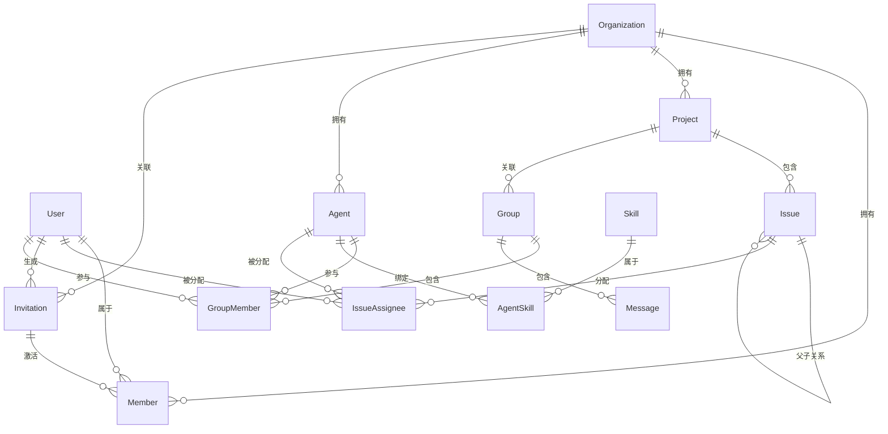
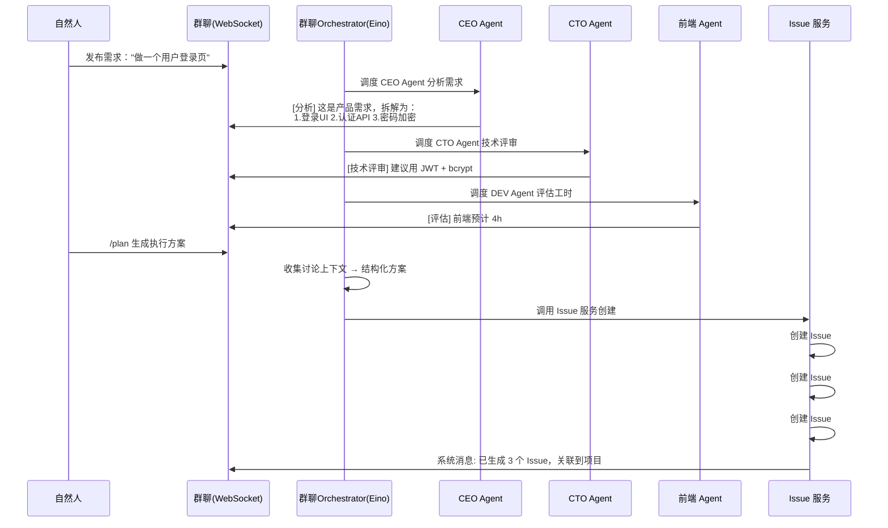
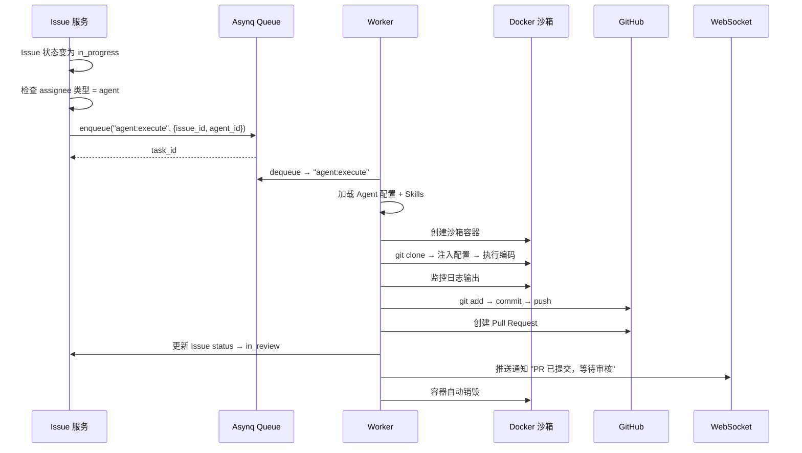

# AnserFlow — 多智能体协作项目管理系统 架构分析文档

## 一、系统愿景

构建一个 **AI Agent + 自然人混合协作** 的项目管理平台。核心场景：

> 自然人创建项目 → 拉群（CEO/CTO/前端/后端等 Agent 角色入群）→ 发布需求 → Agent 根据角色设定自动讨论生成落地方案 → 自动拆解为 Issue 并关联项目 → Agent 认领执行 → 自然人审核验收。

---

## 二、技术栈总览

```
┌──────────────────────────────────────────┐
│ 前端       Next.js 14 SPA (static export)│
│           shadcn/ui + Tailwind CSS        │
│           TanStack Query (数据请求)       │
│           Zustand (客户端状态)            │
│           React Hook Form + Zod (表单)    │
│           Tauri 2.x (桌面+移动端)         │
├──────────────────────────────────────────┤
│ 后端框架   Gin                           │
│ ORM        GORM                          │
│ 数据库     MySQL 8.0+                    │
│ CLI        Cobra                         │
│ 静态嵌入   embed (Go 1.16+)              │
│ 配置       Viper                         │
│ 日志       Zap                           │
│ 校验       go-playground/validator       │
│ 权限       Casbin (RBAC)                 │
├──────────────────────────────────────────┤
│ 缓存/广播  Redis                         │
│ 实时通信   Gorilla WebSocket             │
│           + Redis Pub/Sub (分布式)        │
│ 任务队列   Asynq (基于 Redis)            │
├──────────────────────────────────────────┤
│ AI Agent   Eino (字节跳动 CloudWeGo)     │
│            + 自研业务封装层               │
│ 沙箱       Docker SDK for Go            │
├──────────────────────────────────────────┤
│ Skills     手动编写 + ZIP 导入           │
│ 认证       JWT + OAuth2 (GitHub)         │
│ 邮件       gomail (SMTP)                 │
│ 邀请       分享链接 + 邮箱               │
│ API文档    Swagger (swaggo/swag)         │
│ 跨域       gin-contrib/cors              │
└──────────────────────────────────────────┘
```

### 选型理由

| 技术 | 理由 |
|------|------|
| **Gin** | 高性能、生态成熟、中文社区活跃 |
| **GORM** | Go 最流行的 ORM，支持 MySQL 全面 |
| **MySQL 8.0+** | 关系型数据、事务支持、稳定可靠 |
| **Cobra** | Go CLI 标准库，`anserflow server/init` 命令 |
| **embed** | Go 1.16+ 原生静态文件嵌入，编译为单一可执行文件 |
| **Viper** | Go 配置管理标准库，支持 YAML/ENV 多源加载 |
| **Zap** | Uber 开源高性能结构化日志库 |
| **validator** | Go 结构体校验标准库，API 请求参数校验 |
| **Casbin** | 灵活的 RBAC/ABAC 权限模型，满足组织角色管理 |
| **Next.js SPA** | `output: "export"` 模式，产物可直接嵌入 Go 二进制 |
| **Redis** | 缓存 + WebSocket 分布式 Pub/Sub + Asynq 任务队列，一个组件覆盖三个场景 |
| **Gorilla WebSocket** | Go 社区最成熟的 WebSocket 库 |
| **Asynq** | Go 原生、基于 Redis、支持重试/超时/优先级/死信队列，零额外运维 |
| **Eino** | 字节跳动开源、12k+ Stars、Graph/Workflow 多 Agent 编排、流式原生支持、中文社区强 |
| **Docker SDK** | Agent 编码沙箱隔离，资源限制、自动清理 |
| **TanStack Query** | 服务端状态管理，自动缓存/重取/去重，SPA 模式完美兼容 |
| **Zustand** | 极轻量客户端状态管理（侧栏、弹窗、看板拖拽状态） |
| **React Hook Form + Zod** | 高性能表单 + 声明式校验，与 shadcn/ui 深度集成 |
| **TanStack Table** | 无头表格库，Issue 列表/Agent 列表/成员表格 |
| **Recharts** | 图表库，Dashboard 数据可视化 |
| **next-themes** | 暗色/亮色主题切换，与 Tailwind CSS 原生配合 |
| **Framer Motion** | 动效库，页面过渡、看板拖拽动画 |
| **Sonner** | 轻量 Toast 通知，操作反馈 |
| **date-fns** | 日期处理，轻量 tree-shakable |
| **lucide-react** | 图标库，与 shadcn/ui 配套 |
| **shadcn/ui** | 无捆绑、可定制、基于 Radix 的可访问组件 |
| **Tauri 2.x** | 比 Electron 轻量、Rust 内核、支持移动端 |
| **gomail** | Go 邮件发送库，支持 SMTP/SSL，用于邮箱邀请和通知 |
| **swaggo/swag** | Swagger/OpenAPI 文档自动生成，便于前后端联调 |
| **gin-contrib/cors** | Gin 官方 CORS 中间件，SPA 跨域支持 |

### 框架补充说明

> 以下为生产级 Gin 项目的标准配套设施，确保系统可维护、可观测、可扩展。

#### Viper — 配置管理

`github.com/spf13/viper` 统一管理 `config.yaml`，支持环境变量覆盖（如 `DB_HOST`、`REDIS_ADDR` 覆盖配置文件值），生产环境敏感信息通过环境变量注入。

```go
viper.SetConfigName("config")
viper.AddConfigPath(".")
viper.AutomaticEnv() // ENV 自动覆盖
viper.ReadInConfig()
```

#### Zap — 结构化日志

`go.uber.org/zap` 替代标准库 `log`，支持 JSON 格式输出、日志分级（Debug/Info/Warn/Error）、按时间/大小自动切割。GORM 可直接接入 Zap 作为日志后端：

```go
logger, _ := zap.NewProduction()
db, _ := gorm.Open(mysql.Open(dsn), &gorm.Config{
    Logger: logger.New(gormLogger.Info, &gormLogger.Config{LogLevel: gormLogger.Info}),
})
```

#### go-playground/validator — 请求校验

Gin 原生集成了 `github.com/go-playground/validator`，通过 struct tag 声明校验规则：

```go
type CreateIssueReq struct {
    Title       string `json:"title" binding:"required,min=1,max=256"`
    Priority    string `json:"priority" binding:"required,oneof=p0 p1 p2 p3 p4"`
    ProjectID   uint   `json:"project_id" binding:"required"`
}
```

#### Casbin — 权限控制

`github.com/casbin/casbin` 实现 RBAC，支持组织级角色（owner/admin/member）和资源级权限（项目/Issue/Agent）。策略模型存储在 MySQL 中，运行时动态加载：

```ini
[request_definition]
r = sub, obj, act
[policy_definition]
p = sub, obj, act
[role_definition]
g = _, _
[policy_effect]
e = some(where (p.eft == allow))
[matchers]
m = g(r.sub, p.sub) && keyMatch(r.obj, p.obj) && regexMatch(r.act, p.act)
```

#### Swagger — API 文档

`github.com/swaggo/swag` + `github.com/swaggo/gin-swagger`，通过代码注解自动生成 OpenAPI 3.0 文档，开发环境访问 `/swagger/index.html`：

```go
// @title           AnserFlow API
// @version         1.0
// @host            localhost:8080
// @BasePath        /api
func main() { /* ... */ }
```

#### CORS — 跨域支持

`github.com/gin-contrib/cors` 允许 SPA 前端和 Tauri WebView 跨域访问 API：

```go
r.Use(cors.New(cors.Config{
    AllowOrigins: []string{"http://localhost:3000", "tauri://localhost"},
    AllowMethods: []string{"GET", "POST", "PUT", "DELETE", "OPTIONS"},
    AllowHeaders: []string{"Origin", "Content-Type", "Authorization"},
}))
```

#### 优雅关闭

Go 标准库 `signal` + `http.Server.Shutdown`，确保收到 SIGINT/SIGTERM 时完成进行中的请求再退出：

```go
srv := &http.Server{Addr: ":8080", Handler: r}
go srv.ListenAndServe()

quit := make(chan os.Signal, 1)
signal.Notify(quit, syscall.SIGINT, syscall.SIGTERM)
<-quit

ctx, cancel := context.WithTimeout(context.Background(), 10*time.Second)
defer cancel()
srv.Shutdown(ctx)
```

#### 健康检查

`/api/health` 端点返回数据库、Redis 连通性，供 K8s/Docker 探活：

```go
r.GET("/api/health", func(c *gin.Context) {
    c.JSON(200, gin.H{
        "status": "ok",
        "db":     checkDB(),
        "redis":  checkRedis(),
    })
})
```

### 前端框架补充说明

> 以下为 Next.js SPA 生产级项目标准配套设施，覆盖状态管理、数据请求、表单、动效、主题等核心能力。

#### TanStack Query — 服务端状态管理

`@tanstack/react-query` 负责所有 API 数据请求，提供自动缓存、后台刷新、请求去重、乐观更新。SPA 模式下完全运行在客户端：

```tsx
// hooks/use-issues.ts
import { useQuery, useMutation, useQueryClient } from '@tanstack/react-query'

export function useIssues(projectId: number) {
  return useQuery({
    queryKey: ['issues', projectId],
    queryFn: () => fetch(`/api/projects/${projectId}/issues`).then(r => r.json()),
    staleTime: 30 * 1000,  // 30s 内不重新请求
  })
}

export function useCreateIssue() {
  const qc = useQueryClient()
  return useMutation({
    mutationFn: (data: CreateIssueReq) =>
      fetch('/api/issues', { method: 'POST', body: JSON.stringify(data) }).then(r => r.json()),
    onSuccess: (_, vars) => {
      qc.invalidateQueries({ queryKey: ['issues', vars.project_id] })
    },
  })
}
```

#### Zustand — 客户端状态管理

`zustand` 管理纯客户端状态：侧栏展开/收起、弹窗开关、看板拖拽状态、WebSocket 连接状态等。极简 API，无 Provider 包裹：

```tsx
// stores/sidebar.ts
import { create } from 'zustand'

export const useSidebar = create<SidebarState>((set) => ({
  isOpen: true,
  toggle: () => set((s) => ({ isOpen: !s.isOpen })),
}))
```

#### React Hook Form + Zod — 表单与校验

`react-hook-form` 提供高性能非受控表单，`zod` 声明式 schema 校验，与 shadcn/ui 的 `<Form />` 组件深度集成：

```tsx
// components/agent-form.tsx
import { useForm } from 'react-hook-form'
import { zodResolver } from '@hookform/resolvers/zod'
import { z } from 'zod'

const agentSchema = z.object({
  name: z.string().min(1, '名称不能为空').max(64),
  role_label: z.enum(['CEO', 'CTO', 'Frontend', 'Backend', 'DevOps']),
  system_prompt: z.string().min(10, '人设描述至少 10 个字符'),
})

type AgentFormData = z.infer<typeof agentSchema>

export function AgentForm() {
  const form = useForm<AgentFormData>({ resolver: zodResolver(agentSchema) })
  // ...
}
```

#### TanStack Table — 数据表格

`@tanstack/react-table` 无头表格库，配合 shadcn/ui 的 `<DataTable />` 组件实现排序、筛选、分页、行选择：

```tsx
// features/issues/components/issue-table.tsx
const columns: ColumnDef<Issue>[] = [
  { accessorKey: 'title', header: '标题' },
  { accessorKey: 'status', header: '状态' },
  { accessorKey: 'priority', header: '优先级' },
]

<DataTable columns={columns} data={issues} />
```

#### next-themes — 主题切换

`next-themes` 提供暗色/亮色主题切换，与 Tailwind CSS `dark:` 前缀原生配合，支持系统偏好跟随：

```tsx
import { useTheme } from 'next-themes'

<Button onClick={() => setTheme(theme === 'dark' ? 'light' : 'dark')}>
  <Sun className="dark:hidden" />
  <Moon className="hidden dark:block" />
</Button>
```

#### Framer Motion — 动效

`framer-motion` 提供页面过渡动画、看板卡片拖拽、模态框弹出动效：

```tsx
import { motion, AnimatePresence } from 'framer-motion'

<AnimatePresence>
  {isOpen && (
    <motion.div initial={{ opacity: 0, y: 20 }} animate={{ opacity: 1, y: 0 }} exit={{ opacity: 0 }}>
      <Modal />
    </motion.div>
  )}
</AnimatePresence>
```

#### Sonner — Toast 通知

`sonner` 替代传统 toast 库，支持 Promise 状态、富文本、自定义样式：

```tsx
import { toast } from 'sonner'

toast.promise(createAgent(data), {
  loading: '创建 Agent 中...',
  success: 'Agent 创建成功',
  error: '创建失败',
})
```

#### 日期处理

`date-fns` 纯函数日期工具，tree-shakable，按需导入：

```tsx
import { format, formatDistanceToNow } from 'date-fns'
import { zhCN } from 'date-fns/locale'

format(new Date(), 'yyyy-MM-dd HH:mm')
formatDistanceToNow(issue.created_at, { locale: zhCN, addSuffix: true }) // "3 小时前"
```

#### 环境变量管理

Next.js SPA 模式下，`NEXT_PUBLIC_` 前缀变量在构建时内联，敏感信息必须保留在后端：

```bash
# .env.local
NEXT_PUBLIC_API_BASE=http://localhost:8080/api
NEXT_PUBLIC_WS_URL=ws://localhost:8080/ws
```

#### 前端目录结构

采用 features 模块化架构，按业务功能组织代码：

```
src/
├── app/                        # Next.js App Router（路由层）
│   ├── layout.tsx              # 根布局（Provider 包裹）
│   ├── page.tsx                # Dashboard
│   ├── agents/                 # Agent 管理页
│   ├── projects/               # 项目 & Issue 页
│   └── groups/                 # 群组 & 群聊页
├── components/                 # 共享 UI 组件
│   ├── ui/                     # shadcn/ui 基础组件
│   └── layout/                 # 布局组件（Sidebar/Navbar）
├── features/                   # 业务功能模块
│   ├── agents/
│   │   ├── api/               # API 请求 & mutation
│   │   ├── components/        # Agent 卡片/表单/列表
│   │   └── schemas/           # Zod 校验 schema
│   ├── issues/
│   ├── projects/
│   ├── chat/                  # 群聊 WebSocket 通信
│   └── dashboard/             # 仪表盘图表
├── hooks/                      # 自定义 Hook
├── stores/                     # Zustand Store
├── lib/                        # 工具函数 & API client
│   ├── api.ts                 # 统一 fetch 封装
│   └── ws.ts                  # WebSocket 客户端
└── types/                      # TypeScript 类型定义
```

#### 代码质量工具

```json
{
  "scripts": {
    "lint": "eslint . --ext .ts,.tsx",
    "format": "prettier --write .",
    "type-check": "tsc --noEmit"
  }
}
```

| 工具 | 用途 |
|------|------|
| **ESLint** + `@next/eslint-plugin` | 代码规范检查 |
| **Prettier** + `prettier-plugin-tailwindcss` | 代码格式化 + Tailwind 类名排序 |
| **TypeScript strict** | `tsconfig.json` 启用 `strict: true` |

### Tauri 桌面端补充说明

> Tauri 2.x 负责将 Next.js SPA 打包为桌面应用（Windows/macOS/Linux）+ 移动端（Android/iOS）。以下为 Tauri 项目核心架构、安全模型、插件体系和分发流程。

#### 进程模型

Tauri 采用多进程架构，遵循最小权限原则：

```
┌─────────────────────────────────┐
│  Core 进程 (Rust)                │
│  ├── 唯一拥有 OS 完整访问权限     │
│  ├── 窗口管理 / 系统托盘          │
│  ├── IPC 消息路由与拦截           │
│  ├── 全局状态管理                 │
│  └── 插件调度                    │
├─────────────────────────────────┤
│  WebView 进程 (JS/TS)            │
│  ├── 渲染 Next.js SPA            │
│  ├── 通过 IPC 调用 Core 能力      │
│  └── 受 CSP + Capabilities 限制  │
└─────────────────────────────────┘
```

- **Core 进程**：Rust 编写，管理窗口、托盘、通知，路由所有 IPC 消息
- **WebView 进程**：操作系统原生 WebView（Windows: Edge WebView2, macOS: WKWebView, Linux: webkitgtk）
- **安全隔离**：前端无法直接访问 OS，必须通过 Capabilities 声明的命令才能调用 Core 能力

#### 项目结构

Tauri 项目位于 `desktop/src-tauri/`，与 `desktop/package.json` 同级，符合 Tauri 默认约定：

```
desktop/                       # 桌面客户端根目录
├── package.json               # Next.js + Tauri CLI 依赖
├── next.config.js
├── src/                       # Next.js 源码
├── dist/                      # 构建产物 → frontendDist: "../dist"
└── src-tauri/                 # Tauri Rust 项目
    ├── Cargo.toml             # Rust 依赖
    ├── tauri.conf.json        # Tauri 核心配置
    ├── capabilities/
    │   └── default.json       # 权限声明
    ├── icons/                 # 应用图标（多平台）
    ├── src/
    │   ├── main.rs            # 桌面入口
    │   ├── lib.rs             # 核心逻辑 + 移动端入口
    │   └── commands.rs        # IPC 命令定义
    └── build.rs
```

#### 安全模型：Capabilities

Tauri v2 采用声明式权限系统，`capabilities/default.json` 精确控制前端可调用的能力：

```json
{
  "identifier": "default",
  "description": "默认权限集",
  "windows": ["main"],
  "permissions": [
    "core:default",
    "shell:allow-open",
    "notification:default",
    "dialog:default",
    "clipboard-manager:default",
    "updater:default",
    "process:default",
    "deep-link:default"
  ]
}
```

| 能力 | 用途 |
|------|------|
| `core:default` | 窗口操作、应用事件 |
| `shell:allow-open` | 用系统默认程序打开 URL/文件 |
| `notification:default` | 系统原生通知 |
| `dialog:default` | 原生文件选择/保存对话框 |
| `clipboard-manager:default` | 读写剪贴板 |
| `updater:default` | 自动更新 |
| `process:default` | 进程管理（重启） |
| `deep-link:default` | 自定义协议深度链接 |

#### IPC 通信

前端通过 `@tauri-apps/api` 调用 Rust 端命令，采用异步消息传递：

```rust
// src-tauri/src/commands.rs
#[tauri::command]
fn get_app_version() -> String {
    env!("CARGO_PKG_VERSION").to_string()
}

#[tauri::command]
async fn get_system_info() -> Result<SystemInfo, String> {
    // 获取 OS 信息
    Ok(SystemInfo { os: std::env::consts::OS.to_string() })
}
```

```ts
// 前端调用
import { invoke } from '@tauri-apps/api/core'

const version = await invoke<string>('get_app_version')
const sysInfo = await invoke<SystemInfo>('get_system_info')
```

**核心 IPC 命令**（AnserFlow 场景）：

| 命令 | 功能 |
|------|------|
| `get_app_version` | 获取应用版本 |
| `open_url` | 用系统浏览器打开外部链接 |
| `show_notification` | 发送系统通知 |
| `get_system_info` | 获取 OS 信息 |
| `restart_app` | 更新后重启应用 |

#### Tauri 配置

`tauri.conf.json` 核心配置：

```json
{
  "productName": "AnserFlow",
  "version": "0.1.0",
  "identifier": "io.anserflow.app",
  "build": {
    "beforeBuildCommand": "npm run build",
    "beforeDevCommand": "npm run dev",
    "devUrl": "http://localhost:3000",
    "frontendDist": "../frontend/dist"
  },
  "app": {
    "windows": [{
      "title": "AnserFlow",
      "width": 1280,
      "height": 800,
      "minWidth": 900,
      "minHeight": 600,
      "resizable": true,
      "center": true
    }],
    "security": {
      "csp": "default-src 'self'; connect-src 'self' http://localhost:8080 ws://localhost:8080"
    }
  },
  "bundle": {
    "active": true,
    "targets": "all",
    "icon": ["icons/icon.png"],
    "createUpdaterArtifacts": true
  },
  "plugins": {
    "deep-link": {
      "desktop": {
        "schemes": ["anserflow"]
      }
    }
  }
}
```

#### 插件体系

AnserFlow 需要用到的 Tauri 官方插件：

| 插件 | 场景 |
|------|------|
| **notification** | Issue 状态变更 / Agent 执行完成 / @提及 系统通知 |
| **shell** | 用系统默认浏览器打开 GitHub PR 链接 |
| **dialog** | 文件选择（Skills ZIP 导入） |
| **clipboard-manager** | 复制邀请链接 |
| **updater** | 应用内自动更新 |
| **process** | 更新完成后重启应用 |
| **window-state** | 记忆窗口大小和位置 |
| **single-instance** | 防止重复启动 |
| **deep-link** | `anserflow://invite/xxx` 协议处理邀请 |
| **fs** | 文件系统访问（Skills ZIP 解压） |
| **store** | 持久化键值存储（本地设置缓存） |
| **logging** | Rust 端日志输出 |

安装示例：

```bash
cargo tauri add notification
cargo tauri add updater
cargo tauri add deep-link
```

#### 深度链接

通过 `anserflow://` 自定义协议处理邀请链接，用户点击 `anserflow://invite/abc123` 时自动打开桌面应用并跳转到接受邀请页面：

```rust
// src-tauri/src/lib.rs
use tauri_plugin_deep_link::DeepLinkExt;

app.listen_deep_link(|url| {
    if let Some(token) = url.path().strip_prefix("/invite/") {
        // 通知前端跳转到邀请页面
        app.emit("deep-link-invite", token).unwrap();
    }
});
```

```ts
// 前端监听
import { listen } from '@tauri-apps/api/event'

listen('deep-link-invite', (event) => {
  router.push(`/invite/${event.payload}`)
})
```

#### 自动更新

Tauri updater 插件支持从静态 JSON 或动态服务获取更新，更新流程：

```
应用启动 → 检查更新 API → 发现新版本
  → 下载安装包（MSI/DMG/AppImage）
  → 校验签名
  → 提示用户重启
  → process::restart() 应用新版本
```

```json
// 更新服务器返回 JSON
{
  "version": "0.2.0",
  "notes": "新增 Skills ZIP 导入功能",
  "platforms": {
    "windows-x86_64": { "signature": "...", "url": "https://dl.anserflow.io/v0.2.0/AnserFlow_0.2.0_x64.msi.zip" },
    "darwin-x86_64": { "signature": "...", "url": "https://dl.anserflow.io/v0.2.0/AnserFlow_0.2.0_x64.dmg" },
    "linux-x86_64": { "signature": "...", "url": "https://dl.anserflow.io/v0.2.0/AnserFlow_0.2.0_amd64.AppImage.tar.gz" }
  }
}
```

#### 打包与分发

| 平台 | 格式 | 说明 |
|------|------|------|
| **Windows** | MSI / NSIS | MSI 支持企业批量部署，NSIS 体积更小 |
| **macOS** | DMG | 需 Apple Developer 签名 + Notarization |
| **Linux** | AppImage / deb / rpm | AppImage 通用性最好 |
| **Android** | APK / AAB | 通过 Tauri Android 插件打包 |
| **iOS** | IPA | 需 Apple Developer 账号 |

```bash
# 三平台交叉编译
cargo tauri build --target x86_64-pc-windows-msvc
cargo tauri build --target x86_64-apple-darwin
cargo tauri build --target aarch64-apple-darwin
cargo tauri build --target x86_64-unknown-linux-gnu
```

#### Tauri 前端适配

SPA 在 Tauri WebView 中需注意的适配点：

```ts
// lib/tauri.ts — 环境检测与适配
import { isTauri } from '@tauri-apps/api/core'

// 根据运行环境切换 API 地址
export const API_BASE = isTauri()
  ? 'http://localhost:8080/api'          // 桌面端直连本地后端
  : process.env.NEXT_PUBLIC_API_BASE     // 浏览器模式使用远程 API

export const WS_URL = isTauri()
  ? 'ws://localhost:8080/ws'
  : process.env.NEXT_PUBLIC_WS_URL!

// CSP 适配：Tauri WebView 中 'self' 指向 tauri://localhost
// 需在 tauri.conf.json 的 CSP 中白名单后端地址
```

#### Rust 最小学习路径

AnserFlow 桌面端 Rust 代码量极少，核心仅三个文件，每个都可以按模板修改：

| 文件 | 行数 | 内容 | Rust 知识点 |
|------|------|------|------------|
| `main.rs` | ~10 | 入口（固定模板） | 无，复制粘贴 |
| `lib.rs` | ~20 | 插件注册 + 初始化 | 宏调用、Result |
| `commands.rs` | ~40 | IPC 命令 | 函数声明、字符串操作 |

**对比**：Go vs Rust 在桌面端职责中的对应关系：

```
Go 概念          →  Rust 概念
━━━━━━━━━━━━━━━━━━━━━━━━━━━━━━━━━━
func cmd()       →  fn cmd()
string           →  String
map[string]T     →  HashMap<String, T>
err != nil       →  match / ? 操作符
struct{}         →  struct{}
go mod           →  Cargo.toml
```

> **结论**：不需要学 Rust。参考 AI 生成 + 模板修改即可完成桌面端开发。

#### lib.rs 完整示例

将所有插件在 `lib.rs` 中一次性注册，AnserFlow 桌面端的完整 Rust 骨架：

```rust
// src-tauri/src/lib.rs
use tauri_plugin_deep_link::DeepLinkExt;

#[cfg_attr(mobile, tauri::mobile_entry_point)]
pub fn run() {
    tauri::Builder::default()
        // ── 插件注册 ──
        .plugin(tauri_plugin_notification::init())
        .plugin(tauri_plugin_shell::init())
        .plugin(tauri_plugin_dialog::init())
        .plugin(tauri_plugin_clipboard_manager::init())
        .plugin(tauri_plugin_store::Builder::new().build())
        .plugin(tauri_plugin_window_state::Builder::default().build())
        .plugin(tauri_plugin_single_instance::init(|app, _args, _cwd| {
            // 重复启动 → 激活已有窗口
            if let Some(window) = app.get_webview_window("main") {
                let _ = window.show();
                let _ = window.set_focus();
            }
        }))
        .plugin(
            tauri_plugin_updater::Builder::new().build()
        )
        .plugin(
            tauri_plugin_log::Builder::new()
                .level(log::LevelFilter::Info)
                .target(tauri_plugin_log::Target::new(
                    tauri_plugin_log::TargetKind::LogDir {
                        file_name: Some("anserflow".to_string()),
                    },
                ))
                .max_file_size(5_000_000)  // 5MB
                .rotation_strategy(tauri_plugin_log::RotationStrategy::KeepAll)
                .build(),
        )
        // ── 深度链接 ──
        .setup(|app| {
            #[cfg(desktop)]
            {
                app.listen_deep_link(|url| {
                    if let Some(token) = url.path().strip_prefix("/invite/") {
                        app.emit("deep-link-invite", token).unwrap();
                    }
                });
            }
            Ok(())
        })
        .invoke_handler(tauri::generate_handler![
            commands::get_system_info,
            commands::open_url,
            commands::restart_app,
        ])
        .run(tauri::generate_context!())
        .expect("error while running tauri application");
}
```

```rust
// src-tauri/src/commands.rs — IPC 命令
use tauri::Manager;

#[tauri::command]
fn get_system_info() -> Result<String, String> {
    Ok(format!(
        "{{ \"os\": \"{}\", \"arch\": \"{}\" }}",
        std::env::consts::OS,
        std::env::consts::ARCH,
    ))
}

#[tauri::command]
fn open_url(app: tauri::AppHandle, url: String) -> Result<(), String> {
    tauri_plugin_shell::ShellExt::shell(&app)
        .open(&url, None)
        .map_err(|e| e.to_string())
}

#[tauri::command]
fn restart_app(app: tauri::AppHandle) {
    app.restart();
}
```

#### 通知插件实战

AnserFlow 关键通知场景的 TypeScript 封装：

```ts
// desktop/src/lib/notifications.ts
import {
  isPermissionGranted,
  requestPermission,
  sendNotification,
  registerActionTypes,
  onAction,
  createChannel,
  Importance,
} from '@tauri-apps/plugin-notification'

// 初始化：申请权限 + 注册频道
async function initNotifications() {
  const granted = await isPermissionGranted()
  if (!granted) {
    const perm = await requestPermission()
    if (perm !== 'granted') return
  }

  // 注册通知频道（Android 必需，其他平台兼容）
  await createChannel({
    id: 'issues',
    name: 'Issue 通知',
    description: 'Issue 状态变更、@提及、分配',
    importance: Importance.High,
    visibility: 1, // Private
  })

  await createChannel({
    id: 'agent',
    name: 'Agent 通知',
    description: 'Agent 执行完成通知',
    importance: Importance.Default,
  })

  // 注册带操作的 Issue 通知
  await registerActionTypes([{
    id: 'issue-actions',
    actions: [
      { id: 'view', title: '查看详情', foreground: true },
      { id: 'close', title: '关闭 Issue', foreground: false },
    ],
  }])
}

// 监听通知操作
onAction((action) => {
  if (action.actionId === 'view') {
    // 导航到 Issue 详情页
    window.location.hash = `/projects/${action.payload?.projectId}/issues/${action.payload?.issueId}`
  }
  if (action.actionId === 'close') {
    // 调用 API 关闭 Issue
    fetch(`/api/issues/${action.payload?.issueId}/close`, { method: 'POST' })
  }
})

// 场景函数
export async function notifyIssueAssigned(title: string, issueUrl: string) {
  await sendNotification({
    title: '📋 新 Issue 分配',
    body: title,
    channelId: 'issues',
    actionTypeId: 'issue-actions',
  })
}

export async function notifyAgentComplete(agentName: string) {
  await sendNotification({
    title: '✅ Agent 执行完成',
    body: `${agentName} 已完成任务`,
    channelId: 'agent',
  })
}

@tauri-apps/plugin-notification
export async function notifyMention(who: string, message: string) {
  await sendNotification({
    title: `💬 ${who} 提到了你`,
    body: message,
    channelId: 'issues',
  })
}
```

#### Store 插件实战

用 tauri-plugin-store 持久化本地设置（窗口尺寸、主题、API 地址等），比 localStorage 更可靠：

```ts
// desktop/src/lib/local-settings.ts
import { load } from '@tauri-apps/plugin-store'

interface LocalSettings {
  theme: 'light' | 'dark' | 'system'
  apiBase: string          // 后端 API 地址
  lastProjectId?: string
  windowBounds?: { x: number; y: number; width: number; height: number }
}

const DEFAULT: LocalSettings = {
  theme: 'system',
  apiBase: 'http://localhost:8080/api',
}

let _store: Awaited<ReturnType<typeof load>> | null = null

async function getStore() {
  if (!_store) {
    _store = await load('settings.json', { autoSave: true })
  }
  return _store
}

export async function getSettings(): Promise<LocalSettings> {
  const store = await getStore()
  const val = await store.get<LocalSettings>('settings')
  return { ...DEFAULT, ...val }
}

export async function updateSettings(patch: Partial<LocalSettings>) {
  const store = await getStore()
  const current = await getSettings()
  await store.set('settings', { ...current, ...patch })
  // autoSave: true 会自动持久化
}
```

#### Logging 插件实战

生产环境日志落到文件，便于排查问题：

```ts
// desktop/src/lib/logger.ts
import { info, warn, error, attachConsole } from '@tauri-apps/plugin-log'

// 开发时：前端 console → Rust 日志系统
export function setupLogger() {
  attachConsole() // 将 Rust 日志打印到 WebView console

  // 将 console.log/warn/error 转发到 Rust 日志文件
  const forward = (fnName: 'log' | 'warn' | 'error', logger: (msg: string) => Promise<void>) => {
    const orig = console[fnName]
    console[fnName] = (...args: any[]) => {
      orig(...args)
      logger(args.map(String).join(' '))
    }
  }
  forward('log', info)
  forward('warn', warn)
  forward('error', error)
}

// 调用日志
// info('用户登录成功', { userId: 123 })
// error('API 请求失败', { url: '/api/issues', status: 500 })
```

#### CI/CD：GitHub Actions 跨平台构建

使用 `tauri-action` 一键构建四平台产物并上传：

```yaml
# .github/workflows/desktop-release.yml
name: Desktop Release
on:
  push:
    tags: ['desktop-v*']

jobs:
  build:
    strategy:
      fail-fast: false
      matrix:
        include:
          - platform: windows-latest
            target: x86_64-pc-windows-msvc
          - platform: macos-latest
            target: aarch64-apple-darwin
          - platform: macos-13
            target: x86_64-apple-darwin
          - platform: ubuntu-latest
            target: x86_64-unknown-linux-gnu

    runs-on: ${{ matrix.platform }}
    steps:
      - uses: actions/checkout@v4

      - name: Setup Node.js
        uses: actions/setup-node@v4
        with: { node-version: '20' }

      - name: Install Rust
        uses: dtolnay/rust-toolchain@stable
        with: { targets: '${{ matrix.target }}' }

      - name: Build Frontend & Tauri
        uses: tauri-apps/tauri-action@v0
        env:
          GITHUB_TOKEN: ${{ secrets.GITHUB_TOKEN }}
          TAURI_SIGNING_PRIVATE_KEY: ${{ secrets.TAURI_PRIVATE_KEY }}
        with:
          projectPath: 'desktop'
          tagName: ${{ github.ref_name }}
          releaseName: 'AnserFlow Desktop ${{ github.ref_name }}'
          releaseBody: 'See CHANGELOG.md'
          includeUpdaterJson: true
```

> macOS 签名与公证需要 Apple Developer 账号，在 Actions secrets 中配置 `APPLE_CERTIFICATE`、`APPLE_CERTIFICATE_PASSWORD`、`APPLE_ID`、`APPLE_PASSWORD`、`APPLE_TEAM_ID`。

#### WebDriver E2E 测试

Tauri 内置 WebDriver 支持，可编写 Selenium/WebdriverIO 脚本测试桌面应用：

```bash
# 安装 tauri-driver
cargo install tauri-driver

# 启动测试
tauri-driver &
cargo tauri dev &  # 或 cargo tauri build --debug
npx wdio run wdio.conf.ts
```

```ts
// wdio.conf.ts
const wdioOptions = {
  hostname: 'localhost',
  port: 4444,
  path: '/',
  capabilities: [{
    'tauri:options': {
      application: './src-tauri/target/debug/anserflow-desktop',
    },
  }],
}
```

> 适合对关键流程（登录、创建 Issue、接受邀请）做自动化回归。

#### 推荐插件分级

| 优先级 | 插件 | 原因 |
|--------|------|------|
| 🔴 必须 | window-state | 窗口尺寸记忆，用户体验基础 |
| 🔴 必须 | single-instance | 防止多开导致的状态冲突 |
| 🔴 必须 | notification | 核心功能（Issue / Agent 通知） |
| 🔴 必须 | shell | 打开 GitHub PR 链接 |
| 🔴 必须 | updater | 自动更新分发 |
| 🟡 重要 | store | 持久化本地设置 |
| 🟡 重要 | logging | 生产排查日志 |
| 🟡 重要 | deep-link | 邀请链接直接打开桌面端 |
| 🟡 重要 | dialog | Skills ZIP 导入 |
| 🟢 可选 | clipboard-manager | 复制邀请链接 |
| 🟢 可选 | fs | 文件系统操作 |
| 🟢 可选 | process | 更新后重启 |

```mermaid
graph TD
    A["AnserFlow 平台"] --> B["用户与权限"]
    A --> C["Agent 管理"]
    A --> C["Agent 管理"]
    A --> D["群聊协作"]
    A --> E["项目管理"]
    A --> F["Issue 系统"]
    A --> G["Agent 执行引擎"]
    A --> H["Skills 技能系统"]

    B --> B1["注册/登录(OAuth/GitHub)"]
    B --> B2["组织/团队管理"]
    B --> B3["角色权限(RBAC)"]
    B --> B4["邀请机制"]

    C --> C1["Agent 角色定义(CEO/CTO/Dev...)"]
    C --> C2["Agent System Prompt / 人设"]
    C --> C3["Agent 运行时配置(opencode等)"]
    C --> C4["Agent 绑定 Skills"]
    C --> C5["全局开关 / 单独启停"]

    D --> D1["创建群组"]
    D --> D2["拉入 Agent + 自然人"]
    D --> D3["需求讨论(Agent自动参与)"]
    D --> D4["方案产出 → 自动建 Issue"]

    E --> E1["创建项目"]
    E --> E2["关联 GitHub 仓库(HTTP/SSH)"]
    E --> E3["项目设置/成员"]

    F --> F1["Issue CRUD"]
    F --> F2["状态: Backlog→Todo→InProgress→InReview→Done"]
    F --> F3["优先级(P0-P4)"]
    F --> F4["子 Issue 层级"]
    F --> F5["分配给 Agent 或 自然人"]
    F --> F6["看板视图"]

    G --> G1["监听 InProgress + 执行人为Agent"]
    G --> G2["Asynq 入队 → Worker 消费"]
    G --> G3["Docker 沙箱执行"]
    G --> G4["结果回写 / PR 提交 / 状态流转"]

    H --> H1["Skill 定义(全局)"]
    H --> H2["Skill 绑定到 Agent"]
    H --> H3["Skill 启用/禁用(全局+单Agent)"]
    H --> H4["手动编写 + ZIP 导入"]
```



---

## 四、构建与部署

### 4.1 单一可执行文件

整个后端编译为一个独立二进制文件，Next.js SPA 产物通过 Go `embed` 嵌入，零运行时依赖（除配置文件外）。

```
┌─────────────────────────────────────────┐
│              anserflow.exe               │
│  ┌───────────────────────────────────┐  │
│  │  Go 运行时 (Gin + GORM + ...)     │  │
│  │                                   │  │
│  │  ┌─────────────────────────────┐  │  │
│  │  │ embed.FS (//go:embed dist)  │  │  │
│  │  │ ┌─────────────────────────┐ │  │  │
│  │  │ │ Next.js SPA 构建产物     │ │  │  │
│  │  │ │ index.html + JS + CSS   │ │  │  │
│  │  │ └─────────────────────────┘ │  │  │
│  │  └─────────────────────────────┘  │  │
│  │                                   │  │
│  │  Gin 路由:                        │  │
│  │  /api/*    → 后端 API             │  │
│  │  /ws       → WebSocket            │  │
│  │  /*        → SPA index.html       │  │
│  └───────────────────────────────────┘  │
└─────────────────────────────────────────┘
```

**关键实现**：

```go
//go:embed dist
var spaFiles embed.FS

func main() {
    r := gin.Default()

    // API 路由
    api := r.Group("/api")
    // ... 注册 API

    // WebSocket
    r.GET("/ws", handleWebSocket)

    // SPA 静态文件（嵌入）
    spa, _ := fs.Sub(spaFiles, "dist")
    r.StaticFS("/", http.FS(spa))
    // 对于 SPA 路由，所有非 API 路径返回 index.html
    r.NoRoute(func(c *gin.Context) {
        data, _ := spaFiles.ReadFile("dist/index.html")
        c.Data(http.StatusOK, "text/html", data)
    })

    r.Run(":8080")
}
```

### 4.2 交叉编译

支持三平台编译，产物无外部依赖：

```bash
# Windows
GOOS=windows GOARCH=amd64 go build -o anserflow.exe

# macOS (Intel + Apple Silicon)
GOOS=darwin  GOARCH=amd64 go build -o anserflow-darwin-amd64
GOOS=darwin  GOARCH=arm64 go build -o anserflow-darwin-arm64

# Linux
GOOS=linux   GOARCH=amd64 go build -o anserflow-linux-amd64
```

### 4.3 CLI 命令

使用 `github.com/spf13/cobra`：

```bash
# 初始化配置和数据目录
anserflow init
  --db      MySQL 连接串（默认 localhost:3306）
  --redis   Redis 地址（默认 localhost:6379）
  --data    数据目录（默认 ./data）
  # 自动生成 config.yaml + 数据库表结构

# 启动服务
anserflow server
  --config  config.yaml 路径（默认 ./config.yaml）
  --port    监听端口（默认 8080）
  # 启动 Gin HTTP 服务 + Asynq Worker

# 查看版本
anserflow version

# 仅启动 Worker（分布式部署时）
anserflow worker
  --config  config.yaml 路径
  # 仅启动 Asynq Worker，不启动 HTTP 服务

# 数据库迁移
anserflow migrate
  --config  config.yaml 路径
  --dry-run 仅打印 SQL 不执行（默认 false）
  # 基于 GORM AutoMigrate，自动同步所有表结构

# 版本升级（下载最新版本并替换当前二进制）
anserflow upgrade
  --channel  更新通道（stable/beta，默认 stable）
  --dry-run  仅检查新版本不执行升级（默认 false）
  # 自动检测最新版本 → 下载 → 校验 → 替换 → 重启
```

```go
// cmd/root.go
var rootCmd = &cobra.Command{
    Use:   "anserflow",
    Short: "AnserFlow - 多智能体协作项目管理系统",
}

// cmd/server.go
var serverCmd = &cobra.Command{
    Use:   "server",
    Short: "启动 AnserFlow 服务",
    Run: func(cmd *cobra.Command, args []string) {
        startServer(cfg)
    },
}

// cmd/init.go
var initCmd = &cobra.Command{
    Use:   "init",
    Short: "初始化配置和数据目录",
    Run: func(cmd *cobra.Command, args []string) {
        initConfig(cfg)
    },
}

// cmd/worker.go
var workerCmd = &cobra.Command{
    Use:   "worker",
    Short: "仅启动 Asynq Worker（分布式部署）",
    Run: func(cmd *cobra.Command, args []string) {
        startWorker(cfg)
    },
}

// cmd/migrate.go
var migrateCmd = &cobra.Command{
    Use:   "migrate",
    Short: "数据库自动迁移（GORM AutoMigrate）",
    Run: func(cmd *cobra.Command, args []string) {
        dryRun, _ := cmd.Flags().GetBool("dry-run")
        runMigrate(cfg, dryRun)
    },
}

// cmd/upgrade.go
var upgradeCmd = &cobra.Command{
    Use:   "upgrade",
    Short: "下载并安装最新版本",
    Run: func(cmd *cobra.Command, args []string) {
        channel, _ := cmd.Flags().GetString("channel")
        dryRun, _ := cmd.Flags().GetBool("dry-run")
        runUpgrade(channel, dryRun)
    },
}
```

### 4.4 Next.js SPA 模式

Next.js 使用静态导出模式，不依赖 Node.js 服务端：

```js
// next.config.js
/** @type {import('next').NextConfig} */
const nextConfig = {
  output: 'export',        // 关键：SPA 静态导出
  distDir: 'dist',         // 输出目录
  images: {
    unoptimized: true,     // export 模式不支持 image optimization
  },
  // API 请求代理到 Go 后端（仅 dev 模式需要）
  async rewrites() {
    return [
      { source: '/api/:path*', destination: 'http://localhost:8080/api/:path*' },
    ]
  },
}
```

**构建流程**：

```bash
# 1. 构建前端 SPA
cd frontend && npm run build    # → dist/ 目录

# 2. Go embed 嵌入前端产物
cd backend && go build -o anserflow    # dist/ 被 go:embed 打入二进制

# 3. 部署：单个文件即可
./anserflow init    # 首次运行初始化
./anserflow server  # 启动，访问 http://localhost:8080
```

### 4.5 项目目录结构（Monorepo）

Gin 后端、两套 Next.js 前端（后台管理 + 桌面客户端）、Tauri 放在同一个仓库。

```
anserflow/
├── package.json                # npm workspace 根配置
├── package-lock.json
├── cmd/                        # Go CLI 入口（Cobra）
│   ├── root.go                 #   根命令注册
│   ├── server.go               #   anserflow server
│   ├── worker.go               #   anserflow worker
│   ├── init.go                 #   anserflow init
│   ├── migrate.go              #   anserflow migrate
│   └── upgrade.go              #   anserflow upgrade
├── internal/                   # Go 业务逻辑
│   ├── handler/                #   Gin Handler（API 路由）
│   ├── service/                #   业务服务层
│   ├── model/                  #   GORM Model
│   ├── middleware/             #   Gin 中间件（JWT / CORS / Casbin）
│   ├── ws/                     #   WebSocket Hub
│   ├── agent/                  #   Agent 编排（Eino 封装）
│   ├── sandbox/                #   Docker 沙箱
│   └── invite/                 #   邀请服务
├── config/                     # Go 配置加载（Viper）
├── admin/                      # ① npm workspace: @anserflow/admin
│   ├── package.json            #   "name": "@anserflow/admin"
│   ├── next.config.js          #   output: "export"
│   ├── tsconfig.json
│   ├── src/                    #   Next.js 源码
│   │   ├── app/                #     /login /dashboard /agents /projects ...
│   │   ├── components/         #     共享 UI 组件
│   │   ├── features/           #     业务模块
│   │   ├── hooks/              #     自定义 Hook
│   │   ├── stores/             #     Zustand Store
│   │   ├── lib/                #     工具函数 & API Client
│   │   └── types/              #     TypeScript 类型
│   └── dist/                   #   构建产物 → //go:embed admin/dist/*
├── desktop/                    # ② npm workspace: @anserflow/desktop
│   ├── package.json            #   "name": "@anserflow/desktop"
│   ├── next.config.js          #   output: "export"
│   ├── tsconfig.json
│   ├── src/                    #   Next.js 源码（客户端视角）
│   │   ├── app/                #     /dashboard /projects/:id /chat ...
│   │   ├── components/
│   │   ├── features/
│   │   ├── hooks/
│   │   ├── stores/
│   │   ├── lib/
│   │   │   └── tauri.ts        #     isTauri() 环境检测
│   │   └── types/
│   ├── dist/                   #   构建产物 → Tauri frontendDist
│   └── src-tauri/              #   Tauri Rust 项目
│       ├── Cargo.toml
│       ├── tauri.conf.json     #     frontendDist: "../dist"
│       ├── capabilities/
│       │   └── default.json
│       ├── icons/
│       └── src/
│           ├── main.rs         #     桌面入口
│           ├── lib.rs          #     核心 + 移动端入口
│           └── commands.rs     #     IPC 命令
├── packages/                   # ③ npm workspace: packages/*
│   └── shared-ui/              #   @anserflow/shared-ui
│       ├── package.json        #     公共组件 / 类型 / lib
│       ├── src/
│       │   ├── components/     #     公共 UI 组件
│       │   ├── lib/            #     公共工具函数
│       │   └── types/          #     公共 TypeScript 类型
│       └── tsconfig.json
├── embed.go                    # //go:embed admin/dist/*
├── main.go                     # Go 入口
├── go.mod
├── go.sum
├── config.yaml                 # 运行配置
└── Makefile                    # 构建脚本
```

**npm workspace 配置**：

```json
// 根 package.json
{
  "name": "anserflow",
  "private": true,
  "workspaces": ["admin", "desktop", "packages/*"]
}
```

```json
// admin/package.json
{ "name": "@anserflow/admin", "dependencies": { "@anserflow/shared-ui": "*" } }

// desktop/package.json
{ "name": "@anserflow/desktop", "dependencies": { "@anserflow/shared-ui": "*" } }

// packages/shared-ui/package.json
{ "name": "@anserflow/shared-ui", "main": "./src/index.ts" }
```

> 所有前端依赖统一提升到根 `node_modules/`，React / Next.js / shadcn/ui 只安装一份。

**三种产物、两个前端入口**：

| 产物 | 前端 | 用户 | 部署方式 |
|------|------|------|----------|
| `anserflow` 二进制 | `admin/` 嵌入 | 管理员/团队负责人（浏览器） | 服务器部署 |
| Tauri 安装包 | `desktop/` 打包 | 普通成员/被邀请者（桌面） | MSI/DMG/AppImage |
| 移动端 | `desktop/` + Tauri mobile | 移动用户 | APK/IPA |

**`admin/` vs `desktop/` 职责划分**：

| | `admin/` 后台管理 | `desktop/` 桌面客户端 |
|------|------|------|
| 访问方式 | 浏览器 `http://host:8080` | Tauri 原生窗口 |
| 嵌入 Go | ✅ `//go:embed admin/dist/*` | ❌ 由 Tauri 加载 |
| 目标用户 | 管理员、组织负责人 | 普通成员、被邀请者 |
| 核心页面 | Agent管理 / Skills管理 / 项目创建 / 组织设置 / 系统配置 | 项目看板 / Issue 列表 / 群聊 / 个人工作台 |
| 路由前缀 | `/login` `/dashboard` `/agents` `/projects` `/skills` | `/dashboard` `/projects/:id` `/chat` |
| API 地址 | 同源 `/api/*`（无跨域） | `http://localhost:8080/api/*`（跨域 + CORS） |

**开发运行**：

```bash
# 首次安装（根目录执行一次，所有 workspace 共享 node_modules）
npm install

# ====== 后台管理开发 ======
终端1: go run main.go server                        # Gin :8080
终端2: npm run dev -w @anserflow/admin              # Next.js :3000
#     浏览器打开 http://localhost:3000

# ====== 桌面端开发 ======
终端1: go run main.go server                        # Gin :8080
终端2: npm run dev -w @anserflow/desktop            # Next.js :3001
终端3: npm run tauri -w @anserflow/desktop          # Tauri 窗口加载 :3001
```

**构建流程**：

```bash
# ====== 纯 Web 部署 ======
npm run build -w @anserflow/admin    # → admin/dist/
go build -o anserflow                 # 嵌入 admin/dist/
./anserflow server                    # 浏览器访问 :8080

# ====== 桌面端打包 ======
npm run build -w @anserflow/desktop   # → desktop/dist/
npm run tauri build -w @anserflow/desktop  # → MSI/DMG/AppImage
```

**路由分发**：Go 后端根据路径前缀区分两套前端（暂不实施，先只嵌入 admin/）：

```go
// 后续可扩展：同时嵌入两个 SPA，按路径前缀分发
//go:embed admin/dist
var adminFiles embed.FS
//go:embed desktop/dist
var desktopFiles embed.FS

// /admin/* → admin SPA
// /*       → desktop SPA（或反过来）
```

> 💡 后期可从 `admin/` 和 `desktop/` 中提取公共 UI 组件/类型/API Client 到 `packages/shared-ui/`，减少重复代码。

---

## 五、分布式架构设计

### 4.1 WebSocket 分布式方案

```
                    ┌─────────────┐
                    │  Redis       │
                    │  Pub/Sub     │
                    └──┬───┬───┬──┘
                       │   │   │
          ┌────────────┘   │   └────────────┐
          ▼                ▼                ▼
    ┌──────────┐    ┌──────────┐    ┌──────────┐
    │ Gin #1   │    │ Gin #2   │    │ Gin #3   │
    │ WS连接池 │    │ WS连接池 │    │ WS连接池 │
    └──────────┘    └──────────┘    └──────────┘
```

**原理**：每个 Gin 实例维护自己的 WebSocket 连接池。消息发送时，先推送给本地连接的客户端，再通过 Redis Pub/Sub 广播到其他实例，各实例转发给自己持有的客户端。

**Go 库**：`github.com/gorilla/websocket` + `github.com/redis/go-redis/v9`

### 4.2 任务队列方案

选用 **Asynq**（https://github.com/hibiken/asynq），基于 Redis 的分布式任务队列：

```
Issue 状态变为 InProgress
        │
        ▼
┌──────────────────┐
│ Asynq Client      │  →  enqueue("agent:execute", payload)
│ (Gin HTTP 层)    │     Priority: P0 > P1 > P2...
└──────────────────┘     Timeout: 30min
        │                MaxRetry: 3
        ▼
┌──────────────────┐
│ Redis Queue       │
│ ├── critical (P0) │
│ ├── default  (P1) │
│ └── low      (P2+)│
└──────────────────┘
        │
        ▼
┌──────────────────┐
│ Asynq Worker      │  →  HandleFunc("agent:execute", handler)
│ (独立进程/协程)   │     1. 创建 Docker 沙箱
└──────────────────┘     2. 注入 Agent 配置 + Skills
        │                3. 执行编码任务
        ▼                4. 提交 PR → 更新 Issue
┌──────────────────┐
│ Docker Sandbox    │
└──────────────────┘
```

Asynq 核心特性：

| 特性 | Agent 执行场景 |
|------|---------------|
| 任务优先级 | P0 Issue 插队执行 |
| 重试机制 | 执行失败自动重试 3 次 |
| 超时控制 | 单任务最长 30 分钟 |
| 死信队列 | 3 次重试仍失败 → 人工介入 |
| 定时任务 | 延迟执行（Agent 启动冷却期） |
| Web UI | Asynqmon 可视化管理面板 |

### 4.3 整体分布式拓扑

```
                    ┌──────────────┐
                    │  MySQL       │
                    └──────┬───────┘
                           │
        ┌──────────────────┼──────────────────┐
        │                  │                  │
  ┌─────┴─────┐      ┌─────┴─────┐      ┌─────┴─────┐
  │ Gin #1    │      │ Gin #2    │      │ Gin #3    │
  │ :8080     │      │ :8081     │      │ :8082     │
  │ WS Hub    │      │ WS Hub    │      │ WS Hub    │
  └─────┬─────┘      └─────┬─────┘      └─────┬─────┘
        │                  │                  │
        └──────────────────┼──────────────────┘
                           │
                    ┌──────┴───────┐
                    │  Redis       │
                    │  ├─ Pub/Sub  │ (WS 跨实例广播)
                    │  ├─ Queue    │ (Asynq 任务队列)
                    │  └─ Cache    │ (会话/热点数据)
                    └──────┬───────┘
                           │
                    ┌──────┴───────┐
                    │  Worker #1   │ (Asynq Worker)
                    │  Worker #2   │
                    │  Worker #N   │
                    │  Docker SDK  │
                    └──────────────┘
```

---

## 六、AI Agent 框架：Eino + 自研封装

### 架构分层

```
┌──────────────────────────────────────────┐
│  anserflow/internal/agent/  (自研业务层)  │
│  ├── orchestrator.go    讨论编排          │
│  ├── executor.go        Docker沙箱调度    │
│  ├── skill_loader.go    Skills 加载       │
│  ├── group_discuss.go   群聊 Agent 调度   │
│  └── plan_parser.go     方案→Issue 拆解   │
├──────────────────────────────────────────┤
│  Eino (底层 LLM 引擎)                    │
│  ├── ChatModel         模型调用           │
│  ├── Tool              工具/Skills 抽象   │
│  ├── Graph             多Agent编排        │
│  ├── Callbacks         回调/日志/监控     │
│  └── Flow              流式处理           │
└──────────────────────────────────────────┘
```

---

## 七、Docker 沙箱方案

### 7.1 执行流程

```
┌──────────────────────────────────────┐
│  Asynq Worker                        │
│  ┌────────────────────────────────┐  │
│  │  Step 1: 准备                  │  │
│  │  ├── 读取 Issue 上下文         │  │
│  │  ├── 加载 Agent 配置           │  │
│  │  └── 加载绑定的 Skills         │  │
│  │                                │  │
│  │  Step 2: 创建沙箱容器          │  │
│  │  ├── Image: anserflow/sandbox  │  │
│  │  ├── Memory: 512MB             │  │
│  │  ├── CPU: 2 cores              │  │
│  │  ├── Volume: /workspace        │  │
│  │  └── AutoRemove: true          │  │
│  │                                │  │
│  │  Step 3: 执行                  │  │
│  │  ├── git clone 关联仓库        │  │
│  │  ├── 注入 Agent 配置           │  │
│  │  ├── 运行 opencode / 自定义CLI │  │
│  │  └── 监控执行日志              │  │
│  │                                │  │
│  │  Step 4: 收尾                  │  │
│  │  ├── git add → commit → push   │  │
│  │  ├── 创建 PR                   │  │
│  │  ├── 更新 Issue 状态           │  │
│  │  └── 销毁容器（AutoRemove）    │  │
│  └────────────────────────────────┘  │
└──────────────────────────────────────┘
```

### 7.2 安全策略

| 策略 | 配置 |
|------|------|
| 资源限制 | CPU 2核 / 内存 512MB / 磁盘 1GB |
| 执行超时 | 单任务最长 30 分钟，超时强制 SIGKILL |
| 网络隔离 | 仅允许出站到 GitHub API + LLM API 白名单 |
| 凭证注入 | GitHub Token 通过环境变量注入，不落盘 |
| 自动清理 | `AutoRemove: true`，容器退出即销毁 |
| 镜像预构建 | 包含 Node/Python/Go 运行时 + Git + opencode CLI |

### 7.3 Go Docker SDK

使用官方 `github.com/docker/docker/client`：

```go
import (
    "github.com/docker/docker/client"
    "github.com/docker/docker/api/types/container"
)

func createSandbox(ctx context.Context, cfg SandboxConfig) (string, error) {
    cli, _ := client.NewClientWithOpts(client.FromEnv, client.WithAPIVersionNegotiation())

    resp, err := cli.ContainerCreate(ctx, &container.Config{
        Image: "anserflow/sandbox:latest",
        Env: []string{
            "GITHUB_TOKEN=" + cfg.GitHubToken,
            "LLM_API_KEY=" + cfg.LLMAPIKey,
        },
        Cmd: []string{cfg.RuntimeCLI, "run", "--task", cfg.TaskJSON},
    }, &container.HostConfig{
        Memory:     512 * 1024 * 1024, // 512MB
        NanoCPUs:   2 * 1e9,           // 2 CPU
        AutoRemove: true,
    }, nil, nil, "")

    cli.ContainerStart(ctx, resp.ID, container.StartOptions{})
    return resp.ID, nil
}
```

### 7.4 GitHub SDK 集成

Git 操作与 GitHub API 分别使用两套 Go SDK，职责分离：

| SDK | 用途 | 运行位置 | 认证 |
|------|------|----------|------|
| **go-git** (`github.com/go-git/go-git/v5`) | `clone` / `commit` / `push` / `checkout` | Docker 沙箱内（Worker） | HTTP Token / SSH 私钥 |
| **go-github** (`github.com/google/go-github/v68`) | 创建 PR / Issue / Review Comment / 读取仓库信息 | Go 后端（Service 层） | HTTP Personal Access Token |

```
┌─────────────────────────────────────────────────┐
│  go-github（GitHub REST API）                    │
│  ├── PullRequests.Create → 创建 PR              │
│  ├── Issues.Create / Edit → 操作 Issue          │
│  ├── PullRequests.CreateReview → 添加 Review    │
│  └── Repositories.GetContents → 读取文件树      │
│  运行位置：internal/service/（Gin HTTP 层）      │
├─────────────────────────────────────────────────┤
│  go-git（纯 Go Git 实现，无需系统 git 二进制）     │
│  ├── PlainClone → git clone                     │
│  ├── Worktree.Add + Commit → git add / commit   │
│  ├── Push → git push origin                     │
│  └── Checkout → git checkout -b                 │
│  运行位置：Docker 沙箱内（Asynq Worker）          │
└─────────────────────────────────────────────────┘
```

#### go-github 示例

```go
import "github.com/google/go-github/v68/github"

client := github.NewClient(nil).WithAuthToken(githubToken)

// 创建 Issue
issue, _, _ := client.Issues.Create(ctx, owner, repo, &github.IssueRequest{
    Title:  github.Ptr("实现用户登录页面"),
    Body:   github.Ptr("需要 JWT + bcrypt 认证"),
    Labels: &[]string{"frontend", "p1"},
})

// 创建 Pull Request
pr, _, _ := client.PullRequests.Create(ctx, owner, repo, &github.NewPullRequest{
    Title: github.Ptr("feat: 用户登录页面"),
    Head:  github.Ptr("feature/login"),
    Base:  github.Ptr("main"),
    Body:  github.Ptr("Closes #" + issueID),
})
```

#### go-git 认证示例

**HTTP Token 认证**（对应 `github_auth_type = 'http'`）：

```go
import (
    "github.com/go-git/go-git/v5"
    "github.com/go-git/go-git/v5/plumbing/transport/http"
)

repo, _ := git.PlainClone("/workspace/repo", false, &git.CloneOptions{
    URL: "https://github.com/org/repo.git",
    Auth: &http.BasicAuth{
        Username: "x-access-token", // 固定值，非真实用户名
        Password: githubToken,       // ghp_xxxxxxxxxxxx
    },
})
```

**SSH 私钥认证**（对应 `github_auth_type = 'ssh'`）：

```go
import (
    "github.com/go-git/go-git/v5"
    "github.com/go-git/go-git/v5/plumbing/transport/ssh"
)

publicKeys, _ := ssh.NewPublicKeys("git", []byte(privateKey), passphrase)
repo, _ := git.PlainClone("/workspace/repo", false, &git.CloneOptions{
    URL:  "git@github.com:org/repo.git",
    Auth: publicKeys,
})
```

**commit → push**：

```go
w, _ := repo.Worktree()
w.Add(".")
w.Commit("feat: Agent 自动生成的登录页", &git.CommitOptions{
    Author: &object.Signature{Name: agentName, Email: agentEmail, When: time.Now()},
})
repo.Push(&git.PushOptions{Auth: auth})
```

#### GitHub Token 权限要求

| 权限 | 用途 |
|------|------|
| `repo`（全部） | 读写仓库代码 |
| `issues:write` | 创建/更新 Issue |
| `pull_requests:write` | 创建 PR |

> Classic Token 授权全部仓库即可；Fine-grained Token 需额外指定具体仓库。

#### Go 模块依赖

```
# go.mod
github.com/google/go-github/v68 v68.0.0
github.com/go-git/go-git/v5 v5.15.0
```

#### 多平台扩展设计

后期支持 Gitea / GitLab / Gitee 等平台，通过接口抽象实现：

```
┌──────────────────────────────────────────────┐
│  internal/git/                                │
│  ├── provider.go        GitProvider 接口定义  │
│  ├── github.go          GitHub 实现           │
│  ├── gitea.go           Gitea 实现            │
│  └── gitlab.go          GitLab 实现           │
└──────────────────────────────────────────────┘
```

```go
// internal/git/provider.go — 平台无关接口
type GitProvider interface {
    CreateIssue(ctx, repo, title, body string, labels []string) (issueID string, err error)
    CreatePR(ctx, repo, title, head, base, body string) (prURL string, err error)
    GetRepoInfo(ctx, repo string) (*RepoInfo, error)
    ListRepos(ctx) ([]RepoInfo, error)
}
```

`go-git` 层无需任何改动 — 它只做 `clone/commit/push`，协议层（HTTP/SSH）与平台无关。只有 REST API 层需要为每个平台实现 `GitProvider` 接口。

| 平台 | Go SDK | 备注 |
|------|--------|------|
| **GitHub** | `go-github/v68` | 已实现 |
| **Gitea** | `code.gitea.io/sdk/gitea` | API 兼容 GitHub，迁移成本低 |
| **GitLab** | `github.com/xanzy/go-gitlab` | API 结构不同，独立实现 |
| **Gitee** | REST API（无官方 Go SDK） | 可基于 `net/http` 封装 |

> 数据模型已预留 `git_platform` 字段，创建项目时指定平台类型，后续根据平台字段路由到对应的 `GitProvider` 实现。

---

## 八、Skills 技能系统

### 8.1 两种导入方式

```
Skills 数据表：

┌──────────────────────────────────────────────┐
│ skills                                        │
├──────────────────────────────────────────────┤
│ source_type:  'manual' | 'zip'                │
│                                             │
│ 手动模式 (source_type='manual'):              │
│   definition: TEXT  ← 直接在 UI 编辑 Markdown │
│                                             │
│ ZIP 模式 (source_type='zip'):                 │
│   zip_hash: VARCHAR(64)   ← ZIP 包 SHA256    │
│   file_tree: JSON          ← 文件树快照       │
│   definition: TEXT         ← 解压后的 SKILL.md│
└──────────────────────────────────────────────┘
```

### 8.2 ZIP 包格式

```
my-skill.zip
├── SKILL.md              # 必须：Skill 定义
│                         #   ---
│                         #   name: my-skill
│                         #   description: ...
│                         #   ---
│                         #   # Skill 正文
├── agents/               # 可选：Agent 配置
│   └── openai.yaml
├── tools/                # 可选：辅助脚本
│   └── lint.sh
└── examples/             # 可选：示例
    └── sample.md
```

### 8.3 启用控制

```
                 ┌─────────────────┐
                 │  Skill A (全局)  │
                 │  enabled: true   │────────── 全局开关
                 └────────┬────────┘
                          │
          ┌───────────────┼───────────────┐
          │               │               │
    ┌─────┴─────┐   ┌─────┴─────┐   ┌─────┴─────┐
    │ Agent CEO │   │ Agent CTO │   │ Agent Dev │
    │ Skill A ✅ │   │ Skill A ✅ │   │ Skill A ❌ │── 单Agent开关
    └───────────┘   └───────────┘   └───────────┘
```

---

## 九、核心数据模型

### 9.1 ER 关系图



### 9.2 关键表 DDL

```sql
-- 用户表（自然人）
CREATE TABLE users (
    id BIGINT PRIMARY KEY AUTO_INCREMENT,
    username VARCHAR(64) NOT NULL UNIQUE,
    email VARCHAR(128),
    password_hash VARCHAR(256),
    avatar_url VARCHAR(512),
    github_id VARCHAR(64),
    role ENUM('super_admin','admin','member') DEFAULT 'member',
    created_at DATETIME DEFAULT CURRENT_TIMESTAMP,
    updated_at DATETIME DEFAULT CURRENT_TIMESTAMP ON UPDATE CURRENT_TIMESTAMP
);

-- 组织
CREATE TABLE organizations (
    id BIGINT PRIMARY KEY AUTO_INCREMENT,
    name VARCHAR(128) NOT NULL,
    owner_id BIGINT NOT NULL,
    created_at DATETIME DEFAULT CURRENT_TIMESTAMP,
    FOREIGN KEY (owner_id) REFERENCES users(id)
);

-- 成员
CREATE TABLE members (
    id BIGINT PRIMARY KEY AUTO_INCREMENT,
    org_id BIGINT NOT NULL,
    user_id BIGINT NOT NULL,
    role ENUM('owner','admin','member') DEFAULT 'member',
    UNIQUE KEY (org_id, user_id),
    FOREIGN KEY (org_id) REFERENCES organizations(id),
    FOREIGN KEY (user_id) REFERENCES users(id)
);

-- Agent 定义
CREATE TABLE agents (
    id BIGINT PRIMARY KEY AUTO_INCREMENT,
    org_id BIGINT NOT NULL,
    name VARCHAR(64) NOT NULL,
    role_label VARCHAR(64),            -- CEO / CTO / 前端...
    system_prompt TEXT NOT NULL,       -- Agent 人设
    runtime_type VARCHAR(32) DEFAULT 'opencode',
    runtime_config JSON,               -- API Key、模型等
    enabled TINYINT(1) DEFAULT 1,
    created_at DATETIME DEFAULT CURRENT_TIMESTAMP,
    FOREIGN KEY (org_id) REFERENCES organizations(id)
);

-- Skills 定义
CREATE TABLE skills (
    id BIGINT PRIMARY KEY AUTO_INCREMENT,
    org_id BIGINT,                      -- NULL=系统全局
    name VARCHAR(64) NOT NULL,
    description TEXT,
    source_type ENUM('manual','zip') DEFAULT 'manual',
    definition TEXT NOT NULL,           -- Markdown 内容
    zip_hash VARCHAR(64),              -- ZIP 的 SHA256
    file_tree JSON,                    -- ZIP 文件树
    enabled TINYINT(1) DEFAULT 1,      -- 全局开关
    created_at DATETIME DEFAULT CURRENT_TIMESTAMP
);

-- Agent-Skill 绑定
CREATE TABLE agent_skills (
    id BIGINT PRIMARY KEY AUTO_INCREMENT,
    agent_id BIGINT NOT NULL,
    skill_id BIGINT NOT NULL,
    enabled TINYINT(1) DEFAULT 1,      -- 该 Agent 是否启用该 Skill
    UNIQUE KEY (agent_id, skill_id),
    FOREIGN KEY (agent_id) REFERENCES agents(id),
    FOREIGN KEY (skill_id) REFERENCES skills(id)
);

-- 项目
CREATE TABLE projects (
    id BIGINT PRIMARY KEY AUTO_INCREMENT,
    org_id BIGINT NOT NULL,
    name VARCHAR(128) NOT NULL,
    description TEXT,
    git_platform ENUM('github','gitea','gitlab','gitee') DEFAULT 'github',  -- Git 平台
    git_repo_url VARCHAR(512),                                               -- 仓库地址
    git_repo_name VARCHAR(256),                                              -- 仓库名（org/repo）
    git_auth_type ENUM('http','ssh') DEFAULT 'http',                         -- 授权方式
    git_auth_credential VARCHAR(1024),                                       -- HTTP:Token / SSH:私钥内容
    created_by BIGINT,
    created_at DATETIME DEFAULT CURRENT_TIMESTAMP,
    FOREIGN KEY (org_id) REFERENCES organizations(id),
    FOREIGN KEY (created_by) REFERENCES users(id)
);

-- Issue
CREATE TABLE issues (
    id BIGINT PRIMARY KEY AUTO_INCREMENT,
    project_id BIGINT NOT NULL,
    parent_id BIGINT NULL,              -- 子 Issue
    title VARCHAR(256) NOT NULL,
    description TEXT,
    status ENUM('backlog','todo','in_progress','in_review','done') DEFAULT 'backlog',
    priority ENUM('p0','p1','p2','p3','p4') DEFAULT 'p2',
    source_group_id BIGINT,             -- 来源群聊
    source_message_id BIGINT,           -- 来源消息
    created_by BIGINT,
    created_at DATETIME DEFAULT CURRENT_TIMESTAMP,
    updated_at DATETIME DEFAULT CURRENT_TIMESTAMP ON UPDATE CURRENT_TIMESTAMP,
    FOREIGN KEY (project_id) REFERENCES projects(id),
    FOREIGN KEY (parent_id) REFERENCES issues(id),
    FOREIGN KEY (created_by) REFERENCES users(id)
);

-- Issue 分配
CREATE TABLE issue_assignees (
    id BIGINT PRIMARY KEY AUTO_INCREMENT,
    issue_id BIGINT NOT NULL,
    user_id BIGINT NULL,                -- 自然人
    agent_id BIGINT NULL,               -- Agent
    assigned_at DATETIME DEFAULT CURRENT_TIMESTAMP,
    FOREIGN KEY (issue_id) REFERENCES issues(id),
    FOREIGN KEY (user_id) REFERENCES users(id),
    FOREIGN KEY (agent_id) REFERENCES agents(id),
    CHECK (user_id IS NOT NULL OR agent_id IS NOT NULL)
);

-- 群组
CREATE TABLE groups (
    id BIGINT PRIMARY KEY AUTO_INCREMENT,
    org_id BIGINT NOT NULL,
    project_id BIGINT,                  -- 关联项目
    name VARCHAR(128) NOT NULL,
    created_by BIGINT,
    created_at DATETIME DEFAULT CURRENT_TIMESTAMP,
    FOREIGN KEY (org_id) REFERENCES organizations(id),
    FOREIGN KEY (project_id) REFERENCES projects(id)
);

-- 群成员
CREATE TABLE group_members (
    id BIGINT PRIMARY KEY AUTO_INCREMENT,
    group_id BIGINT NOT NULL,
    user_id BIGINT NULL,
    agent_id BIGINT NULL,
    joined_at DATETIME DEFAULT CURRENT_TIMESTAMP,
    UNIQUE KEY (group_id, user_id, agent_id),
    FOREIGN KEY (group_id) REFERENCES groups(id),
    FOREIGN KEY (user_id) REFERENCES users(id),
    FOREIGN KEY (agent_id) REFERENCES agents(id)
);

-- 群消息
CREATE TABLE messages (
    id BIGINT PRIMARY KEY AUTO_INCREMENT,
    group_id BIGINT NOT NULL,
    sender_type ENUM('user','agent') NOT NULL,
    sender_user_id BIGINT,
    sender_agent_id BIGINT,
    content TEXT NOT NULL,
    created_at DATETIME DEFAULT CURRENT_TIMESTAMP,
    FOREIGN KEY (group_id) REFERENCES groups(id)
);

-- 邀请表
CREATE TABLE invitations (
    id BIGINT PRIMARY KEY AUTO_INCREMENT,
    org_id BIGINT NOT NULL,
    role ENUM('admin','member') DEFAULT 'member',     -- 受邀角色
    token VARCHAR(64) NOT NULL UNIQUE,                 -- 邀请凭证
    invite_type ENUM('link','email') NOT NULL,         -- 分享链接 / 邮箱
    email VARCHAR(128),                                -- 邮箱邀请时必填
    created_by BIGINT NOT NULL,                        -- 邀请人
    max_uses INT DEFAULT 0,                            -- 0=不限制
    use_count INT DEFAULT 0,                           -- 已使用次数
    expires_at DATETIME,                               -- 过期时间
    created_at DATETIME DEFAULT CURRENT_TIMESTAMP,
    FOREIGN KEY (org_id) REFERENCES organizations(id),
    FOREIGN KEY (created_by) REFERENCES users(id)
);

-- 邀请使用记录
CREATE TABLE invitation_usages (
    id BIGINT PRIMARY KEY AUTO_INCREMENT,
    invitation_id BIGINT NOT NULL,
    user_id BIGINT NOT NULL,
    used_at DATETIME DEFAULT CURRENT_TIMESTAMP,
    FOREIGN KEY (invitation_id) REFERENCES invitations(id),
    FOREIGN KEY (user_id) REFERENCES users(id)
);
```

### 9.3 邀请机制说明

**两种邀请方式**：

```
┌─────────────────────────────────────────────┐
│  分享链接邀请                                │
│  ┌───────────────────────────────────────┐  │
│  │ 管理员生成链接                         │  │
│  │ → POST /api/invitations               │  │
│  │   { type: "link", role: "member" }    │  │
│  │                                       │  │
│  │ → 返回: https://xxx/invite/abc123     │  │
│  │                                       │  │
│  │ 目标用户访问链接 → 注册/登录 →        │  │
│  │ 自动加入组织                           │  │
│  └───────────────────────────────────────┘  │
├─────────────────────────────────────────────┤
│  邮箱邀请                                    │
│  ┌───────────────────────────────────────┐  │
│  │ 管理员输入邮箱                         │  │
│  │ → POST /api/invitations               │  │
│  │   { type: "email", email: "u@x.com" } │  │
│  │                                       │  │
│  │ → 系统发送邮件（含邀请链接）            │  │
│  │ → 目标用户点击链接 → 注册/登录 →       │  │
│  │ 自动加入组织                           │  │
│  └───────────────────────────────────────┘  │
└─────────────────────────────────────────────┘
```

**安全控制**：

| 机制 | 说明 |
|------|------|
| Token 唯一 | 64 位随机字符串，不可猜测 |
| 过期时间 | 默认 7 天，管理员可设置 |
| 使用次数限制 | `max_uses` 控制，0=不限 |
| 角色预分配 | 受邀进入组织时自动分配角色 |
| 邮箱验证 | 邮箱邀请时验证邮箱归属 |

### 9.4 邮件服务

邮件发送采用 `gopkg.in/gomail.v2`，通过 SMTP 发送邀请邮件和系统通知。

```go
import "gopkg.in/gomail.v2"

func SendInviteEmail(to string, inviteLink string) error {
    m := gomail.NewMessage()
    m.SetHeader("From", "noreply@anserflow.io")
    m.SetHeader("To", to)
    m.SetHeader("Subject", "您被邀请加入 AnserFlow 组织")
    m.SetBody("text/html", fmt.Sprintf(`
        <p>点击以下链接接受邀请：</p>
        <a href="%s">%s</a>
        <p>链接 7 天内有效</p>
    `, inviteLink, inviteLink))

    d := gomail.NewDialer("smtp.example.com", 587, "username", "password")
    return d.DialAndSend(m)
}
```

**SMTP 配置**（存储在 config.yaml 中）：

| 配置项 | 说明 | 示例 |
|--------|------|------|
| `smtp_host` | SMTP 服务器地址 | `smtp.gmail.com` |
| `smtp_port` | 端口 | `587` |
| `smtp_user` | 发件账号 | `noreply@anserflow.io` |
| `smtp_password` | 授权码/密码 | — |
| `smtp_from` | 发件人显示名 | `AnserFlow` |
| `smtp_ssl` | 是否 SSL | `false` (STARTTLS) |

**邮件触发场景**：

| 场景 | 邮件内容 |
|------|---------|
| 邮箱邀请 | 含邀请链接，引导注册/登录后自动入组织 |
| Issue 状态变更 | 当 Issue 从 InReview→Done 或被退回时通知相关人 |
| Agent 执行完成 | PR 已提交 / 执行失败 通知 |
| 密码重置 | 密码重置链接 |

---

## 十、核心业务流程

### 10.1 需求讨论 → Issue 自动生成



### 10.2 Agent 自动执行（Asynq + Docker）



---

## 十一、前端页面结构

### 11.1 管理后台

```
/admin
├── /login                    登录页
├── /dashboard                仪表盘
├── /organizations            组织管理
│   ├── /[id]/members         成员管理 + 邀请
│   └── /[id]/settings        组织设置
├── /agents                   Agent 管理
│   ├── /create               创建 Agent
│   ├── /[id]/edit            编辑（人设/运行时/Skills）
│   └── /[id]/logs            执行日志
├── /skills                   Skills 管理
│   ├── /create               手动创建
│   ├── /import               导入 ZIP
│   └── /[id]/edit            编辑
├── /projects                 项目管理
│   ├── /create               创建 + GitHub 关联(HTTP/SSH)
│   └── /[id]/issues          Issue 看板
├── /groups                   群组
│   └── /[id]/chat            群聊界面
├── /invite/:token            接受邀请（分享链接）
└── /settings                 全局设置
```

### 11.2 客户端（Tauri）

PC 桌面 + Android + iOS 共用 Next.js 前端，Tauri 打包：

- **WebView 内嵌** Next.js 构建产物
- **原生能力**：系统通知、文件系统、Git 代理（Tauri Command）
- **分阶段交付**：先桌面端，移动端作为 Phase 2

---

## 十二、开发路线图

### L1 — 基础设施（1-2 周）

| 编号 | 任务 | 验收标准 |
|------|------|----------|
| T01 | Go 项目初始化（Gin + GORM） | `go run main.go` 启动成功 |
| T02 | Next.js 项目初始化（shadcn/ui） | `npm run dev` 启动成功 |
| T03 | MySQL 表结构创建 + GORM AutoMigrate | 所有表自动创建 |
| T04 | 用户注册/登录（JWT + bcrypt） | Postman 测试通过 |
| T05 | 组织 CRUD + 成员邀请 | 创建组织、邀请成员流程通 |
| T06 | Redis 集成 + WebSocket 基础 | 单实例 WS 通信正常 |
| T07 | Cobra CLI 框架 + `anserflow init/server` | 命令行可初始化并启动 |
| T08 | Next.js SPA 静态导出 + Go embed 嵌入 | `go build` 产出单文件，浏览器访问正常 |

### L2 — 核心业务（3-4 周）

| 编号 | 任务 | 验收标准 |
|------|------|----------|
| T09 | Agent CRUD + System Prompt 编辑 | 创建/编辑 Agent，保存人设 |
| T10 | Skills CRUD + 手动/ZIP 导入 | 两种方式均可添加 Skill |
| T11 | Agent-Skill 绑定 + 启用控制 | 全局/单Agent 开关生效 |
| T12 | 项目管理 + GitHub 关联（HTTP Token / SSH Key） | 创建项目并绑定 GitHub 仓库，支持两种授权方式 |
| T13 | Issue CRUD + 状态流转 + 优先级 + 子 Issue | 看板操作全流程通 |
| T14 | Issue 分配给 Agent/自然人 | 分配并正确记录 |
| T15 | 邀请系统（分享链接 + 邮箱） | 生成链接→接受→自动入组织流程通 |

### L3 — 协作与执行（5-7 周）

| 编号 | 任务 | 验收标准 |
|------|------|----------|
| T16 | 群聊 WebSocket + 消息持久化 | 多人实时聊天正常 |
| T17 | WebSocket Redis Pub/Sub 分布式 | 多实例消息同步 |
| T18 | Eino 集成 + 群聊 Agent 讨论编排 | Agent 自动参与讨论 |
| T19 | 讨论→方案→自动创建 Issue | /plan 指令产出 Issue |
| T20 | Asynq 任务队列集成 | 任务入队/消费正常 |
| T21 | Docker 沙箱执行引擎 | Agent 在容器中执行编码 |
| T22 | GitHub PR 自动提交 | 代码提交 + PR 创建流程通 |

### L4 — 客户端与交付（8-10 周）

| 编号 | 任务 | 验收标准 |
|------|------|----------|
| T23 | 交叉编译 + CI 构建（win/mac/linux） | 三平台产出单文件 |
| T24 | Tauri 桌面端打包 | Windows/macOS 安装包 |
| T25 | 通知系统（WebSocket Push + 原生 + 邮箱） | 状态变更实时通知 |
| T26 | 权限精细化 + 操作审计日志 | RBAC 权限生效 |
| T27 | 管理后台完整 UI | 所有页面可交互 |
| T28 | 性能优化 + 压力测试 | 100 并发 WS 连接稳定 |

---

## 十三、风险与建议

### 13.1 关键风险

| 风险 | 等级 | 应对措施 |
|------|------|----------|
| Agent 自动编码质量不可控 | 🔴 高 | 先做半自动：Agent 生成代码 → 创建 PR → 人工审核合并 |
| 多 Agent 讨论无限循环 | 🟡 中 | `/plan` 指令触发方案讨论而非实时监听，限制对话轮数 |
| Docker 沙箱安全 | 🟡 中 | 网络白名单 + 资源限额 + 执行超时 + 无特权模式 |
| Tauri 移动端成熟度 | 🟡 中 | 先交付桌面端，移动端作为 Phase 2 |
| Eino 框架迭代不稳定 | 🟢 低 | 字节内部大规模使用，稳定性有保障 |

### 13.2 简化策略

1. **Agent 执行优先做"半自动"**：编码 → PR → 人工 Review → 合并，而非全自动合入 main
2. **讨论先做"指令触发"**：Agent 不实时监听所有消息，通过 `/plan` 触发，避免 Token 浪费
3. **Tauri 先桌面后移动**：降低初期复杂度
4. **Skills 系统复用现有模式**：项目已有 `flowcode_design/executor/todo/wiki` Skill 定义，直接复用 YAML frontmatter + Markdown body 的格式

---

## 十四、可参考项目

| 项目 | 参考点 |
|------|--------|
| Plane (plane.so) | Issue 看板、状态流转的 UI/UX |
| OpenHands / Devon | Agent 自动编码的沙箱架构 |
| Mattermost | 群聊 + WebSocket 架构 |
| Dify | Agent 工作流编排的交互设计 |
| Eino (cloudwego/eino) | Go Agent 框架的 Graph/Workflow 模式 |
| Asynq (hibiken/asynq) | Go 任务队列的 API 设计 |

---

> 📌 文档版本: v1.9  
> 📅 更新日期: 2026-05-13  
> 📂 后续可拆分为 wiki 知识库，生成详细执行任务清单
