# 后台配置与管理

### 系统功能模块总览

```mermaid
graph TD
    A["AnserFlow 平台"] --> B["用户与权限"]
    A --> C["Agent 管理"]
    A --> D["群聊协作"]
    A --> E["项目管理"]
    A --> F["Issue 系统"]
    A --> G["Agent 执行引擎"]
    A --> H["Skills 技能系统"]
    A --> R["运行时管理"]

    B --> B1["注册/登录(OAuth/GitHub)"]
    B --> B2["组织/团队管理"]
    B --> B3["角色权限(RBAC)"]
    B --> B4["邀请机制"]

    C --> C1["Agent 角色定义(自定义提示词)"]
    C --> C2["Agent System Prompt / 人设（1-2句话，行为由Skill定义）"]
    C --> C3["绑定运行时（opencode 默认）"]
    C --> C4["Agent 绑定运行时 + 配置覆盖"]
    C --> C5["全局开关 / 单独启停"]

    D --> D1["创建群组"]
    D --> D2["拉入 Agent + 自然人"]
    D --> D3["需求讨论(Agent自动参与)"]
    D --> D4["方案产出 → 自动建 Issue"]

    E --> E1["创建项目"]
    E --> E2["关联 GitHub 仓库(HTTP/SSH)"]
    E --> E3["项目设置/成员"]

    F --> F1["Issue CRUD"]
    F --> F2["状态: Backlog→Todo→InProgress→InReview→Done"]
    F --> F3["优先级(P0-P4)"]
    F --> F4["子 Issue 层级"]
    F --> F5["分配给 Agent 或 自然人"]
    F --> F6["状态Tab视图（backlog/todo/in_progress/in_review/done）"]

    G --> G1["监听 todo→in_progress 自动入队"]
    G --> G2["Asynq 入队 → Worker 消费"]
    G --> G3["Docker 沙箱 + opencode run"]
    G --> G4["opencode 检查结果 → commit → PR"]
    G --> G5["监听人工提示词 → 重新执行"]
    G --> G6["结果回写时间线 / 状态流转 / 通知"]
    G --> G7["Eino Tool 系统（Skill→Tool调度→写DB）"]

    H --> H1["Skill 定义(全局)"]
    H --> H2["Skill 绑定到 Agent"]
    H --> H3["Skill 启用/禁用(全局+单Agent)"]
    H --> H4["手动编写 + ZIP 导入"]

    R --> R1["运行时注册（名称/Docker镜像/执行命令模板）"]
    R --> R2["运行时配置 Schema 定义"]
    R --> R3["运行时默认 Skill 绑定（flowcode-executor 内置不可关）"]
    R --> R4["Agent 绑定运行时 + 继承默认 Skills"]
```



---

### 完整配置文件 (config.yaml)

> AnserFlow 运行时所有配置集中在 `config.yaml`，由 Viper 加载。生产环境敏感字段（数据库密码、API Key 等）可通过环境变量覆盖。
> 
> **配置分级原则**：
> - 🔴 **config.yaml only** — 基础设施，改后需重启服务
> - 🟡 **config.yaml + 后台覆盖** — 有默认值，后台可运行时修改（存 DB，重启后以 DB 为准）
> - 🟢 **纯后台管理** — 不走 config.yaml，存储在 DB 中

```yaml
# config.yaml — AnserFlow 完整配置

# ═══════════════════════════════════════════════════════════════
# 🔴 基础设施（config.yaml only，改后需重启）
# ═══════════════════════════════════════════════════════════════
server:
  port: 8080
  mode: release                  # debug | release | test
  read_timeout: 30s
  write_timeout: 30s

database:
  driver: mysql
  host: 127.0.0.1
  port: 3306
  database: anserflow
  username: root
  password: ${DB_PASSWORD}
  charset: utf8mb4
  max_open_conns: 100
  max_idle_conns: 10
  conn_max_lifetime: 3600s
  log_level: warn

redis:
  host: 127.0.0.1
  port: 6379
  password: ""
  db: 0
  pool_size: 50

# ═══════════════════════════════════════════════════════════════
# 🟡 服务级（config.yaml 提供默认值，后台 /admin/settings 可覆盖）
# ═══════════════════════════════════════════════════════════════
jwt:
  secret: ${JWT_SECRET}          # 密钥不入库，仅 config.yaml
  expire_hours: 720              # 30 天，后台可覆盖
  issuer: anserflow

oauth2:
  github:
    client_id: ${GITHUB_CLIENT_ID}
    client_secret: ${GITHUB_CLIENT_SECRET}
    redirect_url: http://localhost:8080/api/auth/github/callback
    scopes: ["user:email"]

cors:
  allow_origins:
    - http://localhost:3000
    - http://localhost:3001
    - tauri://localhost

log:
  level: info
  format: json
  output: stdout

smtp:                            # 后台可覆盖
  host: smtp.example.com
  port: 587
  username: noreply@anserflow.io
  password: ${SMTP_PASSWORD}
  from: "AnserFlow <noreply@anserflow.io>"
  ssl: false

invite:                          # 默认值，管理员可在组织设置中覆盖
  link_base_url: http://localhost:8080
  default_expire_hours: 168      # 7 天
  max_uses_default: 0            # 0 = 不限

upgrade:
  channel: stable
  endpoint: https://github.com/anserflow/anserflow/releases/latest/download
  check_interval: 24h

asynq:                           # Worker 默认值，后台可调整全局默认，组织可覆盖
  concurrency: 10
  queues:
    critical: 6
    default: 3
    low: 1
  retry:
    max_retry: 3
    min_backoff: 5s
    max_backoff: 5m
  timeout: 1800s                 # 单任务最长 30 分钟

sandbox:                         # Docker 沙箱默认值
  image: ghcr.io/anserflow/sandbox:latest
  memory: 512                    # MB
  cpu: 2                         # cores
  disk: 1024                     # MB
  timeout: 1800s
  network: restricted
  allowed_domains:
    - github.com
    - api.github.com
    - api.openai.com

# ═══════════════════════════════════════════════════════════════
# 🟢 纯后台管理（config.yaml 仅存默认值，运行时从 DB 读取）
# ═══════════════════════════════════════════════════════════════
eino:                            # 后台 /admin/settings#eino 配置
  provider: openai
  api_key: ${EINO_LLM_API_KEY}
  model: gpt-4o
  temperature: 0.7
  max_tokens: 4096
  timeout: 120s
  discuss:
    max_turns: 5
    agent_timeout: 60s
  backlog:
    context_window: 50
    require_project: true
  optimizer:
    model: gpt-4o-mini
    temperature: 0.3
  rate_limit:
    capacity: 100
    refill_rate: 1.67
```

> **环境变量覆盖规则**：Viper 以 `EINO_LLM_API_KEY` 覆盖 `eino.api_key`，`DB_PASSWORD` 覆盖 `database.password`。所有 `${VAR}` 占位符必须通过环境变量注入。

### 全部配置归属总览

| 配置项 | 类型 | 管理位置 | 存 DB | 改后重启 |
|--------|------|---------|-------|---------|
| **server** (port/mode) | 🔴 基础设施 | `config.yaml` | ❌ | ✅ 需要 |
| **database** (host/port/user) | 🔴 基础设施 | `config.yaml` | ❌ | ✅ 需要 |
| **redis** (host/port) | 🔴 基础设施 | `config.yaml` | ❌ | ✅ 需要 |
| **jwt** (secret/过期) | 🟡 服务级 | `/admin/settings` → 认证 | ❌ secret / ✅ 过期 | ❌ 即时 |
| **oauth2** (GitHub) | 🟡 服务级 | `/admin/settings` → 认证 | ✅ | ❌ 即时 |
| **cors** | 🟡 服务级 | `/admin/settings` → 安全 | ✅ | ❌ 即时 |
| **smtp** | 🟡 服务级 | `/admin/settings` → 邮件 | ✅ | ❌ 即时 |
| **invite** (默认值) | 🟡 服务级 | `/admin/settings` → 邀请 | ✅ | ❌ 即时 |
| **upgrade** | 🟡 服务级 | `/admin/settings` → 更新 | ✅ | ❌ 即时 |
| **asynq** (并发/重试) | 🟡 服务级 | `/admin/settings` → 任务队列 | ✅ | ❌ 即时 |
| **sandbox** (资源限制) | 🟡 服务级 | `/admin/settings` → 沙箱 | ✅ | ❌ 即时 |
| **eino** (LLM/讨论/backlog/优化) | 🟢 全局 | `/admin/settings` → Eino | ✅ | ❌ 即时 |
| **opencode** (provider/model/APIKey) | 🟢 Agent 级 | `/admin/agents/{id}/edit` | ✅ | ❌ 即时 |
| **沙箱并发上限** | 🟢 组织级 | `/admin/organizations/{id}/settings` | ✅ | ❌ 即时 |
| **Runtime 默认 Skills** | 🟢 Runtime 级 | `/admin/settings#runtimes/{id}/skills` | ✅ | ❌ 即时 |
| **Skills 管理** | 🟢 全局/组织级 | `/admin/skills` | ✅ | ❌ 即时 |
| **invite 链接有效期** | 🟢 组织级 | `/admin/organizations/{id}/settings` | ✅ | ❌ 即时 |
| **通知偏好** | 🟢 用户级 | `/admin/user/settings` | ✅ | ❌ 即时 |
| **主题/语言** | 🟢 用户级 | 客户端 localStorage + `users.locale` | ✅ | ❌ 即时 |

### 配置热更新机制

标注为「❌ 即时」的配置项存储在 DB 中（`system_settings` 表），修改后无需重启服务即可生效：

```sql
-- 全局配置存储表（替代 config.yaml 中 🟡🟢 配置项）
CREATE TABLE system_settings (
    id BIGINT PRIMARY KEY AUTO_INCREMENT,
    section VARCHAR(64) NOT NULL,       -- 配置段: eino / smtp / sandbox / asynq / ...
    key VARCHAR(128) NOT NULL,          -- 配置键: provider / model / host / port / ...
    value TEXT NOT NULL,                -- 配置值
    updated_at DATETIME DEFAULT CURRENT_TIMESTAMP ON UPDATE CURRENT_TIMESTAMP,
    UNIQUE KEY (section, key)
);
```

**热更新流程**：

```
后台 /admin/settings 修改配置
        │
        ▼
① PUT /api/admin/settings/{section} → 写 DB (system_settings 表)
        │
        ▼
② 更新当前实例内存缓存（sync.Map）
        │
        ▼
③ Redis Pub/Sub → channel "config:changed" → 通知其他实例
        │
        ▼
④ 其他实例收到消息 → 从 DB 重新加载对应 section
```

```go
// internal/config/hot_reload.go — 热配置管理器
package config

import (
    "sync"
    "github.com/redis/go-redis/v9"
)

type HotConfig struct {
    mu     sync.RWMutex
    cache  map[string]string            // key: "section.key" → value
    db     *gorm.DB
    redis  *redis.Client
}

var hotConfig *HotConfig

// Load 从 DB 加载所有热配置到内存
func (h *HotConfig) LoadAll(ctx context.Context) error {
    var settings []SystemSetting
    h.db.Find(&settings)
    for _, s := range settings {
        h.cache[s.Section+"."+s.Key] = s.Value
    }
    return nil
}

// Get 获取热配置值（带默认值回退到 config.yaml）
func (h *HotConfig) Get(section, key string, defaultVal string) string {
    h.mu.RLock()
    defer h.mu.RUnlock()
    if val, ok := h.cache[section+"."+key]; ok {
        return val
    }
    return defaultVal  // 回退到 config.yaml 初始值
}

// OnSettingUpdated 后台修改配置时调用（单实例写入）
func (h *HotConfig) OnSettingUpdated(ctx context.Context, section, key, value string) error {
    // ① 写 DB
    h.db.Save(&SystemSetting{Section: section, Key: key, Value: value})
    // ② 更新当前实例
    h.mu.Lock()
    h.cache[section+"."+key] = value
    h.mu.Unlock()
    // ③ 通知其他实例
    h.redis.Publish(ctx, "config:changed", section+"."+key)
    return nil
}

// StartWatch 启动 Redis Pub/Sub 监听（多实例同步）
func (h *HotConfig) StartWatch(ctx context.Context) {
    sub := h.redis.Subscribe(ctx, "config:changed")
    go func() {
        for msg := range sub.Channel() {
            parts := strings.SplitN(msg.Payload, ".", 2)
            // 从 DB 重新加载对应 section
            var settings []SystemSetting
            h.db.Where("section = ?", parts[0]).Find(&settings)
            h.mu.Lock()
            for _, s := range settings {
                h.cache[s.Section+"."+s.Key] = s.Value
            }
            h.mu.Unlock()
        }
    }()
}
```

**配置读取优先级**（从高到低）：

| 优先级 | 来源 | 适用配置 | 说明 |
|--------|------|---------|------|
| 1 | 环境变量 | `${DB_PASSWORD}` / `${JWT_SECRET}` | Viper `AutomaticEnv` 覆盖 |
| 2 | DB 热配置 | `system_settings` 表 | 后台运行时修改，即时生效 |
| 3 | config.yaml | 本地配置文件 | 初始默认值 + 基础设施配置 |

> **区分原则**：`config.yaml` 中的 🔴 基础设施配置（数据库连接、Redis 地址、服务端口）不参与热更新，改后必须重启。🟡🟢 配置通过 `HotConfig.Get()` 读取，业务代码不直接访问 `viper`。

### 后台管理页面结构

```
/admin/settings                         # 系统设置（super_admin only）
├── #eino         Eino 调度引擎（LLM / 讨论控制 / backlog 参数 / 优化器 / 限流）
├── #auth         认证（JWT 过期 / OAuth2 GitHub / CORS）
├── #smtp         邮件（SMTP 服务器 / 发件人）
├── #invite       邀请默认值（过期时间 / 使用次数）
├── #sandbox      沙箱默认资源（CPU / 内存 / 磁盘 / 超时 / 网络白名单）
├── #queue        任务队列（Asynq 并发 / 重试次数 / 超时）
└── #upgrade      自动更新（通道 / 检查间隔）

/admin/organizations/{id}/settings       # 组织设置（owner / admin）
├── 沙箱并发上限（默认继承全局，可覆盖）
├── 邀请链接有效期
└── 其他组织级覆盖项

/admin/agents/{id}/edit                  # Agent 运行时配置
├── opencode Provider / Model / API Key
├── 编码模式: build | plan
├── 最大迭代次数 / thinking 开关
└── Skills 绑定管理
```

---
