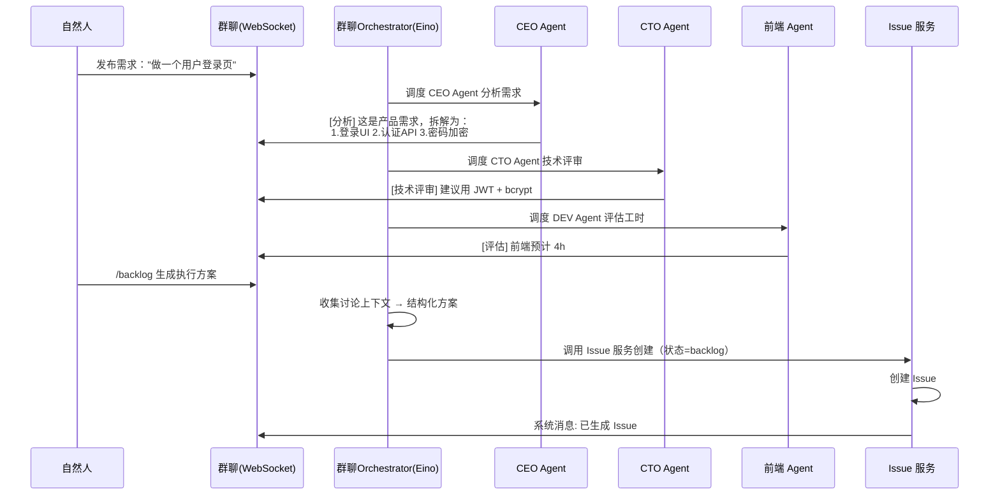
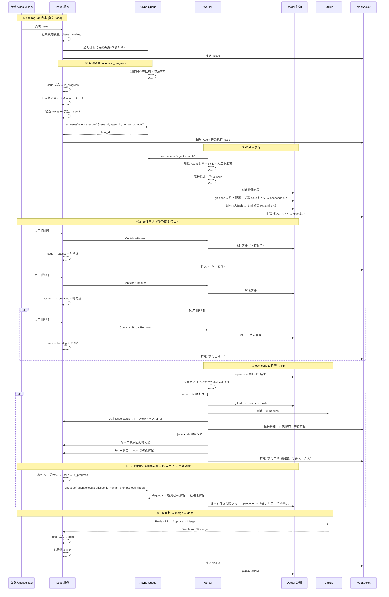

# 核心业务流程

## 十、核心业务流程

### 10.1 需求讨论 → /backlog 自动生成 Issue



**Tab 视图操作**（backlog → 确认/编辑 → 转为 todo）：

```
┌─ 项目 Issues ──────────────────────────────────────────────────────────────────┐
│  [ backlog 3 ]   todo 5    in_progress 2    in_review 1    done 12            │
├────────────────────────────────────────────────────────────────────────────────┤
│  ← 当前选中 backlog Tab，下面只展示 backlog 状态的 Issue                           │
│                                                                                │
│  ☐ Issue #1  实现用户登录页面                        P1  前端Agent  12:00     │
│  │ 描述: 使用 React Hook Form + Zod 实现...          [转为 todo] [编辑]       │
│  │ ── 时间线 ─────────────────────────────────────────────────────────────── │
│  │ 12:00  system   /backlog 创建此 Issue                                      │
│  │ 12:05  张三     编辑了标题 + 补充验收标准                                     │
│  │ 12:06  system   Eino 优化了描述（补充了错误处理边界）                          │
│  ├────────────────────────────────────────────────────────────────────────────┤
│  ☐ Issue #2  JWT 认证 API 实现                       P0  后端Agent  11:30     │
│  │ 描述: 实现 JWT 签发/验证，token 格式需要 @Issue #1 的登录接口对接...          │
│  │        [转为 todo] [编辑]                                                    │
│  ├────────────────────────────────────────────────────────────────────────────┤
│  ☐ Issue #3  密码加密存储                            P0  后端Agent  11:28     │
│  │ 描述: 使用 bcrypt 对密码加盐哈希...      [转为 todo] [编辑]                  │
│  └────────────────────────────────────────────────────────────────────────────┘
│                                                                                │
│  ☑ 已选 3 个  [一键转为 todo]  [批量编辑优先级]                                 │
└────────────────────────────────────────────────────────────────────────────────┘
```

点击 `todo 5` 标签后，列表切换为：

```
│  [ backlog 3 ]  [ todo 5 ]  in_progress 2    in_review 1    done 12          │
├────────────────────────────────────────────────────────────────────────────────┤
│  ← 当前选中 todo Tab，下面只展示 todo 状态的 Issue                                  │
│                                                                                │
│  Issue #4  API 接口文档编写                            P2  后端Agent  11:50    │
│  │ 状态: 排队中（第 2 位），预估等待 3 分钟                                       │
│  │ 时间线: 11:50 转为 todo · 11:50 加入调度队列                                   │
│  ├────────────────────────────────────────────────────────────────────────────┤
│  Issue #5  单元测试补充                              P2  前端Agent  11:40    │
│  │ 状态: 排队中（第 3 位）                                                       │
│  └────────────────────────────────────────────────────────────────────────────┘
```

> 每个 Tab 的数字表示该状态的 Issue 数量，实时更新。当前选中的 Tab 高亮显示。

**Tab 设计要点**：

| 特性 | 说明 |
|------|------|
| 顶部 Tab 栏 | 按状态分页，Tab 上显示各状态的 Issue 数量 |
| 当前 Tab | 默认进入 `backlog` Tab，展开第一个 Issue 的时间线 |
| Issue 行 | 可展开/折叠，展开后显示描述摘要 + 最近 3 条时间线 |
| 转为 todo | 按钮操作（非拖动），确认后 Issue 移入 todo Tab |
| 批量操作 | 勾选多行 → 一键批量转 todo / 批量编辑优先级 |
| 状态流转 | todo Tab 中 Issue 会自动消失（调度器转为 in_progress 后移到对应 Tab） |

**Issue 编辑能力**（backlog / todo 阶段均可）：

| 操作 | 说明 |
|------|------|
| 编辑标题/描述 | 直接修改，写入 `issue_timeline`（event_type=system_note） |
| Eino 优化描述 | 调用 Eino 阅读描述 → 识别模糊点 → 补充技术细节、验收条件、边界情况 → 输出优化版 |
| 调整优先级 | P0-P4 下拉切换 |
| 修改负责人 | 重新分配 Agent 或自然人 |
| 删除 Issue | 仅 backlog 状态可删除 |
| 批量转 todo | Shift/Ctrl 多选 backlog Issue（来自多次 /backlog 调用）→ 一键全部转为 todo 列入执行队列 |
| @关联 Issue | 描述中通过 `@Issue #N` 引用其他 Issue，Eino Agent 自动读取被引用 Issue 的内容注入到 opencode 执行提示词 |

### 10.2 Agent 自动执行（backlog→todo→in_progress→in_review→done）



**状态流转规则**：

| 状态 | 触发方式 | 下一状态 | 触发条件 |
|------|---------|---------|---------|
| `backlog` | `/backlog` 指令自动创建 | `todo` | **人工点击 [转为 todo] 按钮** |
| `todo` | 人工从 backlog 转为 todo | `in_progress` | 系统自动调度（按优先级+排队顺序） |
| `in_progress` | 系统自动 | `in_review` | opencode 检查通过 + PR 创建成功 |
| `in_progress` | 系统自动 | `paused` | 人工点击 [暂停] |
| `in_progress` | 系统自动 | `backlog` | 人工点击 [停止]（终止容器 + 销毁沙箱） |
| `paused` | 人工暂停 | `in_progress` | 人工点击 [恢复]（解冻沙箱，从断点继续） |
| `paused` | 人工暂停 | `backlog` | 人工点击 [停止]（终止容器 + 销毁沙箱） |
| `in_progress` | 系统自动 / 人工恢复 | `todo` | opencode 检查失败 → 保留沙箱 → 等待人工提示词 |
| `in_review` | opencode 检查通过后 | `done` | GitHub Webhook 通知 PR 已 merge → 销毁沙箱 |
| `in_review` | opencode 检查通过后 | `todo` | PR 被拒绝 → 人工追加提示词 → Eino 优化 → 复用沙箱重新执行 |

**人工提示词介入机制**：

Issue 的时间线面板允许自然人在任意阶段追加提示词，直接干预 opencode 的下一步执行：

```
┌─────────────────────────────────────────────────────────┐
│  Issue 时间线                                            │
│  ┌───────────────────────────────────────────────────┐  │
│  │ 12:00  system   状态变更: backlog → todo           │  │
│  │ 12:01  system   状态变更: todo → in_progress       │  │
│  │ 12:02  agent    开始编码: 正在读取 Issue 描述...    │  │
│  │ 12:05  agent    生成文件: src/login.tsx             │  │
│  │ 12:08  agent    运行测试: 2 passed, 1 failed       │  │
│  │ ─────────────────────────────────────────────      │  │
│  │ 12:09  张三     提示词: "login.tsx 的密码框需要     │  │
│  │                 autocomplete='new-password'"        │  │
│  │ 12:09  system   收到人工提示词，重新执行 opencode    │  │
│  │ 12:12  agent    修复完成: lint + test 全部通过      │  │
│  └───────────────────────────────────────────────────┘  │
│                                                         │
│  ┌─ 追加提示词 ──────────────────────────────────────┐  │
│  │ [                    ]  [发送并重新执行]            │  │
│  └──────────────────────────────────────────────────┘  │
└─────────────────────────────────────────────────────────┘
```

**实现**：

- `POST /api/orgs/:org_id/projects/:project_id/issues/:issue_id/prompt` → 写入 `issue_timeline`（event_type=human_prompt）
- Issue 服务收到人工提示词后调用 `prompt_optimizer.Enhance()`（Eino 优化改写）
- 优化后的提示词写入时间线，触发 Issue 重新进入 in_progress
- Worker 检测到已有沙箱容器（`issue_id → container_id` 映射），复用旧沙箱继续执行
- opencode 基于上次工作区状态 + 优化提示词继续编码
- Issue done 后销毁沙箱，释放资源
- opencode 重新执行时保留之前的 `issue_timeline` 日志记录

**GitHub Webhook 处理器**：

```go
// internal/handler/webhook.go
func (h *WebhookHandler) HandleGitHub(c *gin.Context) {
    event := c.GetHeader("X-GitHub-Event")
    if event != "pull_request" { return }

    var payload github.PullRequestEvent
    c.ShouldBindJSON(&payload)

    if payload.Action == "closed" && payload.PullRequest.Merged {
        // ① PR 已合并 → Issue done
        issue := h.issueRepo.FindByPRURL(payload.PullRequest.HTMLURL)
        h.issueRepo.UpdateStatus(issue.ID, "done")
        h.timelineRepo.Append(issue.ID, "system", "status_change",
            "in_review", "done", "PR merged by @"+payload.Sender.Login)
        // 销毁沙箱容器 + 清空 container_id
        if issue.SandboxContainerID != "" {
            h.sandbox.Destroy(ctx, issue.SandboxContainerID)
            h.issueRepo.ClearContainerID(issue.ID)
        }
        h.ws.SendToProject(issue.ProjectID, "Issue #%d 已完成", issue.ID)
        h.notification.NotifyIssueStatusChanged(ctx, issue, issue.CreatedBy)
        return
    }

    if payload.Action == "closed" && !payload.PullRequest.Merged {
        // ② PR 被拒绝（closed but not merged）→ Issue 回到 todo
        issue := h.issueRepo.FindByPRURL(payload.PullRequest.HTMLURL)
        rejectReason := fmt.Sprintf("PR #%d rejected by @%s",
            payload.PullRequest.Number, payload.Sender.Login)

        h.issueRepo.UpdateStatus(issue.ID, "todo")
        h.timelineRepo.Append(issue.ID, "system", "status_change",
            "in_review", "todo", rejectReason)

        // 保留沙箱容器（不销毁），后续人工提示词可复用上次工作区
        h.ws.SendToProject(issue.ProjectID,
            "Issue #%d PR 被拒绝，已退回 todo。可在时间线追加提示词后重新执行。", issue.ID)
        h.notification.NotifyIssueStatusChanged(ctx, issue, issue.CreatedBy)
        return
    }
}
```

> **PR 被拒绝的处理策略**：
> - 沙箱容器**保留不销毁**，后续人工追加提示词 → 重新入队时复用旧沙箱，基于上次工作区继续修改
> - 如果管理员判断 PR 方向完全错误需要重来，可通过 Issue 详情页 **[停止]** 按钮手动销毁沙箱后重新编辑
> - 状态流转：`in_review → todo`（而非 backlog），表示仍需处理但保留已有上下文

> GitHub Webhook 需在项目关联的 GitHub 仓库中配置 Payload URL: `https://<host>/api/webhook/github`，Events: `Pull requests`。

---
