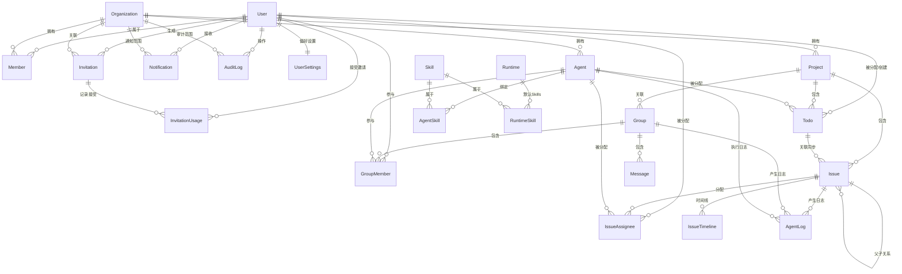

# 数据模型与接口

## 九、核心数据模型

### 9.0 角色与权限管理（RBAC）

AnserFlow 采用双层 RBAC 模型：**系统级角色** + **组织级角色**，由 Casbin 统一管理策略，MySQL 存储策略表，运行时动态加载。

#### 角色体系

```
┌─────────────────────────────────────────────────┐
│  系统级 (System-Level)                           │
│  ┌───────────────────────────────────────────┐  │
│  │  super_admin  平台超级管理员                │  │
│  │  • 管理所有组织/用户/Agent                  │  │
│  │  • 系统配置（邮件/LLM/存储）                │  │
│  │  • 查看审计日志                            │  │
│  └───────────────────────────────────────────┘  │
├─────────────────────────────────────────────────┤
│  组织级 (Organization-Level)                     │
│  ┌──────────────┐ ┌──────────────┐             │
│  │ owner        │ │ admin        │  member     │
│  │ • 完全控制    │ │ • 管理资源   │  • 只读协作 │
│  │ • 删除组织    │ │ • 邀请成员   │  • 查看     │
│  │ • 转移所有权  │ │ • 管理项目   │  • 评论     │
│  │ • 所有CRUD   │ │ • 管理Agent  │  • 创建Issue│
│  └──────────────┘ └──────────────┘             │
└─────────────────────────────────────────────────┘
```

| 层级 | 角色 | 权限范围 | 典型用户 |
|------|------|---------|----------|
| 系统 | `super_admin` | 全平台 | 平台运营者 |
| 组织 | `owner` | 单个组织完全控制 | 组织创建者 |
| 组织 | `admin` | 单个组织管理 | 团队负责人 |
| 组织 | `member` | 单个组织协作 | 普通成员 |

#### 权限矩阵

Casbin 使用 `(sub, obj, act)` 模型：`主体 + 资源 + 操作`。

```ini
# config/rbac_model.conf
[request_definition]
r = sub, obj, act

[policy_definition]
p = sub, obj, act

[role_definition]
g = _, _

[policy_effect]
e = some(where (p.eft == allow))

[matchers]
m = g(r.sub, p.sub) && keyMatch(r.obj, p.obj) && regexMatch(r.act, p.act)
```

| 资源 (obj) | 操作 (act) | owner | admin | member |
|-----------|-----------|-------|-------|--------|
| `org` | `read` / `update` / `delete` | ✅ | ❌ | ❌ |
| `org` | `read` | ✅ | ✅ | ✅ |
| `member` | `invite` / `remove` / `update_role` | ✅ | ✅ | ❌ |
| `member` | `list` | ✅ | ✅ | ✅ |
| `project` | `create` / `update` / `delete` | ✅ | ✅ | ❌ |
| `project` | `read` / `list` | ✅ | ✅ | ✅ |
| `issue` | `create` / `update` / `delete` | ✅ | ✅ | ✅(仅自己) |
| `issue` | `read` / `list` | ✅ | ✅ | ✅ |
| `issue` | `assign` / `change_status` | ✅ | ✅ | ❌ |
| `agent` | `create` / `update` / `delete` | ✅ | ✅ | ❌ |
| `agent` | `read` / `list` | ✅ | ✅ | ✅ |
| `skill` | `create` / `update` / `delete` | ✅ | ✅ | ❌ |
| `skill` | `read` / `list` | ✅ | ✅ | ✅ |
| `group` | `create` / `manage` | ✅ | ✅ | ❌ |
| `group` | `read` / `send_message` | ✅ | ✅ | ✅ |
| `webhook` | `manage` | ✅ | ✅ | ❌ |
| `settings` | `manage` | ✅ | ✅ | ❌ |

#### 数据库设计

```sql
-- Casbin 策略表（MySQL 存储）
CREATE TABLE casbin_rules (
    id BIGINT PRIMARY KEY AUTO_INCREMENT,
    ptype VARCHAR(12) NOT NULL,   -- 'p' 或 'g'
    v0 VARCHAR(256),              -- sub / 角色名
    v1 VARCHAR(256),              -- obj / 资源
    v2 VARCHAR(256),              -- act / 操作
    v3 VARCHAR(256),
    v4 VARCHAR(256),
    v5 VARCHAR(256),
    created_at DATETIME DEFAULT CURRENT_TIMESTAMP
);

-- 预置策略数据（存储在 internal/seed/002_casbin_policies.sql，anserflow migrate --seed 时自动执行）
-- 组织所有权关系（用户创建组织时动态写入）
INSERT INTO casbin_rules (ptype, v0, v1) VALUES
    ('g', '1', 'org:1:owner'),     -- 用户 1 是组织 1 的 owner
    ('g', '2', 'org:1:admin'),     -- 用户 2 是组织 1 的 admin
    ('g', '3', 'org:1:member');    -- 用户 3 是组织 1 的 member

-- 角色权限策略
INSERT INTO casbin_rules (ptype, v0, v1, v2) VALUES
    -- owner: 完全控制
    ('p', 'org_role:owner',   'org:*',    '(read)|(update)|(delete)'),
    ('p', 'org_role:owner',   'member:*', '(invite)|(remove)|(update_role)|(list)'),
    ('p', 'org_role:owner',   'project:*','(create)|(read)|(update)|(delete)'),
    ('p', 'org_role:owner',   'issue:*',  '(create)|(read)|(update)|(delete)|(assign)|(change_status)'),
    ('p', 'org_role:owner',   'agent:*',  '(create)|(read)|(update)|(delete)'),
    ('p', 'org_role:owner',   'skill:*',  '(create)|(read)|(update)|(delete)'),
    ('p', 'org_role:owner',   'group:*',  '(create)|(read)|(manage)|(send_message)'),
    ('p', 'org_role:owner',   'webhook:*','(manage)'),
    ('p', 'org_role:owner',   'settings:*','(manage)'),
    -- admin: 管理权限（不含删除组织/转移所有权）
    ('p', 'org_role:admin',   'org:*',    '(read)'),
    ('p', 'org_role:admin',   'member:*', '(invite)|(remove)|(update_role)|(list)'),
    ('p', 'org_role:admin',   'project:*','(create)|(read)|(update)|(delete)'),
    ('p', 'org_role:admin',   'issue:*',  '(create)|(read)|(update)|(delete)|(assign)|(change_status)'),
    ('p', 'org_role:admin',   'agent:*',  '(create)|(read)|(update)|(delete)'),
    ('p', 'org_role:admin',   'skill:*',  '(create)|(read)|(update)|(delete)'),
    ('p', 'org_role:admin',   'group:*',  '(create)|(read)|(manage)|(send_message)'),
    ('p', 'org_role:admin',   'webhook:*','(manage)'),
    ('p', 'org_role:admin',   'settings:*','(manage)'),
    -- member: 只读 + 创建 Issue + 发送消息
    ('p', 'org_role:member',  'org:*',    '(read)'),
    ('p', 'org_role:member',  'member:*', '(list)'),
    ('p', 'org_role:member',  'project:*','(read)'),
    ('p', 'org_role:member',  'issue:*',  '(create)|(read)|(update)'),
    ('p', 'org_role:member',  'agent:*',  '(read)'),
    ('p', 'org_role:member',  'skill:*',  '(read)'),
    ('p', 'org_role:member',  'group:*',  '(read)|(send_message)');

-- 角色继承：admin 继承 member 权限，owner 继承 admin 权限
INSERT INTO casbin_rules (ptype, v0, v1) VALUES
    ('g', 'org_role:admin',  'org_role:member'),
    ('g', 'org_role:owner',  'org_role:admin');

-- super_admin 全局策略
INSERT INTO casbin_rules (ptype, v0, v1, v2) VALUES
    ('p', 'role:super_admin', '*', '(read)|(write)|(delete)|(manage)');
```

#### Go 中间件集成

Casbin 作为 Gin 中间件，在每个 API 请求前校验权限：

```go
// internal/middleware/rbac.go
package middleware

import (
    "net/http"
    "strconv"

    "github.com/casbin/casbin/v2"
    gormadapter "github.com/casbin/gorm-adapter/v3"
    "github.com/gin-gonic/gin"
)

var enforcer *casbin.Enforcer

func InitRBAC(dsn string) error {
    adapter, err := gormadapter.NewAdapter("mysql", dsn)
    if err != nil {
        return err
    }
    enforcer, err = casbin.NewEnforcer("config/rbac_model.conf", adapter)
    if err != nil {
        return err
    }
    return enforcer.LoadPolicy()
}

// RequirePermission 中间件：检查当前用户是否有资源操作权限
// 用法: r.POST("/api/orgs/:org_id/projects", RequirePermission("project", "create"))
func RequirePermission(obj, act string) gin.HandlerFunc {
    return func(c *gin.Context) {
        userID := c.GetInt64("user_id")        // JWT 中间件注入
        orgID := c.Param("org_id")             // 路径参数

        sub := buildSubject(userID, orgID)      // "user:123@org:1"

        ok, err := enforcer.Enforce(sub, obj, act)
        if err != nil || !ok {
            c.JSON(http.StatusForbidden, gin.H{
                "code":    "ERR_PERMISSION_DENIED",
                "message": "权限不足",
            })
            c.Abort()
            return
        }
        c.Next()
    }
}

// 构建主体标识
func buildSubject(userID int64, orgID string) string {
    return "user:" + strconv.FormatInt(userID, 10) + "@org:" + orgID
}

// GetUserRole 获取用户在组织中的角色
func GetUserRole(userID int64, orgID uint) string {
    roles, _ := enforcer.GetRolesForUser(
        buildSubject(userID, strconv.Itoa(int(orgID))),
    )
    for _, role := range roles {
        switch {
        case role == "org_role:owner":
            return "owner"
        case role == "org_role:admin":
            return "admin"
        case role == "org_role:member":
            return "member"
        }
    }
    return ""
}
```

#### 路由权限配置

```go
// internal/handler/router.go
func SetupRoutes(r *gin.Engine) {
    api := r.Group("/api")
    api.Use(middleware.JWTAuth())           // ① 先鉴权（JWT）

    // ── 组织管理（仅 owner） ──
    org := api.Group("/orgs/:org_id")
    {
        org.PUT("", middleware.RequirePermission("org", "update"))
        org.DELETE("", middleware.RequirePermission("org", "delete"))

        // ── 成员管理（owner / admin） ──
        org.POST("/members/invite", middleware.RequirePermission("member", "invite"))
        org.DELETE("/members/:user_id", middleware.RequirePermission("member", "remove"))

        // ── 项目管理 ──
        org.POST("/projects", middleware.RequirePermission("project", "create"))
        project := org.Group("/projects/:project_id")
        {
            project.PUT("", middleware.RequirePermission("project", "update"))
            project.DELETE("", middleware.RequirePermission("project", "delete"))

            // Issue (member 可创建/编辑自己的)
            project.POST("/issues", middleware.RequirePermission("issue", "create"))
            project.PUT("/issues/:issue_id", middleware.RequirePermission("issue", "update"))
        }

        // ── Agent 管理（owner / admin） ──
        org.POST("/agents", middleware.RequirePermission("agent", "create"))
        org.PUT("/agents/:agent_id", middleware.RequirePermission("agent", "update"))
        org.DELETE("/agents/:agent_id", middleware.RequirePermission("agent", "delete"))

        // ── 组织设置 ──
        org.PUT("/settings", middleware.RequirePermission("settings", "manage"))
    }
}
```

#### 前端权限控制

```tsx
// packages/shared-ui/src/lib/use-permission.ts
import { useQuery } from '@tanstack/react-query'

interface UserRole {
  orgRole: 'owner' | 'admin' | 'member' | ''
  isSuperAdmin: boolean
}

// 获取当前用户在指定组织中的角色
function useOrgRole(orgId: string): UserRole {
  return useQuery({
    queryKey: ['user-role', orgId],
    queryFn: () => fetch(`/api/orgs/${orgId}/my-role`).then(r => r.json()),
    staleTime: 5 * 60 * 1000,
  }).data ?? { orgRole: '', isSuperAdmin: false }
}

// 权限检查 Hook
export function useCan(orgId: string, action: string): boolean {
  const { orgRole, isSuperAdmin } = useOrgRole(orgId)

  if (isSuperAdmin) return true

  const permissions: Record<string, string[]> = {
    'project:create': ['owner', 'admin'],
    'project:delete': ['owner', 'admin'],
    'member:invite': ['owner', 'admin'],
    'org:delete':    ['owner'],
    'settings:manage':['owner', 'admin'],
  }

  return permissions[action]?.includes(orgRole) ?? false
}
```

```tsx
// 条件渲染按钮
import { useCan } from '@/lib/use-permission'

function ProjectHeader({ orgId }: { orgId: string }) {
  const canCreate = useCan(orgId, 'project:create')

  return (
    <div>
      {canCreate && (
        <Button onClick={openCreateDialog}>创建项目</Button>
      )}
    </div>
  )
}
```

#### 权限变更流程

```
┌─────────┐    ┌──────────┐    ┌──────────────┐
│ 操作者   │    │  API      │    │  Casbin       │
│ (owner)  │    │  Service  │    │  (MySQL)      │
└────┬────┘    └────┬─────┘    └──────┬───────┘
     │              │                 │
     │ PUT /members/3/role          │
     │ body: {"role": "admin"}      │
     │─────────────>│                │
     │              │                │
     │              │ ① 校验操作者    │
     │              │   是 org owner  │
     │              │                │
     │              │ ② 更新 members  │
     │              │   表 role 字段  │
     │              │                │
     │              │ ③ 修改 Casbin   │
     │              │   g 策略:       │
     │              │   user:3 →      │
     │              │   org_role:admin│
     │              │───────────────>│
     │              │                │
     │              │ ④ LoadPolicy() │
     │              │   即时生效      │
     │<─────────────│                │
     │  200 OK      │                │
```

#### 数据一致性保障

`members.role` 字段作为冗余缓存，必须与 Casbin g 策略保持同步：

```go
// internal/service/member_service.go
func (s *MemberService) UpdateRole(ctx context.Context, orgID, userID uint, newRole string) error {
    // ① 更新 members.role 冗余字段
    if err := s.memberRepo.UpdateRole(ctx, orgID, userID, newRole); err != nil {
        return err
    }

    // ② 更新 Casbin g 策略（删除旧角色 + 添加新角色）
    subject := fmt.Sprintf("user:%d@org:%d", userID, orgID)
    // 先删除该用户在组织中的所有旧角色
    s.enforcer.RemoveFilteredGroupingPolicy(0, subject)
    // 添加新角色
    s.enforcer.AddGroupingPolicy(subject, "org_role:"+newRole)

    // ③ Casbin 重新加载策略（当前实例即时生效）
    s.enforcer.LoadPolicy()

    // ④ Redis Pub/Sub 通知其他实例重新加载
    s.redis.Publish(ctx, "casbin:policy_changed", fmt.Sprintf("%d:%d:%s", orgID, userID, newRole))

    return nil
}
```

**定期一致性校验**（每 30 分钟，防止异常导致的 drift）：

```go
// internal/service/consistency_checker.go
func (c *ConsistencyChecker) Run(ctx context.Context) {
    ticker := time.NewTicker(30 * time.Minute)
    for range ticker.C {
        c.checkMembersRoles(ctx)
    }
}

func (c *ConsistencyChecker) checkMembersRoles(ctx context.Context) {
    // 全量比对 members.role vs Casbin g 策略
    members := c.memberRepo.FindAll(ctx)
    for _, m := range members {
        casbinRoles := c.enforcer.GetRolesForUser(
            fmt.Sprintf("user:%d@org:%d", m.UserID, m.OrgID),
        )
        expectedRole := ""
        for _, r := range casbinRoles {
            switch {
            case strings.Contains(r, "owner"):
                expectedRole = "owner"
            case strings.Contains(r, "admin"):
                expectedRole = "admin"
            case strings.Contains(r, "member"):
                expectedRole = "member"
            }
        }
        // 不一致时以 Casbin 为准修复 members 表
        if expectedRole != "" && m.Role != expectedRole {
            c.memberRepo.UpdateRole(ctx, m.OrgID, m.UserID, expectedRole)
            c.logger.Warn("role drift fixed",
                zap.Uint("org_id", m.OrgID),
                zap.Uint("user_id", m.UserID),
                zap.String("was", m.Role),
                zap.String("now", expectedRole),
            )
        }
    }
}
```

> **冲突仲裁**：以 Casbin 策略为准。`members.role` 只是冗余缓存，仅用于前端快速展示角色（避免每次都查 Casbin），不参与权限判断。

### 9.1 ER 关系图



### 9.2 关键表 DDL

```sql
-- 用户表（自然人）
CREATE TABLE users (
    id BIGINT PRIMARY KEY AUTO_INCREMENT,
    username VARCHAR(64) NOT NULL UNIQUE,
    email VARCHAR(128),
    password_hash VARCHAR(256),
    avatar_url VARCHAR(512),
    github_id VARCHAR(64),
    locale VARCHAR(10) DEFAULT 'zh-CN',
    is_super_admin TINYINT(1) DEFAULT 0,        -- 平台超级管理员（替代原 role 字段）
    created_at DATETIME DEFAULT CURRENT_TIMESTAMP,
    updated_at DATETIME DEFAULT CURRENT_TIMESTAMP ON UPDATE CURRENT_TIMESTAMP
);

-- 组织
CREATE TABLE organizations (
    id BIGINT PRIMARY KEY AUTO_INCREMENT,
    name VARCHAR(128) NOT NULL,
    owner_id BIGINT NOT NULL,
    created_at DATETIME DEFAULT CURRENT_TIMESTAMP,
    FOREIGN KEY (owner_id) REFERENCES users(id)
);

-- 成员（组织级角色由此表 + Casbin 双重管理）
CREATE TABLE members (
    id BIGINT PRIMARY KEY AUTO_INCREMENT,
    org_id BIGINT NOT NULL,
    user_id BIGINT NOT NULL,
    role ENUM('owner','admin','member') DEFAULT 'member',  -- 冗余字段，与 Casbin g 策略同步
    UNIQUE KEY (org_id, user_id),
    FOREIGN KEY (org_id) REFERENCES organizations(id),
    FOREIGN KEY (user_id) REFERENCES users(id)
);

-- 运行时注册表（Agent 执行引擎配置）
CREATE TABLE runtimes (
    id BIGINT PRIMARY KEY AUTO_INCREMENT,
    name VARCHAR(32) NOT NULL UNIQUE,     -- 标识: opencode / claude-code / custom
    display_name VARCHAR(64) NOT NULL,    -- 显示名: OpenCode / Claude Code
    description TEXT,                     -- 描述
    docker_image VARCHAR(256) NOT NULL,   -- Docker 镜像
    install_cmd VARCHAR(512),             -- Dockerfile 中安装命令（空=预装在镜像中）
    execute_template TEXT NOT NULL,       -- 执行命令模板（支持变量: {model} {agent} {prompt}）
    config_schema JSON NOT NULL,          -- 配置项 JSON Schema（前端动态生成表单）
    default_config JSON NOT NULL,         -- 默认配置
    is_builtin TINYINT(1) DEFAULT 0,     -- 是否系统内置（内置运行时不可删除）
    enabled TINYINT(1) DEFAULT 1,
    created_at DATETIME DEFAULT CURRENT_TIMESTAMP,
    updated_at DATETIME DEFAULT CURRENT_TIMESTAMP ON UPDATE CURRENT_TIMESTAMP
);

-- 预置运行时: opencode
INSERT INTO runtimes (name, display_name, description, docker_image, install_cmd, execute_template, config_schema, default_config, is_builtin) VALUES
('opencode', 'OpenCode', '开源 AI 编码代理，TypeScript，160k+ Stars',
 'ghcr.io/anserflow/sandbox:latest',
 'npm install -g opencode-ai@latest',
 'opencode run "{prompt}" --model {provider}/{model} --agent {agent} --dangerously-skip-permissions',
 '{"type":"object","properties":{"provider":{"type":"string","enum":["openai","anthropic","google","deepseek"]},"model":{"type":"string"},"agent":{"type":"string","enum":["build","plan"]},"api_key_encrypted":{"type":"string"},"max_iterations":{"type":"number","default":20},"thinking":{"type":"boolean","default":true}}}',
 '{"provider":"openai","model":"gpt-4o","agent":"build","max_iterations":20,"thinking":true}',
 1);

-- Agent 定义
CREATE TABLE agents (
    id BIGINT PRIMARY KEY AUTO_INCREMENT,
    org_id BIGINT NOT NULL,
    name VARCHAR(64) NOT NULL,
    role_label VARCHAR(64),            -- 用户自定义角色标签
    system_prompt TEXT NOT NULL,       -- Agent 人设
    runtime_id BIGINT NOT NULL DEFAULT 1,  -- 绑定运行时（默认=opencode）
    runtime_config JSON,               -- 覆盖运行时默认配置（API Key、模型等）
    enabled TINYINT(1) DEFAULT 1,
    created_at DATETIME DEFAULT CURRENT_TIMESTAMP,
    updated_at DATETIME DEFAULT CURRENT_TIMESTAMP ON UPDATE CURRENT_TIMESTAMP,
    FOREIGN KEY (org_id) REFERENCES organizations(id),
    FOREIGN KEY (runtime_id) REFERENCES runtimes(id)
);

-- Agent 执行日志（org_id 为冗余设计，避免跨表 JOIN agents 读取，便于按组织聚合统计）
CREATE TABLE agent_logs (
    id BIGINT PRIMARY KEY AUTO_INCREMENT,
    org_id BIGINT NOT NULL,
    agent_id BIGINT NOT NULL,
    issue_id BIGINT NULL,               -- 关联 Issue（非空表示编码执行）
    group_id BIGINT NULL,               -- 关联群聊（非空表示讨论参与）
    type ENUM('discuss','execute','system') NOT NULL,  -- 日志类型
    action VARCHAR(64) NOT NULL,        -- 具体动作: invoke_llm / clone_repo / commit / create_pr / error
    status ENUM('running','success','failed','timeout') DEFAULT 'running',
    input JSON,                         -- 输入上下文（prompt / issue 信息）
    output JSON,                        -- 输出结果
    error_message TEXT,                 -- 错误信息
    token_usage JSON,                   -- Token 用量: {prompt_tokens, completion_tokens}
    duration_ms INT,                    -- 执行耗时（毫秒）
    started_at DATETIME,
    finished_at DATETIME,
    created_at DATETIME DEFAULT CURRENT_TIMESTAMP,
    INDEX idx_agent_time (agent_id, created_at),
    INDEX idx_issue (issue_id),
    FOREIGN KEY (org_id) REFERENCES organizations(id),
    FOREIGN KEY (agent_id) REFERENCES agents(id),
    FOREIGN KEY (issue_id) REFERENCES issues(id),
    FOREIGN KEY (group_id) REFERENCES groups(id)
);

-- Skills 定义
CREATE TABLE skills (
    id BIGINT PRIMARY KEY AUTO_INCREMENT,
    org_id BIGINT,                      -- NULL=系统全局
    name VARCHAR(64) NOT NULL,
    description TEXT,
    source_type ENUM('manual','zip') DEFAULT 'manual',
    definition TEXT NOT NULL,           -- Markdown 内容
    zip_hash VARCHAR(64),              -- ZIP 的 SHA256
    file_tree JSON,                    -- ZIP 文件树
    enabled TINYINT(1) DEFAULT 1,      -- 全局开关
    is_builtin TINYINT(1) DEFAULT 0,   -- 是否系统内置（内置 Skill 不可删除，如 flowcode-executor）
    created_at DATETIME DEFAULT CURRENT_TIMESTAMP,
    updated_at DATETIME DEFAULT CURRENT_TIMESTAMP ON UPDATE CURRENT_TIMESTAMP
);

-- Agent-Skill 绑定
CREATE TABLE agent_skills (
    id BIGINT PRIMARY KEY AUTO_INCREMENT,
    agent_id BIGINT NOT NULL,
    skill_id BIGINT NOT NULL,
    enabled TINYINT(1) DEFAULT 1,      -- 该 Agent 是否启用该 Skill
    UNIQUE KEY (agent_id, skill_id),
    FOREIGN KEY (agent_id) REFERENCES agents(id),
    FOREIGN KEY (skill_id) REFERENCES skills(id)
);

-- Runtime-Skill 默认绑定（Agent 继承该运行时的默认 Skill，可在 Agent 级覆盖关闭）
CREATE TABLE runtime_skills (
    id BIGINT PRIMARY KEY AUTO_INCREMENT,
    runtime_id BIGINT NOT NULL,
    skill_id BIGINT NOT NULL,
    enabled TINYINT(1) DEFAULT 1,      -- 该运行时是否启用此 Skill
    UNIQUE KEY (runtime_id, skill_id),
    FOREIGN KEY (runtime_id) REFERENCES runtimes(id),
    FOREIGN KEY (skill_id) REFERENCES skills(id)
);

-- 项目
CREATE TABLE projects (
    id BIGINT PRIMARY KEY AUTO_INCREMENT,
    org_id BIGINT NOT NULL,
    name VARCHAR(128) NOT NULL,
    description TEXT,
    git_platform ENUM('github','gitea','gitlab','gitee') DEFAULT 'github',  -- Git 平台
    git_repo_url VARCHAR(512),                                               -- 仓库地址
    git_repo_name VARCHAR(256),                                              -- 仓库名（org/repo）
    git_auth_type ENUM('http','ssh') DEFAULT 'http',                         -- 授权方式
    git_auth_credential TEXT,                                                   -- HTTP:Token / SSH:私钥 (RSA 4096 > 1024 字符)
    created_by BIGINT,
    created_at DATETIME DEFAULT CURRENT_TIMESTAMP,
    FOREIGN KEY (org_id) REFERENCES organizations(id),
    FOREIGN KEY (created_by) REFERENCES users(id)
);

-- Issue
CREATE TABLE issues (
    id BIGINT PRIMARY KEY AUTO_INCREMENT,
    project_id BIGINT NOT NULL,
    parent_id BIGINT NULL,              -- 子 Issue
    title VARCHAR(256) NOT NULL,
    description TEXT,
    status ENUM('backlog','todo','in_progress','paused','in_review','done') DEFAULT 'backlog',
    priority ENUM('p0','p1','p2','p3','p4') DEFAULT 'p2',
    source_group_id BIGINT,             -- 来源群聊
    source_message_id BIGINT,           -- 来源消息
    pr_url VARCHAR(512),                -- 关联 PR 链接（由 Worker 在创建 PR 后回写）
    sandbox_container_id VARCHAR(64),   -- Docker 容器 ID（首次执行时写入，重试时由此复用沙箱，done 后清空）
    created_by BIGINT,
    created_at DATETIME DEFAULT CURRENT_TIMESTAMP,
    updated_at DATETIME DEFAULT CURRENT_TIMESTAMP ON UPDATE CURRENT_TIMESTAMP,
    FOREIGN KEY (project_id) REFERENCES projects(id),
    FOREIGN KEY (parent_id) REFERENCES issues(id),
    FOREIGN KEY (created_by) REFERENCES users(id)
);

-- Issue 分配（v1: 一个 Issue 仅保留一个当前 assignee）
CREATE TABLE issue_assignee (
    id BIGINT PRIMARY KEY AUTO_INCREMENT,
    issue_id BIGINT NOT NULL,
    user_id BIGINT NULL,                -- 自然人
    agent_id BIGINT NULL,               -- Agent
    assigned_at DATETIME DEFAULT CURRENT_TIMESTAMP,
    UNIQUE KEY (issue_id),              -- v1: 一个 Issue 仅保留一个当前 assignee
    FOREIGN KEY (issue_id) REFERENCES issues(id),
    FOREIGN KEY (user_id) REFERENCES users(id),
    FOREIGN KEY (agent_id) REFERENCES agents(id),
    CHECK ((user_id IS NULL) <> (agent_id IS NULL))
);

-- Issue 状态时间线（记录全量状态变更 + 人工介入提示词）
CREATE TABLE issue_timeline (
    id BIGINT PRIMARY KEY AUTO_INCREMENT,
    issue_id BIGINT NOT NULL,
    actor_type ENUM('user','agent','system') NOT NULL,  -- 操作者
    actor_id BIGINT,                                     -- user_id / agent_id
    event_type ENUM('status_change','human_prompt','agent_log','system_note') NOT NULL,
    old_status VARCHAR(32),                              -- status_change 时记录旧状态
    new_status VARCHAR(32),                              -- status_change 时记录新状态
    comment TEXT,                                        -- 人工提示词 / Agent 日志摘要 / 系统备注
    metadata JSON,                                       -- 扩展信息（opencode 返回的日志/错误等）
    created_at DATETIME DEFAULT CURRENT_TIMESTAMP,
    INDEX idx_issue_time (issue_id, created_at),
    FOREIGN KEY (issue_id) REFERENCES issues(id)
);

-- 群组
CREATE TABLE groups (
    id BIGINT PRIMARY KEY AUTO_INCREMENT,
    org_id BIGINT NOT NULL,
    project_id BIGINT,                  -- 关联项目
    name VARCHAR(128) NOT NULL,
    created_by BIGINT,
    created_at DATETIME DEFAULT CURRENT_TIMESTAMP,
    FOREIGN KEY (org_id) REFERENCES organizations(id),
    FOREIGN KEY (project_id) REFERENCES projects(id)
);

-- 群成员
CREATE TABLE group_members (
    id BIGINT PRIMARY KEY AUTO_INCREMENT,
    group_id BIGINT NOT NULL,
    user_id BIGINT NULL,
    agent_id BIGINT NULL,
    joined_at DATETIME DEFAULT CURRENT_TIMESTAMP,
    UNIQUE KEY (group_id, user_id, agent_id),
    FOREIGN KEY (group_id) REFERENCES groups(id),
    FOREIGN KEY (user_id) REFERENCES users(id),
    FOREIGN KEY (agent_id) REFERENCES agents(id)
);

-- 群消息
CREATE TABLE messages (
    id BIGINT PRIMARY KEY AUTO_INCREMENT,
    group_id BIGINT NOT NULL,
    sender_type ENUM('user','agent') NOT NULL,
    sender_user_id BIGINT,
    sender_agent_id BIGINT,
    content TEXT NOT NULL,
    created_at DATETIME DEFAULT CURRENT_TIMESTAMP,
    FOREIGN KEY (group_id) REFERENCES groups(id),
    FOREIGN KEY (sender_user_id) REFERENCES users(id),
    FOREIGN KEY (sender_agent_id) REFERENCES agents(id)
);

-- 邀请表
CREATE TABLE invitations (
    id BIGINT PRIMARY KEY AUTO_INCREMENT,
    org_id BIGINT NOT NULL,
    role ENUM('admin','member') DEFAULT 'member',     -- 受邀角色
    token VARCHAR(64) NOT NULL UNIQUE,                 -- 邀请凭证
    invite_type ENUM('link','email') NOT NULL,         -- 分享链接 / 邮箱
    email VARCHAR(128),                                -- 邮箱邀请时必填
    created_by BIGINT NOT NULL,                        -- 邀请人
    max_uses INT DEFAULT 0,                            -- 0=不限制
    use_count INT DEFAULT 0,                           -- 已使用次数
    expires_at DATETIME,                               -- 过期时间
    created_at DATETIME DEFAULT CURRENT_TIMESTAMP,
    FOREIGN KEY (org_id) REFERENCES organizations(id),
    FOREIGN KEY (created_by) REFERENCES users(id)
);

-- 邀请使用记录
CREATE TABLE invitation_usages (
    id BIGINT PRIMARY KEY AUTO_INCREMENT,
    invitation_id BIGINT NOT NULL,
    user_id BIGINT NOT NULL,
    assigned_role ENUM('admin','member') NOT NULL,   -- 接受邀请时赋予的角色（快照）
    used_at DATETIME DEFAULT CURRENT_TIMESTAMP,
    FOREIGN KEY (invitation_id) REFERENCES invitations(id),
    FOREIGN KEY (user_id) REFERENCES users(id)
);

-- Todo 任务（拆解后的可执行单元）
CREATE TABLE todos (
    id BIGINT PRIMARY KEY AUTO_INCREMENT,
    project_id BIGINT NOT NULL,
    parent_id BIGINT NULL,              -- 子任务
    title VARCHAR(256) NOT NULL,
    description TEXT,
    status ENUM('todo','in_progress','done','blocked') DEFAULT 'todo',
    priority ENUM('p0','p1','p2','p3','p4') DEFAULT 'p2',
    assigned_agent_id BIGINT NULL,      -- 分配给 Agent
    assigned_user_id BIGINT NULL,       -- 分配给自然人
    estimated_hours DECIMAL(5,1),
    depends_on JSON NULL,               -- 依赖的 Todo ID 列表: [1, 3]
    acceptance_criteria TEXT,           -- 验收标准
    source ENUM('manual','agent_breakdown','import') DEFAULT 'manual',  -- 来源
    linked_issue_id BIGINT NULL,        -- 关联的 Issue（双向同步）
    created_by BIGINT,
    created_at DATETIME DEFAULT CURRENT_TIMESTAMP,
    updated_at DATETIME DEFAULT CURRENT_TIMESTAMP ON UPDATE CURRENT_TIMESTAMP,
    FOREIGN KEY (project_id) REFERENCES projects(id),
    FOREIGN KEY (parent_id) REFERENCES todos(id),
    FOREIGN KEY (assigned_agent_id) REFERENCES agents(id),
    FOREIGN KEY (assigned_user_id) REFERENCES users(id),
    FOREIGN KEY (linked_issue_id) REFERENCES issues(id),
    FOREIGN KEY (created_by) REFERENCES users(id)
);

-- Issue 与 Todo 的关系（设计说明）：
-- ┌──────────────────────────────────────────────────────────────┐
-- │  Issue（执行层）             Todo（规划层）                    │
-- │  ─────────────               ────────────                     │
-- │  粒度: 粗（功能级）          粒度: 细（子任务级）              │
-- │  流转: backlog→done          流转: todo→in_progress→done      │
-- │  关联: GitHub Issue          关联: 内部任务拆解                 │
-- │  来源: 群聊/backlog 指令         来源: Agent 拆解 / 手动创建    │
-- │                                                               │
-- │  关系: 一个 Issue 可以拆解为 N 个 Todo（linked_issue_id）     │
-- │        Todo 完成后可同步 Issue 进度                            │
-- │        L1-L4 先闭环 Issue 流程；Todo 模块为 Phase 2 能力       │
-- └──────────────────────────────────────────────────────────────┘

-- 审计日志
CREATE TABLE audit_logs (
    id BIGINT PRIMARY KEY AUTO_INCREMENT,
    org_id BIGINT NOT NULL,
    user_id BIGINT NULL,                -- 操作人（NULL 表示系统操作）
    action VARCHAR(64) NOT NULL,        -- 操作类型: issue.create / agent.update / member.invite
    resource_type VARCHAR(32) NOT NULL, -- 资源类型: issue / agent / project / member / skill
    resource_id BIGINT NOT NULL,        -- 资源 ID
    detail JSON,                        -- 变更详情（旧值/新值）
    ip VARCHAR(45),                     -- 操作 IP
    created_at DATETIME DEFAULT CURRENT_TIMESTAMP,
    INDEX idx_org_time (org_id, created_at),
    INDEX idx_action (action),
    FOREIGN KEY (org_id) REFERENCES organizations(id),
    FOREIGN KEY (user_id) REFERENCES users(id)
);

-- 通知
CREATE TABLE notifications (
    id BIGINT PRIMARY KEY AUTO_INCREMENT,
    org_id BIGINT NOT NULL,
    user_id BIGINT NOT NULL,            -- 接收人
    type VARCHAR(32) NOT NULL,          -- issue_assigned / issue_status_changed / agent_completed / mention / invite
    title VARCHAR(256) NOT NULL,
    body TEXT,
    resource_type VARCHAR(32),          -- 关联资源类型
    resource_id BIGINT,                 -- 关联资源 ID
    is_read TINYINT(1) DEFAULT 0,       -- 已读状态
    is_pushed TINYINT(1) DEFAULT 0,     -- 是否已推送（WS/原生/邮件）
    push_channel ENUM('websocket','native','email','none') DEFAULT 'none',
    created_at DATETIME DEFAULT CURRENT_TIMESTAMP,
    INDEX idx_user_read (user_id, is_read, created_at),
    FOREIGN KEY (org_id) REFERENCES organizations(id),
    FOREIGN KEY (user_id) REFERENCES users(id)
);

-- 用户偏好设置（locale 以 users.locale 为准，此处仅存通知/主题等非语言偏好）
CREATE TABLE user_settings (
    id BIGINT PRIMARY KEY AUTO_INCREMENT,
    user_id BIGINT NOT NULL UNIQUE,
    theme ENUM('light','dark','system') DEFAULT 'system',
    notify_issue_assigned TINYINT(1) DEFAULT 1,
    notify_agent_completed TINYINT(1) DEFAULT 1,
    notify_mention TINYINT(1) DEFAULT 1,
    notify_invite TINYINT(1) DEFAULT 1,
    notify_email TINYINT(1) DEFAULT 1,  -- 同时发送邮件通知
    updated_at DATETIME DEFAULT CURRENT_TIMESTAMP ON UPDATE CURRENT_TIMESTAMP,
    FOREIGN KEY (user_id) REFERENCES users(id)
);
```

### 9.3 邀请机制说明

**两种邀请方式**：

```
┌─────────────────────────────────────────────┐
│  分享链接邀请                                │
│  ┌───────────────────────────────────────┐  │
│  │ 管理员生成链接                         │  │
│  │ → POST /api/invitations               │  │
│  │   { type: "link", role: "member" }    │  │
│  │                                       │  │
│  │ → 返回: https://xxx/invite/abc123     │  │
│  │                                       │  │
│  │ 目标用户访问链接 → 注册/登录 →        │  │
│  │ 自动加入组织                           │  │
│  └───────────────────────────────────────┘  │
├─────────────────────────────────────────────┤
│  邮箱邀请                                    │
│  ┌───────────────────────────────────────┐  │
│  │ 管理员输入邮箱                         │  │
│  │ → POST /api/invitations               │  │
│  │   { type: "email", email: "u@x.com" } │  │
│  │                                       │  │
│  │ → 系统发送邮件（含邀请链接）            │  │
│  │ → 目标用户点击链接 → 注册/登录 →       │  │
│  │ 自动加入组织                           │  │
│  └───────────────────────────────────────┘  │
└─────────────────────────────────────────────┘
```

**安全控制**：

| 机制 | 说明 |
|------|------|
| Token 唯一 | 64 位随机字符串，不可猜测 |
| 过期时间 | 默认 7 天，管理员可设置 |
| 使用次数限制 | `max_uses` 控制，0=不限 |
| 角色预分配 | 受邀进入组织时自动分配角色 |
| 邮箱验证 | 邮箱邀请时验证邮箱归属 |

### 9.4 邮件服务

邮件发送采用 `gopkg.in/gomail.v2`，通过 SMTP 发送邀请邮件和系统通知。

```go
import "gopkg.in/gomail.v2"

func SendInviteEmail(to string, inviteLink string) error {
    m := gomail.NewMessage()
    m.SetHeader("From", "noreply@anserflow.io")
    m.SetHeader("To", to)
    m.SetHeader("Subject", "您被邀请加入 AnserFlow 组织")
    m.SetBody("text/html", fmt.Sprintf(`
        <p>点击以下链接接受邀请：</p>
        <a href="%s">%s</a>
        <p>链接 7 天内有效</p>
    `, inviteLink, inviteLink))

    d := gomail.NewDialer("smtp.example.com", 587, "username", "password")
    return d.DialAndSend(m)
}
```

**SMTP 配置**（存储在 config.yaml 中）：

| 配置项 | 说明 | 示例 |
|--------|------|------|
| `smtp.host` | SMTP 服务器地址 | `smtp.gmail.com` |
| `smtp.port` | 端口 | `587` |
| `smtp.username` | 发件账号 | `noreply@anserflow.io` |
| `smtp.password` | 授权码/密码 | — |
| `smtp.from` | 发件人显示名 | `"AnserFlow <noreply@anserflow.io>"` |
| `smtp.ssl` | 是否 SSL | `false` (STARTTLS) |

**邮件触发场景**：

| 场景 | 邮件内容 |
|------|---------|
| 邮箱邀请 | 含邀请链接，引导注册/登录后自动入组织 |
| Issue 状态变更 | 当 Issue 从 InReview→Done 或被退回时通知相关人 |
| Agent 执行完成 | PR 已提交 / 执行失败 通知 |
| 密码重置 | 密码重置链接 |

**双语邮件模板**：邮件服务根据用户语言偏好发送对应语言版本：

```go
// internal/email/sender.go
func (s *Sender) SendInviteEmail(
    to string,
    inviterName string,
    orgName string,
    inviteLink string,
    locale string, // "zh-CN" | "en-US"
) error {
    m := gomail.NewMessage()
    m.SetHeader("From", s.from)
    m.SetHeader("To", to)

    switch locale {
    case "zh-CN":
        m.SetHeader("Subject", fmt.Sprintf("%s 邀请你加入 AnserFlow 组织「%s」", inviterName, orgName))
        m.SetBody("text/html", fmt.Sprintf(`
            <h2>你被邀请加入组织</h2>
            <p><strong>%s</strong> 邀请你加入 <strong>%s</strong> 组织。</p>
            <p><a href="%s" style="display:inline-block;padding:12px 24px;background:#4F46E5;color:white;border-radius:6px;text-decoration:none;">接受邀请</a></p>
            <p style="color:#6B7280;">链接 7 天内有效</p>
        `, inviterName, orgName, inviteLink))
    default: // en-US
        m.SetHeader("Subject", fmt.Sprintf("%s invited you to join %s on AnserFlow", inviterName, orgName))
        m.SetBody("text/html", fmt.Sprintf(`
            <h2>You've been invited</h2>
            <p><strong>%s</strong> has invited you to join <strong>%s</strong>.</p>
            <p><a href="%s" style="display:inline-block;padding:12px 24px;background:#4F46E5;color:white;border-radius:6px;text-decoration:none;">Accept Invitation</a></p>
            <p style="color:#6B7280;">Link expires in 7 days</p>
        `, inviterName, orgName, inviteLink))
    }

    d := gomail.NewDialer(s.host, s.port, s.username, s.password)
    return d.DialAndSend(m)
}

func (s *Sender) SendAgentNotification(
    to string,
    agentName string,
    issueTitle string,
    success bool,
    locale string,
) error {
    // 类似双语模板切换逻辑
    // ...
}
```

> **locale 来源**：`users.locale` 字段（注册时根据浏览器语言设置，可在个人设置中修改）。未登录用户（邮箱邀请）默认按邀请人 locale 发送。

### 9.5 API 路由总览

所有 API 挂载在 `/api` 下，需要认证的端点由 JWT 中间件保护（标注 `🔒`），敏感操作额外受 Casbin RBAC 约束（标注 `🔐`）。

```
/api
├── /health                                GET  → 健康检查
│
├── /auth                                  认证模块
│   ├── /register                          POST → 邮箱注册
│   ├── /login                             POST → 邮箱登录 → JWT
│   ├── /github/login                      GET  → GitHub OAuth 入口
│   ├── /github/callback                   GET  → GitHub OAuth 回调
│   └── /me                                GET  → 🔒 当前用户信息
│
├── /orgs                                  组织模块（🔒）
│   ├── /                                  GET  → 我加入的组织列表
│   ├── /                                  POST → 创建组织
│   ├── /:org_id                           GET  → 组织详情
│   ├── /:org_id                           PUT  → 🔐 更新组织
│   ├── /:org_id                           DELETE → 🔐 删除组织
│   ├── /:org_id/my-role                   GET  → 当前用户角色
│   ├── /:org_id/dashboard                 GET  → 仪表盘聚合数据（Issue分布/Agent活跃度/项目概览）
│   ├── /:org_id/members                   GET  → 成员列表
│   ├── /:org_id/members/invite            POST → 🔐 邀请成员
│   ├── /:org_id/members/:user_id          DELETE → 🔐 移除成员
│   ├── /:org_id/members/:user_id/role     PUT  → 🔐 修改角色
│   │
│   ├── /:org_id/invitations              邀请模块（🔒）
│   │   ├── /                              POST → 🔐 创建邀请（link/email）
│   │   └── /:token/accept                 POST → 接受邀请
│   │
│   ├── /:org_id/settings                  GET/PUT → 🔐 组织设置
│   │
│   ├── /:org_id/projects                 项目管理（🔒）
│   │   ├── /                              GET  → 项目列表
│   │   ├── /                              POST → 🔐 创建项目
│   │   ├── /:project_id                   GET  → 项目详情
│   │   ├── /:project_id                   PUT  → 🔐 更新项目
│   │   ├── /:project_id                   DELETE → 🔐 删除项目
│   │   │
│   │   ├── /:project_id/issues           Issue 管理
│   │   │   ├── /                          GET  → Issue 列表
│   │   │   ├── /                          POST → 🔒 创建 Issue
│   │   │   ├── /:issue_id                 GET  → Issue 详情
│   │   │   ├── /:issue_id                 PUT  → 🔒 更新 Issue
│   │   │   ├── /:issue_id                 DELETE → 🔐 删除 Issue
│   │   │   ├── /:issue_id/status          PUT  → 🔒 状态流转
│   │   │   ├── /:issue_id/assign          PUT  → 🔐 分配/更改负责人
│   │   │   ├── /:issue_id/children        GET  → 子 Issue 列表
│   │   │   ├── /batch-status                PUT  → 🔒 批量状态变更（backlog→todo / todo→backlog）
│   │   │   ├── /:issue_id/timeline         GET  → 状态时间线（含人工提示词历史）
│   │   │   ├── /:issue_id/prompt           POST → 🔒 追加人工提示词（重新触发执行）
│   │   │   ├── /:issue_id/pause            POST → 🔒 暂停执行（冻结沙箱）
│   │   │   ├── /:issue_id/resume           POST → 🔒 恢复执行（解冻沙箱）
│   │   │   └── /:issue_id/stop             POST → 🔒 停止执行（终止沙箱 → backlog）
│   │   │
│   │   ├── /:project_id/todos            Todo 管理 [远期]
│   │   │   ├── /                          GET  → Todo 列表
│   │   │   ├── /                          POST → 🔐 创建 Todo
│   │   │   ├── /:todo_id                  PUT  → 🔒 更新 Todo
│   │   │   ├── /:todo_id                  DELETE → 🔐 删除 Todo
│   │   │   └── /:todo_id/status           PUT  → 🔒 状态变更
│   │   │
│   │   └── /:project_id/groups           项目群组
│   │       ├── /                          GET  → 群组列表
│   │       └── /                          POST → 🔐 创建群组
│   │
│   ├── /:org_id/agents                   Agent 管理（🔒）
│   │   ├── /                              GET  → Agent 列表
│   │   ├── /                              POST → 🔐 创建 Agent
│   │   ├── /:agent_id                     GET  → Agent 详情
│   │   ├── /:agent_id                     PUT  → 🔐 更新 Agent
│   │   ├── /:agent_id                     DELETE → 🔐 删除 Agent
│   │   ├── /:agent_id/enable              PUT  → 🔐 启用/禁用
│   │   ├── /:agent_id/skills              GET  → 已绑定 Skills
│   │   ├── /:agent_id/skills              PUT  → 🔐 更新 Skills 绑定
│   │   └── /:agent_id/logs                GET  → 执行日志（来源: agent_logs 表）
│   │   └── /:agent_id/token-usage         GET  → Token 用量详情（按日期聚合，含成本估算）
│   │
│   ├── /:org_id/token-summary             GET  → 组织级 Token 用量汇总（按 Agent + 按日期）
│   │
│   └── /:org_id/skills                   Skills 管理（🔒）
│       ├── /                              GET  → Skills 列表
│       ├── /                              POST → 🔐 创建 Skill
│       ├── /:skill_id                     GET  → Skill 详情
│       ├── /:skill_id                     PUT  → 🔐 更新 Skill
│       ├── /:skill_id                     DELETE → 🔐 删除 Skill
│       ├── /:skill_id/enable              PUT  → 🔐 启用/禁用
│       └── /import/zip                    POST → 🔐 ZIP 导入
│
├── /groups/:group_id                      群组模块（🔒）
│   ├── /                                  GET  → 群组信息
│   ├── /members                           GET  → 成员列表
│   ├── /members                           POST → 🔐 添加成员
│   ├── /members/:id                       DELETE → 🔐 移除成员
│   ├── /messages                          GET  → 历史消息（分页）
│   └── /messages                          POST → 发送消息
│
├── /user                                  当前用户模块（🔒）
│   └── /settings                          GET/PUT → 个人偏好设置（user_settings 表）
│
├── /admin                                 系统管理（🔒 🔐 super_admin only）
│   ├── /settings                           GET/PUT → 全局系统配置（按 section 读写）
│   ├── /settings/{section}                 GET/PUT → section = eino/auth/smtp/sandbox/queue/upgrade
│   ├── /runtimes                           GET/POST → 运行时列表 / 注册新运行时
│   │   └── /:runtime_id                    GET/PUT/DELETE → 运行时详情/更新/删除（内置不可删）
│   │       └── /skills                     GET/PUT → 该运行时的默认 Skills 绑定
│
├── /notifications                         通知模块（🔒）
│   ├── /                                  GET  → 通知列表（分页）
│   ├── /unread-count                      GET  → 未读数
│   ├── /:id/read                          PUT  → 标记已读
│   └── /read-all                          PUT  → 全部已读
│
├── /audit-logs                            审计日志（🔒 🔐）
│   └── /                                  GET  → 按 org + 时间筛选
│
├── /webhook                                 Webhook 接收
│   └── /github                             POST → GitHub Webhook（PR merge → Issue→done）
│
└── /ws                                    WebSocket（认证参数化）
    └── ?token=xxx&group_id=42             → 群聊连接

/invite/:token [公开]                      GET  → 查看邀请详情 → 注册/登录后接受
```

> **图例**：无标注 = 公开端点 | `🔒` = 需 JWT 认证 | `🔐` = 需 JWT + Casbin RBAC | `[远期]` = Phase 2 实施

### 9.5.1 Dashboard 聚合 API

`GET /api/orgs/:org_id/dashboard` 返回仪表盘所需的聚合数据：

```go
// internal/handler/dashboard_handler.go
type DashboardResponse struct {
    IssueDistribution IssueDistribution     `json:"issue_distribution"`
    AgentActivity     AgentActivity         `json:"agent_activity"`
    ProjectOverview   ProjectOverview       `json:"project_overview"`
    RecentActivity    []RecentActivityItem  `json:"recent_activity"` // 最近 7 天事件
}

// Issue 分布（按状态计数）
type IssueDistribution struct {
    Backlog    int64 `json:"backlog"`
    Todo       int64 `json:"todo"`
    InProgress int64 `json:"in_progress"`
    InReview   int64 `json:"in_review"`
    Done       int64 `json:"done"`
    Total      int64 `json:"total"`
    DoneRate   float64 `json:"done_rate"`  // done / total * 100
}

// Agent 活跃度（近 7 天）
type AgentActivity struct {
    ActiveAgents   int64                 `json:"active_agents"`   // 近 7 天有执行的 Agent 数
    TotalAgents    int64                 `json:"total_agents"`
    ExecutionsByDay []ExecutionCount     `json:"executions_by_day"`
}

type ExecutionCount struct {
    Date  string `json:"date"`  // "2026-05-14"
    Count int64  `json:"count"`
}

// 项目概览
type ProjectOverview struct {
    TotalProjects   int64 `json:"total_projects"`
    ActiveProjects  int64 `json:"active_projects"`  // 近 7 天有 Issue 活动
    TotalIssues     int64 `json:"total_issues"`
}

type RecentActivityItem struct {
    Type     string `json:"type"`      // issue_created / agent_completed / member_joined
    Message  string `json:"message"`
    Timestamp string `json:"timestamp"`
}
```

**GORM 查询实现**：

```go
func (r *DashboardRepo) GetIssueDistribution(ctx context.Context, orgID uint) (*IssueDistribution, error) {
    var dist IssueDistribution
    r.db.WithContext(ctx).
        Table("issues").
        Joins("JOIN projects ON projects.id = issues.project_id").
        Where("projects.org_id = ?", orgID).
        Select(`
            SUM(CASE WHEN issues.status='backlog' THEN 1 ELSE 0 END) as backlog,
            SUM(CASE WHEN issues.status='todo' THEN 1 ELSE 0 END) as todo,
            SUM(CASE WHEN issues.status='in_progress' THEN 1 ELSE 0 END) as in_progress,
            SUM(CASE WHEN issues.status='in_review' THEN 1 ELSE 0 END) as in_review,
            SUM(CASE WHEN issues.status='done' THEN 1 ELSE 0 END) as done,
            COUNT(*) as total
        `).Scan(&dist)

    if dist.Total > 0 {
        dist.DoneRate = float64(dist.Done) / float64(dist.Total) * 100
    }
    return &dist, nil
}

func (r *DashboardRepo) GetAgentActivity(ctx context.Context, orgID uint) (*AgentActivity, error) {
    since := time.Now().AddDate(0, 0, -7)
    var act AgentActivity
    r.db.WithContext(ctx).
        Table("agent_logs").
        Joins("JOIN agents ON agents.id = agent_logs.agent_id").
        Where("agents.org_id = ? AND agent_logs.created_at >= ?", orgID, since).
        Select("COUNT(DISTINCT agent_logs.agent_id) as active_agents").
        Scan(&act)

    r.db.WithContext(ctx).
        Raw(`SELECT DATE(created_at) as date, COUNT(*) as count
             FROM agent_logs
             WHERE org_id = ? AND created_at >= ?
             GROUP BY DATE(created_at)
             ORDER BY date`, orgID, since).
        Scan(&act.ExecutionsByDay)

    r.db.Model(&Agent{}).Where("org_id = ?", orgID).Count(&act.TotalAgents)
    return &act, nil
}
```

### 9.6 通知生成与分发

服务端内部通过 `NotificationService` 自动生成通知，非由客户端 API 创建：

```go
// internal/service/notification_service.go
type NotificationService struct {
    repo *repository.NotificationRepo
    ws   *ws.Hub          // WebSocket 推送
    smtp *email.Sender    // 邮件推送
}

// 典型触发场景：Issue 状态变更时自动生成通知
func (s *NotificationService) NotifyIssueStatusChanged(
    ctx context.Context,
    issue *model.Issue,
    assigneeID uint,
) {
    // 1. 写入 notifications 表
    notif := &model.Notification{
        OrgID:        issue.Project.OrgID,
        UserID:       assigneeID,
        Type:         "issue_status_changed",
        Title:        fmt.Sprintf("Issue #%d 状态变更为 %s", issue.ID, issue.Status),
        ResourceType: "issue",
        ResourceID:   issue.ID,
    }
    s.repo.Create(ctx, notif)

    // 2. WebSocket 实时推送
    s.ws.SendToUser(assigneeID, notif)

    // 3. 邮件通知（根据 user_settings.notify_issue_assigned）
    if s.shouldEmail(assigneeID, "notify_issue_assigned") {
        s.smtp.SendIssueNotification(assigneeID, issue)
    }
}
```

触发场景覆盖：Issue 分配/状态变更、Agent 执行完成/失败、群聊 @提及、组织邀请。

#### NotifyAgentComplete — Agent 执行完成通知

```go
// internal/service/notification_service.go
func (s *NotificationService) NotifyAgentComplete(
    ctx context.Context,
    issue *model.Issue,
    agent *model.Agent,
    success bool,
    detail string,
) {
    // 确定通知的负责人（Issue assignee 或项目 owner）
    assigneeID := s.getIssueAssigneeID(ctx, issue.ID)

    title := fmt.Sprintf("Agent '%s' 执行完成", agent.Name)
    if !success {
        title = fmt.Sprintf("Agent '%s' 执行失败", agent.Name)
    }

    notif := &model.Notification{
        OrgID:        issue.Project.OrgID,
        UserID:       assigneeID,
        Type:         "agent_completed",
        Title:        title,
        Body:         detail,
        ResourceType: "issue",
        ResourceID:   issue.ID,
    }
    s.repo.Create(ctx, notif)
    s.ws.SendToUser(assigneeID, notif)

    // 邮件通知
    if s.shouldEmail(assigneeID, "notify_agent_completed") {
        s.smtp.SendAgentNotification(assigneeID, agent, issue, success)
    }

    // 桌面端原生通知（通过 WebSocket 推送到 Tauri 客户端触发）
    s.ws.SendToUser(assigneeID, map[string]interface{}{
        "type":   "native_notification",
        "title":  title,
        "body":   detail,
        "channel": "agent",
    })
}
```

#### NotifyMention — 群聊 @提及通知

```go
func (s *NotificationService) NotifyMention(
    ctx context.Context,
    orgID uint,
    mentionedUserID uint,
    byUserName string,
    message string,
    groupID uint,
) {
    notif := &model.Notification{
        OrgID:        orgID,
        UserID:       mentionedUserID,
        Type:         "mention",
        Title:        fmt.Sprintf("%s 在群聊中提到了你", byUserName),
        Body:         message,
        ResourceType: "group",
        ResourceID:   groupID,
    }
    s.repo.Create(ctx, notif)
    s.ws.SendToUser(mentionedUserID, notif)

    if s.shouldEmail(mentionedUserID, "notify_mention") {
        s.smtp.SendMentionEmail(mentionedUserID, byUserName, message)
    }

    // 桌面端原生通知
    s.ws.SendToUser(mentionedUserID, map[string]interface{}{
        "type":   "native_notification",
        "title":  fmt.Sprintf("💬 %s 提到了你", byUserName),
        "body":   message,
        "channel": "issues",
    })
}
```

#### NotifyInvite — 组织邀请通知

```go
func (s *NotificationService) NotifyInvite(
    ctx context.Context,
    invitation *model.Invitation,
    inviterName string,
) {
    if invitation.InviteType == "link" {
        return // 分享链接无需推送通知，用户访问链接时自行接受
    }

    // 邮箱邀请：发送邮件
    org, _ := s.orgRepo.FindByID(ctx, invitation.OrgID)
    inviteLink := fmt.Sprintf("%s/invite/%s", s.inviteBaseURL, invitation.Token)

    s.smtp.SendInviteEmail(recipientEmail, inviterName, org.Name, inviteLink, recipientLocale)

    // 同时写入 notifications 表（如果被邀请者已是平台用户）
    if existingUser := s.userRepo.FindByEmail(ctx, invitation.Email); existingUser != nil {
        notif := &model.Notification{
            OrgID:        invitation.OrgID,
            UserID:       existingUser.ID,
            Type:         "invite",
            Title:        fmt.Sprintf("%s 邀请你加入组织 %s", inviterName, org.Name),
            ResourceType: "organization",
            ResourceID:   invitation.OrgID,
        }
        s.repo.Create(ctx, notif)
        s.ws.SendToUser(existingUser.ID, notif)
    }
}
```

#### 完整通知触发场景矩阵

| 触发场景 | type | WS 推送 | 桌面原生通知 | 邮件通知 | 触发位置 |
|---------|------|---------|------------|---------|---------|
| Issue 分配 | `issue_assigned` | ✅ | ✅ | ✅ (受 notify_issue_assigned 控制) | `IssueService.Assign` |
| Issue 状态变更 | `issue_status_changed` | ✅ | ❌ | ✅ (受 notify_issue_assigned 控制) | `IssueService.TransitionStatus` |
| Agent 执行完成 | `agent_completed` | ✅ | ✅ | ✅ (受 notify_agent_completed 控制) | `Worker.handleCompletion` |
| Agent 执行失败 | `agent_completed` | ✅ | ✅ | ✅ (受 notify_agent_completed 控制) | `Worker.handleCompletion` |
| 群聊 @提及 | `mention` | ✅ | ✅ | ✅ (受 notify_mention 控制) | `MessageService.Send` (解析 @) |
| 组织邀请 (邮箱) | `invite` | ✅ | ❌ | ✅ (直接发送，不受偏好控制) | `InviteService.Create` |
| PR 已合并 (Issue done) | `issue_status_changed` | ✅ | ❌ | ✅ | `WebhookHandler.HandleGitHub` |
| PR 被拒绝 | `issue_status_changed` | ✅ | ❌ | ✅ | `WebhookHandler.HandleGitHub` |
| 重试次数耗尽 | `system` | ✅ | ❌ | ✅ | `IssueScheduler.Run` |

> **双重推送说明**：桌面端同时收到 WS 消息和原生通知（通过 Tauri notification 插件）。WS 消息用于更新 UI（如通知 bell 红点），原生通知用于 OS 级弹窗提示。用户可通过 `user_settings` 表控制邮件和通知偏好。

---
