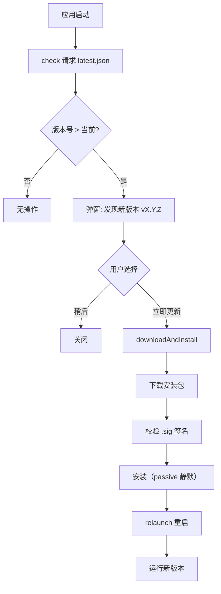

# 桌面端架构说明

### Tauri 桌面端补充说明

> Tauri 2.x 负责将 Next.js SPA 打包为桌面应用（Windows/macOS/Linux）+ 移动端（Android/iOS）。以下为 Tauri 项目核心架构、安全模型、插件体系和分发流程。

#### 进程模型

Tauri 采用多进程架构，遵循最小权限原则：

```
┌─────────────────────────────────┐
│  Core 进程 (Rust)                │
│  ├── 唯一拥有 OS 完整访问权限     │
│  ├── 窗口管理 / 系统托盘          │
│  ├── IPC 消息路由与拦截           │
│  ├── 全局状态管理                 │
│  └── 插件调度                    │
├─────────────────────────────────┤
│  WebView 进程 (JS/TS)            │
│  ├── 渲染 Next.js SPA            │
│  ├── 通过 IPC 调用 Core 能力      │
│  └── 受 CSP + Capabilities 限制  │
└─────────────────────────────────┘
```

- **Core 进程**：Rust 编写，管理窗口、托盘、通知，路由所有 IPC 消息
- **WebView 进程**：操作系统原生 WebView（Windows: Edge WebView2, macOS: WKWebView, Linux: webkitgtk）
- **安全隔离**：前端无法直接访问 OS，必须通过 Capabilities 声明的命令才能调用 Core 能力

#### 项目结构

Tauri 项目位于 `desktop/src-tauri/`，与 `desktop/package.json` 同级，符合 Tauri 默认约定：

```
desktop/                       # 桌面客户端根目录
├── package.json               # Next.js + Tauri CLI 依赖
├── next.config.js
├── src/                       # Next.js 源码
├── dist/                      # 构建产物 → frontendDist: "../dist"
└── src-tauri/                 # Tauri Rust 项目
    ├── Cargo.toml             # Rust 依赖
    ├── tauri.conf.json        # Tauri 核心配置
    ├── capabilities/
    │   └── default.json       # 权限声明
    ├── icons/                 # 应用图标（多平台）
    ├── src/
    │   ├── main.rs            # 桌面入口
    │   ├── lib.rs             # 核心逻辑 + 移动端入口
    │   └── commands.rs        # IPC 命令定义
    └── build.rs
```

#### 安全模型：Capabilities

Tauri v2 采用声明式权限系统，`capabilities/default.json` 精确控制前端可调用的能力：

```json
{
  "identifier": "default",
  "description": "默认权限集",
  "windows": ["main"],
  "permissions": [
    "core:default",
    "shell:allow-open",
    "notification:default",
    "dialog:default",
    "clipboard-manager:default",
    "updater:default",
    "process:default",
    "deep-link:default"
  ]
}
```

| 能力 | 用途 |
|------|------|
| `core:default` | 窗口操作、应用事件 |
| `shell:allow-open` | 用系统默认程序打开 URL/文件 |
| `notification:default` | 系统原生通知 |
| `dialog:default` | 原生文件选择/保存对话框 |
| `clipboard-manager:default` | 读写剪贴板 |
| `updater:default` | 自动更新 |
| `process:default` | 进程管理（重启） |
| `deep-link:default` | 自定义协议深度链接 |

#### IPC 通信

前端通过 `@tauri-apps/api` 调用 Rust 端命令，采用异步消息传递：

```rust
// src-tauri/src/commands.rs
#[tauri::command]
fn get_app_version() -> String {
    env!("CARGO_PKG_VERSION").to_string()
}

#[tauri::command]
async fn get_system_info() -> Result<SystemInfo, String> {
    // 获取 OS 信息
    Ok(SystemInfo { os: std::env::consts::OS.to_string() })
}
```

```ts
// 前端调用
import { invoke } from '@tauri-apps/api/core'

const version = await invoke<string>('get_app_version')
const sysInfo = await invoke<SystemInfo>('get_system_info')
```

**核心 IPC 命令**（AnserFlow 场景）：

| 命令 | 功能 |
|------|------|
| `get_app_version` | 获取应用版本 |
| `open_url` | 用系统浏览器打开外部链接 |
| `show_notification` | 发送系统通知 |
| `get_system_info` | 获取 OS 信息 |
| `restart_app` | 更新后重启应用 |

#### Tauri 配置

`tauri.conf.json` 核心配置：

```json
{
  "productName": "AnserFlow",
  "version": "0.1.0",
  "identifier": "io.anserflow.app",
  "build": {
    "beforeBuildCommand": "npm run build",
    "beforeDevCommand": "npm run dev",
    "devUrl": "http://localhost:3001",
    "frontendDist": "../dist"
  },
  "app": {
    "windows": [{
      "title": "AnserFlow",
      "width": 1280,
      "height": 800,
      "minWidth": 900,
      "minHeight": 600,
      "resizable": true,
      "center": true
    }],
    "security": {
      "csp": "default-src 'self'; connect-src 'self' http://localhost:8080 ws://localhost:8080 https://${API_DOMAIN} wss://${API_DOMAIN}"
    }
  },
  "bundle": {
    "active": true,
    "targets": "all",
    "icon": ["icons/icon.png"],
    "createUpdaterArtifacts": true
  },
  "plugins": {
    "deep-link": {
      "desktop": {
        "schemes": ["anserflow"]
      }
    }
  }
}
```

生产构建时通过环境变量 `${API_DOMAIN}` 注入实际服务域名；开发环境保留 `localhost:8080` 便于本地联调。

#### 插件体系

AnserFlow 需要用到的 Tauri 官方插件：

| 插件 | 场景 |
|------|------|
| **notification** | Issue 状态变更 / Agent 执行完成 / @提及 系统通知 |
| **shell** | 用系统默认浏览器打开 GitHub PR 链接 |
| **dialog** | 文件选择（Skills ZIP 导入） |
| **clipboard-manager** | 复制邀请链接 |
| **updater** | 应用内自动更新 |
| **process** | 更新完成后重启应用 |
| **window-state** | 记忆窗口大小和位置 |
| **single-instance** | 防止重复启动 |
| **deep-link** | `anserflow://invite/xxx` 协议处理邀请 |
| **fs** | 文件系统访问（Skills ZIP 解压） |
| **store** | 持久化键值存储（本地设置缓存） |
| **logging** | Rust 端日志输出 |

安装示例：

```bash
cargo tauri add notification
cargo tauri add updater
cargo tauri add deep-link
```

#### 深度链接

通过 `anserflow://` 自定义协议处理邀请链接，用户点击 `anserflow://invite/abc123` 时自动打开桌面应用并跳转到接受邀请页面：

```rust
// src-tauri/src/lib.rs
use tauri_plugin_deep_link::DeepLinkExt;

app.listen_deep_link(|url| {
    if let Some(token) = url.path().strip_prefix("/invite/") {
        // 通知前端跳转到邀请页面
        app.emit("deep-link-invite", token).unwrap();
    }
});
```

```ts
// 前端监听
import { listen } from '@tauri-apps/api/event'

listen('deep-link-invite', (event) => {
  router.push(`/invite/${event.payload}`)
})
```

#### 自动更新

> 核心插件：`tauri-plugin-updater`。支持从 GitHub Releases 静态 JSON 或自定义服务器获取更新。

##### 密钥生成（一次性）

Tauri 更新必须签名校验，需要一对公私钥：

```bash
# 生成密钥对（保存到安全位置，私钥绝不可泄露）
npm run tauri signer generate -w ~/.tauri/anserflow.key
# 输出：
#   ~/.tauri/anserflow.key      ← 私钥（机密，配置到 CI secrets）
#   ~/.tauri/anserflow.key.pub  ← 公钥（写入 tauri.conf.json）
```

##### tauri.conf.json 配置

```json
{
  "bundle": {
    "createUpdaterArtifacts": true
  },
  "plugins": {
    "updater": {
      "pubkey": "dW50cnVzdGVkIGNvbW1lbnQ6IG1pbmlzaWduIHB1YmxpYyBrZXk6I...",
      "endpoints": [
        "https://github.com/anserflow/anserflow/releases/latest/download/latest.json"
      ],
      "windows": {
        "installMode": "passive"
      }
    }
  }
}
```

| 配置项 | 说明 |
|--------|------|
| `pubkey` | 公钥内容（不是文件路径），用于校验安装包签名 |
| `endpoints` | 更新检查 URL 列表，依次尝试直到返回 2xx |
| `installMode` | Windows 安装模式：`passive`（静默进度条 / 默认）、`basicUi`（用户交互）、`quiet`（完全静默） |
| `createUpdaterArtifacts` | `true` 时构建自动生成 `.sig` 签名文件 |

URL 支持动态变量：`{{current_version}}`、`{{target}}` (win/mac/linux)、`{{arch}}` (x86_64/aarch64)。

##### GitHub Actions 自动发布

构建时设置私钥环境变量，Tauri 自动生成签名 + `latest.json`：

```yaml
# .github/workflows/desktop-release.yml（关键步骤）
- name: Build & Release
  uses: tauri-apps/tauri-action@v0
  env:
    GITHUB_TOKEN: ${{ secrets.GITHUB_TOKEN }}
    TAURI_SIGNING_PRIVATE_KEY: ${{ secrets.TAURI_PRIVATE_KEY }}
    TAURI_SIGNING_PRIVATE_KEY_PASSWORD: ${{ secrets.TAURI_KEY_PASSWORD }}
  with:
    projectPath: 'desktop'
    tagName: 'desktop-v__VERSION__'
    releaseName: 'AnserFlow Desktop v__VERSION__'
    releaseBody: 'See CHANGELOG.md'
    includeUpdaterJson: true    # ← 自动生成 latest.json 并上传
    releaseDraft: true
```

**CI Secrets 需配置**：

| Secret | 说明 |
|--------|------|
| `TAURI_PRIVATE_KEY` | 私钥内容或路径 |
| `TAURI_KEY_PASSWORD` | 生成密钥时设置的密码 |
| `APPLE_CERTIFICATE` | macOS 签名证书（base64） |
| `APPLE_CERTIFICATE_PASSWORD` | 证书密码 |
| `APPLE_ID` / `APPLE_PASSWORD` / `APPLE_TEAM_ID` | macOS 公证 |

##### 更新服务器方案对比

| 方案 | 优点 | 缺点 | 推荐场景 |
|------|------|------|----------|
| **GitHub Releases 静态 JSON** | 零成本、自动生成 `latest.json` | 国内下载慢 | ✅ AnserFlow 首选 |
| **GitHub Releases + CDN 代理** | 零成本、国内加速 | 需配置加速域名 | 国内用户多的项目 |
| **自建 Go 更新 API** | 完全可控、灰度发布 | 需维护服务器 | 企业级分发 |
| **S3 / OSS 静态 JSON** | CDN 加速、高可用 | 需手动上传 | 有云服务预算的项目 |

> AnserFlow 推荐方案：GitHub Releases 托管 `latest.json`，国内用户走 CDN 代理（如 `gh.anserflow.cn`）。

##### 前端更新检查

应用启动时自动检查更新，有则弹窗提示，用户确认后下载安装并重启：

```ts
// desktop/src/lib/updater.ts
import { check } from '@tauri-apps/plugin-updater'
import { ask, message } from '@tauri-apps/plugin-dialog'
import { relaunch } from '@tauri-apps/plugin-process'

/**
 * 检查并执行应用更新
 * @param onUserClick 是否由用户手动触发（手动触发时无更新也弹提示）
 */
export async function checkForUpdates(onUserClick = false) {
  try {
    const update = await check()

    if (!update) {
      if (onUserClick) {
        await message('已是最新版本 🎉', {
          title: '检查更新',
          kind: 'info',
        })
      }
      return
    }

    // 有新版本 → 弹窗确认
    const yes = await ask(
      `发现新版本 v${update.version}\n\n${update.body || ''}`,
      {
        title: '更新可用',
        kind: 'info',
        okLabel: '立即更新',
        cancelLabel: '稍后',
      },
    )

    if (yes) {
      // 下载 + 安装 + 重启
      await update.downloadAndInstall()
      await relaunch()
    }
  } catch (e) {
    console.error('更新检查失败:', e)
  }
}
```

```tsx
// 应用入口调用
import { useEffect } from 'react'
import { checkForUpdates } from '@/lib/updater'

useEffect(() => {
  checkForUpdates() // 启动时静默检查
}, [])
```

##### 更新流程全貌



##### Capabilities 权限

更新所需的权限声明：

```json
// src-tauri/capabilities/default.json
{
  "permissions": [
    "updater:default",
    "updater:allow-check",
    "updater:allow-download-and-install",
    "dialog:default",
    "dialog:allow-ask",
    "dialog:allow-message",
    "process:allow-restart"
  ]
}
```

##### 调试技巧

```bash
# 本地测试更新流程（不发布 Release）
# 1. 修改 version
cargo set-version 0.2.0 --path desktop/src-tauri/Cargo.toml

# 2. 构建并手动启动一个本地静态服务器提供 latest.json
cargo tauri build
npx serve target/release/bundle

# 3. 在 tauri.conf.json 临时指向本地
# "endpoints": ["http://localhost:3000/latest.json"]
```

#### 打包与分发

| 平台 | 格式 | 说明 |
|------|------|------|
| **Windows** | MSI / NSIS | MSI 支持企业批量部署，NSIS 体积更小 |
| **macOS** | DMG | 需 Apple Developer 签名 + Notarization |
| **Linux** | AppImage / deb / rpm | AppImage 通用性最好 |
| **Android** | APK / AAB | 通过 Tauri Android 插件打包 |
| **iOS** | IPA | 需 Apple Developer 账号 |

```bash
# 三平台交叉编译
cargo tauri build --target x86_64-pc-windows-msvc
cargo tauri build --target x86_64-apple-darwin
cargo tauri build --target aarch64-apple-darwin
cargo tauri build --target x86_64-unknown-linux-gnu
```

#### Tauri 前端适配

SPA 在 Tauri WebView 中需注意的适配点：

```ts
// lib/tauri.ts — 环境检测与适配
import { isTauri } from '@tauri-apps/api/core'
import { getLocalSettings } from '@/lib/local-settings'

// 浏览器后台走同源 /api；桌面端读取已配置的远程服务地址
export async function getApiConfig() {
  if (!isTauri()) {
    return {
      apiBase: process.env.NEXT_PUBLIC_API_BASE!,
      wsUrl: process.env.NEXT_PUBLIC_WS_URL!,
    }
  }

  const settings = await getLocalSettings()
  return {
    apiBase: settings.apiBase,
    wsUrl: settings.wsUrl,
  }
}

// CSP 适配：Tauri WebView 中 'self' 指向 tauri://localhost
// 需在 tauri.conf.json 的 CSP 中白名单后端地址
```

**桌面端组织上下文**：桌面端路由为 `/projects/:id`、`/chat` 等扁平路径（无 org_id 前缀），但 API 路由需要 `org_id`。桌面端通过以下机制建立组织上下文：

```ts
// desktop/src/lib/org-context.ts — 桌面端组织选择与缓存
import { getSettings, updateSettings } from '@/lib/local-settings'
import { invoke } from '@tauri-apps/api/core'

export async function getCurrentOrgId(): Promise<string> {
  const settings = await getSettings()
  // 如果已有缓存，直接使用
  if (settings.lastOrgId) return settings.lastOrgId

  // 否则从 API 获取用户加入的第一个组织
  const orgs = await fetch(`${settings.apiBase}/api/orgs`).then(r => r.json())
  if (orgs.length === 0) throw new Error('未加入任何组织')
  
  await updateSettings({ lastOrgId: orgs[0].id })
  return orgs[0].id
}

// API 调用时自动注入 org_id
export async function apiFetch(path: string, init?: RequestInit) {
  const orgId = await getCurrentOrgId()
  const url = path.startsWith('/api/orgs/')
    ? path  // 已包含 org_id
    : path.replace('/api/', `/api/orgs/${orgId}/`)
  return fetch(url, init)
}
```

桌面 UI 提供组织切换组件，切换时更新 `lastOrgId` 并刷新所有数据：

```tsx
// desktop/src/components/org-switcher.tsx
const { data: orgs } = useQuery({ queryKey: ['orgs'], queryFn: fetchOrgs })
<Select onValueChange={setCurrentOrgId}>
  {orgs?.map(o => <SelectItem key={o.id} value={o.id}>{o.name}</SelectItem>)}
</Select>
```

#### Rust 最小学习路径

AnserFlow 桌面端 Rust 代码量极少，核心仅三个文件，每个都可以按模板修改：

| 文件 | 行数 | 内容 | Rust 知识点 |
|------|------|------|------------|
| `main.rs` | ~10 | 入口（固定模板） | 无，复制粘贴 |
| `lib.rs` | ~20 | 插件注册 + 初始化 | 宏调用、Result |
| `commands.rs` | ~40 | IPC 命令 | 函数声明、字符串操作 |

**对比**：Go vs Rust 在桌面端职责中的对应关系：

```
Go 概念          →  Rust 概念
━━━━━━━━━━━━━━━━━━━━━━━━━━━━━━━━━━
func cmd()       →  fn cmd()
string           →  String
map[string]T     →  HashMap<String, T>
err != nil       →  match / ? 操作符
struct{}         →  struct{}
go mod           →  Cargo.toml
```

> **结论**：不需要学 Rust。参考 AI 生成 + 模板修改即可完成桌面端开发。

#### lib.rs 完整示例

将所有插件在 `lib.rs` 中一次性注册，AnserFlow 桌面端的完整 Rust 骨架：

```rust
// src-tauri/src/lib.rs
use tauri_plugin_deep_link::DeepLinkExt;

#[cfg_attr(mobile, tauri::mobile_entry_point)]
pub fn run() {
    tauri::Builder::default()
        // ── 插件注册 ──
        .plugin(tauri_plugin_notification::init())
        .plugin(tauri_plugin_shell::init())
        .plugin(tauri_plugin_dialog::init())
        .plugin(tauri_plugin_clipboard_manager::init())
        .plugin(tauri_plugin_store::Builder::new().build())
        .plugin(tauri_plugin_window_state::Builder::default().build())
        .plugin(tauri_plugin_single_instance::init(|app, _args, _cwd| {
            // 重复启动 → 激活已有窗口
            if let Some(window) = app.get_webview_window("main") {
                let _ = window.show();
                let _ = window.set_focus();
            }
        }))
        .plugin(
            tauri_plugin_updater::Builder::new().build()
        )
        .plugin(
            tauri_plugin_log::Builder::new()
                .level(log::LevelFilter::Info)
                .target(tauri_plugin_log::Target::new(
                    tauri_plugin_log::TargetKind::LogDir {
                        file_name: Some("anserflow".to_string()),
                    },
                ))
                .max_file_size(5_000_000)  // 5MB
                .rotation_strategy(tauri_plugin_log::RotationStrategy::KeepAll)
                .build(),
        )
        // ── 深度链接 ──
        .setup(|app| {
            #[cfg(desktop)]
            {
                app.listen_deep_link(|url| {
                    if let Some(token) = url.path().strip_prefix("/invite/") {
                        app.emit("deep-link-invite", token).unwrap();
                    }
                });
            }
            Ok(())
        })
        .invoke_handler(tauri::generate_handler![
            commands::get_system_info,
            commands::open_url,
            commands::restart_app,
        ])
        .run(tauri::generate_context!())
        .expect("error while running tauri application");
}
```

```rust
// src-tauri/src/commands.rs — IPC 命令
use tauri::Manager;

#[tauri::command]
fn get_system_info() -> Result<String, String> {
    Ok(format!(
        "{{ \"os\": \"{}\", \"arch\": \"{}\" }}",
        std::env::consts::OS,
        std::env::consts::ARCH,
    ))
}

#[tauri::command]
fn open_url(app: tauri::AppHandle, url: String) -> Result<(), String> {
    tauri_plugin_shell::ShellExt::shell(&app)
        .open(&url, None)
        .map_err(|e| e.to_string())
}

#[tauri::command]
fn restart_app(app: tauri::AppHandle) {
    app.restart();
}
```

#### 通知插件实战

AnserFlow 关键通知场景的 TypeScript 封装：

```ts
// desktop/src/lib/notifications.ts
import {
  isPermissionGranted,
  requestPermission,
  sendNotification,
  registerActionTypes,
  onAction,
  createChannel,
  Importance,
} from '@tauri-apps/plugin-notification'

// 初始化：申请权限 + 注册频道
async function initNotifications() {
  const granted = await isPermissionGranted()
  if (!granted) {
    const perm = await requestPermission()
    if (perm !== 'granted') return
  }

  // 注册通知频道（Android 必需，其他平台兼容）
  await createChannel({
    id: 'issues',
    name: 'Issue 通知',
    description: 'Issue 状态变更、@提及、分配',
    importance: Importance.High,
    visibility: 1, // Private
  })

  await createChannel({
    id: 'agent',
    name: 'Agent 通知',
    description: 'Agent 执行完成通知',
    importance: Importance.Default,
  })

  // 注册带操作的 Issue 通知
  await registerActionTypes([{
    id: 'issue-actions',
    actions: [
      { id: 'view', title: '查看详情', foreground: true },
      { id: 'close', title: '关闭 Issue', foreground: false },
    ],
  }])
}

// 监听通知操作
onAction((action) => {
  if (action.actionId === 'view') {
    // 导航到 Issue 详情页
    window.location.hash = `/projects/${action.payload?.projectId}/issues/${action.payload?.issueId}`
  }
  if (action.actionId === 'close') {
    // 调用 API 关闭 Issue
    fetch(`/api/issues/${action.payload?.issueId}/close`, { method: 'POST' })
  }
})

// 场景函数
export async function notifyIssueAssigned(title: string, issueUrl: string) {
  await sendNotification({
    title: '📋 新 Issue 分配',
    body: title,
    channelId: 'issues',
    actionTypeId: 'issue-actions',
  })
}

export async function notifyAgentComplete(agentName: string) {
  await sendNotification({
    title: '✅ Agent 执行完成',
    body: `${agentName} 已完成任务`,
    channelId: 'agent',
  })
}

export async function notifyMention(who: string, message: string) {
  await sendNotification({
    title: `💬 ${who} 提到了你`,
    body: message,
    channelId: 'issues',
  })
}
```

#### Store 插件实战

用 tauri-plugin-store 持久化本地设置（窗口尺寸、主题、API 地址等），比 localStorage 更可靠：

```ts
// desktop/src/lib/local-settings.ts
import { load } from '@tauri-apps/plugin-store'

interface LocalSettings {
  theme: 'light' | 'dark' | 'system'
  apiBase: string          // 后端 API 地址
  wsUrl: string            // WebSocket 地址
  lastProjectId?: string
  windowBounds?: { x: number; y: number; width: number; height: number }
}

const DEFAULT: LocalSettings = {
  theme: 'system',
  apiBase: 'https://${API_DOMAIN}/api',
  wsUrl: 'wss://${API_DOMAIN}/ws',
}

let _store: Awaited<ReturnType<typeof load>> | null = null

async function getStore() {
  if (!_store) {
    _store = await load('settings.json', { autoSave: true })
  }
  return _store
}

export async function getSettings(): Promise<LocalSettings> {
  const store = await getStore()
  const val = await store.get<LocalSettings>('settings')
  return { ...DEFAULT, ...val }
}

export async function updateSettings(patch: Partial<LocalSettings>) {
  const store = await getStore()
  const current = await getSettings()
  await store.set('settings', { ...current, ...patch })
  // autoSave: true 会自动持久化
}
```

#### Logging 插件实战

生产环境日志落到文件，便于排查问题：

```ts
// desktop/src/lib/logger.ts
import { info, warn, error, attachConsole } from '@tauri-apps/plugin-log'

// 开发时：前端 console → Rust 日志系统
export function setupLogger() {
  attachConsole() // 将 Rust 日志打印到 WebView console

  // 将 console.log/warn/error 转发到 Rust 日志文件
  const forward = (fnName: 'log' | 'warn' | 'error', logger: (msg: string) => Promise<void>) => {
    const orig = console[fnName]
    console[fnName] = (...args: any[]) => {
      orig(...args)
      logger(args.map(String).join(' '))
    }
  }
  forward('log', info)
  forward('warn', warn)
  forward('error', error)
}

// 调用日志
// info('用户登录成功', { userId: 123 })
// error('API 请求失败', { url: '/api/issues', status: 500 })
```

#### CI/CD：桌面端发布

> 完整工作流见「三、GitHub Flow 与 CI/CD → 3.6」节。此处仅列 Tauri 特定注意事项：

| 事项 | 说明 |
|------|------|
| 触发标签 | `desktop-v*` |
| Node.js 版本 | 22（非 20，与根 `package.json` engines 一致） |
| macOS 签名 | 需 `APPLE_CERTIFICATE` / `APPLE_ID` 等 5 个 secrets |
| Rust Target | `aarch64-apple-darwin` + `x86_64-apple-darwin` 需分别构建 |

#### WebDriver E2E 测试

Tauri 内置 WebDriver 支持，可编写 Selenium/WebdriverIO 脚本测试桌面应用：

```bash
# 安装 tauri-driver
cargo install tauri-driver

# 启动测试
tauri-driver &
cargo tauri dev &  # 或 cargo tauri build --debug
npx wdio run wdio.conf.ts
```

```ts
// wdio.conf.ts
const wdioOptions = {
  hostname: 'localhost',
  port: 4444,
  path: '/',
  capabilities: [{
    'tauri:options': {
      application: './src-tauri/target/debug/anserflow-desktop',
    },
  }],
}
```

> 适合对关键流程（登录、创建 Issue、接受邀请）做自动化回归。

#### 推荐插件分级

| 优先级 | 插件 | 原因 |
|--------|------|------|
| 🔴 必须 | window-state | 窗口尺寸记忆，用户体验基础 |
| 🔴 必须 | single-instance | 防止多开导致的状态冲突 |
| 🔴 必须 | notification | 核心功能（Issue / Agent 通知） |
| 🔴 必须 | shell | 打开 GitHub PR 链接 |
| 🔴 必须 | updater | 自动更新分发 |
| 🟡 重要 | store | 持久化本地设置 |
| 🟡 重要 | logging | 生产排查日志 |
| 🟡 重要 | deep-link | 邀请链接直接打开桌面端 |
| 🟡 重要 | dialog | Skills ZIP 导入 |
| 🟢 可选 | clipboard-manager | 复制邀请链接 |
| 🟢 可选 | fs | 文件系统操作 |
| 🟢 可选 | process | 更新后重启 |

> **opencode**：AnserFlow 内置默认运行时，基于开源 AI 编码代理 [anomalyco/opencode](https://github.com/anomalyco/opencode)（TypeScript，160k+ Stars）。在 Docker 沙箱中通过非交互 CLI 模式（`opencode run`）执行编码任务。支持多 LLM 提供商、Plan/Build 双模式。后台可注册其他运行时（如 Claude Code），Agent 绑定任意运行时。
