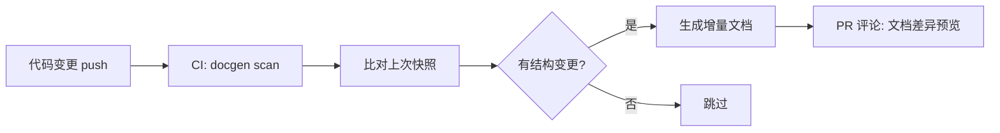
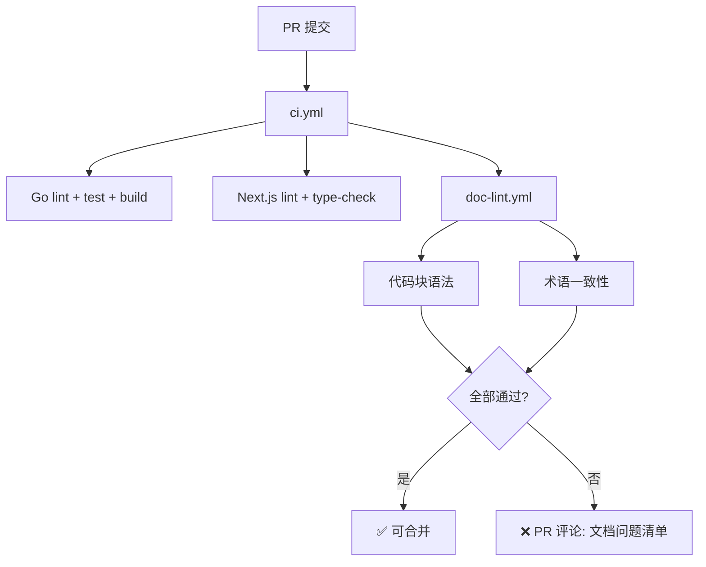
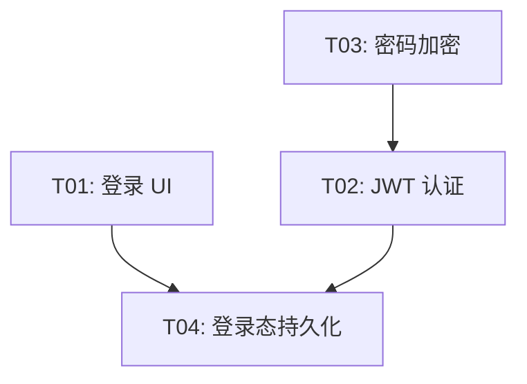

# 开发路线图与风险

## 十二、开发路线图

### L1 — 基础设施（1-2 周）

| 编号 | 任务 | 验收标准 |
|------|------|----------|
| T01 | Go 项目初始化（Gin + GORM） | `go run main.go server` 启动成功 |
| T02 | Next.js 项目初始化（shadcn/ui） | `npm run dev` 启动成功 |
| T03 | MySQL 表结构创建 + GORM AutoMigrate | 所有表自动创建 |
| T04 | 用户注册/登录（JWT + bcrypt） | Postman 测试通过 |
| T05 | 组织 CRUD + 邀请系统（分享链接 + 邮箱） | 创建组织、生成链接/发送邮件、接受邀请自动入组织、成员管理全流程通 |
| T06 | Redis 集成 + WebSocket 基础 | 单实例 WS 通信正常 |
| T07 | Cobra CLI 框架 + `anserflow init/server` | 命令行可初始化并启动 |
| T08 | Next.js SPA 静态导出 + Go embed 嵌入 | `go build` 产出单文件，浏览器访问正常 |

### L2 — 核心业务（3-4 周）

| 编号 | 任务 | 验收标准 |
|------|------|----------|
| T09 | Agent CRUD + System Prompt 编辑 | 创建/编辑 Agent，保存人设 |
| T10 | Skills CRUD + 手动/ZIP 导入 | 两种方式均可添加 Skill |
| T11 | Agent-Skill 绑定 + 启用控制 | 全局/单Agent 开关生效 |
| T12 | 项目管理 + GitHub 关联（HTTP Token / SSH Key） | 创建项目并绑定 GitHub 仓库，支持两种授权方式 |
| T13 | Issue CRUD + 状态流转 + 优先级 + 子 Issue | Tab 状态视图操作全流程通 |
| T14 | Issue 分配给 Agent/自然人 | 分配并正确记录 |


### L3 — 协作与执行（5-7 周）

| 编号 | 任务 | 验收标准 |
|------|------|----------|
| T16 | 群聊 WebSocket + 消息持久化 | 多人实时聊天正常 |
| T17 | WebSocket Redis Pub/Sub 分布式 | 多实例消息同步 |
| T18 | Eino 集成 + 群聊 Agent 讨论编排 | Agent 自动参与讨论 |
| T19 | 讨论→方案→自动创建 Issue（backlog） | /backlog 指令产出 Issue（状态=backlog），到 backlog Tab 手动确认后转为 todo |
| T20 | Asynq 任务队列集成 | 任务入队/消费正常 |
| T21 | Docker 沙箱执行引擎 | Agent 在容器中执行编码 |
| T22 | GitHub PR 自动提交 | 代码提交 + PR 创建流程通 |
| T22a | Agent 执行日志（agent_logs 写入 + 前端查询） | Agent 讨论/执行过程记录到 agent_logs 表，前端 Agent 日志页可按时间/类型筛选 |

### L4 — 客户端与交付（8-10 周）

| 编号 | 任务 | 验收标准 |
|------|------|----------|
| T23 | 交叉编译 + CI 构建（win/mac/linux） | 三平台产出单文件 |
| T24 | Tauri 桌面端打包 | Windows/macOS 安装包 |
| T25 | 通知系统（WebSocket Push + 原生 + 邮箱） | 状态变更实时通知 |
| T26 | 权限精细化 + 操作审计日志 | RBAC 权限生效 |
| T27 | 管理后台完整 UI | 所有页面可交互 |
| T28 | 性能优化 + 压力测试 | 100 并发 WS 连接稳定 |

### 测试策略

测试贯穿全部四个阶段，不在单独阶段集中编写：

| 层级 | 框架 | 目标 | 触发时机 |
|------|------|------|----------|
| **Go 单元测试** | `testing` + `testify` | Service / Model 层覆盖率 > 70% | 每次 `go test`（CI PR） |
| **Go 集成测试** | `testing` + `testcontainers-go` | MySQL/Redis 真实交互（Handler + DB 层） | PR + main push |
| **前端组件测试** | Vitest + Testing Library | 核心组件（AgentForm / IssueCard / TodoKanban） | PR |
| **E2E 测试** | Playwright | 关键流程：注册→登录→创建Agent→创建Issue→状态流转→邀请 | main push / 发布前 |
| **WebSocket 测试** | `gorilla/websocket` 客户端 + testify | 消息格式 / 心跳 / 重连 / 分布式 Pub/Sub | PR |
| **Tauri E2E** | WebDriver (tauri-driver) | 登录 / Issue 创建 / 邀请接受 | desktop-release 前 |
| **压力测试** | k6 / vegeta | WS 并发连接 > 100、API QPS > 500 | L4 阶段 |
| **合约测试** | Pact | 前后端 API 契约一致性 | Phase 2 独立立项 |

> **CI 闭环要求**：当前仓库需补齐 `ci.yml`，至少覆盖 Go `test + lint + build` 与 Next.js `type-check + lint + build`。在工作流真正落地前，这一条只作为计划要求，不表述为“已涵盖”。

### 数据库迁移策略

GORM AutoMigrate 仅处理正向迁移（创建表/添加列）。需要回滚时采用：

| 场景 | 方案 |
|------|------|
| **本地开发** | `anserflow migrate --dry-run` 预览 SQL → 手动执行回滚 DDL |
| **生产发布** | 每次 `anserflow migrate` 前自动生成备份 SQL（`data/migrations/YYYYMMDDHHMMSS_before.sql`） |
| **紧急回滚** | 执行对应时间的备份 SQL 恢复表结构 |
| **当前收口** | 本轮统一采用 `AutoMigrate + 备份 SQL + 种子数据`；`golang-migrate/migrate` 放入 Phase 2 独立任务 |

```bash
# 迁移前自动备份
anserflow migrate --backup    # → data/migrations/20260514120000_before.sql

# 跳过种子数据（仅 DDL）
anserflow migrate --seed=false
```

### 数据库备份恢复

除 `migrate --backup` 自动备份外，提供独立的 `restore` 子命令用于灾难恢复：

```bash
# 恢复数据库到指定备份
anserflow restore --file data/migrations/20260514120000_before.sql
  --config  config.yaml 路径
  --yes     跳过二次确认（默认 false）
  --dry-run 预览将执行的 SQL（默认 false）
```

```go
// cmd/restore.go
var restoreCmd = &cobra.Command{
    Use:   "restore",
    Short: "从备份 SQL 恢复数据库",
    Long: `从 data/migrations/ 目录选择备份 SQL 文件执行恢复。

⚠️  警告：恢复操作会覆盖当前数据库数据，请务必在维护窗口执行。
操作前会自动检查当前数据库状态并生成警告提示。`,
    Run: func(cmd *cobra.Command, args []string) {
        filePath, _ := cmd.Flags().GetString("file")
        dryRun, _ := cmd.Flags().GetBool("dry-run")
        skipConfirm, _ := cmd.Flags().GetBool("yes")

        // 1. 校验备份文件存在
        if _, err := os.Stat(filePath); os.IsNotExist(err) {
            fmt.Printf("❌ 备份文件不存在: %s\n", filePath)
            os.Exit(1)
        }

        // 2. 读取备份 SQL
        sqlBytes, err := os.ReadFile(filePath)
        if err != nil {
            fmt.Printf("❌ 无法读取备份文件: %v\n", err)
            os.Exit(1)
        }

        // 3. dry-run 模式：仅打印 SQL 不执行
        if dryRun {
            fmt.Println("📋 [DRY RUN] 以下 SQL 将被执行:")
            fmt.Println(string(sqlBytes))
            return
        }

        // 4. 连接数据库并检查当前表状态
        db := connectDB(cfg)
        tables := listTables(db)
        fmt.Printf("⚠️  当前数据库包含 %d 张表: %v\n", len(tables), tables)

        // 5. 二次确认
        if !skipConfirm {
            fmt.Print("确认恢复？这会覆盖当前所有数据 (yes/no): ")
            var confirm string
            fmt.Scanln(&confirm)
            if strings.ToLower(confirm) != "yes" {
                fmt.Println("已取消。")
                return
            }
        }

        // 6. 执行恢复 SQL（事务内逐条执行）
        tx := db.Begin()
        for _, stmt := range splitStatements(string(sqlBytes)) {
            if err := tx.Exec(stmt).Error; err != nil {
                tx.Rollback()
                fmt.Printf("❌ 恢复失败 at \"%s\": %v\n",
                    truncate(stmt, 80), err)
                os.Exit(1)
            }
        }
        tx.Commit()

        fmt.Println("✅ 数据库恢复成功")
    },
}

func init() {
    restoreCmd.Flags().String("file", "", "备份 SQL 文件路径（必填）")
    restoreCmd.Flags().Bool("dry-run", false, "预览模式：仅打印 SQL 不执行")
    restoreCmd.Flags().Bool("yes", false, "跳过确认直接执行")
    restoreCmd.MarkFlagRequired("file")
}
```

```
恢复操作流程：
┌──────────────┐
│ 1. 校验文件   │── 备份文件是否存在且可读
└──────┬───────┘
       ▼
┌──────────────┐
│ 2. 安全检查   │── 列出当前数据库表，提示覆盖风险
└──────┬───────┘
       ▼
┌──────────────┐
│ 3. 二次确认   │── 用户输入 "yes" 才继续（--yes 跳过）
└──────┬───────┘
       ▼
┌──────────────┐
│ 4. 事务执行   │── BEGIN → 逐条执行 SQL → COMMIT
└──────┬───────┘     任一失败 → ROLLBACK + 报错退出
       ▼
┌──────────────┐
│ 5. 验证提示   │── 恢复完成后提示重新执行 migrate
└──────────────┘     确保表结构为最新版本
```

> **恢复后操作**：恢复数据库后需执行 `anserflow migrate` 确保表结构与当前代码版本一致（备份可能来自较早版本，缺少新增字段）。

种子数据 SQL 统一放置在 `internal/seed/` 目录：

```
internal/seed/
├── 001_default_skills.sql     # 系统预置 Skill（flowcode-executor + 6个角色Skill）
├── 002_casbin_policies.sql    # Casbin RBAC 角色权限策略
├── 003_runtime_skills.sql     # 各运行时默认 Skill 绑定（opencode→flowcode-executor）
└── 004_example_agent.sql      # 可选：示例 Agent 配置
```

**预置 Eino 调度 Skill 清单**（`001_default_skills.sql`）：

| Skill 名称 | 用途 | Eino 调度环节 | 核心内容 |
|-----------|------|-------------|---------|
| `flowcode-executor` | 编码执行规范 | opencode 沙箱执行 | 代码风格、提交规范、PR 格式 |
| `eino-discuss` | 群聊讨论调度 | 群聊 Agent 编排 | 如何组织讨论、轮次控制、何时收敛结论 |
| `eino-backlog` | 方案拆解 | /backlog 指令 | 如何从讨论生成 Issue、描述格式、优先级/负责人判定 |
| `eino-optimizer` | 提示词优化 | 人工提示词改写 | 自然语言→编码指令的转换规则、技术细节补充要求 |
| `eino-planner` | 任务编排 | Issue 调度 + 依赖分析 | 优先级判定、依赖关系推导、并发度计算 |

> 以上 Skill 均为 Eino 调度专用（`is_builtin=1`）。Agent 的 System Prompt 仅写角色人设 1-2 句，具体调度行为由对应 Eino Skill 定义。

---

## 十三、风险与建议

### 13.1 关键风险

| 风险 | 等级 | 应对措施 |
|------|------|----------|
| Agent 自动编码质量不可控 | 🔴 高 | 先做半自动：Agent 生成代码 → 创建 PR → 人工审核合并 |
| 多 Agent 讨论无限循环 | 🟡 中 | `/backlog` 指令触发方案讨论而非实时监听，限制对话轮数 |
| Docker 沙箱安全 | 🟡 中 | 网络白名单 + 资源限额 + 执行超时 + 无特权模式 |
| Tauri 移动端成熟度 | 🟡 中 | 先交付桌面端，移动端作为 Phase 2 |
| Eino 框架迭代不稳定 | 🟢 低 | 字节内部大规模使用，稳定性有保障 |

### 13.2 简化策略

1. **Agent 执行优先做"半自动"**：编码 → PR → 人工 Review → 合并，而非全自动合入 main
2. **讨论先做"指令触发"**：Agent 不实时监听所有消息，通过 `/backlog` 触发，避免 Token 浪费
3. **Tauri 先桌面后移动**：降低初期复杂度
4. **Skills 系统复用现有模式**：项目已有 `flowcode_design/executor/todo/wiki` Skill 定义，直接复用 YAML frontmatter + Markdown body 的格式

---

## 十四、可参考项目

| 项目 | 参考点 |
|------|--------|
| Plane (plane.so) | Issue 看板、状态流转的 UI/UX |
| OpenHands / Devon | Agent 自动编码的沙箱架构 |
| Mattermost | 群聊 + WebSocket 架构 |
| Dify | Agent 工作流编排的交互设计 |
| Eino (cloudwego/eino) | Go Agent 框架的 Graph/Workflow 模式 |
| Asynq (hibiken/asynq) | Go 任务队列的 API 设计 |

---

## 十五、文档与任务工程化能力扩展（远期 backlog，不纳入当前 L1-L4 验收）

> 以下为 AnserFlow 平台远期能力规划，面向文档自动生成、质量保障以及任务智能化方向。

### 15.1 文档生成

当前项目文档依赖手工编写。以下补全**代码 → 文档**的反向生成能力。

#### 15.1.1 代码 → 文档自动生成

从代码仓库自动产出文档，减少手工维护成本：

| 源 | 产物 | 触发时机 |
|------|------|----------|
| GORM Model 结构体 | 数据字典 Markdown（字段/类型/约束/索引） | CI push main |
| Gin Handler + swag 注解 | OpenAPI 文档增强（含请求示例/错误码） | CI push main |
| TypeScript interface/type | API 契约文档 | CI push main |
| SQL Migration 文件 | 表结构变更日志 + 回滚说明 | `anserflow migrate` |
| Git commit log | CHANGELOG.md（按 Conventional Commits 分组） | CI tag `v*` |

```go
// internal/docgen/engine.go — 文档生成引擎
type DocGenerator interface {
    ScanSource(dir string) ([]SourceUnit, error)
    Generate(units []SourceUnit) (*Document, error)
    Diff(prev, current *Document) (*Changelog, error)
}
```



#### 15.1.2 文档质量门禁

CI/CD 流水线中增加文档自动化检查：

```yaml
文档 CI 检查项:
  代码块语法校验:   ```go → go build   ```ts → tsc   ```sql → 语法解析
  Mermaid 语法:    mermaid-cli 渲染测试
  术语一致性:       关键词表校验（Issue / Agent / Skill 不混用别名）
  新鲜度评分:       对比关联代码变更频率，标记可能过时的文档章节
```



---

### 15.2 任务计划

当前任务计划按 L1-L4 静态拆分。以下扩展仅作为下一阶段增强方向，不与当前交付混算；若要启动，需单独建任务并补验收标准。

#### 15.2.1 Agent 驱动的智能拆分

利用 Eino Agent 对需求做语义级拆解，自动推断子任务、优先级和依赖关系：

```
需求: "做一个用户登录页"
        │
        ▼
  Eino 拆分 Agent（分析需求语义）
        │
        ▼
  ┌─────────────────────────────────────────┐
  │ T01  登录表单 UI        前端  2h  p1     │
  │ T02  JWT 认证 API       后端  3h  p0     │
  │ T03  bcrypt 密码加密    后端  1h  p0  ←── T02 依赖 T03
  │ T04  登录态持久化       前端  1h  p1  ←── T04 依赖 T01+T02
  └─────────────────────────────────────────┘
```

```go
// internal/agent/backlog_breakdown.go
type BreakdownResult struct {
    Tasks []BreakdownTask `json:"tasks"`
}

type BreakdownTask struct {
    Title          string   `json:"title"`
    Description    string   `json:"description"`
    EstimatedHours float64  `json:"estimated_hours"`
    RoleLabel      string   `json:"role_label"`   // CEO / CTO / 前端 / 后端
    Priority       string   `json:"priority"`      // p0-p4
    DependsOn      []int    `json:"depends_on"`    // 依赖的任务序号
    Acceptance     string   `json:"acceptance"`    // 验收标准
}
```

#### 15.2.2 任务依赖图可视化

基于 `depends_on` 关系自动生成依赖图：

- **循环依赖检测**：自动告警并阻断
- **关键路径高亮**：决定总工期的最长依赖链
- **并行度分析**：最大可并行执行的任务数
- **看板联动**：拖动任务卡片自动更新依赖线



#### 15.2.3 Todo ↔ Issue 双向同步

打通规划层（Todo）与执行层（Issue），实现状态闭环：

| Todo 状态 | Issue 状态 | 同步方向 |
|-----------|-----------|----------|
| `[ ]` 未开始 | `backlog` | 创建时 Todo → Issue |
| 执行中 | `in_progress` | Issue → Todo（自动标记） |
| `[x]` 已完成 | `done` | 双向（任一侧完成即同步） |
| 验收退回 | `in_review` | Issue → Todo（取消勾选） |

```go
// internal/sync/todo_issue_sync.go
var stateMapping = map[string]string{
    "todo":        "backlog",
    "in_progress": "in_progress",
    "done":        "done",
    "blocked":     "backlog",
}
```

#### 15.2.4 执行策略引擎

多策略任务调度，按场景选择：

| 策略 | 行为 | 适用场景 |
|------|------|----------|
| 顺序执行 | 按排列逐个执行 | 简单线性任务 |
| 依赖优先 | 拓扑排序，先完成前置任务 | 有明确依赖链 |
| 角色匹配 | 按 Agent role_label 认领 | 多人协作 |
| 并行批处理 | 无依赖任务并行，最多 N 并发 | 提速 |
| 风险优先 | p0 → p4 降序执行 | 核心路径先行 |
| 时间盒 | 单任务超时自动标记 blocked | 防卡死 |

```go
// internal/executor/strategy.go
type ExecutionStrategy interface {
    NextTask(todos []Todo, completed []string) (*Todo, error)
}
```

#### 15.2.5 多维度任务视图

同一份任务数据，多种视角切换：

```
视图模式:
├── 列表视图    L1-L4 层级排列
├── 看板视图    backlog → todo → in_progress → done 泳道
├── 时间线      甘特图展示起止时间和依赖
├── 人员视图    按 Agent/自然人分组
└── 阻塞视图    仅展示阻塞链上的任务
```

看板视图复用已有 Issue 看板 UI 组件：

```tsx
// features/todos/components/todo-kanban.tsx
const columns = [
  { status: 'todo',        title: '待开始', tasks: todos.filter(t => !t.done && !t.inProgress) },
  { status: 'in_progress', title: '进行中', tasks: todos.filter(t => t.inProgress) },
  { status: 'done',        title: '已完成', tasks: todos.filter(t => t.done) },
  { status: 'blocked',     title: '已阻塞', tasks: todos.filter(t => t.blocked) },
]
```

---

> 📌 文档版本: v2.8  
> 📅 更新日期: 2026-05-14  
> 📂 如需拆分为 wiki 知识库或生成详细执行任务清单，需单独立项，不视为本计划未完成项
