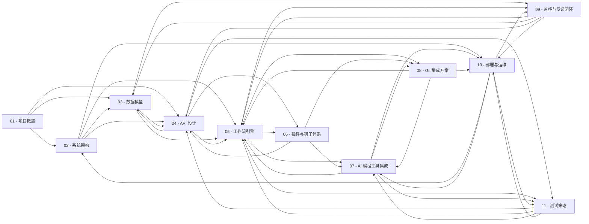

# flowcode 文档知识库

> 来源范围：本知识库仅由 `docs/*.md` 生成。

## 快速入口

- [01 - 项目概述](01-项目概述/README.md)
- [02 - 系统架构](02-系统架构/README.md)
- [03 - 数据模型](03-数据模型/README.md)
- [04 - API 设计](04-API设计/README.md)
- [05 - 工作流引擎](05-工作流引擎/README.md)
- [06 - 插件与钩子体系](06-插件与钩子体系/README.md)
- [07 - AI 编程工具集成](07-AI编程工具集成/README.md)
- [08 - Git 集成方案](08-Git集成方案/README.md)
- [09 - 监控与反馈闭环](09-监控与反馈闭环/README.md)
- [10 - 部署与运维](10-部署与运维/README.md)
- [11 - 测试策略](11-测试策略/README.md)

## 推荐检索路径

- 产品全貌：[01 - 项目概述](01-项目概述/README.md) -> [02 - 系统架构](02-系统架构/README.md) -> [03 - 数据模型](03-数据模型/README.md) -> [04 - API 设计](04-API设计/README.md)
- 需求到代码闭环：[01 - 项目概述](01-项目概述/README.md) -> [05 - 工作流引擎](05-工作流引擎/README.md) -> [07 - AI 编程工具集成](07-AI编程工具集成/README.md) -> [08 - Git 集成方案](08-Git集成方案/README.md) -> [11 - 测试策略](11-测试策略/README.md)
- 插件与外部工具：[06 - 插件与钩子体系](06-插件与钩子体系/README.md) -> [07 - AI 编程工具集成](07-AI编程工具集成/README.md) -> [08 - Git 集成方案](08-Git集成方案/README.md) -> [04 - API 设计](04-API设计/README.md)
- 线上反馈到 Issue：[09 - 监控与反馈闭环](09-监控与反馈闭环/README.md) -> [05 - 工作流引擎](05-工作流引擎/README.md) -> [03 - 数据模型](03-数据模型/README.md) -> [04 - API 设计](04-API设计/README.md)
- 部署与验证：[10 - 部署与运维](10-部署与运维/README.md) -> [09 - 监控与反馈闭环](09-监控与反馈闭环/README.md) -> [11 - 测试策略](11-测试策略/README.md)

## 关系图

## 细分文档树

- [01 - 项目概述](01-项目概述/README.md)
  - [1.1 flowcode 是什么](01-项目概述/1.1-flowcode-是什么.md)
  - [1.2 目标用户](01-项目概述/1.2-目标用户.md)
  - [1.3 解决的核心痛点](01-项目概述/1.3-解决的核心痛点.md)
  - [1.4 核心功能矩阵](01-项目概述/1.4-核心功能矩阵.md)
  - [1.5 核心竞争力](01-项目概述/1.5-核心竞争力/README.md)
    - [顺滑的需求到代码体验](01-项目概述/1.5-核心竞争力/顺滑的需求到代码体验.md)
    - [开放式插件 + Skills 体系](01-项目概述/1.5-核心竞争力/开放式插件-+-Skills-体系.md)
    - [全链路闭环](01-项目概述/1.5-核心竞争力/全链路闭环.md)
  - [1.6 与其他工具对比](01-项目概述/1.6-与其他工具对比.md)
  - [1.7 技术栈速览](01-项目概述/1.7-技术栈速览.md)
  - [1.8 三种接入形态](01-项目概述/1.8-三种接入形态/README.md)
    - [Web 控制台](01-项目概述/1.8-三种接入形态/Web-控制台.md)
    - [CLI 工具 (`flowcode`)](01-项目概述/1.8-三种接入形态/CLI-工具-flowcode.md)
    - [REST API](01-项目概述/1.8-三种接入形态/REST-API.md)
  - [1.9 项目命名](01-项目概述/1.9-项目命名.md)
- [02 - 系统架构](02-系统架构/README.md)
  - [2.1 架构全景图](02-系统架构/2.1-架构全景图.md)
  - [2.2 技术选型](02-系统架构/2.2-技术选型.md)
  - [2.3 模块详细划分](02-系统架构/2.3-模块详细划分/README.md)
    - [2.3.1 前端模块 (web/)](02-系统架构/2.3-模块详细划分/2.3.1-前端模块-web.md)
    - [2.3.2 后端模块 (server/)](02-系统架构/2.3-模块详细划分/2.3.2-后端模块-server.md)
    - [2.3.3 CLI 模块 (cmd/cli/)](02-系统架构/2.3-模块详细划分/2.3.3-CLI-模块-cmdcli.md)
    - [2.3.4 Skills 目录约定](02-系统架构/2.3-模块详细划分/2.3.4-Skills-目录约定.md)
    - [2.3.5 CLI 安全机制](02-系统架构/2.3-模块详细划分/2.3.5-CLI-安全机制.md)
    - [2.3.6 WebSocket 分布式架构](02-系统架构/2.3-模块详细划分/2.3.6-WebSocket-分布式架构.md)
    - [2.3.7 开发工具链](02-系统架构/2.3-模块详细划分/2.3.7-开发工具链.md)
    - [2.3.8 安全架构](02-系统架构/2.3-模块详细划分/2.3.8-安全架构.md)
    - [2.3.9 国际化 (i18n)](02-系统架构/2.3-模块详细划分/2.3.9-国际化-i18n.md)
  - [2.4 SaaS 多租户架构](02-系统架构/2.4-SaaS-多租户架构/README.md)
    - [2.4.1 隔离模型：Shared DB + orgId](02-系统架构/2.4-SaaS-多租户架构/2.4.1-隔离模型：Shared-DB-+-orgId.md)
    - [2.4.2 租户识别：JWT + APIKey（无 Subdomain）](02-系统架构/2.4-SaaS-多租户架构/2.4.2-租户识别：JWT-+-APIKey无-Subdomain.md)
    - [2.4.3 Gorm Scoped 查询](02-系统架构/2.4-SaaS-多租户架构/2.4.3-Gorm-Scoped-查询.md)
  - [2.5 数据流](02-系统架构/2.5-数据流/README.md)
    - [标准流程：需求 → Issue → 分析 → 计划 → 执行 → 测试 → PR → 部署](02-系统架构/2.5-数据流/标准流程：需求-→-Issue-→-分析-→-计划-→-执行-→-测试-→-PR-→-部署.md)
    - [监控反馈流程：线上问题 → 自动Issue](02-系统架构/2.5-数据流/监控反馈流程：线上问题-→-自动Issue.md)
  - [2.6 部署架构 (GitHub Flow)](02-系统架构/2.6-部署架构-GitHub-Flow.md)
- [03 - 数据模型](03-数据模型/README.md)
  - [3.1 实体关系图 (ER)](03-数据模型/3.1-实体关系图-ER.md)
  - [3.2 核心表结构](03-数据模型/3.2-核心表结构/README.md)
    - [3.2.0 Organization 组织表 (SaaS 核心)](03-数据模型/3.2-核心表结构/3.2.0-Organization-组织表-SaaS-核心.md)
    - [3.2.0b OrgMember 组织成员表](03-数据模型/3.2-核心表结构/3.2.0b-OrgMember-组织成员表.md)
    - [3.2.0c ApiKey API 密钥表](03-数据模型/3.2-核心表结构/3.2.0c-ApiKey-API-密钥表.md)
    - [3.2.1 User 用户表](03-数据模型/3.2-核心表结构/3.2.1-User-用户表.md)
    - [3.2.2 Project 项目表](03-数据模型/3.2-核心表结构/3.2.2-Project-项目表.md)
    - [3.2.3 Requirement 需求表](03-数据模型/3.2-核心表结构/3.2.3-Requirement-需求表.md)
    - [3.2.4 Issue 核心表](03-数据模型/3.2-核心表结构/3.2.4-Issue-核心表.md)
    - [3.2.4b Comment Issue 评论表](03-数据模型/3.2-核心表结构/3.2.4b-Comment-Issue-评论表.md)
    - [3.2.5 ExecutionLog 执行日志表](03-数据模型/3.2-核心表结构/3.2.5-ExecutionLog-执行日志表.md)
    - [3.2.5b TestCase 测试用例表](03-数据模型/3.2-核心表结构/3.2.5b-TestCase-测试用例表.md)
    - [3.2.5c HistoryRecord 历史记录表](03-数据模型/3.2-核心表结构/3.2.5c-HistoryRecord-历史记录表.md)
    - [3.2.6 MonitorEvent 监控事件表](03-数据模型/3.2-核心表结构/3.2.6-MonitorEvent-监控事件表.md)
    - [3.2.7 GitCredential Git 凭证表](03-数据模型/3.2-核心表结构/3.2.7-GitCredential-Git-凭证表.md)
    - [3.2.8 AIToolConfig AI 工具配置表](03-数据模型/3.2-核心表结构/3.2.8-AIToolConfig-AI-工具配置表.md)
    - [3.2.9 Skill 技能表](03-数据模型/3.2-核心表结构/3.2.9-Skill-技能表.md)
    - [3.2.10 Label 标签表](03-数据模型/3.2-核心表结构/3.2.10-Label-标签表.md)
    - [3.2.11 LoginLog 登录日志表](03-数据模型/3.2-核心表结构/3.2.11-LoginLog-登录日志表.md)
    - [3.2.12 AuditLog 操作审计表](03-数据模型/3.2-核心表结构/3.2.12-AuditLog-操作审计表.md)
    - [3.2.13 Device 设备表](03-数据模型/3.2-核心表结构/3.2.13-Device-设备表.md)
    - [3.2.14 IssueLabel 多对多关联表](03-数据模型/3.2-核心表结构/3.2.14-IssueLabel-多对多关联表.md)
    - [3.2.15 TestResult 测试结果表](03-数据模型/3.2-核心表结构/3.2.15-TestResult-测试结果表.md)
  - [3.3 配置与状态字段设计细节](03-数据模型/3.3-配置与状态字段设计细节/README.md)
    - [Issue.aiConfig](03-数据模型/3.3-配置与状态字段设计细节/Issue.aiConfig.md)
    - [MonitorEvent.metadata](03-数据模型/3.3-配置与状态字段设计细节/MonitorEvent.metadata.md)
    - [Project.settings](03-数据模型/3.3-配置与状态字段设计细节/Project.settings.md)
    - [Requirement.status 状态枚举](03-数据模型/3.3-配置与状态字段设计细节/Requirement.status-状态枚举.md)
  - [3.4 索引策略](03-数据模型/3.4-索引策略.md)
- [04 - API 设计](04-API设计/README.md)
  - [4.1 设计原则](04-API设计/4.1-设计原则.md)
  - [4.2 统一响应格式](04-API设计/4.2-统一响应格式.md)
  - [4.3 接口清单](04-API设计/4.3-接口清单/README.md)
    - [4.3.0 健康检查](04-API设计/4.3-接口清单/4.3.0-健康检查.md)
    - [4.3.1 认证模块 `/api/v1/auth`](04-API设计/4.3-接口清单/4.3.1-认证模块-apiv1auth.md)
    - [4.3.1b 组织管理 `/api/v1/orgs` (SaaS)](04-API设计/4.3-接口清单/4.3.1b-组织管理-apiv1orgs-SaaS.md)
    - [4.3.1c API 密钥管理 `/api/v1/api-keys`](04-API设计/4.3-接口清单/4.3.1c-API-密钥管理-apiv1api-keys.md)
    - [4.3.2 项目管理 `/api/v1/projects`](04-API设计/4.3-接口清单/4.3.2-项目管理-apiv1projects.md)
    - [4.3.3 需求管理 `/api/v1/requirements`](04-API设计/4.3-接口清单/4.3.3-需求管理-apiv1requirements.md)
    - [4.3.4 Issue 管理 `/api/v1/issues`](04-API设计/4.3-接口清单/4.3.4-Issue-管理-apiv1issues.md)
    - [4.3.5 执行管理 `/api/v1/executions`](04-API设计/4.3-接口清单/4.3.5-执行管理-apiv1executions.md)
    - [4.3.6 Git 管理 `/api/v1/git`](04-API设计/4.3-接口清单/4.3.6-Git-管理-apiv1git.md)
    - [4.3.7 监控管理 `/api/v1/monitor`](04-API设计/4.3-接口清单/4.3.7-监控管理-apiv1monitor.md)
    - [4.3.8 AI 工具配置 `/api/v1/ai-tools`](04-API设计/4.3-接口清单/4.3.8-AI-工具配置-apiv1ai-tools.md)
    - [4.3.9 标签管理 `/api/v1/labels`](04-API设计/4.3-接口清单/4.3.9-标签管理-apiv1labels.md)
    - [4.3.10 Skills 管理 `/api/v1/skills`](04-API设计/4.3-接口清单/4.3.10-Skills-管理-apiv1skills.md)
    - [4.3.10a 项目配置 `.flowcode/config.yaml`](04-API设计/4.3-接口清单/4.3.10a-项目配置-.flowcodeconfig.yaml.md)
    - [4.3.10b Skill 文件格式](04-API设计/4.3-接口清单/4.3.10b-Skill-文件格式.md)
    - [4.3.10c 外部 AI 工具集成流程](04-API设计/4.3-接口清单/4.3.10c-外部-AI-工具集成流程.md)
    - [4.3.10d sync 实现](04-API设计/4.3-接口清单/4.3.10d-sync-实现.md)
    - [4.3.11 测试用例管理 `/api/v1/test-cases`](04-API设计/4.3-接口清单/4.3.11-测试用例管理-apiv1test-cases.md)
    - [4.3.12 PR 列表 `/api/v1/prs`](04-API设计/4.3-接口清单/4.3.12-PR-列表-apiv1prs.md)
    - [4.3.13 审计日志 `/api/v1/audit-logs`](04-API设计/4.3-接口清单/4.3.13-审计日志-apiv1audit-logs.md)
    - [4.3.13b 登录日志 `/api/v1/login-logs`](04-API设计/4.3-接口清单/4.3.13b-登录日志-apiv1login-logs.md)
    - [4.3.14 设备管理 `/api/v1/devices`](04-API设计/4.3-接口清单/4.3.14-设备管理-apiv1devices.md)
  - [4.4 OpenAPI 文档生成](04-API设计/4.4-OpenAPI-文档生成/README.md)
    - [工具选型：swaggo/swag](04-API设计/4.4-OpenAPI-文档生成/工具选型：swaggoswag.md)
    - [注解示例](04-API设计/4.4-OpenAPI-文档生成/注解示例.md)
    - [访问方式](04-API设计/4.4-OpenAPI-文档生成/访问方式.md)
- [05 - 工作流引擎](05-工作流引擎/README.md)
  - [5.1 Issue 生命周期状态机](05-工作流引擎/5.1-Issue-生命周期状态机.md)
  - [5.2 状态详解](05-工作流引擎/5.2-状态详解.md)
  - [5.3 状态机实现 — 基于 looplab/fsm](05-工作流引擎/5.3-状态机实现-—-基于-looplabfsm/README.md)
    - [5.3.1 Issue 状态机定义](05-工作流引擎/5.3-状态机实现-—-基于-looplabfsm/5.3.1-Issue-状态机定义.md)
    - [5.3.2 转换验证](05-工作流引擎/5.3-状态机实现-—-基于-looplabfsm/5.3.2-转换验证.md)
    - [5.3.3 状态持久化与恢复](05-工作流引擎/5.3-状态机实现-—-基于-looplabfsm/5.3.3-状态持久化与恢复.md)
    - [5.3.4 依赖注入 — 回调所需的全部依赖](05-工作流引擎/5.3-状态机实现-—-基于-looplabfsm/5.3.4-依赖注入-—-回调所需的全部依赖.md)
    - [5.3.5 可视化 — Graphviz 输出](05-工作流引擎/5.3-状态机实现-—-基于-looplabfsm/5.3.5-可视化-—-Graphviz-输出.md)
  - [5.4 关键业务逻辑 — 回调实现](05-工作流引擎/5.4-关键业务逻辑-—-回调实现/README.md)
    - [5.4.1 审核流程 (draft → approved / rejected)](05-工作流引擎/5.4-关键业务逻辑-—-回调实现/5.4.1-审核流程-draft-→-approved-rejected.md)
    - [5.4.2 执行调度 (approved → queued → running)](05-工作流引擎/5.4-关键业务逻辑-—-回调实现/5.4.2-执行调度-approved-→-queued-→-running.md)
    - [5.4.3 继续编辑 (vibe coding 续跑)](05-工作流引擎/5.4-关键业务逻辑-—-回调实现/5.4.3-继续编辑-vibe-coding-续跑.md)
    - [5.4.4 PR 创建 (done → pr_ready → pr_created)](05-工作流引擎/5.4-关键业务逻辑-—-回调实现/5.4.4-PR-创建-done-→-prready-→-prcreated.md)
    - [5.4.5 失败重试与回退](05-工作流引擎/5.4-关键业务逻辑-—-回调实现/5.4.5-失败重试与回退.md)
  - [5.5 工作流 Hook 点 (集成到 FSM 回调)](05-工作流引擎/5.5-工作流-Hook-点-集成到-FSM-回调/README.md)
    - [5.5.1 钩子调用模式](05-工作流引擎/5.5-工作流-Hook-点-集成到-FSM-回调/5.5.1-钩子调用模式.md)
    - [5.5.2 外部订阅 (Webhook / Skill)](05-工作流引擎/5.5-工作流-Hook-点-集成到-FSM-回调/5.5.2-外部订阅-Webhook-Skill.md)
    - [5.5.3 审计日志自动记录](05-工作流引擎/5.5-工作流-Hook-点-集成到-FSM-回调/5.5.3-审计日志自动记录.md)
  - [5.6 看板视图映射](05-工作流引擎/5.6-看板视图映射.md)
  - [5.7 TestCase 审核工作流](05-工作流引擎/5.7-TestCase-审核工作流/README.md)
    - [5.7.1 TestCase FSM 实现](05-工作流引擎/5.7-TestCase-审核工作流/5.7.1-TestCase-FSM-实现.md)
    - [5.7.2 审核回调 — 自动衔接 AI 生成](05-工作流引擎/5.7-TestCase-审核工作流/5.7.2-审核回调-—-自动衔接-AI-生成.md)
    - [5.7.3 完整审核→生成→测试流程 API 层](05-工作流引擎/5.7-TestCase-审核工作流/5.7.3-完整审核→生成→测试流程-API-层.md)
  - [5.8 历史记录自动采集](05-工作流引擎/5.8-历史记录自动采集/README.md)
    - [5.8.1 通用历史记录回调](05-工作流引擎/5.8-历史记录自动采集/5.8.1-通用历史记录回调.md)
    - [5.8.2 字段级变更仍然使用 Gorm Hook](05-工作流引擎/5.8-历史记录自动采集/5.8.2-字段级变更仍然使用-Gorm-Hook.md)
    - [5.8.3 注册](05-工作流引擎/5.8-历史记录自动采集/5.8.3-注册.md)
  - [5.9 Webhook 驱动的外部状态变更](05-工作流引擎/5.9-Webhook-驱动的外部状态变更/README.md)
    - [Git 平台 Webhook → FSM](05-工作流引擎/5.9-Webhook-驱动的外部状态变更/Git-平台-Webhook-→-FSM.md)
    - [Webhook 防重入](05-工作流引擎/5.9-Webhook-驱动的外部状态变更/Webhook-防重入.md)
    - [事件 → FSM 映射表](05-工作流引擎/5.9-Webhook-驱动的外部状态变更/事件-→-FSM-映射表.md)
    - [完整 FSM 文件结构](05-工作流引擎/5.9-Webhook-驱动的外部状态变更/完整-FSM-文件结构.md)
  - [5.10 需求拆解流程 (AI Decompose)](05-工作流引擎/5.10-需求拆解流程-AI-Decompose.md)
- [06 - 插件与钩子体系](06-插件与钩子体系/README.md)
  - [6.1 设计目标](06-插件与钩子体系/6.1-设计目标.md)
  - [6.2 插件分类](06-插件与钩子体系/6.2-插件分类.md)
  - [6.3 AI Tool Adapter 接口规范](06-插件与钩子体系/6.3-AI-Tool-Adapter-接口规范/README.md)
    - [Adapter 实现契约](06-插件与钩子体系/6.3-AI-Tool-Adapter-接口规范/Adapter-实现契约.md)
  - [6.4 Git Provider 接口规范](06-插件与钩子体系/6.4-Git-Provider-接口规范.md)
  - [6.5 钩子系统 (Hook Registry)](06-插件与钩子体系/6.5-钩子系统-Hook-Registry/README.md)
    - [架构](06-插件与钩子体系/6.5-钩子系统-Hook-Registry/架构.md)
    - [钩子注册](06-插件与钩子体系/6.5-钩子系统-Hook-Registry/钩子注册.md)
    - [钩子执行流程](06-插件与钩子体系/6.5-钩子系统-Hook-Registry/钩子执行流程.md)
    - [Webhook 签名验证](06-插件与钩子体系/6.5-钩子系统-Hook-Registry/Webhook-签名验证.md)
  - [6.6 自定义插件开发指南](06-插件与钩子体系/6.6-自定义插件开发指南/README.md)
    - [接入新 AI 工具（以接入 Aide 为例）](06-插件与钩子体系/6.6-自定义插件开发指南/接入新-AI-工具以接入-Aide-为例.md)
    - [接入新 Git 平台（以接入 Gitea 为例）](06-插件与钩子体系/6.6-自定义插件开发指南/接入新-Git-平台以接入-Gitea-为例.md)
  - [6.7 插件发现与热加载](06-插件与钩子体系/6.7-插件发现与热加载.md)
  - [6.8 Skills 技能体系](06-插件与钩子体系/6.8-Skills-技能体系/README.md)
    - [Skill 定义格式](06-插件与钩子体系/6.8-Skills-技能体系/Skill-定义格式.md)
    - [Skill 加载机制](06-插件与钩子体系/6.8-Skills-技能体系/Skill-加载机制.md)
    - [Skill 与 AI 执行的集成](06-插件与钩子体系/6.8-Skills-技能体系/Skill-与-AI-执行的集成.md)
    - [Skill 市场与社区](06-插件与钩子体系/6.8-Skills-技能体系/Skill-市场与社区.md)
    - [Skill 安全机制](06-插件与钩子体系/6.8-Skills-技能体系/Skill-安全机制.md)
  - [6.9 安全钩子中间件](06-插件与钩子体系/6.9-安全钩子中间件.md)
- [07 - AI 编程工具集成](07-AI编程工具集成/README.md)
  - [7.1 概述](07-AI编程工具集成/7.1-概述/README.md)
    - [7.1b 通信机制](07-AI编程工具集成/7.1-概述/7.1b-通信机制.md)
    - [7.1c 触发 opencode 开始开发](07-AI编程工具集成/7.1-概述/7.1c-触发-opencode-开始开发.md)
  - [7.2 Docker 沙盒执行环境](07-AI编程工具集成/7.2-Docker-沙盒执行环境/README.md)
    - [架构](07-AI编程工具集成/7.2-Docker-沙盒执行环境/架构.md)
    - [Docker 沙盒镜像](07-AI编程工具集成/7.2-Docker-沙盒执行环境/Docker-沙盒镜像.md)
    - [SandboxManager 实现](07-AI编程工具集成/7.2-Docker-沙盒执行环境/SandboxManager-实现.md)
    - [配置](07-AI编程工具集成/7.2-Docker-沙盒执行环境/配置.md)
    - [多节点 Docker 调度](07-AI编程工具集成/7.2-Docker-沙盒执行环境/多节点-Docker-调度.md)
    - [与 Git Clone 的衔接](07-AI编程工具集成/7.2-Docker-沙盒执行环境/与-Git-Clone-的衔接.md)
    - [多节点 Docker 调度（分布式可选）](07-AI编程工具集成/7.2-Docker-沙盒执行环境/多节点-Docker-调度分布式可选.md)
  - [7.3 OpenCode 适配](07-AI编程工具集成/7.3-OpenCode-适配/README.md)
    - [工具概述](07-AI编程工具集成/7.3-OpenCode-适配/工具概述.md)
    - [适配方式](07-AI编程工具集成/7.3-OpenCode-适配/适配方式.md)
    - [配置项](07-AI编程工具集成/7.3-OpenCode-适配/配置项.md)
  - [7.4 Codex (OpenAI) 适配](07-AI编程工具集成/7.4-Codex-OpenAI-适配/README.md)
    - [工具概述](07-AI编程工具集成/7.4-Codex-OpenAI-适配/工具概述.md)
    - [适配方式](07-AI编程工具集成/7.4-Codex-OpenAI-适配/适配方式.md)
    - [配置项](07-AI编程工具集成/7.4-Codex-OpenAI-适配/配置项.md)
  - [7.5 Claude Code 适配](07-AI编程工具集成/7.5-Claude-Code-适配/README.md)
    - [工具概述](07-AI编程工具集成/7.5-Claude-Code-适配/工具概述.md)
    - [适配方式](07-AI编程工具集成/7.5-Claude-Code-适配/适配方式.md)
    - [配置项](07-AI编程工具集成/7.5-Claude-Code-适配/配置项.md)
  - [7.6 工具选择策略](07-AI编程工具集成/7.6-工具选择策略/README.md)
    - [自动选择](07-AI编程工具集成/7.6-工具选择策略/自动选择.md)
    - [手动选择](07-AI编程工具集成/7.6-工具选择策略/手动选择.md)
  - [7.6b 前置分析与分类适配器 (IssueAnalyzer)](07-AI编程工具集成/7.6b-前置分析与分类适配器-IssueAnalyzer/README.md)
    - [分析 Prompt 模板](07-AI编程工具集成/7.6b-前置分析与分类适配器-IssueAnalyzer/分析-Prompt-模板.md)
    - [异步分析任务](07-AI编程工具集成/7.6b-前置分析与分类适配器-IssueAnalyzer/异步分析任务.md)
    - [分析与计划触发时机](07-AI编程工具集成/7.6b-前置分析与分类适配器-IssueAnalyzer/分析与计划触发时机.md)
    - [前端体验](07-AI编程工具集成/7.6b-前置分析与分类适配器-IssueAnalyzer/前端体验.md)
  - [7.6c 需求自动拆解 (RequirementDecomposer)](07-AI编程工具集成/7.6c-需求自动拆解-RequirementDecomposer/README.md)
    - [拆解流程](07-AI编程工具集成/7.6c-需求自动拆解-RequirementDecomposer/拆解流程.md)
    - [适配器实现](07-AI编程工具集成/7.6c-需求自动拆解-RequirementDecomposer/适配器实现.md)
    - [用户确认界面](07-AI编程工具集成/7.6c-需求自动拆解-RequirementDecomposer/用户确认界面.md)
  - [7.7 多工具编排（后续版本）](07-AI编程工具集成/7.7-多工具编排后续版本.md)
  - [7.8 测试用例自动生成](07-AI编程工具集成/7.8-测试用例自动生成/README.md)
    - [触发机制](07-AI编程工具集成/7.8-测试用例自动生成/触发机制.md)
    - [API 调用](07-AI编程工具集成/7.8-测试用例自动生成/API-调用.md)
    - [语言 / 框架映射表](07-AI编程工具集成/7.8-测试用例自动生成/语言-框架映射表.md)
    - [Go 实现（基于用户描述生成测试）](07-AI编程工具集成/7.8-测试用例自动生成/Go-实现基于用户描述生成测试.md)
- [08 - Git 集成方案](08-Git集成方案/README.md)
  - [8.1 概述](08-Git集成方案/8.1-概述/README.md)
    - [8.1b Git SDK 配置清单](08-Git集成方案/8.1-概述/8.1b-Git-SDK-配置清单.md)
  - [8.2 整体流程](08-Git集成方案/8.2-整体流程.md)
  - [8.2b Git URL 可用性校验](08-Git集成方案/8.2b-Git-URL-可用性校验/README.md)
    - [校验流程](08-Git集成方案/8.2b-Git-URL-可用性校验/校验流程.md)
    - [URL 规范化规则](08-Git集成方案/8.2b-Git-URL-可用性校验/URL-规范化规则.md)
    - [校验时机与缓存](08-Git集成方案/8.2b-Git-URL-可用性校验/校验时机与缓存.md)
  - [8.2c 代码克隆 (Git Clone)](08-Git集成方案/8.2c-代码克隆-Git-Clone/README.md)
    - [Clone in Sandbox 实现](08-Git集成方案/8.2c-代码克隆-Git-Clone/Clone-in-Sandbox-实现.md)
    - [Clone 策略](08-Git集成方案/8.2c-代码克隆-Git-Clone/Clone-策略.md)
    - [容器内 Commit & Push](08-Git集成方案/8.2c-代码克隆-Git-Clone/容器内-Commit-&-Push.md)
  - [8.2d SSH 密钥管理](08-Git集成方案/8.2d-SSH-密钥管理/README.md)
    - [密钥格式要求](08-Git集成方案/8.2d-SSH-密钥管理/密钥格式要求.md)
    - [密钥安全存储](08-Git集成方案/8.2d-SSH-密钥管理/密钥安全存储.md)
    - [SSH known_hosts 管理](08-Git集成方案/8.2d-SSH-密钥管理/SSH-knownhosts-管理.md)
  - [8.3 分支命名规范](08-Git集成方案/8.3-分支命名规范.md)
  - [8.4 Commit Message 生成](08-Git集成方案/8.4-Commit-Message-生成/README.md)
    - [示例](08-Git集成方案/8.4-Commit-Message-生成/示例.md)
  - [8.5 PR 自动创建与管理](08-Git集成方案/8.5-PR-自动创建与管理/README.md)
    - [Issue 与 PR 的职责边界](08-Git集成方案/8.5-PR-自动创建与管理/Issue-与-PR-的职责边界.md)
    - [触发条件](08-Git集成方案/8.5-PR-自动创建与管理/触发条件.md)
    - [GitHub Flow 分支策略](08-Git集成方案/8.5-PR-自动创建与管理/GitHub-Flow-分支策略.md)
    - [PR 模板](08-Git集成方案/8.5-PR-自动创建与管理/PR-模板.md)
    - [PR 附加信息](08-Git集成方案/8.5-PR-自动创建与管理/PR-附加信息.md)
  - [8.6 GitProvider 统一接口](08-Git集成方案/8.6-GitProvider-统一接口.md)
  - [8.7 GitHub Provider（go-github SDK）](08-Git集成方案/8.7-GitHub-Providergo-github-SDK.md)
  - [8.8 GitLab Provider（go-gitlab SDK）](08-Git集成方案/8.8-GitLab-Providergo-gitlab-SDK.md)
  - [8.9 Gitea Provider（go-gitea SDK）](08-Git集成方案/8.9-Gitea-Providergo-gitea-SDK.md)
  - [8.10 GitProvider 工厂](08-Git集成方案/8.10-GitProvider-工厂.md)
  - [8.11 Webhook 统一路由](08-Git集成方案/8.11-Webhook-统一路由/README.md)
    - [多 Provider 路由](08-Git集成方案/8.11-Webhook-统一路由/多-Provider-路由.md)
    - [统一处理器](08-Git集成方案/8.11-Webhook-统一路由/统一处理器.md)
  - [8.12 认证方式](08-Git集成方案/8.12-认证方式.md)
  - [8.12b Issue 单向导入（手动）](08-Git集成方案/8.12b-Issue-单向导入手动/README.md)
    - [平台接口方法](08-Git集成方案/8.12b-Issue-单向导入手动/平台接口方法.md)
    - [字段映射](08-Git集成方案/8.12b-Issue-单向导入手动/字段映射.md)
    - [去重策略](08-Git集成方案/8.12b-Issue-单向导入手动/去重策略.md)
    - [API](08-Git集成方案/8.12b-Issue-单向导入手动/API.md)
    - [导入流程](08-Git集成方案/8.12b-Issue-单向导入手动/导入流程.md)
    - [导入结果](08-Git集成方案/8.12b-Issue-单向导入手动/导入结果.md)
    - [CLI](08-Git集成方案/8.12b-Issue-单向导入手动/CLI.md)
  - [8.13 安全考虑](08-Git集成方案/8.13-安全考虑.md)
- [09 - 监控与反馈闭环](09-监控与反馈闭环/README.md)
  - [9.1 设计理念](09-监控与反馈闭环/9.1-设计理念.md)
  - [9.2 监控事件接入方式](09-监控与反馈闭环/9.2-监控事件接入方式/README.md)
    - [方式一：内置前端 SDK（推荐）](09-监控与反馈闭环/9.2-监控事件接入方式/方式一：内置前端-SDK推荐.md)
    - [方式二：服务端 SDK](09-监控与反馈闭环/9.2-监控事件接入方式/方式二：服务端-SDK.md)
    - [方式三：通用 HTTP API](09-监控与反馈闭环/9.2-监控事件接入方式/方式三：通用-HTTP-API.md)
  - [9.3 事件处理管道](09-监控与反馈闭环/9.3-事件处理管道/README.md)
    - [去重算法](09-监控与反馈闭环/9.3-事件处理管道/去重算法.md)
    - [优先级推断规则](09-监控与反馈闭环/9.3-事件处理管道/优先级推断规则.md)
  - [9.4 自动创建 Issue 策略](09-监控与反馈闭环/9.4-自动创建-Issue-策略/README.md)
    - [触发条件（可配置）](09-监控与反馈闭环/9.4-自动创建-Issue-策略/触发条件可配置.md)
    - [自动生成 Issue 内容](09-监控与反馈闭环/9.4-自动创建-Issue-策略/自动生成-Issue-内容.md)
  - [9.5 监控面板](09-监控与反馈闭环/9.5-监控面板/README.md)
    - [项目级统计](09-监控与反馈闭环/9.5-监控面板/项目级统计.md)
    - [事件趋势图](09-监控与反馈闭环/9.5-监控面板/事件趋势图.md)
    - [事件详情列表](09-监控与反馈闭环/9.5-监控面板/事件详情列表.md)
  - [9.6 监控 SDK 事件类型](09-监控与反馈闭环/9.6-监控-SDK-事件类型.md)
  - [9.7 反馈入口](09-监控与反馈闭环/9.7-反馈入口.md)
  - [9.8 监控与 Issue 双向追溯](09-监控与反馈闭环/9.8-监控与-Issue-双向追溯.md)
- [10 - 部署与运维](10-部署与运维/README.md)
  - [10.1 部署哲学](10-部署与运维/10.1-部署哲学.md)
  - [10.2 部署方式](10-部署与运维/10.2-部署方式/README.md)
    - [方式 A：零依赖启动（SQLite 默认）](10-部署与运维/10.2-部署方式/方式-A：零依赖启动SQLite-默认.md)
    - [方式 B：Docker Compose（MySQL 生产环境）](10-部署与运维/10.2-部署方式/方式-B：Docker-ComposeMySQL-生产环境.md)
    - [完整 docker-compose.yml](10-部署与运维/10.2-部署方式/完整-docker-compose.yml.md)
    - [Nginx 配置（生产环境推荐）](10-部署与运维/10.2-部署方式/Nginx-配置生产环境推荐.md)
    - [方式 C：npm 全局安装（CLI 工具）](10-部署与运维/10.2-部署方式/方式-C：npm-全局安装CLI-工具.md)
    - [安装方式对比](10-部署与运维/10.2-部署方式/安装方式对比.md)
  - [10.3 环境变量清单](10-部署与运维/10.3-环境变量清单.md)
  - [10.4 一键启动](10-部署与运维/10.4-一键启动/README.md)
    - [SQLite 模式（推荐入门）](10-部署与运维/10.4-一键启动/SQLite-模式推荐入门.md)
    - [MySQL 模式（生产环境）](10-部署与运维/10.4-一键启动/MySQL-模式生产环境.md)
  - [10.5 数据库迁移](10-部署与运维/10.5-数据库迁移.md)
  - [10.6 备份策略](10-部署与运维/10.6-备份策略/README.md)
    - [数据库备份](10-部署与运维/10.6-备份策略/数据库备份.md)
    - [完整备份](10-部署与运维/10.6-备份策略/完整备份.md)
  - [10.7 健康检查与监控](10-部署与运维/10.7-健康检查与监控/README.md)
    - [内置健康端点](10-部署与运维/10.7-健康检查与监控/内置健康端点.md)
    - [日志管理](10-部署与运维/10.7-健康检查与监控/日志管理.md)
    - [业务日志保留策略](10-部署与运维/10.7-健康检查与监控/业务日志保留策略.md)
    - [关键指标](10-部署与运维/10.7-健康检查与监控/关键指标.md)
  - [10.8 资源需求](10-部署与运维/10.8-资源需求/README.md)
    - [最低配置](10-部署与运维/10.8-资源需求/最低配置.md)
    - [推荐配置（含 Docker 沙盒执行）](10-部署与运维/10.8-资源需求/推荐配置含-Docker-沙盒执行.md)
  - [10.9 沙盒节点扩展](10-部署与运维/10.9-沙盒节点扩展.md)
  - [10.10 升级流程](10-部署与运维/10.10-升级流程.md)
  - [10.11 可选：Railway / Fly.io 部署](10-部署与运维/10.11-可选：Railway-Fly.io-部署.md)
- [11 - 测试策略](11-测试策略/README.md)
  - [11.1 测试金字塔](11-测试策略/11.1-测试金字塔.md)
  - [11.2 单元测试](11-测试策略/11.2-单元测试/README.md)
    - [覆盖目标](11-测试策略/11.2-单元测试/覆盖目标.md)
    - [示例](11-测试策略/11.2-单元测试/示例.md)
    - [工具](11-测试策略/11.2-单元测试/工具.md)
  - [11.3 集成测试](11-测试策略/11.3-集成测试/README.md)
    - [FSM 状态机测试](11-测试策略/11.3-集成测试/FSM-状态机测试.md)
    - [API 契约测试](11-测试策略/11.3-集成测试/API-契约测试.md)
    - [测试数据库](11-测试策略/11.3-集成测试/测试数据库.md)
  - [11.4 E2E 测试](11-测试策略/11.4-E2E-测试/README.md)
    - [覆盖的核心链路](11-测试策略/11.4-E2E-测试/覆盖的核心链路.md)
    - [工具选型](11-测试策略/11.4-E2E-测试/工具选型.md)
  - [11.5 CI/CD 测试流水线](11-测试策略/11.5-CICD-测试流水线.md)
  - [11.6 测试辅助工具](11-测试策略/11.6-测试辅助工具/README.md)
    - [Mock 生成](11-测试策略/11.6-测试辅助工具/Mock-生成.md)
    - [测试 Fixtures](11-测试策略/11.6-测试辅助工具/测试-Fixtures.md)
